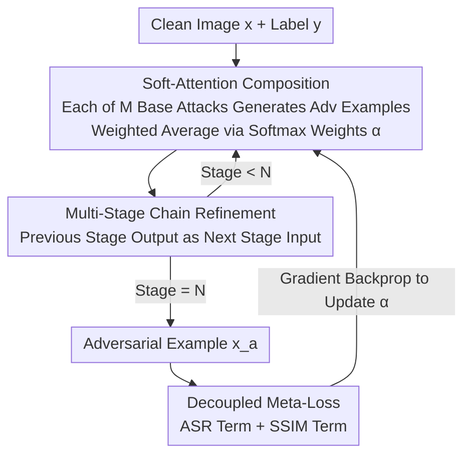

# DASH: A Meta-Attack Framework for Synthesizing Effective and Stealthy Adversarial Examples

**Conference**: CVPR 2026  
**arXiv**: [2508.13309](https://arxiv.org/abs/2508.13309)  
**Code**: https://github.com/siege-research/DASH (Available)  
**Area**: AI Security / Adversarial Examples  
**Keywords**: Adversarial Attacks, Perceptual Alignment, Differentiable Meta-Attack, Soft-Attention Composition, Multi-Stage Chaining

## TL;DR
DASH treats a set of off-the-shelf $\ell_p$ norm attacks (PGD, CW, various FGSM variants, etc.) as components, "softly combining" their adversarial examples using learnable softmax weights and refining them through multi-stage chaining. It learns these weights end-to-end via a meta-loss that simultaneously optimizes attack success rate and SSIM perceptual similarity. On adversarially trained robust models, it pushes the attack success rate to nearly 100% while remaining more stealthy than specialized perceptually-aligned attacks (e.g., AdvAD).

## Background & Motivation

**Background**: The mainstream approach for generating adversarial examples is to constrain perturbations within a small $\ell_p$ norm ball ($\ell_2$ and $\ell_\infty$ being the most common). Representative methods include FGSM, PGD, CW, and AutoAttack, which evaluates models using a suite of multiple attacks. These methods use the $\ell_p$ norm as a proxy for "stealthiness."

**Limitations of Prior Work**: A small $\ell_p$ norm does not necessarily equate to being imperceptible to the human eye—minimizing $\ell_p$ cannot guarantee high perceptual similarity. Consequently, a class of attacks guided by perceptual metrics (SSIM, LPIPS, FID) has emerged (SSAH, PerC-AL, and diffusion-model-based attacks like DiffAttack, AdvAD, and DiffPGD). However, these "perceptually-aligned attacks" conversely suffer from lower attack success rates, particularly against robust (adversarially trained) models, indicating a significant "success rate ↔ stealthiness" trade-off.

**Key Challenge**: A single $\ell_p$ attack trajectory cannot fully characterize human perception and often fails against specific defenses. Meanwhile, specialized perceptual attacks sacrifice the broad adaptability of $\ell_p$ attacks across different models. Both types of methods have strengths but remain isolated.

**Goal**: Instead of redesigning attacks, can we "combine" the strengths of existing $\ell_p$ attacks to produce an attack that is both stronger and more aligned with human perception? This requires answering two sub-questions: (a) how to determine the optimal weight for each base attack; (b) how to ensure the combined result falls into a perceptually friendly region rather than just satisfying $\ell_p$ constraints.

**Key Insight**: The authors' key observation is that while different $\ell_p$ norms alone do not equal human perception, they each correspond to different perceptual characteristics (contrast, texture, edge perturbations). Therefore, mixing attacks optimized under different norms in a principled way is expected to simultaneously improve success rate and perceptual quality.

**Core Idea**: Use a set of **continuous, learnable** soft-attention weights to combine multiple base attacks in a low-dimensional weight space (rather than hard-searching in a high-dimensional pixel space). Optimize these weights end-to-end using a **meta-loss** that governs both "attack success" and "SSIM perception," converting norm-constrained attacks into perceptually-aligned attacks without requiring internal modifications to the base attacks.

## Method

### Overall Architecture
DASH (Differentiable Attack SearcH) is a differentiable multi-stage meta-attack framework. The input is a clean image $\boldsymbol{x}$ and its ground-truth label $y$, and the output is an adversarial example $\boldsymbol{x}_a$. It assumes $M$ base attacks and $N$ stages (attack cells), both of which are hyperparameters selectable by the attacker. In each stage, DASH first lets all base attacks in the pool generate their own adversarial examples, then computes a weighted average using softmax weights learned for that stage. This output is then used as the input for the next stage in a chained iterative refinement process. The weights for the entire pipeline are learned end-to-end via Adam using a joint meta-loss that optimizes for "Attack Success Rate (ASR) + SSIM Perceptual Similarity." Note that the optimization target is not the pixels themselves, but the small set of composition weights $\boldsymbol{\alpha}$.

### Key Designs

**1. Soft-Attention Composition: Combining Multiple Attacks in a Low-Dimensional Weight Space**

To address the challenge of "how to determine weights and fall into perceptual regions," DASH does not search for perturbations in the massive pixel space. Instead, it treats "composition weights" as continuous learnable quantities. In the $j$-th stage, each base attack $i$ has a learnable scalar $\alpha_{j,i}$. The stage output is the softmax weighted average of the adversarial examples $\boldsymbol{x}_a^{j,i}$ produced by each base attack:

$$\mathcal{A}_j(\boldsymbol{x}_a^{j-1},y)=\sum_{i=1}^{M}\frac{\exp(\alpha_{j,i})}{\sum_{k=1}^{M}\exp(\alpha_{j,k})}\cdot\boldsymbol{x}_a^{j,i}$$

The softmax ensures weight normalization and provides a "soft importance" distribution, making the composition differentiable. This step reduces the search from high-dimensional pixel space to a low-dimensional weight space of only $M\times N$ scalars, making optimization much easier than discrete selection or heuristic pixel searches like those in AutoAttack or Composite Attack. Since each base attack still adheres to $\ell_p$ constraints, their convex combination also largely maintains perceptual similarity, transforming norm attacks into perceptually-aligned ones "for free." The paper describes this as "searching within the convex hull of multiple attack trajectories to construct perturbations sandwiched between standard paths."

**2. Multi-Stage Chain Refinement: Escaping Poor Local Optima through Iterative Recombination**

Adversarial example generation is a non-convex optimization that easily gets trapped in poor local optima. DASH mitigates this via multi-stage chaining: the $j$-th stage uses a **newly learned** set of weights to recombine base attacks, taking the previous stage's output $\boldsymbol{x}_a^{j-1}$ as input. The entire chain is formulated as $\boldsymbol{x}_a=\mathcal{A}_N(\boldsymbol{x}_a^{N-1},y)\circ\cdots\circ\mathcal{A}_1(\boldsymbol{x}^0,y)$. Unlike previous transfer attacks that usually use only two stages with fixed attack assignments, DASH allows arbitrary depth and continuous optimization of weights at every stage. Each stage also includes a "None" operation (returning the input directly), allowing the model to decide whether to "skip" a stage, adding flexibility. In experiments, success rates skyrocketed from 51.88% to 99.49% when moving from 1 to 2 stages, direct evidence of escaping poor local optima.

**3. Decoupled Meta-Loss: Optimizing "Hit" and "Stealth" Independently**

Previous methods suffered from rigid trade-offs between stealth and success. DASH uses a meta-loss to decouple these objectives with adaptive weighting:

$$\mathcal{L}_{\text{total}}=\lambda_{\text{asr}}\cdot f_y(\boldsymbol{x}_a)+\lambda_{\text{ssim}}\cdot\big(1-\text{SSIM}(\boldsymbol{x},\boldsymbol{x}_a)\big)$$

The first term $f_y(\boldsymbol{x}_a)$ is the confidence of the adversarial example on the ground-truth class $y$; minimizing it lowers the ground-truth confidence to encourage misclassification. The second term punishes perceptual distortion using $1-\text{SSIM}$ (where SSIM $\in [0,1]$). The paper sets $\lambda_{\text{asr}}=1.3$ and $\lambda_{\text{ssim}}=1.0$. Because perceptual metrics like SSIM/LPIPS/FID are differentiable, they can be directly optimized, constraining the adversarial examples within a "visual perturbation budget" (though not as strictly as hard $\ell_p$ clipping). An interesting side effect: while CW uses a hinge loss that stops gradient backpropagation once misclassification is achieved, DASH's meta-loss "pushes beyond the decision boundary," causing composition weights to shift focus from CW to other attacks that still provide effective gradients—explaining why DASH is more robust against post-processing defenses than CW alone.

### Loss & Training
The optimized variable is the meta-loss $\mathcal{L}_{\text{total}}$, and the only learnable parameters are the composition weights $\boldsymbol{\alpha}$ (pixels and base attack hyperparameters remain unchanged). Optimization uses Adam with a learning rate of 0.01 for $T=100$ epochs (Algorithm 1). The $\ell_\infty$ attack budget is $\epsilon=\frac{7}{255}$. The base attack pool contains 10 attacks: FGSM, PGD, CW, FAB, TI-/NI-/MI-/DI-FGSM, BIM, PI-FGSM++, plus a "None" op per stage. After training, the learned weights are used to generate the final adversarial examples. The paper notes that replacing SSIM with other perceptual metrics like LPIPS yields similar results, while FID is unsuitable for direct optimization due to high noise in small batches.

## Key Experimental Results

Datasets: CIFAR-10 / CIFAR-100 / ImageNet-1k, with 1,000 randomly sampled test images each. The targets are 7 adversarially trained robust models from RobustBench, plus 4 additional post-processing defenses (JPEG, TVM, NRP, Ensemble). SSIM is scaled to [0,100].

### Main Results
On the CIFAR-100 / Cui2024 robust model, comparison of average ASR (average of Base + 4 defenses) vs. perceptual metrics:

| Attack | Time (s) | Avg ASR↑ | SSIM↑ | LPIPS↓ | FID↓ |
|------|---------|----------|-------|--------|------|
| DI-FGSM | 0.17 | 63.72 | 92.08 | 0.0168 | 54.93 |
| CW | 0.11 | 84.14 | 94.38 | 0.0153 | 32.49 |
| AutoAttack | 0.33 | 76.77 | 92.09 | 0.0167 | 41.68 |
| DiffPGD | 4.21 | 75.80 | 91.15 | 0.0165 | 43.50 |
| DiffAttack | 12.44 | 77.24 | 91.16 | 0.0169 | 42.30 |
| AdvAD | 0.51 | 79.14 | 83.18 | 0.0288 | 45.67 |
| **DASH (Ours)** | **0.96** | **99.77** | **94.43** | **0.0139** | **41.08** |

DASH increases the average ASR from the strongest perceptual baseline (AdvAD's 79.14%) to 99.77% (a 20.63% Gain mentioned in the abstract), while maintaining an SSIM approximately 11 points higher than AdvAD, lower LPIPS, and lower FID. It is also an order of magnitude faster than diffusion-based attacks (0.96s vs 12.44s for DiffAttack). Conclusions are consistent across datasets: CIFAR-10 Avg ASR is $\ge 15\%$ higher than the strongest baseline, and ImageNet is $\ge 5\%$ higher.

### Ablation Study
Impact of the number of stages $N$ (CIFAR-100 / Cui2024):

| Stages | Avg ASR↑ | SSIM↑ | LPIPS↓ | FID↓ |
|--------|----------|-------|--------|------|
| 1 | 51.88 | 98.48 | 0.0027 | 16.19 |
| 2 | 99.49 | 94.59 | 0.0115 | 43.28 |
| 3 | 99.77 | 94.43 | 0.0139 | 41.08 |
| 4 | 99.86 | 93.22 | 0.0190 | 47.56 |
| 5 | 99.98 | 92.92 | 0.0209 | 48.25 |

Role of learnable weights (Fig 3/4): Replacing weights with uniform random sampling in $[0,1]$ without training resulted in significantly lower ASR and SSIM. As training epochs increased, ASR rose and SSIM improved almost monotonically.

### Key Findings
- **Multi-stage chaining is the lifeline of success rate**: The jump in ASR from 51.88% to 99.49% when moving from 1 to 2 stages confirms that "chained refinement escapes poor local optima." However, more stages lead to reduced stealthiness (SSIM moves from 98.48 to 92.92), representing a tunable trade-off. The paper selects 3 stages for balance.
- **Learnable weights are indispensable**: The version with random, untrained weights performed significantly worse in both ASR and SSIM, proving that meta-learned weights are the key factor.
- **Weights transfer across models/datasets**: Weights trained on one model/dataset and applied to unseen ones showed ASR fluctuations of $<3\%$ and SSIM fluctuations of $<2$ (Table 4), suggesting the framework learns a general composition strategy.
- **Strongest black-box transferability**: DASH adversarial examples generated using a surrogate model transferred to target models (Cui2024/Wang2023) achieved 10%/12% higher Avg ASR than the strongest baseline (DiffAttack), while maintaining superior SSIM (Table 2).
- **Counter-intuitive behavior of CW**: Although CW is a base attack, it does not always receive high weights because its hinge loss stops providing gradients once misclassification occurs. The meta-loss continues to push the perturbation, shifting attention to other attacks and making DASH more robust to post-processing defenses than CW alone.

## Highlights & Insights
- **Reducing "Attack Design" to "Weight Learning"**: Instead of inventing new attacks or modifying internal hyperparameters, DASH performs gradient optimization on $M\times N$ scalar weights. This "composing existing parts + differentiable meta-loss" approach is highly transferable to any scenario requiring adaptive weighting of multiple differentiable sub-solutions.
- **Perceptual Metrics as Differentiable Optimization Terms**: Directly using SSIM/LPIPS as loss terms to constrain the "visual budget" bypasses the traditional discrepancy between $\ell_p$ hard clipping and human perception—a clean and clever engineering choice.
- **Mechanistic Analysis of CW Weight Decay**: The explanation regarding "meta-loss pushing beyond the boundary vs CW hinge loss stopping" provides a convincing gradient-level justification for why combined attacks outperform individual ones.
- **None Operation for Adaptive Depth**: Inclusion of a skip option in each stage allows the framework to determine the effective number of stages automatically, providing flexibility at zero cost.

## Limitations & Future Work
- **Composition limited to weighted averages**: Current implementation uses linear softmax weighting and linear chaining. The authors acknowledge that more advanced compositions (e.g., learnable hyperparameters for base attacks, or cyclic/attention-based chains) are left for future work.
- **Meta-loss cannot strictly enforce budgets**: SSIM in the meta-loss acts as a soft penalty rather than a hard constraint, meaning it cannot strictly clip samples to a precise SSIM/FID/LPIPS threshold like $\ell_p$ can.
- **Trade-off requires manual tuning**: Higher $N$ increases ASR but degrades SSIM; the choice of $N$ remains a manual trade-off with no automated selection mechanism.
- **Dual-use nature of attack frameworks**: While positioned as an evaluation baseline for robustness, such frameworks also pose a threat to deployed models, requiring concurrent research into defenses.
- **Dependence on base pool quality**: DASH's performance is bounded by the diversity and strength of the base attacks. If sub-attacks are too similar, the benefit of composition may diminish.

## Related Work & Insights
- **vs AutoAttack / Composite Attacks**: While they also "combine multiple attacks," AutoAttack is a discrete ensemble of a few attacks, and Composite Attacks use heuristic genetic algorithms. Both operate under discrete choice within $\ell_p$ constraints. DASH replaces discrete choice with continuous differentiable interpolation and explicitly optimizes perceptual metrics.
- **vs AdvAD / DiffAttack / DiffPGD**: These specialized perceptual/diffusion attacks often act in isolation and adapt poorly to different models, frequently losing in both success rate and stealthiness on robust models. DASH builds on the broad applicability of norm attacks to achieve nearly 100% success with better perceptual metrics and faster speeds.
- **vs CW**: CW is strong but the hinge loss makes it vulnerable to post-processing defenses. DASH uses CW as a component but supplements its weaknesses with a meta-loss that pushes beyond the decision boundary.
- **vs Two-stage chained transfer attacks**: Previous chained attacks were often limited to two stages with fixed attack assignments; DASH allows arbitrary depth and continuous weight optimization at every stage.

## Rating
- Novelty: ⭐⭐⭐⭐ The "composition of existing $\ell_p$ attacks + differentiable soft-attention + perceptual meta-loss" angle is novel and practical.
- Experimental Thoroughness: ⭐⭐⭐⭐⭐ Comprehensive coverage across 3 datasets, 7 robust models, 4 defenses, white-box/black-box tests, and multidimensional ablations.
- Writing Quality: ⭐⭐⭐⭐ Clear motivation-design-analysis chain. The mechanism analysis for CW weights is a highlight.
- Value: ⭐⭐⭐⭐ Very useful as a strong baseline for robustness evaluation; the "differentiable meta-composition" paradigm is transferable to other tasks.

<!-- RELATED:START -->

## Related Papers

- [\[CVPR 2026\] Towards Stealthy and Effective Backdoor Attacks on Lane Detection: A Naturalistic Data Poisoning Approach](towards_stealthy_and_effective_backdoor_attacks_on_lane_detection_a_naturalistic.md)
- [\[CVPR 2026\] Shedding Light on VLN Robustness: A Black-box Framework for Indoor Lighting-based Adversarial Attack](shedding_light_on_vln_robustness_a_black-box_framework_for_indoor_lighting-based.md)
- [\[CVPR 2025\] MOS-Attack: A Scalable Multi-Objective Adversarial Attack Framework](../../CVPR2025/ai_safety/mos-attack_a_scalable_multi-objective_adversarial_attack_framework.md)
- [\[CVPR 2026\] Meta-FC: Meta-Learning with Feature Consistency for Robust and Generalizable Watermarking](meta-fc_meta-learning_with_feature_consistency_for_robust_and_generalizable_wate.md)
- [\[CVPR 2026\] CamPI: Physical Adversarial Examples through Camera Power Signal Injection](campi_physical_adversarial_examples_through_camera_power_signal_injection.md)

<!-- RELATED:END -->
