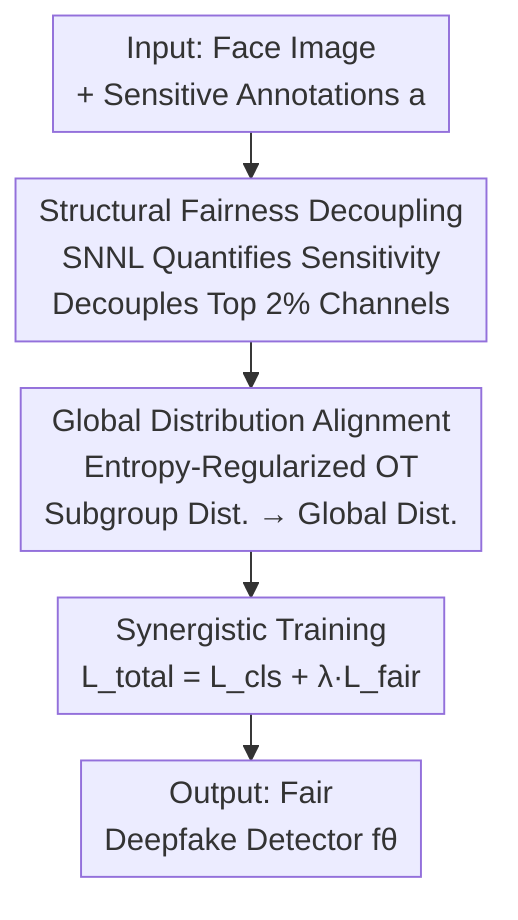

# Decoupling Bias, Aligning Distributions: Synergistic Fairness Optimization for Deepfake Detection

**Conference**: CVPR 2026  
**Paper**: [CVF Open Access](https://openaccess.thecvf.com/content/CVPR2026/html/Ding_Decoupling_Bias_Aligning_Distributions_Synergistic_Fairness_Optimization_for_Deepfake_Detection_CVPR_2026_paper.html)  
**Code**: https://github.com/ywh1093/Fairness-Optimization  
**Area**: AI Security / Deepfake Detection / Algorithmic Fairness  
**Keywords**: Fairness optimization, Deepfake detection, Channel decoupling, Distribution alignment, Optimal transport

## TL;DR
To address biases in Deepfake detectors across demographic groups (e.g., gender, race), this paper proposes a synergistic dual-mechanism framework: "Structural Fairness Decoupling + Global Distribution Alignment." It first prunes convolutional channels most sensitive to demographic attributes using a channel sensitivity metric and then aligns the prediction distributions of subgroups to a global distribution via entropy-regularized optimal transport. This approach improves both inter-group and intra-group fairness across multiple datasets without sacrificing (and sometimes even improving) detection AUC.

## Background & Motivation
**Background**: Mainstream Deepfake detection relies on end-to-end binary classification using CNNs (Xception, ResNet-50). Recent research also explores forensic trace modeling and LLM assistance. However, most works focus purely on "classification accuracy" while ignoring performance consistency across demographic groups.

**Limitations of Prior Work**: Training sets (e.g., FF++) naturally exhibit distribution skew—predominantly white faces and specific genders. Under empirical risk minimization (ERM), models favor majority groups, leading to significantly higher error rates for individuals with darker skin tones or minority genders. Such systematic misjudgments exacerbate social injustice in scenarios like digital identity security and judicial forensics.

**Key Challenge**: Existing fairness enhancement methods face a trade-off between "fairness and accuracy." Pre-processing (re-sampling/cross-group synthesis) generalizes poorly; in-processing (adversarial debiasing, risk-sensitive objectives, feature decoupling) often suppresses legitimate forensic clues while suppressing attribute information, leading to performance drops; post-processing (threshold calibration, output alignment) is constrained by residual representation bias and is unstable across domains. Specifically, decoupling demographic features from forensic clues often degrades detection accuracy despite improving fairness generalization.

**Goal**: Improve both **intra-group** (e.g., race alone) and **inter-group** (cross-attribute gender $\times$ race) fairness without sacrificing detection accuracy, while maintaining cross-domain generalization.

**Key Insight**: The authors decompose the sources of bias into two layers: the **Structural Layer** (where certain convolutional channels implicitly encode textures strongly related to sensitive attributes, such as skin reflectance or facial geometry) and the **Feature Layer** (where prediction distributions of different subgroups are misaligned). These two layers are addressed simultaneously rather than relying on a single mechanism.

**Core Idea**: First, identify and decouple channels that "leak" sensitive attributes at the architectural layer (removing the structural basis of bias). Then, align the distributions of subgroups to the global distribution using optimal transport at the feature layer (eliminating residual distribution shifts).

## Method

### Overall Architecture
Given a training set $D_{sensitive}=\{(x_i,y_i,a_i)\}_{i=1}^m$ with sensitive attribute labels ($x_i$ is a face image, $y_i\in\{0:\text{real},1:\text{fake}\}$, $a_i$ is a single or intersectional sensitive attribute), the goal is to train a fair detector $f_\theta$. The method is a two-stage serial process: **Stage 1 (SFD) identifies and decouples channels most sensitive to demographic attributes in the last convolutional layer**, and Stage 2 (GDA) aligns the real/fake prediction distributions of subgroups to the global distribution using optimal transport on the decoupled features. Finally, the model is trained with a joint classification and fairness loss.

### Key Designs

**1. Structural Fairness Decoupling (SFD): Pruning Channels Least Robust to Bias**

The core issue is that different channels in the last convolutional layer respond differently to sensitive attributes. Some channels specifically encode skin reflectance or facial geometry strongly correlated with race/gender, thereby introducing bias into predictions. Instead of indirect suppression via loss functions, this paper directly identifies and decouples these channels at the architecture level.

Selection Mechanism: **Soft Nearest Neighbor Loss (SNNL)** is used to quantify the "sensitivity" of each channel. For channel $k$ in batch $t$, the sensitivity loss is:

$$l^{k,t}_{sn} = -\frac{1}{b}\sum_{i=1}^{b}\log\frac{\sum_{x\neq i}\delta(a_i-a_x)\exp(-\|m_{k,i}-m_{k,x}\|^2/T)}{\sum_{y\neq i}\exp(-\|m_{k,i}-m_{k,y}\|^2/T)}$$

where $\delta(a_i-a_x)$ is the Dirac delta, being 1 when two samples belong to the same sensitive group. The numerator counts similarity for **intra-group** samples, and the denominator counts **all** samples; $T$ is the temperature. Intuition: If channel $k$ clusters samples of the same sensitive group closely (high feature similarity), the ratio is large, the $-\log$ is small, and the loss is low—indicating the channel **strongly clusters by sensitive attributes**. Averaging across all batches gives the fairness index $F_k=\frac{1}{N_b}\sum_{t}l^{k,t}_{sn}$. **Lower $F_k$ → stronger discriminative power for sensitive attributes → less fair**. Channels are sorted by $F_k$, and the bottom $prc\%$ are decoupled (ablation shows decoupling 2% channels in the 3rd iteration is optimal). Stage 1 initially uses cross-entropy $L_{cls}=C(h(z^i_r),y^i_r)+C(h(z^i_f),y^i_f)$ to ensure the model learns forensic knowledge before decoupling.

**2. Global Distribution Alignment (GDA): Aligning Subgroup Distributions to Global via Entropy-Regularized OT**

Since decoupling only affects the structure, residual distribution offsets may persist in the feature layer. GDA aims to make predictions "invariant" to sensitive attributes by minimizing the distance between each subgroup distribution and the global distribution:

$$\min_f \sum_\alpha^{A} d\big(D_{\{(x_I,a)\}|f}-D_{\{(x_I,a)|a=\alpha\}|f}\big)$$

The authors align **empirical distributions** for **real and fake images separately**. Let $g^a_r, g^a_f$ be the prediction distributions for real/fake images of subgroup $a$, and $R, G$ be the global real/fake distributions. The distance is measured using **Optimal Transport with Mutual Information regularization**:

$$L^\epsilon_c(g^a_r,R)=\min_{(X,Y)}\Big(\mathbb{E}_{(X,Y)}[c(X,Y)]+\epsilon\cdot I(X;Y)\Big),\quad I(X;Y)=\mathrm{KL}(\pi\,\|\,g^a_r\otimes R)$$

Here $c(X,Y)$ is the transport cost. The mutual information term $I(X;Y)$ punishes deviation of the joint distribution $\pi$ from the product of marginals—$I=0$ when sensitive attributes are independent of predictions. The total fairness loss is:

$$L_{fair}=\frac{1}{|A|}\sum_{a\in A}\big(L^\epsilon_c(g^a_r,R)+L^\epsilon_c(g^a_r,G)\big)$$

This is solved via the **Sinkhorn-Knopp** algorithm, with empirical distributions approximated by Kernel Density Estimation (KDE).

**3. Mechanism: Joint Training via Structural Debiasing and Distribution Alignment**

SFD performs **local** structural pruning of biased channels, while GDA performs **global** optimization on the "clean" features to extract cross-domain invariant consensus. The total objective for the second stage is:

$$L_{total}=L_{cls}+\lambda L_{fair}$$

$\lambda=0.005$ balances accuracy and fairness. Ablations confirm that the synergy is greater than the sum of its parts; while GDA significantly improves fairness and AUC, adding SFD further reduces metrics like gender $F_{FPR}$ from 3.91% to 0.53% for Xception on FF++.

### Loss & Training
Stage 1: Cross-entropy $L_{cls}$ for forensic learning and channel decoupling. Stage 2: Joint optimization $L_{total}=L_{cls}+\lambda L_{fair}$ ($\lambda=0.005$). Training: SGD ($\beta=1\times10^{-3}$), batch 64, 50 epochs, OT regularization $\epsilon=5\times10^{-4}$, 2x RTX 4090.

## Key Experimental Results

### Main Results (In-domain FF++, Xception)
Fairness metrics $F_{FPR}$ (Difference in False Positive Rate) and $F_{DP}$ (Demographic Parity) — lower is better. es-AUC (Fairness-consistent AUC) and AUC — higher is better.

| Attribute | Method | F_FPR↓ | F_DP↓ | es-AUC↑ | AUC↑ |
|-----------|--------|--------|-------|---------|------|
| Gender    | Ori    | 4.10   | 5.72  | 91.93   | 92.69|
| Gender    | PG-FDD (CVPR'24) | 0.62 | 4.74 | 96.32 | 97.66 |
| Gender    | **Ours** | **0.53** | **3.61** | **96.45** | **97.71** |
| Race      | Ori    | 19.76  | 4.74  | 82.85   | 92.69|
| Race      | PG-FDD | 11.13  | 4.78  | 94.52   | 97.66|
| Race      | **Ours** | 9.29 | **4.35** | **94.86** | **97.71** |
| Intersect | Ori    | 36.03  | 14.64 | 74.43   | 92.69|
| Intersect | PG-FDD | 9.19   | 13.39 | 86.83   | 97.66|
| Intersect | **Ours** | 20.18 | **9.47** | **86.91** | **97.71** |

Ours achieves the highest detection AUC (97.71). Fairness metrics lead in most categories. ⚠️ Note: For intersectional $F_{FPR}$, Ours (20.18) is higher than PG-FDD (9.19). The authors emphasize a win-win on "most fairness metrics + detection accuracy." Cross-domain results on Celeb-DF also show top performance.

### Ablation Study (FF++, Xception; Ori → +GDA → +GDA+SFD)

| Configuration | Gender F_FPR↓ | Gender es-AUC↑ | Intersect F_DP↓ | AUC↑ |
|---------------|---------------|----------------|-----------------|------|
| Ori           | 4.10          | 91.93          | 14.64           | 92.69|
| + GDA         | 3.91          | 96.11          | 16.60           | 97.22|
| + GDA + SFD (**Ours**) | **0.53** | **96.45** | **9.47** | **97.71** |

### Key Findings
- **GDA is the primary driver for accuracy and fairness**: Adding GDA alone boosts AUC from 92.69 to 97.22.
- **SFD handles "last mile" debiasing**: Adding SFD reduces gender $F_{FPR}$ from 3.91% to 0.53% (an ~87% relative reduction) while maintaining accuracy.
- **Decoupling has an upper bound**: Aggressive decoupling hurts performance. The optimal setting is 2% channels in the 3rd iteration.
- **Architecture Agnostic**: Similar trends are observed on ResNet-50.
- **Attention Visualization**: Grad-CAM shows that while Ori overfits to background noise, Ours focuses consistently on salient facial regions.

## Highlights & Insights
- **Layered Approach to Fairness vs. Accuracy**: By splitting the problem into structural pruning and feature alignment, the model avoids suppressing forensic clues, which is the root cause of AUC improvements.
- **SNNL as a Sensitivity Probe**: Using the ratio of intra-group to global similarity to score channels provides a transferable method for locating "bias carriers" in networks.
- **MI-Regularized OT**: Penalizing $I(X;Y)$ via KL divergence allows for a practical implementation of the independence constraint between predictions and sensitive attributes.

## Limitations & Future Work
- Hyperparameters for decoupling (2%, 3rd iteration) are empirical; automated selection for new datasets remains unexplored.
- ⚠️ Intersectional $F_{FPR}$ results suggest room for improvement in high-order attribute interactions (e.g., specific sparse combinations like Female-Asian).
- Fairness metrics depend on accurate attribute labels; the subjective nature of labels and potential missing values may impact real-world deployment.
- Testing is limited to image-level Deepfakes; applicability to video or AIGC-generated faces is yet to be verified.

## Related Work & Insights
- **vs. PG-FDD (CVPR'24)**: PG-FDD uses feature decoupling but loses detection accuracy; Ours uses structural pruning + OT alignment to improve both intersectional $F_{DP}$ and overall AUC.
- **vs. DAG-FDD / DAW-FDD (WACV'24)**: These methods use risk-sensitive weighting with limited cross-domain generalization; Ours is more stable across domains due to explicit distribution alignment.
- **vs. Fairadapter (ICASSP'25)**: Designed for AIGC image detection using ViT-L/14, Fairadapter performs poorly on Deepfake detection (AUC 71.50). Ours is robust on general CNN backbones.

## Rating
- Novelty: ⭐⭐⭐⭐ Decomposition into structural/feature layers and the SNNL+OT combination is a novel perspective.
- Experimental Thoroughness: ⭐⭐⭐⭐ 4 datasets, 3 fairness metrics, 2 backbones; includes cross-domain and ablation studies.
- Writing Quality: ⭐⭐⭐⭐ Logic is clear, though some distribution notations are relatively complex.
- Value: ⭐⭐⭐⭐ Directly addresses the fairness bottleneck in Deepfake detection deployment.

<!-- RELATED:START -->

## Related Papers

- [\[CVPR 2026\] DSO: Direct Steering Optimization for Bias Mitigation](dso_direct_steering_optimization_for_bias_mitigation.md)
- [\[CVPR 2026\] DFD-HR: Generalizable Deepfake Detection via Hierarchical Routing Learning](dfd-hr_generalizable_deepfake_detection_via_hierarchical_routing_learning.md)
- [\[CVPR 2026\] DeepfakeImpact: A Two-Stage Benchmark with Real-World Impact in Deepfake Detection](deepfakeimpact_a_two-stage_benchmark_with_real-world_impact_in_deepfake_detectio.md)
- [\[CVPR 2026\] Omni-Fake: Benchmarking Unified Multimodal Social Media Deepfake Detection](omni-fake_benchmarking_unified_multimodal_social_media_deepfake_detection.md)
- [\[CVPR 2026\] X-AVDT: Audio-Visual Cross-Attention for Robust Deepfake Detection](x-avdt_audio-visual_cross-attention_for_robust_deepfake_detection.md)

<!-- RELATED:END -->
