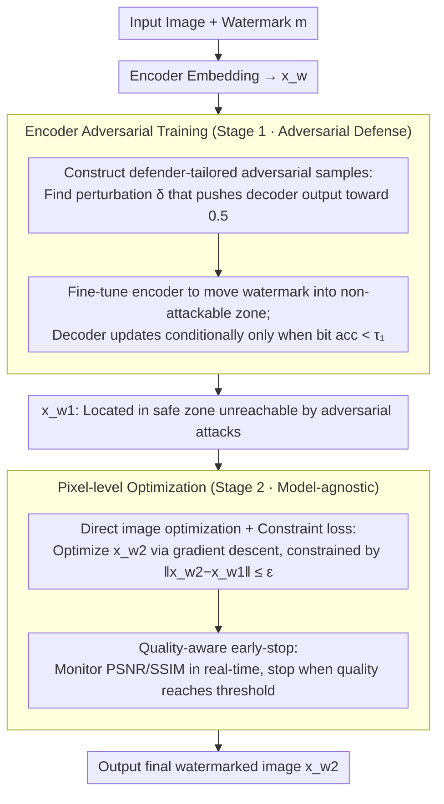

# AdvMark: Decoupling Defense Strategies for Robust Image Watermarking

**Conference**: CVPR2026  
**arXiv**: [2602.20053](https://arxiv.org/abs/2602.20053)  
**Code**: None  
**Area**: AI Security  
**Keywords**: Image watermarking, Adversarial robustness, Diffusion regeneration attack, Decoupled training, Adversarial training, Image quality

## TL;DR
AdvMark is proposed as a two-stage decoupled defense framework: Stage 1 Encoder Adversarial Training (EAT) shifts watermarked images into non-attackable regions to resist adversarial attacks; Stage 2 utilizes direct image optimization to counter distortion and regeneration attacks while preserving adversarial robustness. Across 9 watermarking methods and 10 attack types, AdvMark improves distortion/regeneration/adversarial accuracy by 29%/33%/46% respectively, achieving optimal image quality.

## Background & Motivation

**Background**: Deep learning image watermarking (DL watermarking) embeds information into images via an encoder and extracts it via a decoder, becoming a core technology for copyright protection and content provenance. Recently, attack methods have escalated, forming a triple threat.

**Triple Threat**:
   - **Adversarial Attack**: e.g., WEvade, which uses infinitesimal perturbations to cause the decoder to extract incorrect information, with no visual change to the attacked image.
   - **Regeneration Attack**: Utilizes diffusion models to add noise and سپس denoise watermarked images, effectively "washing away" the watermark.
   - **Distortion Attack**: Traditional image processing operations such as JPEG compression, Gaussian blur, and cropping.

**Limitations of Prior Work (Joint Adversarial Training, JAT)**:
   - **Problem 1**: Adversarial training of the decoder leads to a decrease in clean accuracy—to correctly decode adversarial samples, the decoder is forced to expand its decision boundaries, which conversely reduces precision on clean images.
   - **Problem 2**: Simultaneous training against three types of attacks results in slow convergence and poor performance—the gradient directions of the three attacks conflict, creating a complex optimization landscape where joint training struggles to satisfy all defense requirements.

**Key Insight**: Adversarial attacks differ fundamentally from distortion/regeneration attacks. Adversarial attacks exploit model-specific decision boundary weaknesses, while distortion/regeneration attacks are model-agnostic signal-level disruptions. Defense strategies should be decoupled rather than jointly trained.

**Core Idea**: Two-stage decoupling—first use EAT to let the encoder "push" the image into a non-attackable region, then use direct image optimization to handle distortion and regeneration attacks.

## Core Problem
How to simultaneously defend against the triple threat of adversarial, regeneration, and distortion attacks while avoiding the gradient conflicts and clean accuracy degradation inherent in joint training?

## Method

### Overall Architecture
AdvMark aims to solve the challenge of a single watermarked image resisting adversarial, distortion, and regeneration attacks simultaneously, whereas joint training entangles these tasks, leading to mutual interference. The solution splits the defense into two stages based on the "nature" of the attacks: adversarial attacks target model-specific decision boundary weaknesses, while distortion/regeneration attacks are model-agnostic signal disruptions. In Stage 1, Encoder Adversarial Training (EAT) focuses solely on adversarial robustness—fine-tuning the encoder to "move" the watermarked image into a safe region unreachable by adversarial attacks. Stage 2 takes the output $x_{w1}$ from Stage 1 and optimizes $x_{w2}$ directly in the pixel space to resist distortion and regeneration, while employing an offset constraint to lock the image within the safe region established in Stage 1. At inference, the process is: Encoder embedding → Stage 2 optimization → final watermarked image output.

### Key Designs

**1. Encoder Adversarial Training: Rather than making the decoder tolerate adversarial samples, move the image to a safe zone via the encoder.**

Traditional Adversarial Training (AT) updates both the encoder and decoder, relying on the decoder to expand decision boundaries, which drops clean decoding accuracy (clean BA decreases from ~99% to ~92%). EAT reverses this—it freezes the decoder and treats the encoder as the primary training target. It constructs defender-tailored adversarial samples by solving $\min_{\delta}\, |0.5 - l(\text{clamp}(D(x_w + \delta), 0, 1), m)|$ (Eq.2), finding the perturbation $\delta$ that pushes the decoder toward maximum uncertainty (0.5). These samples are fed back to the encoder, forcing it to embed watermarks far from decision boundaries. The decoder is only updated if bit accuracy falls below $\tau_1$. This preserves clean accuracy (~98-99% under EAT) while enhancing adversarial robustness.

**2. Direct Image Optimization + Constraint Loss: Using pixel-level optimization for signal attacks while guarding the safe zone.**

Since distortion and regeneration are model-agnostic, training networks on them has limited returns. Stage 2 leaves network parameters unchanged and optimizes $x_{w2}$ via gradient descent in pixel space so that the decoder can still extract the watermark after attacks. To prevent the optimization from pushing the image out of the Stage 1 safe zone, a constrained image loss $\|x_{w2}-x_{w1}\| \le \epsilon$ is added to lock the optimization within the safety region.

**3. Quality-aware Early-stop: Using quality metrics as a brake instead of a fixed ε-ball projection.**

Fixed $\epsilon$-ball projections lead to inconsistent degradation across different images. This method monitors PSNR/SSIM in real-time during optimization and stops early once the quality threshold is met. This results in an average PSNR increase of 1–2 dB at the same accuracy level, making attack resistance and visual quality more controllable.

**4. Theoretical Guarantee for Decoupling: Ensuring Stage 2 does not undermine Stage 1.**

The paper provides a robustness preservation conclusion: if $x_{w1}$ is safe within an adversarial attack radius $r$, and $\|x_{w2}-x_{w1}\| \le \epsilon$, then $x_{w2}$ remains safe within a radius $r-\epsilon$. This clarifies the relationship between "constrained offset" and "preserving adversarial robustness."

### Loss & Training
- **Stage 1**: Iteratively train the encoder on adversarial samples (K-step PGD for perturbations + encoder update). The decoder is conditionally frozen and only updated if bit accuracy $< \tau_1$.
- **Stage 2**: Fix encoder/decoder, perform gradient descent on $x_{w2}$ pixels, subject to constrained image loss ($\|x_{w2}-x_{w1}\| \le \epsilon$) and quality-aware early-stop.
- **Inference**: Encoder embedding → Stage 2 optimization → final watermarked image.

## Key Experimental Results

### Main Results — 9 Watermarking Methods × 10 Attacks

| Defense Strategy | Distortion Acc (%) | Regeneration Acc (%) | Adversarial Acc (%) | PSNR ↑ | SSIM ↑ |
|:---|:---:|:---:|:---:|:---:|:---:|
| Baseline (No Defense) | ~60-70 | ~50-60 | ~20-30 | Highest | Highest |
| JAT (Joint Training) | ~65-75 | ~55-65 | ~40-50 | Lower | Lower |
| AT + Distortion | ~70-78 | ~58-68 | ~45-55 | Low | Low |
| **AdvMark (Ours)** | **+29%** | **+33%** | **+46%** | **Highest** | **Highest** |

### Ablation Study

| Configuration | Adversarial Acc | Distortion Acc | Regeneration Acc | Image Quality |
|:---|:---:|:---:|:---:|:---:|
| Stage 1 only (EAT) | High | Mid | Mid | High |
| Stage 2 only (DIO) | Low | High | High | Mid |
| JAT (Joint Training) | Mid | Mid | Mid | Low |
| EAT + Standard AT | Mid | — | — | Low |
| EAT + DIO w/o constraint | Low | High | High | Mid |
| **AdvMark (EAT + constrained DIO)** | **High** | **High** | **High** | **High** |

### Key Findings
- **EAT vs. Standard AT**: Standard AT drops clean BA from ~99% to ~92%; EAT maintains ~98-99% while offering stronger adversarial robustness.
- **Importance of Constraints**: Removing the Stage 2 image constraint significantly drops adversarial Acc, validating the theoretical analysis.
- **Quality-aware early-stop vs. ε-ball**: Early-stop achieves 1-2 dB higher PSNR at the same Acc.
- **Generalization**: Improvements shown across 9 different watermarking architectures prove AdvMark is a plug-and-play framework.
- **Most Significant Gain (+46% in Adversarial)**: Indicates that EAT’s "moving to safe zone" strategy is more effective than "expanding boundaries."

## Highlights & Insights
- **"Moving to Safe Zone vs. Expanding Boundaries"**: The core insight. Traditional AT forces the decoder to tolerate more; EAT forces the encoder to send images to safer locations.
- **Depth of Decoupling Strategy**: Categorizing attacks into model-specific versus model-agnostic allows for optimized, interference-free defense strategies.
- **Theory + Practice**: Theoretical proofs of robustness preservation guide the engineering implementation of the quality-aware early-stop.
- **Universal Framework**: The ability to apply this as a post-processing or fine-tuning step to existing methods provides high practical value.

## Limitations & Future Work
- Stage 2 optimization requires additional inference time (dozens of optimization steps per image), which may limit real-time applications.
- Thresholds for Quality-aware early-stop may require per-application tuning.
- Theoretical guarantees assume $\|x_{w2} - x_{w1}\| \leq \epsilon$; actual optimization might deviate.
- Only validated on image watermarking; applicability to video or audio requires exploration.
- More diverse adaptive attack testing could further strengthen credibility.

## Related Work & Insights
- **vs. RivaGAN/StegaStamp**: These ignore adversarial robustness; AdvMark acts as a plug-and-play enhancement for them.
- **vs. Joint Adversarial Training (JAT)**: JAT suffers from gradient conflict and clean accuracy loss; AdvMark's decoupled optimization outperforms in both effect and quality.
- **vs. DiffPure**: While DiffPure uses diffusion to purify samples, diffusion is also a threat to watermarks (regeneration). AdvMark must defend against the diffusion model as an attacker.

## Rating
- Novelty: ⭐⭐⭐⭐ The "moving to safety zone" EAT logic and two-stage decoupling are profound.
- Experimental Thoroughness: ⭐⭐⭐⭐⭐ Large-scale comparison across 9 methods and 10 attacks is highly comprehensive.
- Writing Quality: ⭐⭐⭐⭐ Excellent narrative comparing "boundary expansion" vs. "safe zone relocation."
- Value: ⭐⭐⭐⭐ A plug-and-play framework with direct implications for watermarking practices.

<!-- RELATED:START -->

## Related Papers

- [\[CVPR 2026\] ClusterMark: Towards Robust Watermarking for Autoregressive Image Generators with Visual Token Clustering](clustermark_towards_robust_watermarking_for_autoregressive_image_generators_with.md)
- [\[CVPR 2026\] UniDef: Universal Defense Against Unauthorized Image Manipulation](unidef_universal_defense_against_unauthorized_image_manipulation.md)
- [\[CVPR 2026\] RecoverMark: Robust Watermarking for Localization and Recovery of Manipulated Faces](recovermark_robust_watermarking_for_localization_and_recovery_of_manipulated_fac.md)
- [\[AAAI 2026\] Robust Watermarking on Gradient Boosting Decision Trees](../../AAAI2026/ai_safety/robust_watermarking_on_gradient_boosting_decision_trees.md)
- [\[CVPR 2026\] Meta-FC: Meta-Learning with Feature Consistency for Robust and Generalizable Watermarking](meta-fc_meta-learning_with_feature_consistency_for_robust_and_generalizable_wate.md)

<!-- RELATED:END -->
