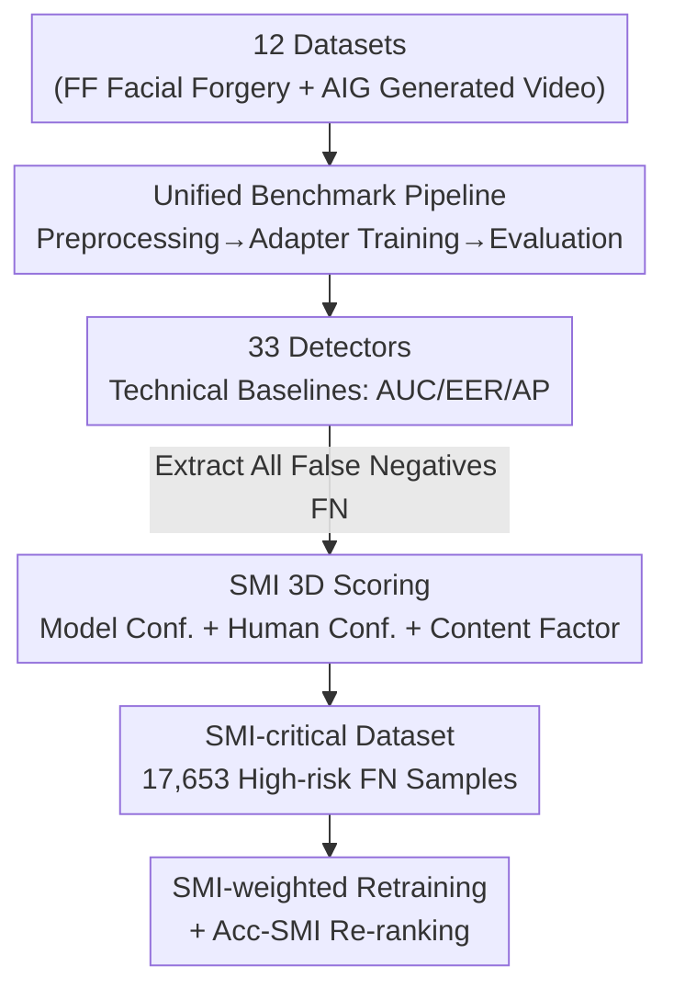

# DeepfakeImpact: A Two-Stage Benchmark with Real-World Impact in Deepfake Detection

**Conference**: CVPR 2026  
**Paper**: [CVF Open Access](https://openaccess.thecvf.com/content/CVPR2026/html/Gong_DeepfakeImpact_A_Two-Stage_Benchmark_with_Real-World_Impact_in_Deepfake_Detection_CVPR_2026_paper.html)  
**Code**: https://github.com/explorerZH/DeepfakeImpact-Stage1 (Available, Stage I)  
**Area**: AI Safety / Deepfake Detection Benchmark  
**Keywords**: deepfake detection, evaluation benchmark, social harm, SMI metric, cost-sensitive learning

## TL;DR
This research redefines deepfake detection from "measuring accuracy" to "measuring social utility" through a two-stage benchmark: Stage I reproduces 33 SOTA detectors across 12 datasets; Stage II introduces the Social Misjudgment Impact (SMI) metric to assign "social harm scores" to missed detections, constructing an SMI-critical dataset of 17,653 high-risk samples. The findings reveal that models leading in technical metrics often fail under SMI-based evaluation.

## Background & Motivation
**Background**: Recent deepfake detection has evolved from CNN classifiers to methods utilizing facial inconsistencies, frequency domain artifacts, and temporal consistency. Evaluation has transitioned from fragmented setups to standardized frameworks like DeepfakeBench, primarily ranked by technical metrics such as Accuracy, AUC, and EER.

**Limitations of Prior Work**: Existing benchmarks assume "every error carries equal weight"—treating a missed forgery of a high-stakes political figure the same as a missed low-quality, inconsequential fake. Consequently, the community has optimized detectors for technical precision without evaluating their ability to intercept the most harmful forgeries in practice.

**Key Challenge**: There is a misalignment between technical metrics and social value. The authors present a poignant example: a detector with 95% accuracy that misses the most socially harmful 5% of forgeries may be more dangerous than a detector with 85% accuracy that reliably captures high-risk fakes. Purely accuracy-oriented paradigms fail to capture the variance in social consequences of different failures.

**Goal**: To reposition deepfake detection as a "socio-technical problem" where algorithmic performance is viewed through the lens of "potential harm reduction." This is decomposed into two sub-problems: (1) establishing a fair, reproducible, and broad technical baseline; (2) quantifying the social harm of individual missed detections and re-ranking models accordingly.

**Key Insight**: Among error types, False Negatives (FN, classifying fakes as real) cause the actual social harm—missed forgeries spread rumors or incite public panic. Therefore, the focus of social-aware evaluation is specifically narrowed to FN samples rather than broadly weighting all errors.

**Core Idea**: Quantify an SMI score based on three dimensions: "model confidence in the error," "human susceptibility to the deception," and "content propagation potential." This score is used to weight training losses and evaluation accuracy, shifting from "how accurate" to "how socially beneficial."

## Method

### Overall Architecture
DeepfakeImpact is an **evaluation benchmark** rather than a new detection model. The pipeline consists of two complementary stages: Stage I runs 33 detectors through unified preprocessing, training, and evaluation to establish standardized technical baselines. Stage II identifies high-risk samples from the false negatives of Stage I, scores them using the SMI metric to form the SMI-critical dataset, and performs SMI-weighted retraining and re-evaluation. The link between the two stages is the "entire pool of FN samples produced in Stage I," which serves as both an output of Stage I and the raw material for Stage II.

### Key Designs

**1. Unified Benchmark Pipeline (Adapter Architecture): Enabling Fair Comparison Across 33 Models**

Early benchmarks suffered from disparate preprocessing and metrics, making models incomparable. Stage I addresses this with a unified pipeline: facial forgery datasets use dlib for detection, cropping, and alignment to $256\times256$; AIG videos involve fixed uniform sampling of 32 frames per video. All datasets are partitioned into train/val/test splits with standard JSON metadata. The core engineering abstraction is the **Adapter module**—each detection method is wrapped in an adapter responsible for model construction, loss definition, forward passes, and metric calculation, utilizing a standalone Config YAML. This allows frame-level and video-level methods to be evaluated fairly under the same epoch, sampling, and augmentation strategies. The pipeline features **unified granularity** (independent evaluation for frame and video levels), **task integration** (supporting both facial forgery and AI-generated video detection), and **modular extensibility** (automatic logging of ROC curves, confusion matrices, t-SNE, and misclassified samples).

**2. SMI Metric: Quantifying Social Harm of Individual Failures**

After Stage I, false negative samples (forgeries classified as real by any model) are aggregated. For each sample $i$, three complementary harm dimensions are calculated:

-   **Model Confidence $\text{SMI}_{\text{model},i}$**: The average predicted probability for the "real" label across all models that misclassified the sample, $\text{SMI}_{\text{model},i} = \frac{1}{M}\sum_{m=1}^{M} p_i^{(m)}(\text{real})$, where $M$ is the number of models failing on that sample. Higher confidence in the incorrect prediction indicates the sample is more "algorithmically deceptive."
-   **Human Confidence $\text{SMI}_{\text{human},i}$**: Average "probability of being real" $s_i^{(h)}\in[0,1]$ assigned by $H=10$ laypersons with no AI background, $\text{SMI}_{\text{human},i} = \frac{1}{H}\sum_{h=1}^{H} s_i^{(h)}$. This measures the deception potential for human audiences.
-   **Content Factor $\text{SMI}_{\text{content},i}$**: Normalized mean of video length $L_i$ and resolution $R_i$, $\text{SMI}_{\text{content},i}=\frac{1}{2}\left(\frac{L_i-L_{\min}}{L_{\max}-L_{\min}}+\frac{R_i-R_{\min}}{R_{\max}-R_{\min}}\right)$, with $L_{\min}=2s,\ L_{\max}=120s,\ R_{\min}=320\times240,\ R_{\max}=4K$. Longer, higher-resolution videos possess greater propagation potential.

The total score is the unweighted average:

$$\text{SMI}_i = \frac{1}{3}\Big(\text{SMI}_{\text{model},i}+\text{SMI}_{\text{human},i}+\text{SMI}_{\text{content},i}\Big)$$

This design couples "difficulty" with "social importance"—samples that deceive both algorithms and humans while being highly shareable receive the highest scores.

**3. SMI-aware Training and Evaluation: Injecting Harm Scores into Loss and Accuracy**

The SMI score is incorporated into training via **SMI-weighted Cross-Entropy**:

$$\mathcal{L} = -\frac{1}{N}\sum_{i=1}^{N}\text{SMI}_i\cdot\Big[y_i\log\hat{y}_i+(1-y_i)\log(1-\hat{y}_i)\Big]$$

High SMI samples carry more weight in the loss, forcing the model to focus on socially critical samples. On the evaluation side, traditional accuracy is replaced by **Acc-SMI**: $\text{Acc-SMI}=\frac{\sum_{i=1}^{N}\text{SMI}_i\cdot\mathbb{I}(\hat{y}_i=y_i)}{\sum_{i=1}^{N}\text{SMI}_i}$, which is the hit rate weighted by SMI. This shifts the ranking criteria from "general accuracy" to "accuracy on the most dangerous candidates."

## Key Experimental Results

### Stage I: Standardized Technical Benchmark
Covers 33 SOTA detectors (2017–2025) and 12 datasets (5 Facial Forgery FF + 7 AI-Generated AIG). Results report the average top-3 AUC over 20 runs. Cross-domain tests for facial forgery use FF++ for training.

**Facial Forgery Datasets (Top-3 AUC, Selected Models)**:

| Model | Type | Intra-domain Avg | Cross-domain Avg | Notes |
|------|------|---------|---------|------|
| SSTGNN | Video | 0.9766 | **0.8912** | Strongest cross-domain generalization |
| FTCN | Video | 0.9270 | 0.8828 | Best single item on FF++ (0.9583) |
| TALL | Video | 0.9548 | 0.8071 | Perfect score on UADFV intra-domain |
| UIA-ViT | Frame | **0.9578** | **0.8040** | Most robust frame-level model |
| Effort | Frame | 0.9562 | 0.8534 | Strong frame-level cross-domain |
| Capsule | Video | 0.9412 | 0.6590 | Significant cross-domain drop |

Average performance drops of 7–12% from intra-domain to cross-domain highlight domain shift challenges. Video-level models generally outperform frame-level models in cross-domain scenarios, suggesting temporal modeling acts as a regularizer.

**AIG Datasets (Top-3 AUC, All Cross-domain, trained on Youku-mPLUG+ZeroScope)**:

| Model | Type | Avg AUC | Highlights |
|------|------|---------|------|
| SSTGNN | Video | **0.8591** | Best generalization across diverse AIG content |
| Effort | Frame | 0.8583 | Best single item on Kinetics-400 (0.9174) |
| EfficientNet | Frame | 0.8348 | Best overall frame-level performance |

Notably, the advantage of video-level models seen in facial forgery diminishes in AIG tasks, where frame-level Effort nearly equals the best video-level model. This suggests different temporal artifact characteristics in AIG compared to facial forgeries.

### Stage II: Socially-Aware Benchmark (Key Findings)
The **SMI-critical dataset consists of 17,653 samples** (5,673 FF + 11,980 AIG). Re-evaluating baselines with Acc-SMI leads to significant re-ranking:

| Phenomenon | Model | Description |
|------|------|------|
| Technical & SMI Strong | Effort (Frame), SSTGNN (Video) | Robust even on high-risk missed samples |
| Technical Strong, SMI Failed | UIA-ViT, FTCN | Competitive AUC but degrades sharply under SMI-aware evaluation |
| Technical Mid, SMI Leading | EfficientNet (Frame) | Highest Acc-SMI on the total SMI-critical set |

Conclusion: Models optimized for traditional metrics may bias toward easier detection tasks, inadvertently missing forgery videos with the highest propagation risk and social harm.

### Ablation Study

**Impact of Data Augmentation on Acc-SMI (Table 5, Excerpts)**:

| Config | SIA (Frame) | XceptionNet (Frame) | SSTGNN (Video) | STIL (Video) |
|------|---------|-----------------|--------------|------------|
| wo all | -1.20% | -2.20% | **+2.40%** | **+4.50%** |
| wo gab (Gaussian Blur) | +0.40% | +0.80% | +0.90% | +2.00% |
| wo iss (Isotropic Scaling) | -0.40% | -0.60% | **-0.90%** | **-1.20%** |

Finding: Removing all augmentations causes performance drops in frame-level models (which rely on regularization) but increases performance for some video-level models, suggesting aggressive augmentation may interfere with intrinsic temporal modeling.

**Backbone and Pre-training Ablation (Table 6, Acc-SMI)**:

| Backbone | SSTGNN | FaceXray | Core | SPSL |
|----------|--------|----------|------|------|
| ResNet-50 | **0.741** | 0.304 | 0.245 | 0.458 |
| ResNet-50 wo Pre-training | 0.705 | 0.247 | 0.235 | 0.410 |
| Xception | 0.729 | 0.299 | 0.240 | **0.462** |

The removal of pre-training weights consistently causes significant performance drops. No single backbone dominates across all detection architectures.

### Key Findings
-   High-risk missed detections (samples humans perceive as most realistic) are the primary source of social harm, which traditional technical metrics often ignore—this is the blind spot SMI aims to address.
-   T-SNE visualizations show that while "detected" and "missed" forgery features overlap under standard loss, SMI-weighted loss effectively separates them.
-   Temporal modeling is a major advantage for facial forgery but less so for AIG, indicating the need for distinct feature representations.

## Highlights & Insights
-   **Quantifying Social Harm as an Optimizable Scalar**: SMI elegantly combines model confidence, human perception, and content metadata. This approach is transferable to any detection task with unequal error costs (e.g., spam, fraud) where harm dimensions can be defined.
-   **Incorporating Human Judgment as a Dimension**: Human perception of realism is a signal that algorithmic metrics cannot capture, explicitly including "susceptibility to deception" in the evaluation.
-   **Impactful Re-ranking Results**: The fact that AUC leaders like UIA-ViT fail under SMI while middle-tier models like EfficientNet excel proves that "leaderboard chasing" does not equate to "real-world utility."

## Limitations & Future Work
-   **Empirical Weighting in SMI**: The three dimensions are averaged equally with linear normalization, lacking a theoretical foundation for the weight distribution. ⚠️ Different scenarios (e.g., political figures vs. private citizens) may require different harm weights.
-   **Scalability of Human Scoring**: Relying on 10 annotators for every FN sample is costly and difficult to scale, and the population representativeness is limited.
-   **Code Availability**: Current code is localized to Stage I. The reproduction path for Stage II (SMI scoring/weighted training) remains less clear. ⚠️ Refer to the official repository for updates.
-   **Future Directions**: Exploring learnable SMI weights, crowdsourcing at scale, and extending SMI to multimodal (audio-video) forgeries.

## Related Work & Insights
-   **vs. DeepfakeBench**: While DeepfakeBench pioneered standardized technical pipelines, this work extends that logic by layering social harm evaluation, moving beyond "how accurate" to "how critical."
-   **vs. DeepfakeBench-MM / Mega-MMDF**: Those works focus on scaling data and modalities. This work focuses on the social consequences of detection outcomes, providing an orthogonal evaluation perspective.
-   **vs. Reliability-oriented Researches**: Unlike studies on transferability or interpretability which are model-centric, this work explicitly links model decisions to social impact and ethical risks.

## Rating
- Novelty: ⭐⭐⭐⭐⭐ Redefining evaluation from accuracy to harm reduction is a genuine paradigm shift.
- Experimental Thoroughness: ⭐⭐⭐⭐ 33 models across 12 datasets is solid, though the Stage II human annotation scale is small.
- Writing Quality: ⭐⭐⭐⭐ Compelling motivation and examples, though some formula layouts in the extracted PDF require cross-referencing.
- Value: ⭐⭐⭐⭐⭐ Establishes a new baseline for safety-oriented deepfake detection, reminding the community that leaderboard accuracy $\neq$ utility.

<!-- RELATED:START -->

## Related Papers

- [\[CVPR 2026\] A Sanity Check for Multi-In-Domain Face Forgery Detection in the Real World](a_sanity_check_for_multi-in-domain_face_forgery_detection_in_the_real_world.md)
- [\[CVPR 2026\] DFD-HR: Generalizable Deepfake Detection via Hierarchical Routing Learning](dfd-hr_generalizable_deepfake_detection_via_hierarchical_routing_learning.md)
- [\[CVPR 2026\] Towards Robust Vision Transformers: Path Dependency Analysis and a Simple Two-Stage Adversarial Training](towards_robust_vision_transformers_path_dependency_analysis_and_a_simple_two-sta.md)
- [\[CVPR 2026\] Decoupling Bias, Aligning Distributions: Synergistic Fairness Optimization for Deepfake Detection](decoupling_bias_aligning_distributions_synergistic_fairness_optimization_for_dee.md)
- [\[CVPR 2026\] Omni-Fake: Benchmarking Unified Multimodal Social Media Deepfake Detection](omni-fake_benchmarking_unified_multimodal_social_media_deepfake_detection.md)

<!-- RELATED:END -->
