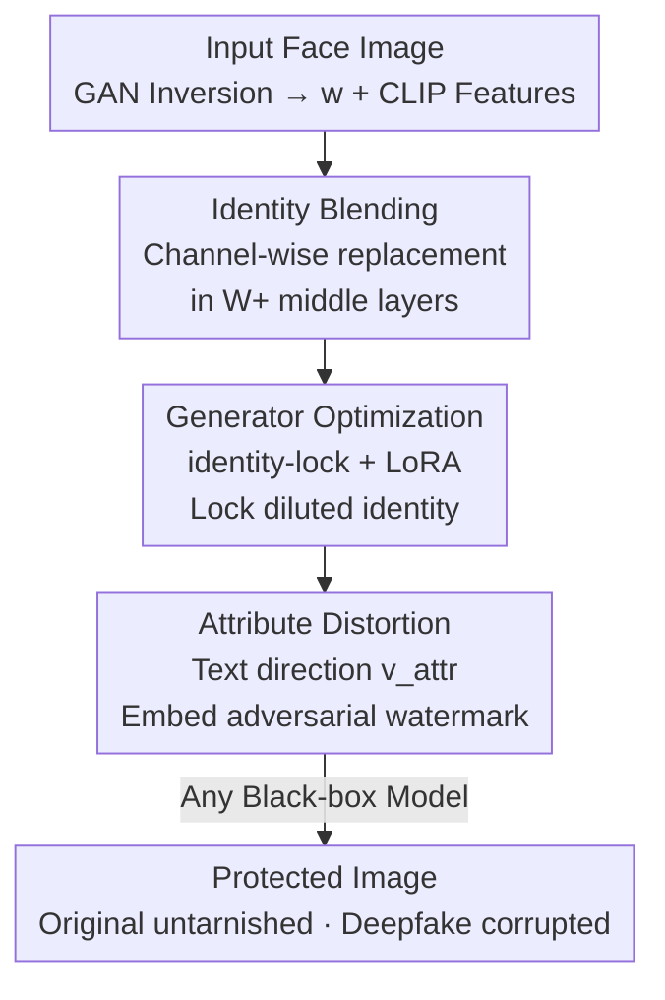

# DeepProtect: Proactive Face-Swapping Defense using Identity Blending and Attribute Distortion

**Conference**: CVPR 2026  
**Paper**: [CVF Open Access](https://openaccess.thecvf.com/content/CVPR2026/html/Lee_DeepProtect_Proactive_Face-Swapping_Defense_using_Identity_Blending_and_Attribute_Distortion_CVPR_2026_paper.html)  
**Code**: https://github.com/BACKAI/DeepProtect  
**Area**: AI Security / Facial Privacy Protection  
**Keywords**: Proactive Defense, Face-swapping Deepfake, Identity Blending, Adversarial Watermark, StyleGAN W+ Space  

## TL;DR
DeepProtect "vaccinates" face images before upload: it first dilutes extractable identity features by performing channel-wise blending of the target identity with visually similar but distinct faces in the StyleGAN W+ latent space. Subsequently, it embeds invisible adversarial watermarks along directions of specific facial parts (e.g., nose, eyebrows) specified by text prompts. This ensures that any deepfakes generated by subsequent face-swapping models are corrupted, while the protected image itself remains visually indistinguishable from the original.

## Background & Motivation
**Background**: Identity-driven face-swapping deepfakes can transfer a source identity to any target image without retraining by using an identity encoder to extract and fuse features. Defense strategies follow two paths: post-hoc deepfake detection and **proactive defense**. Detection occurs after propagation and often fails to stop early diffusion; proactive defense modifies the source image before upload to prevent correct identity extraction, providing "source protection" that works offline without real-time processing.

**Limitations of Prior Work**: Existing proactive defenses (based on noise, patches, attribute editing, or makeup transfer) suffer from two issues. First, they **leave visible artifacts** or significantly alter the original appearance, hindering user adoption. Second, even if they push identity features away globally, the features often land in regions corresponding to "another visually similar person," resulting in deepfakes that remain perceptually close to the original, failing to **truly disrupt visual quality** and protect privacy. Recent latent-space identity obfuscation methods require expensive two-stage StyleGAN optimization and only support global manipulation.

**Key Challenge**: There is an inherent trade-off between visual fidelity (the protected image should look like the original) and identity destruction strength (the generated deepfake should be corrupted). Stronger modifications degrade the original image, while lighter modifications fail to disrupt the deepfake.

**Goal**: To achieve "near-lossless protection" and "significant downstream deepfake corruption" simultaneously under a strict imperceptible perturbation budget, while remaining generalizable to black-box face-swapping models with deployable computational overhead.

**Key Insight**: The authors decouple defense into two complementary layers: "global dilution + local distortion." First, identity is globally "diluted" to become blurred, preventing convergence to any single individual. Once identity is diluted, constraints relax, allowing local distortions via user-specified attributes in the identity space to become more significant without damaging the overall visual appearance.

**Core Idea**: Replace "globally pushing identity features" with "W+ space channel-wise identity blending + text-driven attribute-direction adversarial watermarks" to maximize both fidelity and destruction strength.

## Method

### Overall Architecture
DeepProtect is a two-stage proactive defense pipeline. It takes an original face as input and outputs a "protected image" that is visually unchanged but causes any face-swapping model to fail.

Phase 1: **Identity Blending**. GAN inversion maps the input to a latent code $w$ and extracts its CLIP image feature $c^I$. Using $c^I$, visually similar but distinct identities are retrieved from a pre-built library. In identity-critical intermediate layers, $w$ is replaced channel-wise with the most similar candidate vector to obtain a diluted code $\tilde{w}$. To prevent the image from "drifting back" to the original identity during optimization, an identity-lock loss is used to fine-tune only the intermediate layers of the generator (using LoRA to compress parameters), resulting in an appearance-consistent but identity-diluted image. Phase 2: **Attribute Distortion**. Based on a text prompt (e.g., "nose"), the corresponding attribute direction $v_{attr}$ is retrieved in the identity space. An invisible adversarial watermark $W_{attr}$ is iteratively embedded along this direction under an $\ell_\infty$ constraint, causing controllable semantic distortion in the deepfake result. At inference, an identity encoder serves as a surrogate, while the face-swapping model remains a black box.

### Key Designs

**1. Identity Blending: "Diluting" identity channel-wise in W+ instead of pushing it away**

To address the issue where pushing identity globally leads to another similar face, DeepProtect performs channel-wise fusion in the StyleGAN W+ space. A code $w$ consists of 18 styles of 512 dimensions, where layers 3–7 are known to encode critical identity information. The method first constructs a candidate set via CLIP: $C = \{w_i \mid \cos(c^I, c^I_i) \ge \tau\}$, ensuring candidates look like the input but have different identities. It then replaces the style vector for each intermediate layer with the most similar candidate:

$$\tilde{w}[l] = \arg\max_{w_j \in C} \cos\big(w[l], w_j[l]\big)$$

Other layers remain unchanged. By fusing features from multiple semantically similar identities, the identity is "diluted" so it does not converge to any single individual. This makes it harder for face-swapping models to recover the original identity while preserving appearance compared to global translation.

**2. Generator Optimization: Locking diluted identity with identity-lock loss + LoRA**

Replacing the latent code with $\tilde{w}$ breaks identity consistency. During pixel/perceptual reconstruction, the generator might re-introduce original identity features to match the original image. An identity-lock loss is introduced to constrain the generator's output to match the "initially diluted identity" rather than the original:

$$L_{\text{id-lock}} = 1 - \cos\big(E_{id}(G_{\text{init}}(\tilde{w})), E_{id}(G(\tilde{w}))\big)$$

where $E_{id}$ is a pretrained identity encoder. Since only intermediate layers need adjustment, affine transformation outputs for coarse/fine layers are cached. Yet, this still involves ~11M parameters, so LoRA is applied: $\theta_0 \in \mathbb{R}^{512\times b}$ is decomposed into $\theta_1 \in \mathbb{R}^{512\times r}$ and $\theta_2 \in \mathbb{R}^{r\times b}$ ($r=8$). The objective is:

$$\theta^* = \arg\min_{\theta=\{\theta_1,\theta_2\}} L_2 + L_{\text{LPIPS}} + \lambda_{\text{id-lock}} L_{\text{id-lock}}$$

This balances fidelity and identity locking with significantly reduced computational cost.

**3. Attribute Distortion: Text prompt → order-aware LDA → Directional destruction**

While identity dilution "loosens the soil," this step destroys the deepfake. Users specify a component (e.g., nose) via text to be distorted in the identity space. Two steps derive the direction. First, **Text-guided Retrieval**: FaRL encodes the text into $c^T$, and samples are ranked by $s_i = c^I_i \cdot c^T$. The top-$m$ and bottom-$m$ identity features $Z^{id}_k$ are selected. Second, **Order-aware LDA**: A discriminant analysis objective with order-preserving regularization is solved:

$$v_{attr} = \arg\max_v \frac{v^\top S_B v}{v^\top (S_W + \lambda_R R)v}$$

$R$ is a regularization term weighted by CLIP rank differences $|\text{rank}_{\text{CLIP}}(i)-\text{rank}_{\text{CLIP}}(j)|$, ensuring the projected direction preserves the relative "strong-to-weak" semantic order of the attribute. Finally, an **Adversarial Watermark** $W_{attr}$ is embedded. The target direction is $v_{\text{target}} = -\text{sign}(p)\cdot v_{attr}$ (to maximize deviation). It uses sign gradient iteration to maximize $L(z_t, v_{\text{target}}) = z_t \cdot v_{\text{target}}$ within an $\ell_\infty$ ball ($|W_{attr}|\le 0.02$).

### Loss & Training
The generator optimization objective is $L_2 + L_{\text{LPIPS}} + \lambda_{\text{id-lock}} L_{\text{id-lock}}$, updating only LoRA parameters. Key hyper-parameters: $\tau=0.75$, $\lambda_{\text{id-lock}}=0.1$, $\lambda_R=1$, $m=30$, $r=8$, $\epsilon=0.02$. The feature library contains 4,605 identities from VGGFace2-HQ. StyleGAN2 is pretrained on FFHQ. 

## Key Experimental Results

### Main Results
Evaluation spans two datasets (CelebA-HQ, VGGFace2-HQ) and five models (SimSwap, FaceDancer, BlendFace, FaceSwapper, DiffFace). Metrics include PSNR, SSIM, ISM (Identity Similarity Measure, ↓ is better), and DSR (Defense Success Rate, ↑). Comparison on CelebA-HQ against SimSwap († compares original vs. protected; ‡ compares their deepfakes):

| Method | Type | PSNR‡ ↓ | SSIM‡ ↓ | DSR↑ |
|------|------|---------|---------|------|
| CMUA-Watermark | Noise | 27.10 | 0.851 | 41.0 |
| DF-RAP | Noise | 26.73 | 0.840 | 42.7 |
| FaceShield | Noise | 22.78 | 0.752 | 81.6 |
| DiffAM | Makeup | 23.11 | 0.779 | 79.7 |
| WDP | Makeup | 29.04 | 0.900 | 38.6 |
| **DeepProtect (Attribute)** | Ours | 26.01 | 0.824 | 60.5 |
| **DeepProtect (Combined)** | Ours | **21.09** | **0.710** | **94.8** |

The combined version achieves 92–97% DSR across all five models. It maintains high fidelity (PSNR 32.02 / SSIM 0.902) while achieving the lowest ISM (0.201). 

Subjective MOS (1-5 scale) results:

| Method | Source MOS↑ | Deepfake MOS↓ |
|------|-----------|----------------|
| DiffAM | 3.45 | 3.20 |
| FaceShield | 4.7 | 3.82 |
| **DeepProtect** | **4.7** | **1.35** |

### Ablation Study
(PDS = SSIM of original/protected minus SSIM of their deepfakes; higher means "stronger destruction with lower fidelity loss"):

| Identity Blending | Optimization | Attribute Distortion | SSIM† ↑ | ISM↓ | PDS↑ |
|:---:|:---:|:---:|---------|------|------|
| ✓ | | | 0.584 | 0.241 | -0.191 |
| ✓ | ✓ | | 0.915 | 0.249 | 0.136 |
| | | ✓ | 0.944 | 0.419 | 0.120 |
| ✓ | | ✓ | 0.571 | 0.194 | -0.196 |
| ✓ | ✓ | ✓ | 0.902 | 0.201 | **0.192** |

### Key Findings
- **Optimization is critical for fidelity**: Without generator optimization, SSIM is only 0.584. LoRA + identity-lock raises it to 0.915 while maintaining identity destruction.
- **Two stages are complementary**: Attribute distortion alone only yields an ISM of 0.419. The full combination lowers it to 0.201 and maximizes PDS.
- **Efficiency and Robustness**: Total FLOPs (126G) and inference time (12s) are lower than diffusion-based methods like DiffAM. DSR remains >93% under Gaussian noise, JPEG compression (QF=25), and adaptive attacks.
- **Beyond Face-swapping**: It effectively increases identity variance in diffusion-based text-to-video deepfakes.

## Highlights & Insights
- **"Dilution" vs. "Translation"**: Channel-wise fusion of multiple identities avoids the trap of landing on a single similar face, which usually leaves the deepfake looking realistic.
- **Identity-lock as an "Anchor"**: Paradoxically, the loss "locks" the disrupted state during reconstruction, preventing the generator from recovering original identity cues.
- **Traceability via Local Distortion**: User-specified component destruction embeds semantic clues into the deepfake, which can aid in post-hoc trace-back or detection.
- **Order-aware LDA**: Utilizing CLIP rank differences as regularization provides a robust way to find unsupervised semantic directions in entangled latent spaces.

## Limitations & Future Work
- Dependency on GAN inversion (E4E) and StyleGAN2: Errors in inverting extreme poses, occlusions, or out-of-distribution faces may propagate to defense quality.
- Pre-built feature library: While cross-dataset usage works, the diversity of the 4,605 identities affects candidates; library bias might impact dilution directions.
- Surrogate reliance: The "optimal" attribute direction $v_{attr}$ depends on the consistency between the surrogate encoder and the target black-box model.

## Related Work & Insights
- **vs. Noise/Patch-based (FaceShield, etc.)**: These struggle on flat areas and often yield DSR around 40. FaceShield is heavy (593G FLOPs). DeepProtect operates on identity itself, achieving >94% DSR with 126G FLOPs.
- **vs. Makeup/Editing-based (DiffAM, WDP)**: These significantly alter appearance (DiffAM source MOS is only 3.45). DeepProtect preserves the source look (MOS 4.7) while crushing the deepfake (1.35).

## Rating
- Novelty: ⭐⭐⭐⭐⭐ 
- Experimental Thoroughness: ⭐⭐⭐⭐⭐ 
- Writing Quality: ⭐⭐⭐⭐ 
- Value: ⭐⭐⭐⭐⭐ 

<!-- RELATED:START -->

## Related Papers

- [\[CVPR 2026\] No Way To Steal My Face: Proactive Defense Against Identity-Preserving Personalized Generation](no_way_to_steal_my_face_proactive_defense_against_identity-preserving_personaliz.md)
- [\[CVPR 2026\] Bridging Privacy and Provenance: Traceable Virtual Identity Generation](bridging_privacy_and_provenance_traceable_virtual_identity_generation.md)
- [\[CVPR 2026\] Frequency-domain Manipulation for Face Obfuscation](frequency-domain_manipulation_for_face_obfuscation.md)
- [\[CVPR 2026\] Reinforcement-Guided Synthetic Data Generation for Privacy-Sensitive Identity Recognition](reinforcement-guided_synthetic_data_generation_for_privacy-sensitive_identity_re.md)
- [\[CVPR 2026\] Logit-Margin Repulsion for Backdoor Defense](logit-margin_repulsion_for_backdoor_defense.md)

<!-- RELATED:END -->
