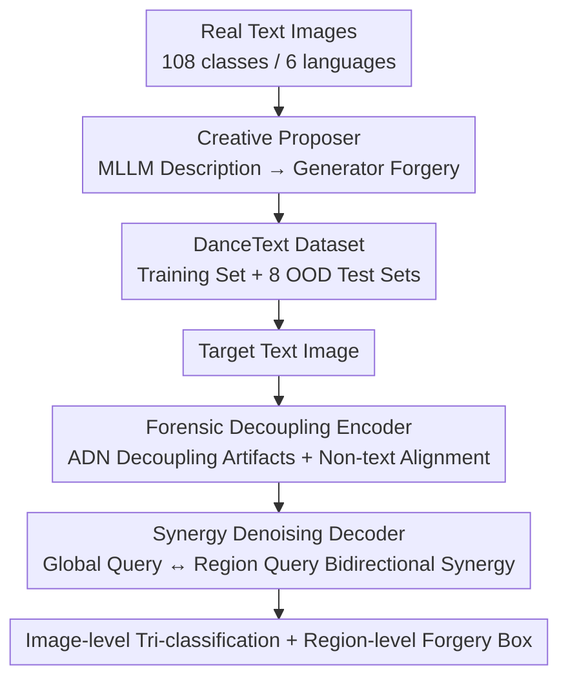

# Detect Any AI-Counterfeited Text Image

**Conference**: CVPR 2026  
**Paper**: [CVF Open Access](https://openaccess.thecvf.com/content/CVPR2026/html/Qu_Detect_Any_AI-Counterfeited_Text_Image_CVPR_2026_paper.html)  
**Code**: https://github.com/qcf-568/DanceText  
**Area**: AI Security  
**Keywords**: AI-Counterfeited Text Image Detection, Forensic Localization, Artifact Decoupling, Tamper Localization, Cross-domain Generalization

## TL;DR
Aiming at the detection of generative AI-counterfeited text images, the authors utilized an MLLM-driven Creative Proposer pipeline to construct the DanceText dataset, which is over 100 times larger than previous works. They proposed DS-Net, which leverages an "Artifact-Content Decoupling Encoder" to learn general artifacts from massive fake images in non-text domains, and a "Synergy Denoising Decoder" to enable mutual error correction between image-level classification and region-level localization. This approach improved the average F1 from 49.4 to 53.9 across eight out-of-domain test sets, including cross-generator, cross-language, and real-world software scenarios.

## Background & Motivation

**Background**: Diffusion models and Multimodal Large Language Models (MLLMs) like Qwen-Image can now easily forge any type of text image (whole-image synthesis, regional editing, and regional erasure). These fake receipts, documents, and credentials are used for fraud and the spread of rumors, posing realistic security threats. Previous research in detection includes benchmarks like T-SROIE, T-IC13, and OSTF, along with models like S3R and DAF.

**Limitations of Prior Work**: ① **Data side**—Existing datasets each contain fewer than 2,000 forged images, with limited image types (only receipts or signs), single languages (mostly English), and outdated generators (mostly pre-2023), failing to cover new forgery methods such as commercial apps, generative MLLMs, and regional erasure. ② **Model side**—Artifacts left by each generator are strongly coupled with image content and style, making detection models prone to over-fitting on "specific generator traces + content spurious correlations" seen during training, which leads to failure on unseen generators or image types. Furthermore, general DeepFake detectors only perform image-level binary classification and cannot handle the regional localization required for text forgery.

**Key Challenge**: To train a detector that is robust against any generator and any image type, yet the **number of available text image generators is limited**, leading to insufficient artifact diversity and inevitable model over-fitting. Meanwhile, classification and localization tasks have been treated separately in previous methods, preventing the bidirectional verification between global and local scales used by human experts.

**Goal**: Decomposed into two sub-problems—(1) Build a large-scale dataset with comprehensive coverage across image types, generators, forgery paradigms, and languages; (2) Design a robust detector capable of generalizing to unseen styles and generators.

**Key Insight**: The authors made two observations—firstly, fake image resources in non-text domains (e.g., Community Forensics with 2.7 million images and 4800+ generators) are much richer than in the text domain and can be borrowed to supplement artifact diversity. Secondly, human forensic experts perform bidirectional reasoning: "identifying global anomalies to focus on local details, and finding local forgeries to revise global judgments."

**Core Idea**: Regarding data, MLLMs are used to describe real images as "semantically rich prompts" which are then fed into generators to create world-realistic forgeries. Regarding the model, artifacts are decoupled from content, and image-level classification is forced to synergize bidirectionally with region-level localization.

## Method

The work consists of two parts: the **Creative Proposer pipeline** (for data generation, producing the DanceText dataset) and the **DS-Net detection model** (for detection).

### Overall Architecture

Data side: The Creative Proposer solves "how to control generators to create realistic fake images that meet requirements." It consists of two branches—the whole-image synthesis branch uses MLLMs to describe real images into detailed prompts for text-to-image models; the regional editing/erasure branch extracts text via OCR, uses MLLMs to suggest semantically reasonable replacements/deletions, and finally implements controlled inpainting. Using 45–49 generators to process 144,657 real images, 793,731 fake images were obtained, divided into one training set and eight out-of-domain test subsets.

Detection side: DS-Net takes a text image as input and outputs "image-level tri-classification (Real / Whole-image Generation / Regional Editing) + region-level forgery bounding box localization." It connects two components: the **Forensic Decoupling Encoder**, which strips generator artifacts from semantic content and aligns them to a unified artifact space using non-text fake images; and the **Synergy Denoising Decoder**, which utilizes a global forensic query and region localization queries to interact repeatedly within transformer decoding layers, allowing global judgments and local localization to correct each other.

### Key Designs

**1. Creative Proposer: Using MLLMs to Make "Forgery" Realistic**

The limitation is straightforward—previous fake images were either generated as whole images with simple prompts (looking very fake) or created by randomly modifying regions (lacking semantic rationality), leading to a huge domain gap with real-world forgeries. The authors use MLLMs as "creative proposers." Whole-image synthesis has two sub-pipelines: **Image-to-Text-to-Image** uses prompts like "Describe this image in detail so that I can prompt an image generation model to generate the very same image" to let Gemini-2.5-pro or GPT-4o describe real images, which are then synthesized by models like Qwen-Image or HunYuan3—the textual errors made by MLLMs during recognition are utilized as natural "textual content forgery" to increase diversity. **Text-to-Text-to-Image** starts from a high-quality seed prompt pool and iteratively lets MLLMs generate new prompts with equivalent detail, bypassing the prompt length limits of some generators.

Regional editing/erasure involves three steps: ① OCR extracts text and coordinates, which are segmented into character/word/phrase-level semantic fragments using NLP and rules; ② Fragments, context, position, and the original image are given to an MLLM to propose a semantically reasonable replacement or deletion; ③ If the proposal is valid, a blue border is used for regional disambiguation, and an inpainting model executes the edit while erasing the visual marker, followed by strict post-processing to filter low-quality results.

**2. Forensic Decoupling Encoder: Stripping Generator-Agnostic Artifacts and Leveraging Non-Text Diversity**

The problem is that a lack of text image generators leads to insufficient artifact diversity and over-fitting, while massive non-text fake images cannot be used directly due to content/task misalignment. The authors use a ViT backbone with a parallel **Artifact Decouple Network (ADN, ConvNeXt backbone)**. While ViT features are prone to over-fitting, ADN focuses on extracting "semantically irrelevant general artifact features" to enhance the main ViT features. ADN achieves decoupling through three new losses (applied to the top-level feature map $F_4$):

- $L_{dnt}$ (Non-text Image Decoupling): Performs **internal (spatial) and external (batch-wise) patch shuffle** on real/fake non-text images—internal shuffling destroys semantics, forcing ADN to focus on local artifacts; external shuffling allows "whole-image generation" data to perform patch-level independent prediction, bridging the gap between image-level classification and region-level localization. It is a BCE loss on shuffled patches.
- $L_{dt}$ (Text Image Decoupling): Uses L2 loss to **attract** features of edited regions $E$ and erased regions $R$ while **pushing** them away from real regions. Since $E$ and $R$ share the commonality of "having artifacts" but differ in that "$R$ lacks text content," this forces ADN to learn content-agnostic artifact features.
- $L_{da}$ (Domain Alignment): Aligns feature maps of text and non-text domains in the latent space—attracting forged region features from both domains and pushing them away from real regions to learn unified artifact representations.

ADN is trained end-to-end with $L_{ADN} = L_{dnt} + L_{dt} + L_{da} + L_{ce}$.

**3. Synergy Denoising Decoder: Enabling Bidirectional Verification Between Classification and Localization**

The limitation is that previous methods either inferred global judgments from a noisy localization map or used two independent heads without interaction, failing to simulate expert reasoning. The core is a learnable **Global Forensic Query (GFQ)**: it **interacts iteratively** with region-level localization queries in the transformer decoding layers, ensuring final image-level judgments are informed by local evidence while using global information to better correct regional queries. The decoder is adapted from the DINO denoising architecture.

## Key Experimental Results

Backbone: Swin-Transformer-small for the main model, ConvNeXt-small for ADN; AdamW, lr 8e-6; text images resized to 1024×1536. Image-level tri-classification uses balanced accuracy (Acc.), and region-level uses ICDAR2015 DetEval F1.

### Main Results: DanceText Eight Test Subsets (AVG column)

| Method | Test F1 | CG F1 (Cross-Gen) | CL F1 (Cross-Lang) | RW F1 (Real Software) | AVG Acc. | AVG F1 |
|------|---------|-----------------|----------------|------------------|----------|--------|
| ATRR-S3R | 72.9 | 53.2 | 58.8 | 6.4 | 74.4 | 44.2 |
| CounterNet-S3R | 74.2 | 56.5 | 60.1 | 7.6 | 74.4 | 45.8 |
| FRCNN-DAF | 77.3 | 58.7 | 62.9 | 9.5 | 74.6 | 48.0 |
| CRCNN-DAF | 78.5 | 60.4 | 64.0 | 9.8 | 74.6 | 49.4 |
| **DS-Net (Ours)** | **83.6** | **68.7** | **72.1** | **12.3** | **77.4** | **53.9** |

Performance drops significantly across all models on Cross-Generator (CG), Cross-Language (CL), and especially Real-World software forgery (RW) subsets. DS-Net leads in every OOD subset, with an AVG F1 4.5 points higher than the second-best CRCNN-DAF.

### Ablation Study (DS-Net Components)

| Configuration | DanceText Acc. | DanceText F1 |
|------|----------------|--------------|
| (1) Baseline (DINO) | 74.2 | 45.1 |
| (4) w/o $L_{dnt}$ | 75.8 | 47.9 |
| (6) w/o $L_{da}$ | 76.3 | 49.0 |
| (7) w/o ADN (Encoder) | 75.4 | 47.3 |
| (8) w/o Synergy (GFQ) | 75.9 | 51.8 |
| **(9) DS-Net Full** | **77.4** | **53.9** |

### Key Findings
- **ADN Decoupling Encoder is the main driver for generalization**: Removing the entire ADN (Config 7) dropped the DanceText F1 from 53.9 to 47.3 (-6.6). Among the three decoupling losses, $L_{dnt}$ and $L_{da}$ had the greatest impact.
- **Internal patch shuffle is essential**: It forces the model to focus on local artifacts by destroying semantics. External shuffle bridges the gap between "classification data" and "localization supervision."
- **Synergy Decoder brings synergistic gains**: Removing GFQ (Config 8) reduced the F1 from 53.9 to 51.8, validating that bidirectional interaction between image-level and region-level tasks yields a "1+1>2" effect.
- **Real-world software forgery is the hardest scenario**: F1 scores on RW/RWT dropped to the teens or low single digits for all methods, indicating that private generators and post-processing remain an open challenge.

## Highlights & Insights
- **Turning "MLLM recognition errors" into an advantage**: In the Image-to-Text-to-Image pipeline, MLLM textual errors are used directly as natural text content forgery, increasing data diversity for free.
- **Decoupling perspective for cross-domain knowledge transfer**: The core insight is that "artifacts" are more transferable than "content." By using the commonality of edited/erased regions and aligning non-text domains, the model effectively utilizes 2.7 million external fake images.
- **Patch shuffle bridges image and region levels**: External batch-wise shuffle allows synthetic data with only whole-image labels to provide patch-level supervision, bridging the gap between classification and localization tasks.

## Limitations & Future Work
- Real-world software/app forgery (RW/RWT) remains a major weakness due to private generators and post-processing that erases artifacts.
- There is an inconsistency in the backbone description (ViT in abstract vs. Swin-Transformer in implementation).
- The method relies heavily on the quality of OCR and MLLM proposals; errors here can contaminate the data.
- Although the dataset covers six languages, the training distribution is heavily weighted toward Qwen-Image generators, suggesting room for improvement in generator diversity.

## Related Work & Insights
- **vs S3R / DAF**: These methods excel at localizing edits but struggle with image-level classification and text erasure. DS-Net outperforms them on T-IC13/OSTF even when they are retrained with the same configurations.
- **vs General DeepFake Detectors**: General detectors only perform binary classification. DS-Net borrows their massive non-text datasets to supplement artifact diversity for text-specific needs.
- **vs DINO Detection Framework**: DS-Net uses DINO as a base but injects a Global Forensic Query to transform a general detector into a forensic model with "global-local mutual verification."

## Rating
- Novelty: ⭐⭐⭐⭐ The dataset scale is a major leap, and the decoupling + synergy mechanisms are well-designed, though many components rely on existing techniques.
- Experimental Thoroughness: ⭐⭐⭐⭐⭐ Comprehensive evaluation across 8 OOD subsets plus two public datasets with extensive ablations.
- Writing Quality: ⭐⭐⭐⭐ The motivation and data contributions are clear, though there are minor inconsistencies in backbone descriptions.
- Value: ⭐⭐⭐⭐⭐ Provides the first truly world-realistic large-scale benchmark and open-source code for this domain, significantly advancing AI forgery detection research.

<!-- RELATED:START -->

## Related Papers

- [\[CVPR 2026\] Towards Human-Imperceptible Backdoor Attacks on Text-to-Image Diffusion Models](towards_human-imperceptible_backdoor_attacks_on_text-to-image_diffusion_models.md)
- [\[CVPR 2026\] JANUS: A Lightweight Framework for Jailbreaking Text-to-Image Models via Distribution Optimization](janus_a_lightweight_framework_for_jailbreaking_text-to-image_models_via_distribu.md)
- [\[CVPR 2026\] GenBreak: Red Teaming Text-to-Image Generation Using Large Language Models](genbreak_red_teaming_text-to-image_generation_using_large_language_models.md)
- [\[CVPR 2026\] When LoRA Betrays: Backdooring Text-to-Image Models by Masquerading as Benign Adapters](when_lora_betrays_backdooring_text-to-image_models_by_masquerading_as_benign_ada.md)
- [\[CVPR 2026\] Scaling Up AI-Generated Image Detection with Generator-Aware Prototypes](scaling_up_ai-generated_image_detection_with_generator-aware_prototypes.md)

<!-- RELATED:END -->
