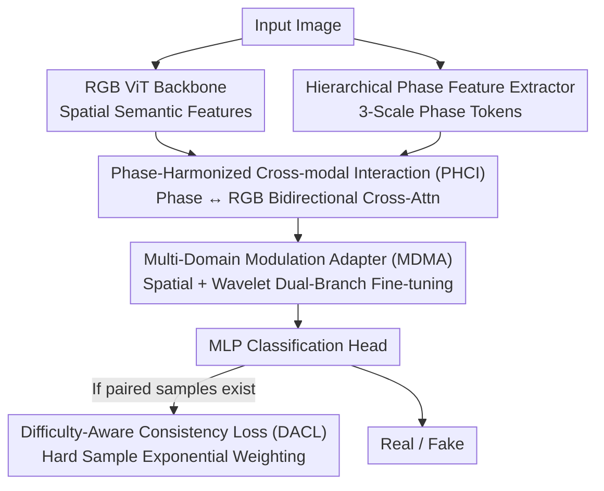

# Detecting Compressed AI-Generated Images via Phase Spectrum Robustness

**Conference**: CVPR 2026  
**Paper**: [CVF Open Access](https://openaccess.thecvf.com/content/CVPR2026/html/Li_Detecting_Compressed_AI-Generated_Images_via_Phase_Spectrum_Robustness_CVPR_2026_paper.html)  
**Code**: Undisclosed  
**Area**: AI Security / Forged Image Detection  
**Keywords**: AI-generated image detection, Phase spectrum robustness, JPEG compression, Cross-modal interaction, Difficulty-aware loss  

## TL;DR
To address the failure of AI-generated image detectors caused by JPEG compression on social networks destroying forgery traces, this paper starts from the signal processing observation that "phase spectra are more robust to compression than magnitude spectra." It proposes CPTFormer, which uses phase features to guide RGB representations through bidirectional cross-modal fusion, followed by fine-tuning via spatial and wavelet-frequency dual-branch adapters. By employing a difficulty-aware loss to focus on hard samples with limited compression labels, the model improves accuracy by up to 6.7% across four compression benchmarks for GAN/Diffusion models.

## Background & Motivation

**Background**: Most AI-generated image detectors (e.g., FreqNet, NPR, Fatformer, ODDN) rely on high-frequency forgery traces. The upsampling operations of generative models leave characteristic "fingerprints" in the frequency domain. Detectors learn these subtle high-frequency statistical differences to distinguish real from fake.

**Limitations of Prior Work**: These traces are extremely fragile. In real-world deployment, Online Social Networks (OSNs) apply aggressive JPEG compression to all uploaded images, dealing a double blow: ① Compression **erases** the high-frequency forgery traces the detector relies on (Figure 1(c) shows energy loss concentrated in high frequencies); ② The compression itself **introduces new artifacts**, acting as misleading signals. Consequently, 90%+ of detectors performing well on clean academic benchmarks drop to near-random performance on OSNs.

**Key Challenge**: Recent methods (ADD, QAD, ODDN) attempt to enhance robustness by training on compressed data, but they rely heavily on "raw-compressed paired data + compression labels." In reality, obtaining both the original high-quality image and its OSN-compressed version is often infeasible, and labeling compression ratios is labor-intensive. There is a sharp contradiction between the demand for robustness and the cost of annotation.

**Key Insight**: The authors return to the signal processing essence of JPEG compression. JPEG transforms 8×8 pixel blocks into the frequency domain via DCT. Information loss primarily stems from the quantization step, where each frequency coefficient $F(u,v)$ is divided by a quantization table $Q(u,v)$ and rounded. Decomposing the complex coefficient into magnitude and phase, $F(u,v)=|F(u,v)|\cdot e^{\angle F(u,v)}$, reveals that quantization primarily affects the **magnitude** ($|F_{quant}(u,v)|\approx |F(u,v)|/Q(u,v)$), while the **phase** $\angle F(u,v)$ remains **entirely unchanged** as long as the coefficient is not quantized to zero. Phase is only lost when the highest frequency components (largest $Q$ values) are quantized to zero. Empirical evidence in Figure 1(d)(e) confirms that compression disturbs the magnitude spectrum much more than the phase spectrum, with phase differences for most frequency components clustering tightly around zero.

**Core Idea**: Treat this stable phase information as an "anti-compression anchor" to guide the learning of fragile RGB/spatial features. This allows learning compression-robust representations **using only forgery labels, without requiring paired data or compression labels**.

## Method

### Overall Architecture

CPTFormer (Compression-Robust Phase-Harmonized Transformer) is a dual-branch architecture: a standard RGB branch uses a pre-trained CLIP-ViT to extract spatial semantic features, while a phase branch uses a lightweight convolutional pyramid to extract multi-scale anti-compression cues from the phase spectrum. The two branches perform bidirectional cross-modal fusion via **PHCI**—where stable phase first guides RGB, and processed RGB semantics then refine the phase. The fused features are refined within each ViT block by **MDMA** adapters using parameter-efficient spatial and wavelet-frequency branches. Finally, an MLP head outputs Real/Fake. If small amounts of compressed paired samples are available during training, the **DACL** loss is added to focus learning on the most difficult compressed samples.

### Key Designs

**1. Hierarchical Phase Feature Extractor: Encoding anti-compression phase into scale-aware token sequences**

Knowing "phase is anti-compression" is insufficient; phase information must be transformed into representations usable by Transformers. The authors use a lightweight convolutional pyramid to generate feature pyramids $\{C_l\}_{l=1}^3$ at three spatial scales (1/8, 1/16, 1/32 of the input resolution), allowing the model to perceive phase characteristics at both coarse structures and fine details. Each feature map $C_l$ is projected to a uniform dimension $D$ using a level-specific $1\times1$ convolution $\phi_l$, then flattened into tokens. A critical step adds a **learnable level embedding** $e_l$ to tokens of the same scale to preserve hierarchical context:

$$p_l = \mathrm{Flatten}(\phi_l(C_l)) + e_l, \qquad p = \mathrm{Concat}(p_1, p_2, p_3)$$

The tokens from three scales are concatenated into the final phase representation $p\in\mathbb{R}^{N_p\times D}$ for subsequent fusion. This representation is both detail-rich and explicitly scale-aware.

**2. Phase-Harmonized Cross-modal Interaction (PHCI): Guiding fragile RGB with stable phase, then refining phase with semantics**

Given RGB tokens $l$ and phase tokens $p$, the challenge is fusing these complementary modalities. PHCI employs **bidirectional** cross-attention rather than simple concatenation. First, RGB tokens act as queries and phase tokens as keys/values, allowing each RGB token to query all phase tokens for anti-compression cues:

$$l_{cross} = \mathrm{CrossAttn}(\mathrm{Norm}(l), \mathrm{Norm}(p)), \qquad l' = l + \gamma_l\cdot(l_{cross} + \mathrm{MLP}(\mathrm{Norm}(l_{cross})))$$

The enhanced RGB tokens $l'$ pass through ViT blocks to obtain semantic $l_{ViT}$. Second, phase tokens act as queries to attend to $l_{ViT}$, using global semantic understanding to refine local phase cues:

$$p_{cross} = \mathrm{CrossAttn}(\mathrm{Norm}(p), \mathrm{Norm}(l_{ViT})), \qquad p' = p + \gamma_p\cdot(p_{cross} + \mathrm{MLP}(\mathrm{Norm}(p_{cross})))$$

$\gamma_l, \gamma_p$ are learnable gating scalars. This "Phase → RGB → Phase" bidirectional refinement is the essence of PHCI: phase provides stable anti-compression signals, while RGB provides task-related semantics.

**3. Multi-Domain Modulation Adapter (MDMA): Parameter-efficient fine-tuning with spatial and wavelet-frequency branches**

To leverage pre-trained ViT knowledge without destroying it or full fine-tuning, MDMA adapters are inserted into ViT blocks. The **spatial branch** is a standard bottleneck adapter: $\Delta F_{spatial}=\mathrm{MLP}_{up}(\sigma(\mathrm{MLP}_{down}(F)))$. The **frequency branch** reshapes tokens into 2D feature maps and applies a 2D Discrete Wavelet Transform (DWT), decomposing them into an approximation band $X_{LL}$ and three detail bands $X_{LH}, X_{HL}, X_{HH}$. Channel attention $S(\cdot)$ via SE blocks recalibrates each band $X'_{band}=X_{band}\odot S(X_{band})$, followed by an inverse DWT (IDWT) to reconstruct $\Delta F_{freq}$. The final output is a gated sum:

$$\Delta F = \alpha_s\cdot\Delta F_{spatial} + \alpha_f\cdot\Delta F_{freq}$$

The frequency branch explicitly amplifies useful forgery frequency cues in different wavelet subbands, complementing the spatial path.

**4. Difficulty-Aware Consistency Loss (DACL): Optimizing limited compression labels**

When small amounts of compressed paired samples are available, DACL **assigns higher weights to the hardest samples**—those most likely to be misclassified. A difficulty weight is calculated using the cross-entropy loss of compressed images, with **gradient backpropagation stopped through $\omega$**:

$$\omega = \exp(L_{CE}(f_\theta(x_c), y)), \qquad L_{DAL} = \omega L_{CE}(f_\theta(x_c), y) + L_{CE}(f_\theta(x_o), y)$$

where $x_c$ is compressed and $x_o$ is uncompressed. Weights grow **exponentially** with difficulty. A contrastive loss $L_{con}$ is added for intra-class consistency and inter-class separability:

$$L_{con}^{(i)} = -\log\frac{\sum_{p\in P(i)}\exp(\mathrm{sim}(z_i,z_p)/\tau)}{\sum_{j\ne i}\exp(\mathrm{sim}(z_i,z_j)/\tau)}, \qquad L_{DACL} = L_{DAL} + \lambda_{con}L_{con}$$

### Loss & Training

The backbone is a pre-trained CLIP-ViT. Images are resized to 256×256 and cropped to 224×224. Optimization uses AdamW (LR 2e-5, Batch Size 32, 20 epochs). The training set follows the ODDN protocol: 80% unpaired raw images ($D_{unpaired}$) + 20% paired subset ($D_{paired}$ and its QF=40 JPEG version $D_{compressed}$), with DACL applied only to the 20% paired samples.

## Key Experimental Results

### Main Results

Trained only on ProGAN (ForenSynths) and tested on GAN (ForenSynths + GANGen-Detection) and Diffusion models (DiffusionForensics + Ojha) in quality-aware (fixed QF) and quality-agnostic (random QF) scenarios using Accuracy (Acc).

| Test Scenario | Setting | CPTformer | Prev. SOTA | Gain |
|----------|------|-----------|---------|------|
| GAN · quality-aware | 2-class | **77.4** | 71.4 (ODDN) | +6.0 |
| GAN · quality-aware | 4-class | **79.3** | 72.6 (ODDN) | +6.7 |
| DM · quality-aware | 2-class | **65.9** | 62.3 (FF++) | +3.6 |
| GAN · quality-agnostic | 2-class | **76.3** | 70.7 (ODDN) | +5.6 |
| GAN · quality-agnostic | 4-class | **77.4** | 72.1 (ODDN) | +5.3 |
| DM · quality-agnostic | 2-class | **63.5** | 58.6 (Fatformer) | +4.9 |

The stable performance in the random QF quality-agnostic scenario proves the phase-centered design yields genuine generalization rather than overfitting to specific compression ratios.

### Ablation Study

Table 5 (2-class quality-aware GAN, cumulative components):

| Configuration | Mean Acc | Note |
|------|---------|------|
| Baseline (CLIP-ViT) | 64.6 | Pure RGB backbone |
| + PHCI | 74.7 | Phase bidirectional interaction (+10.1, largest contributor) |
| + MDMA | 76.0 | Multi-domain adapter (+1.3) |
| + DACL | 77.4 | Difficulty-aware loss (+1.4, full model) |

### Key Findings
- **PHCI is the primary driver**: Adding PHCI alone provides a +10.1% gain, confirming that "guiding fragile RGB with stable phase" addresses the core issue of compression robustness.
- **Label efficiency is a key advantage**: The framework can train without paired data or compression labels; DACL only provides on-demand gains when small paired samples are present.
- **t-SNE (Figure 3)**: Baseline real/fake features are severely entangled; CPTformer learns features where real and fake form two compact, separated clusters.

## Highlights & Insights
- **From Signal First Principles**: Instead of just stacking backbones, the method derives "quantization affects magnitude but not phase" from the mathematics of JPEG, using phase as an anchor.
- **Transferable Interaction Paradigm**: The "Phase → RGB → Phase" bidirectional refinement can be extended to any multi-modal scenario with one robust but semantic-weak modality and one semantic-strong but fragile modality.
- **Wavelet Adapter Design**: MDMA's wavelet branch decomposes subbands to explicitly amplify forgery cues, aligning perfectly with the frequency-domain phase motivation.
- **Gradient Stop in DACL**: Stopping gradients through $\omega = \exp(L_{CE})$ ensures it acts as a modulation factor without allowing the model to take "shortcuts" to reduce weights.

## Limitations & Future Work
- Robustness against other post-processing (resizing, noise, filters) is not deeply discussed.
- ⚠️ Phase robustness assumes coefficients are not quantized to zero. At **extremely low Quality Factors** (much lower than QF=40), phase information may be lost.
- Performance on Diffusion models (65.9%) remains lower than on GANs, suggesting that compression-robust detection for Diffusion images is still an open challenge.
- Training on a single generator (ProGAN) limits coverage; introducing multi-source phase priors might improve generalization to unseen architectures.

## Related Work & Insights
- **vs ODDN / QAD / ADD (Paired Data Approach)**: These rely on "raw-compressed pairs + compression labels," which is costly. Ours uses intrinsic phase robustness, outperforming them by ~6% without requiring such supervision.
- **vs FreqNet / F3Net (Frequency Statistics Approach)**: These use high-frequency components that are destroyed by compression. Ours relies on the more stable phase information.
- **vs Fatformer / NPR (Spatial/Relationship Approach)**: Most spatial methods fail on compressed artifacts; Ours introduces the phase-frequency channel to provide more robust cues.

## Rating
- Novelty: ⭐⭐⭐⭐⭐ 
- Experimental Thoroughness: ⭐⭐⭐⭐ 
- Writing Quality: ⭐⭐⭐⭐ 
- Value: ⭐⭐⭐⭐⭐

<!-- RELATED:START -->

## Related Papers

- [\[CVPR 2026\] VMD-FACT: A New Video Dataset and MLLM-based method for Detecting Realistic AI-Generated Video Misinformation](vmd-fact_a_new_video_dataset_and_mllm-based_method_for_detecting_realistic_ai-ge.md)
- [\[CVPR 2026\] Skyra: AI-Generated Video Detection via Grounded Artifact Reasoning](skyra_ai-generated_video_detection_via_grounded_artifact_reasoning.md)
- [\[CVPR 2026\] Scaling Up AI-Generated Image Detection with Generator-Aware Prototypes](scaling_up_ai-generated_image_detection_with_generator-aware_prototypes.md)
- [\[CVPR 2026\] SAIDO: Scene-Aware and Importance-Guided Dynamic Optimization for Generalizable AI-Generated Image Detection](saido_generalizable_detection_of_ai-generated_images_via_scene-aware_and_importa.md)
- [\[ICLR 2026\] PluriHarms: Benchmarking the Full Spectrum of Human Judgments on AI Harm](../../ICLR2026/ai_safety/pluriharms_benchmarking_the_full_spectrum_of_human_judgments_on_ai_harm.md)

<!-- RELATED:END -->
