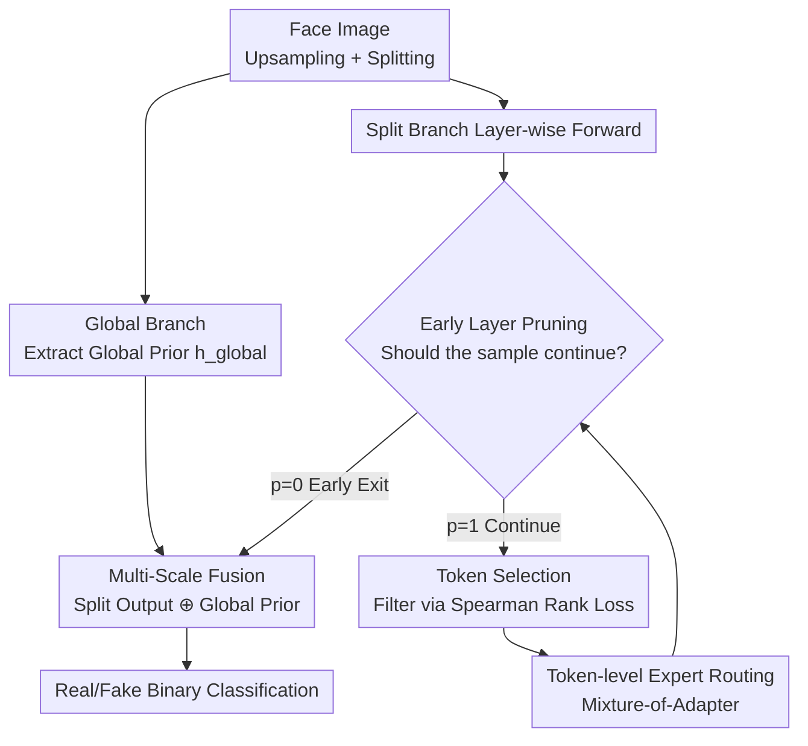

# DFD-HR: Generalizable Deepfake Detection via Hierarchical Routing Learning

**Conference**: CVPR 2026  
**Paper**: [CVF Open Access](https://openaccess.thecvf.com/content/CVPR2026/html/Sun_DFD-HR_Generalizable_Deepfake_Detection_via_Hierarchical_Routing_Learning_CVPR_2026_paper.html)  
**Code**: https://dfd-hr.github.io/ (Project Page)  
**Area**: AI Security / Deepfake Detection  
**Keywords**: Deepfake Detection, Parameter-Efficient Fine-Tuning, Hierarchical Routing, Early Layer Pruning, Mixture-of-Experts

## TL;DR
When migrating Visual Foundation Models (VFMs) like CLIP to deepfake detection, DFD-HR avoids simply "tuning fewer parameters." Instead, it implements "hierarchical routing" at both the **layer level** (adaptively determining the number of layers per sample) and **token level** (filtering irrelevant tokens via Spearman rank loss + MoE expert routing). This allows the model to concentrate computational power on representations containing actual forgery clues, achieving gains of +2.3% and +3.8% in Video-level AUC across datasets and forgery methods, respectively.

## Background & Motivation

**Background**: Generalizable deepfake detection (DFD) currently favors migrating Visual Foundation Models (VFMs, e.g., CLIP) via Parameter-Efficient Fine-Tuning (PEFT, only updating a small subset of parameters like Adapters/LoRA). This has proven effective for "unseen forgery types," as seen in works like Forensics Adapter, Effort, and MoE-FFD.

**Limitations of Prior Work**: Direct migration via PEFT conceals a critical unanswered question: **even when tuning only a few parameters, are these parameters (and the features they act upon) truly the most informative?** The authors observe two neglected structural facts: ① Different layers capture different semantic abstractions, and the **depth requirement for real vs. fake samples is asymmetric**—real samples often converge quickly, while fake samples require deeper layers, with different forgery methods exposing flaws at different depths (Fig.2(b)); ② Within the same layer, different tokens carry vastly different forgery clues, leading to significant interference from "spurious tokens" in attention maps (Fig.2(a)). Simply transferring CLIP often leads the attention to incorrect regions, which even "zoom-in" strategies cannot fully resolve.

**Key Challenge**: Standard PEFT employs "globally uniform" tuning—all samples pass through all layers, and all tokens participate equally. This mismatches the fact that different samples require different depths and show disparate token contributions. Redundant layers and tokens not only waste computation but also cause the model to overfit to specific forgery artifacts, harming generalization.

**Goal**: Upgrade PEFT from "which parameters to tune" to "dynamically determining which layers, tokens, and experts each sample should use"—optimizing at both layer and token granularities.

**Core Idea**: Propose **Hierarchical Routing (HR)**—using "Early Layer Pruning" to let samples adaptively decide forward depth, and "Token Selection + Expert Routing" to extract the most discriminative tokens and decouple real/fake learning, concentrating resources on the most informative representations.

## Method

### Overall Architecture

DFD-HR processes a face image through two paths: a global branch extracts the global [CLS] representation $h_{global}^{cls}$ as a "global prior," while the split branch divides the upsampled image into patches and passes them through a Transformer inserted with "Hierarchical Routing." In the **last few layers** of the backbone (the last 4 layers in the implementation), the HR suite is inserted: before entering each layer, **Early Layer Pruning** determines if the sample should continue (if not, it goes directly to classification). If it continues, **Token Selection** filters Top-K tokens based on forgery relevance (others pass through a bypass), and selected tokens are processed by **Token-level Expert Routing** (Mixture-of-Adapter). Other non-HR layers only use expert designs. Finally, **Multi-Scale Fusion** combines the split branch output with the global representation for classification. The training objective combines classification loss and a Spearman rank loss to guide token ordering.

### Key Designs

**1. Early Layer Pruning: Differentiated Depth for Samples**

Addressing the "asymmetric depth requirement," the authors add a "layer judge" to each HR layer. It takes the layer's [CLS] token $h_i^{cls}$ and passes it through a two-layer MLP: $\text{logits} = W_2(\text{ReLU}(W_1(h_i^{cls})))$. **Gumbel-Sigmoid** is used for hard routing—sampling Gumbel noise $g=-\log(-\log(U+\epsilon)+\epsilon)$, soft probability $p_{soft}=\sigma\!\left(\frac{\text{logits}+g}{\tau}\right)$, and hard decision $p_{hard}=\mathbb{I}[p_{soft}>0.5]$. To maintain differentiability, straight-through estimation is used during training:

$$p = \text{sg}(p_{hard}) - \text{sg}(p_{soft}) + p_{soft}$$

where $\text{sg}(\cdot)$ is the stop-gradient. The layer output is a gate-weighted residual: $H_{i+1}=p\cdot \text{Layer}_i(H_i)+(1-p)\cdot H_i$. Once $p=0$, the sample **skips all subsequent layers**. Consequently, real samples typically exit early, while different forgery methods terminate at different depths, turning "depth" itself into a discriminative signal. The number of layers can be reduced by up to 17%.

**2. Token Selection: Guidance via Global Prior + Spearman Rank Loss**

To mitigate "interference from spurious tokens," a "token judge" scores each token: $\text{scores}_i = W_t([h_i^{cls}, h_i^{patch}])$. Only Top-K ($k=\max(1,\lfloor r\times L\rfloor)$ with $r=75\%$) are retained. The scores are supervised using the cosine similarity $\text{cosine}_i$ between the global [CLS] $h_{global}^{cls}$ and current hidden states. **Spearman Rank Correlation** constrains the scoring order to be monotonic with similarity:

$$\rho_{spearman}=\frac{\text{Cov}(\text{rank}(\text{scores}_i),\text{rank}(\text{cosine}_i))}{\sigma_{\text{rank}(\text{scores}_i)}\cdot\sigma_{\text{rank}(\text{cosine}_i)}},\quad L_{rank}=1-\rho_{spearman}$$

Rank correlation is preferred over direct regression because forgery detection relies on the **relative sorting** of "which token is more important" rather than absolute values. Selected tokens are re-weighted: $H_{i+1}^{select}=H_{i+1}^{select}\odot(1+\text{Softmax}(\text{TopK}(\text{scores}_i,k)))$.

**3. Token-level Expert Routing: Decoupling Forgery Conflicts via MoE**

Different forgery types (deepfakes, reenactment, synthesis) have varying artifact distributions. A single Adapter may overfit to one type. The authors insert **Mixture-of-Adapter (MOA)** after MHA and MLP. A noisy gating network $G=\text{Softmax}(L+\epsilon\odot\text{Softplus}(L))$ (where $\epsilon\sim\mathcal{N}(0,I)$ encourages diversity) weights $N=4$ Adapter experts: $\text{MOA}(X)=X+\sum_{i=1}^{N}G_i\odot\text{Adapter}_i(X)$. This allows sparse experts to handle "real/fake decoupling" and "forgery type decoupling."

**4. Multi-Scale Fusion: Concatenating Split and Global Representations**

The split branch (local high-res) and global branch (contextual semantics) are complementary. A learnable query token $Q_{token}$ performs cross-attention over the split output $h_{split}=\text{MHA}(Q_{token},H_{split},H_{split})$, which is then concatenated with $h_{global}^{cls}$ for the final classification head.

### Loss & Training

The total loss combines binary cross-entropy and Spearman rank loss:

$$L = L_{cls} + \lambda_1 \cdot \frac{1}{m}\sum_{i}^{m} L_{rank}^{i}$$

where $m$ is the number of HR layers (last 4), and $\lambda_1=0.1$. The backbone defaults to CLIP ViT-L/14 with full fine-tuning (LR 1e-6 as baseline); HR modules use Adam with LR 1e-4. Training uses 8 frames per video (batch 16), and inference uses 32 frames (batch 32).

## Key Experimental Results

### Main Results

Trained on FF++ (c23), evaluated under Protocol-1 (7 unseen datasets) and Protocol-2 (DF40 cross-forgery) for Video-level AUC:

| Setting | Metric | Ours | Prev. SOTA (Effort) | Gain |
|------|------|--------|------------------|------|
| Cross-Dataset Avg. | Video-AUC | **0.940** | 0.917 | +2.3% |
| Cross-Method Avg. | Video-AUC | **0.978** | 0.940 | +3.8% |
| CDF-v2 | Video-AUC | 0.960 | 0.956 | +0.4% |
| DFo | Video-AUC | 0.997 | 0.977 | +2.0% |
| WDF | Video-AUC | 0.907 | 0.848 | +5.9% |
| FFIW | Video-AUC | 0.968 | 0.921 | +4.7% |

At the Frame-level AUC (Tab.2), the model outperforms others across all four datasets, averaging 0.891 (+2.1% over CVPR'25 ForAda). It simultaneously reduces layers by 17% and tokens by 25%.

### Ablation Study

Breakdown of HR and MSF (Cross-Method, Video-AUC %):

| Configuration | CDF-v2 | FaceShifter | Avg. |
|------|--------|-------------|------|
| Baseline | 91.8 | 88.8 | 90.3 |
| + HR | 95.0 (+3.2) | 90.7 (+1.9) | 92.9 (+2.6) |
| + MSF | 92.9 (+1.1) | 90.1 (+1.3) | 91.5 (+1.2) |
| + HR + MSF (Full) | **96.0 (+4.2)** | **91.2 (+2.4)** | **93.6 (+3.3)** |

### Key Findings
- **Contribution Ranking**: HR provides the largest gain (+2.6% avg), driven primarily by Token Selection (+1.1%) and Early Layer Pruning (+1.0%).
- **Token Selection Accuracy**: Compared to PCA, FastV, or Sparse Attention, the proposed rank-loss-guided scheme achieves the highest average AUC, suggesting global priors better suit DFD than pure feature heuristics.
- **Counter-intuitive Multi-Scale Fusion**: Simpler fusion outperformed heavier alternatives like RINE or MRA, highlighting that "aligning split + global priors" is more critical than stacking large auxiliary models.
- **Backbone Agnostic**: The mechanism remains effective when switching to BEITv2 or SigLIP.

## Highlights & Insights
- **Depth as a Discriminative Signal**: Early Layer Pruning explicitly encodes the "required depth" into routing, leveraging the inherent asymmetry in learning real vs. fake samples.
- **Rank Loss for Importance**: Using Spearman rank loss is a robust trick for any task requiring relative prioritization of tokens rather than absolute value alignment.
- **Efficiency-Accuracy Synergy**: Breaking the common trade-off, this method increases accuracy while reducing computation by pruning redundant/spurious representations.
- **MoE for Type Decoupling**: Handling forgery type conflicts via sparse experts instead of forcing all types into a single set of parameters.

## Limitations & Future Work
- HR is restricted to the last 4 layers; the potential of hierarchical routing in shallower layers remains unexplored.
- The quantitative superiority of MSF over complex methods like MRA (using DINOv2) lacks a deep mechanical explanation beyond "simplicity."
- Sensitivity to Gumbel-Sigmoid hyperparameters (temperature $\tau$, noise) during training is not fully detailed.
- Evaluation focuses on face deepfakes; generalization to diffusion-generated whole-image or temporal forgery is not yet verified.

## Related Work & Insights
- **vs. Effort (ICML'25)**: While Effort focuses on orthogonal subspaces for tuning, this work focuses on **dynamic selection** of layers, tokens, and experts.
- **vs. Forensics Adapter (CVPR'25)**: ForAda treats tokens/layers uniformly; DFD-HR adds hierarchical routing on top, yielding a +2.1% Frame-AUC increase.
- **vs. UDD (AAAI'25)**: Unlike UDD's reliance on shuffling/mixing for debiasing, Token Selection **actively filters** discriminative tokens via global prior guidance.

## Rating
- **Novelty**: ⭐⭐⭐⭐⭐ Integrating hierarchical routing with depth as a discriminative signal is highly original.
- **Experimental Thoroughness**: ⭐⭐⭐⭐⭐ Comprehensive coverage across protocols and backbones.
- **Writing Quality**: ⭐⭐⭐⭐ Mechanisms are clear, though some qualitative claims regarding MSF could be stronger.
- **Value**: ⭐⭐⭐⭐⭐ Efficient, accurate, and backbone-agnostic; practical for generalizable DFD deployment.

<!-- RELATED:START -->

## Related Papers

- [\[CVPR 2026\] Beyond \[CLS\] Token: Query-Driven Token-Level Forgery Purification for Generalizable Deepfake Detection](beyond_cls_token_query-driven_token-level_forgery_purification_for_generalizable.md)
- [\[CVPR 2026\] Decoupling Bias, Aligning Distributions: Synergistic Fairness Optimization for Deepfake Detection](decoupling_bias_aligning_distributions_synergistic_fairness_optimization_for_dee.md)
- [\[CVPR 2026\] Omni-Fake: Benchmarking Unified Multimodal Social Media Deepfake Detection](omni-fake_benchmarking_unified_multimodal_social_media_deepfake_detection.md)
- [\[CVPR 2026\] DeepfakeImpact: A Two-Stage Benchmark with Real-World Impact in Deepfake Detection](deepfakeimpact_a_two-stage_benchmark_with_real-world_impact_in_deepfake_detectio.md)
- [\[CVPR 2026\] Tutor-Student Reinforcement Learning: A Dynamic Curriculum for Robust Deepfake Detection](tutor-student_reinforcement_learning_a_dynamic_curriculum_for_robust_deepfake_de.md)

<!-- RELATED:END -->
