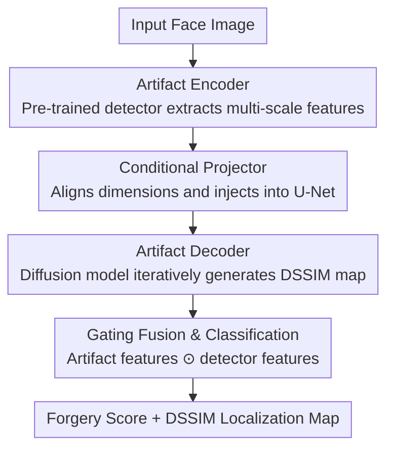

# DiffusionFF: A Diffusion-based Framework for Joint Face Forgery Detection and Fine-Grained Artifact Localization

**Conference**: CVPR 2026  
**Paper**: [CVF Open Access](https://openaccess.thecvf.com/content/CVPR2026/html/Peng_DiffusionFF_A_Diffusion-based_Framework_for_Joint_Face_Forgery_Detection_and_CVPR_2026_paper.html)  
**Code**: None (Not provided in the paper)  
**Area**: AI Security / Face Forgery Detection  
**Keywords**: Face Forgery Detection, Artifact Localization, Diffusion Models, DSSIM map, Encoder-Decoder  

## TL;DR
DiffusionFF repurposes a pre-trained forgery detector as an "artifact encoder" and a denoising diffusion model as an "artifact decoder." Using multi-scale forgery features as conditions, it progressively generates fine-grained DSSIM artifact localization maps, which are subsequently fused back into the detector for classification, achieving SOTA results in both detection and localization tasks.

## Background & Motivation
**Background**: As face deepfakes become increasingly realistic, industry requirements for detection algorithms have evolved from binary "real or fake" judgments to "identifying modified areas." Precise artifact localization provides human-interpretable evidence, enhancing model explainability and user trust. Consequently, recent research has shifted toward unified "detection + localization" frameworks.

**Limitations of Prior Work**: Localization follows two main technical routes, both with significant drawbacks. First, **mask-based** methods treat localization as a segmentation task and output binary masks; however, masks are inherently coarse and only outline approximate regions. Second, **DSSIM-based** methods pixel-wise compare aligned real-fake image pairs to generate structural dissimilarity maps (DSSIM maps). While these can capture subtle artifacts, existing approaches (e.g., LiSiam, LRL) rely on **direct regression** frameworks, which tend to "smooth out" fine traces, resulting in blurry, low-information localization maps.

**Key Challenge**: While DSSIM maps can inherently represent fine-grained artifacts, the "direct regression" one-step prediction approach conflicts with "fine-grained high-frequency details." Regression tends to output smooth mean solutions, losing the sharp differences that are most critical. The authors' analysis (Paper Figure 2) reveals a crucial fact: **fusing estimated DSSIM maps back into the detection network consistently improves detection performance, and the higher the quality of the map, the greater the gain**. Thus, "how to generate a high-quality DSSIM map" is both a localization goal and a key to improving detection accuracy.

**Goal**: To develop a unified framework that simultaneously addresses (1) fine-grained artifact localization and (2) face forgery detection, ensuring the former directly benefits the latter.

**Key Insight**: Diffusion models inherently support **iterative refinement**. By starting from noise and refining the output step-by-step, they can approximate the fine-grained inconsistencies in DSSIM maps, avoiding the over-smoothing typical of direct regression.

**Core Idea**: Construct a new encoder-decoder architecture where a **pre-trained forgery detector = artifact encoder** and a **denoising diffusion model = artifact decoder**. Multi-scale forgery features from the encoder serve as conditions for the decoder to progressively synthesize DSSIM maps, which are then fused back into the detector for performance gains.

## Method

### Overall Architecture
Given an input face image, DiffusionFF simultaneously outputs a forgery score and a DSSIM map for fine-grained artifact localization. The pipeline operates as follows: A pre-trained forgery detector extracts multi-scale forgery-related features. These features are aligned via a "conditional projector" and injected into various stages of the diffusion model's U-Net encoder. Starting from pure noise and conditioned on these features, the diffusion model iteratively denoises to generate a DSSIM map. Subsequently, an "artifact feature extractor" encodes this map into artifact-aware features, which are fused with the detector's high-level semantic features through a gating mechanism. A classification head then provides the final forgery score.

The **supervision signal (DSSIM map)** is derived by pixel-wise structural comparison of aligned real and fake image pairs during training. For each pixel position $(i,j)$ in local windows $x, y$:

$$\mathrm{DSSIM}(x, y) = 1 - \frac{(2\mu_x\mu_y + C_1)(2\sigma_{xy} + C_2)}{(\mu_x^2 + \mu_y^2 + C_1)(\sigma_x^2 + \sigma_y^2 + C_2)}$$

where $\mu, \sigma, \sigma_{xy}$ represent the mean, variance, and covariance of the windows, and $C_1, C_2$ are stability constants. Real images are assigned a pure black map (zero difference). This ground-truth (GT) DSSIM map is the target for the diffusion model.

### Key Designs

**1. Repurposing Encoder-Decoder: Detector as Encoder, Diffusion as Decoder**

This is the foundation of the work, addressing the "blurry regression" issue. Instead of one-step regression, DSSIM map generation is modeled as a **conditional denoising diffusion process**. Following the DDPM framework, the forward process adds noise to the clean map $x_0$. At any time step $t$, the noisy map is sampled as $x_t = \sqrt{\bar\alpha_t}\,x_0 + \sqrt{1-\bar\alpha_t}\,\epsilon$, where $\epsilon \sim \mathcal{N}(0, I)$. The reverse process trains a denoising network $\epsilon_\theta(x_t, t)$ to predict the added noise using the MSE loss: $L_{\mathrm{MSE}} = \mathbb{E}_{x_0,\epsilon,t}\big[\|\epsilon - \epsilon_\theta(x_t, t)\|_2^2\big]$. During inference, the map is reconstructed from pure noise $x_T$. The iterative nature of diffusion allows it to "recover" fine artifacts rather than smoothing them. The authors observed that joint training from scratch leads to **training collapse**, necessitating the use of a pre-trained detector (ConvNeXt-B) to provide prerequisite forgery knowledge.

**2. Conditional Projector: Multi-scale Alignment and Injection**

To reconcile the dimensionality differences between the detector and the diffusion model, a conditional projector is introduced. It aligns the multi-scale features from four stages of the detector across **spatial and channel dimensions** before injecting them into the U-Net **encoder stages**. Ablations confirmed that injection into the encoder side outperforms the decoder side. The multi-scale approach is essential because artifacts exist at both regional and pixel levels; single-scale conditions (like those from a standard ViT) are insufficient.

**3. Gating Fusion and Classification: DSSIM Map as Visual Explanation**

The generated DSSIM map $M_{\mathrm{DSSIM}}$ is encoded by an artifact feature extractor $E$ into artifact-aware features. These are aligned with the detector's high-level semantic features $F_{\mathrm{det}}$ and fused using a gating mechanism:

$$\mathrm{Score} = H\big(\sigma(E(M_{\mathrm{DSSIM}})) \odot F_{\mathrm{det}} + F_{\mathrm{det}}\big)$$

where $\sigma$ is the Sigmoid function, $\odot$ denotes the Hadamard product, and $H$ is the classification head. This gating mechanism uses the DSSIM-derived response as an "attention gate" to **selectively amplify** tampered regions within the detection features, while the residual $+ F_{\mathrm{det}}$ ensures no original discriminative information is lost.

**4. Two-Stage Decoupled Training**

Due to the conflicting objectives of generation (DSSIM estimation) and discrimination (binary classification), the training process is **fully decoupled**. In **Stage 1**, the pre-trained detector is frozen while the conditional projector and diffusion model are trained using the diffusion MSE loss. In **Stage 2**, the detector, projector, and diffusion model are all frozen, and only the artifact feature extractor and classification head are trained using standard cross-entropy loss. This prevents gradient interference between the different tasks.

### Loss & Training
- **Stage 1**: Diffusion + Conditional Projector; Diffusion MSE Loss; AdamW; 100 epochs; batch size 96; initial LR $1\times10^{-4}$ with cosine decay; diffusion steps $T=50$.
- **Stage 2**: Artifact Feature Extractor + Classification Head; Cross-Entropy Loss; AdamW; 5 epochs; batch size 128; fixed LR $5\times10^{-5}$.
- **Backbone**: Detector uses ConvNeXt-B pre-trained on FF++; Diffusion uses U-Net with timestep encoder; 8×RTX 3090.

## Key Experimental Results

### Main Results
Cross-dataset detection (AUC %, trained on FF++, tested on unseen datasets) — DiffusionFF ranks first across all four benchmarks:

| Method | Type | CDF2 | DFDC | DFDCP | FFIW |
|------|------|------|------|-------|------|
| Effort∗ (ICML25) | Detection only | 95.73 | 84.78 | 90.42 | 88.53 |
| KFD (ICML25) | Det + Loc (mask) | 94.71 | 79.12 | 91.81 | - |
| LiSiam∗ (TIFS22) | Det + Loc (DSSIM) | 90.36 | 72.59 | 82.06 | 76.52 |
| **Ours** | Det + Loc (DSSIM) | **97.24** | **85.05** | **92.56** | **88.56** |

DSSIM map quality (Cross-dataset CDF2, compared with DSSIM-based methods) — FID drops significantly from the 250s to below 100:

| Method | PSNR↑ | SSIM↑ | LPIPS↓ | FID↓ |
|------|-------|-------|--------|------|
| LiSiam | 21.99 | 0.367 | 0.464 | 256.20 |
| LRL | 20.80 | 0.422 | 0.455 | 258.67 |
| **Ours** | **30.70** | **0.546** | **0.376** | **98.98** |

### Ablation Study
Ablation on Diffusion Model design choices (FF++ intra-dataset):

| Configuration | PSNR↑ | SSIM↑ | LPIPS↓ | FID↓ | Description |
|------|-------|-------|--------|------|------|
| Direct Regression | 24.34 | 0.584 | 0.252 | 172.21 | Switching to regression spikes FID |
| Latent-Space Diffusion | 24.23 | 0.680 | 0.217 | 56.38 | Latent is inferior to pixel-level |
| Final-Stage Cond. | 26.15 | 0.711 | 0.204 | 43.81 | Single-stage injection |
| Decoder Cond. | 26.25 | 0.716 | 0.202 | 46.33 | Injection into U-Net Decoder side |
| **The Proposed** | **26.38** | **0.718** | **0.198** | **43.09** | Multi-scale + Encoder injection |

Ablation on Fusion modules (Average Cross-dataset AUC %):

| Fusion Type | CDF2 | DFDC | DFDCP | FFIW | Avg. |
|----------|------|------|-------|------|------|
| Addition | 95.79 | 84.68 | 91.56 | 88.38 | 90.10 |
| Concatenation | 96.66 | 85.00 | 91.87 | 89.01 | 90.64 |
| Cross-Attention | 97.19 | 84.91 | 92.26 | 88.46 | 90.71 |
| **Gating Mechanism** | **97.24** | **85.05** | **92.56** | **88.56** | **90.85** |

### Key Findings
- **Iterative Generation vs. Direct Regression**: Reverting to direct regression caused the FID to jump from 43 to 172, proving that "iterative refinement" is the root cause of map clarity, not just a larger network.
- **Pixel-level > Latent-space**: DSSIM maps contain high-frequency details; latent compression loses vital information (FID 56 vs 43).
- **Plug-and-play Gains**: DiffusionFF as an auxiliary module boosted EfficientNet-B4 (+9.8 AUC on DFDC) and Swin-B (+1.3 AUC on CDF2), demonstrating universal applicability across backbones (except ViT due to multi-scale constraints).
- **Superior Robustness**: Under six types of degradation (JPEG, occlusion, noise, etc.), DiffusionFF showed significantly less performance drop compared to SBI.

## Highlights & Insights
- **Repurposing Concept**: Instead of inventing new modules, the framework cleverly utilizes existing architectures—detector for "forgery knowledge" and diffusion for "iterative generation"—achieving a 1+1>2 effect.
- **Evidence-based Motivation**: The authors establish a causal link (Map Quality $\uparrow \rightarrow$ Detection $\uparrow$) in Figure 2 before designing the generator, building a solid logical foundation.
- **Gated Residual Fusion**: Using DSSIM responses as a gate to amplify features while using residuals for stability is a robust design pattern transferable to other multi-modal fusion tasks.
- **Intrinsic Explainability**: The generative localization map serves as a natural visual explanation ("where the forgery is"), merging performance improvement with trust-building.

## Limitations & Future Work
- **Dependency on Aligned Pairs**: Ground-truth DSSIM requires pixel-aligned real and fake video frames. Datasets like DFDC/DFDCP cannot be used for localization training/evaluation due to misalignment, limiting the method to specific paired scenarios.
- **Inference Cost**: The $T=50$ iterative steps of diffusion introduce higher inference latency compared to single-forward regression models. 
- **Parameter Overhead**: Parameters increased from 89M to 102M (ConvNeXt-B); essentially trading computational power for precision.
- **Future Directions**: Exploring distillation or Consistency Models to reduce inference steps; investigating self-supervised DSSIM labels to generalize to unpaired real-world forgeries.

## Related Work & Insights
- **vs LiSiam / LRL (DSSIM-based regression)**: These methods use regression, leading to blurry outputs. This work uses diffusion for radical improvements in clarity (FID ~99 vs ~256).
- **vs mask-based methods (KFD / AUNet)**: These provide binary masks for regional localization; this work provides pixel-level DSSIM maps with higher granularity and better detection feedback.
- **vs DiffusionFake**: While DiffusionFake reconstructs identities, DiffusionFF is the first to use diffusion specifically for fine-grained artifact localization maps.

## Rating
- Novelty: ⭐⭐⭐⭐⭐ High. Innovative repurposing of detector/diffusion as an encoder/decoder pair for artifact localization.
- Experimental Thoroughness: ⭐⭐⭐⭐⭐ Comprehensive coverage across 4 cross-datasets, intra-dataset tests, and detailed ablations.
- Writing Quality: ⭐⭐⭐⭐ Clear motivation, though more analysis on inference latency is needed.
- Value: ⭐⭐⭐⭐⭐ High practical value due to significant plug-and-play gains and intrinsic explainability.

<!-- RELATED:START -->

## Related Papers

- [\[AAAI 2026\] Fine-Grained DINO Tuning with Dual Supervision for Face Forgery Detection](../../AAAI2026/ai_safety/fine-grained_dino_tuning_with_dual_supervision_for_face_forgery_detection.md)
- [\[CVPR 2026\] A Sanity Check for Multi-In-Domain Face Forgery Detection in the Real World](a_sanity_check_for_multi-in-domain_face_forgery_detection_in_the_real_world.md)
- [\[CVPR 2026\] Skyra: AI-Generated Video Detection via Grounded Artifact Reasoning](skyra_ai-generated_video_detection_via_grounded_artifact_reasoning.md)
- [\[CVPR 2026\] GROW: Watermark Generation with Progressive Guidance for Diffusion Models](grow_watermark_generation_with_progressive_guidance_for_diffusion_models.md)
- [\[CVPR 2026\] Unleashing Stealthy Backdoor Pandemic by Infecting a Single Diffusion Model](unleashing_stealthy_backdoor_pandemic_by_infecting_a_single_diffusion_model.md)

<!-- RELATED:END -->
