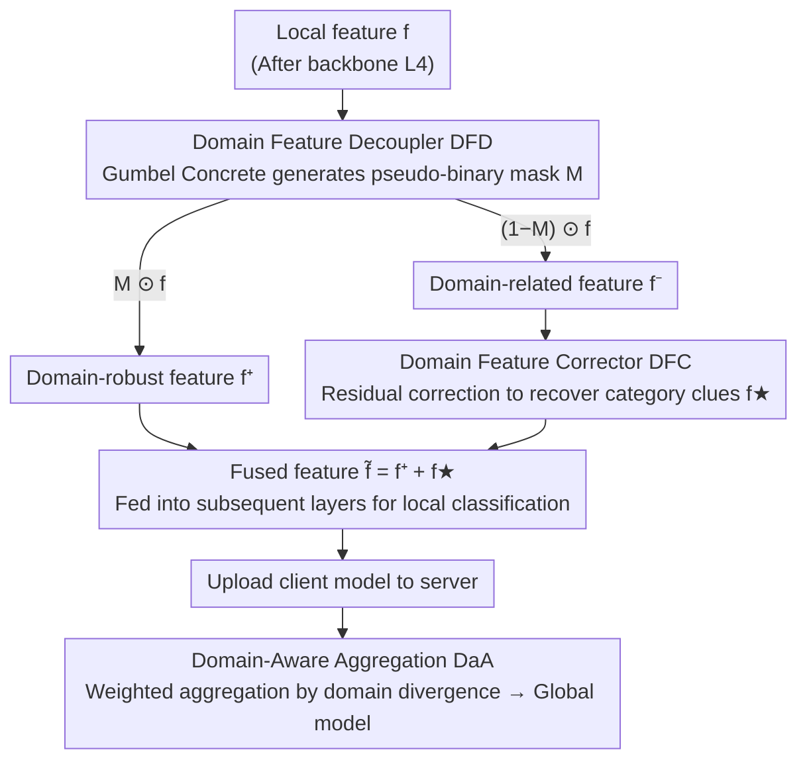

# Domain-Skewed Federated Learning with Feature Decoupling and Calibration

**Conference**: CVPR 2026  
**arXiv**: [2603.14238](https://arxiv.org/abs/2603.14238)  
**Code**: [GitHub](https://github.com/mala-lab/F2DC)  
**Area**: AI Security  
**Keywords**: Federated Learning, Domain Skew, Feature Decoupling, Domain-Aware Aggregation, Representation Calibration

## TL;DR

Ours proposes the F²DC framework, which separates local features of clients in federated learning into domain-robust and domain-related features using a Domain Feature Decoupler (DFD) and a Domain Feature Corrector (DFC). By calibrating domain-related features to rescue discarded category information and employing a Domain-Aware Aggregation strategy, the method consistently outperforms SOTA on three multi-domain datasets.

## Background & Motivation

**Domain Skew in Federated Learning**: Unlike label skew, in domain skew scenarios, data from different clients originate from different domains (e.g., driving data under different weather conditions). The category distributions are similar, but feature distributions differ significantly: $\mathbb{P}_{k_1}(x|y) \neq \mathbb{P}_{k_2}(x|y)$.

**Dimensional Collapse Phenomenon**: Domain skew causes local model representations to collapse into narrow low-dimensional subspaces—many singular values of the feature covariance matrix approach zero, implying that each client only fits features specific to its own domain while ignoring other subspaces.

**Limitations of "Elimination-based" Methods**: Methods like FDSE attempt to eliminate domain-specific biases. However, domain-related features are entangled with valuable category information (e.g., object contours formed by brushstrokes in a sketch domain). Direct elimination leads to information loss—Grad-CAM shows that FDSE misses the antlers and head of a giraffe in cartoon/sketch domains.

**Core Idea**: By calibrating rather than eliminating domain-related features, the category-related clues entangled within them are rescued, thereby facilitating more consistent cross-domain decision-making.

## Method

### Overall Architecture

F²DC consists of two core modules and an aggregation strategy embedded within the standard FedAvg framework:
- **Domain Feature Decoupler (DFD)**: Decouples local features into domain-robust features $f^+$ and domain-related features $f^-$.
- **Domain Feature Corrector (DFC)**: Calibrates $f^-$ into corrected features $f^\star$ to capture additional category clues.
- **Domain-Aware Aggregation (DaA)**: Weights global aggregation based on the degree of domain divergence of each client.

Architecturally, DFD and DFC are inserted after the last backbone layer (e.g., after L4 in ResNet-10). $f^+$ and $f^\star$ are summed to obtain the final feature $\tilde{f}$, which is fed into subsequent layers. DFD, DFC, and the auxiliary MLP $\mathbf{m}$ are kept locally and do not participate in global aggregation.

### Key Designs

**1. Domain Feature Decoupler (DFD): Separating domain context before processing raw features.**

If local features are used directly for classification, the model overfits to the bias of its specific domain, losing the chance to determine which information is cross-domain universal. DFD labels each unit of the feature map with "cross-domain robustness" before splitting. Specifically, a two-layer CNN (with BN + ReLU) calculates an attribute map $\mathcal{S}_i = \mathcal{A}_D(f_i) \in \mathbb{R}^{C \times H \times W}$. Since binary selection is non-differentiable, a **Gumbel Concrete distribution** is used to generate a pseudo-binary mask $\mathcal{M}_i$—approaching a true hard binary as temperature $\sigma \to 0$ while remaining differentiable during training. The mask splits features into a domain-robust part $f_i^+ = \mathcal{M}_i \odot f_i$ and a domain-related part $f_i^- = (1 - \mathcal{M}_i) \odot f_i$.

To ensure a clean split, the loss governs two aspects: a separability term minimizes the cosine similarity between $f^+$ and $f^-$, pushing them in different directions; a discriminative term uses an auxiliary MLP $\mathbf{m}$ to predict logits, requiring $f^+$ to hit the ground truth while forcing $f^-$ toward the highest-confidence wrong label. This pushes all "truly discriminative" signals into $f^+$. This is the watershed between DFD and FDSE—FDSE eliminates domain-related features entirely, while DFD "separates but preserves," keeping $f^-$ for the next calibration step.

**2. Domain Feature Corrector (DFC): Rescuing category clues from discarded domain-related features.**

The $f^-$ separated by DFD is not pure noise; domain bias and category information are entangled within it—such as the object contours in the sketch domain. Discarding it directly results in the loss of valuable signals. DFC uses a two-layer CNN $\mathcal{A}_C$ (isomorphic to DFD) to learn a residual correction, reshaping $f^-$ into a supplementary feature $f_i^\star = f_i^- + (1 - \mathcal{M}_i) \odot \mathcal{A}_C(f_i^-)$. The residual form ensures additions are made only in domain-related regions without destroying the original structure. For training, a standard cross-entropy $\mathcal{L}_{DFC} = -y_i \cdot \log(\delta(\mathbf{m}(l_i^\star)))$ is applied to force correct category signals back into $f^\star$. Finally, $f^+$ and $f^\star$ are summed to form $\tilde{f}$, combining "robust backbone + rescued category clues."

**3. Domain-Aware Aggregation (DaA): Weighting global aggregation by domain diversity rather than treating all equally.**

Heuristic FedAvg weights only by sample size, ignoring domain differences and allowing biases from certain domains to skew the model. DaA defines a uniform global domain distribution $\mathcal{G} = [1/Q, \dots, 1/Q]$ ($Q$ is the number of domains) as a reference, calculates the domain divergence $\mathbf{d}_k$ of client $k$ from this uniform distribution, and assigns a weight $\mathbf{p}_k = \sigma(\alpha \cdot n_k/N - \beta \cdot \mathbf{d}_k)$. More samples increase the weight, while higher domain deviation decreases it. This preserves the sample size signal while explicitly incorporating "domain representativeness" to prevent extreme domains from dominating the global model.

### Loss & Training

$$\mathcal{L} = \mathcal{L}_{CE} + \frac{1}{|L|}\sum_{j=1}^{|L|}(\lambda_1 \cdot \mathcal{L}_{DFD}^{L_j} + \lambda_2 \cdot \mathcal{L}_{DFC}^{L_j})$$

By default, $|L|=1$ (last layer only), $\lambda_1=0.8, \lambda_2=1.0$, Gumbel temperature $\sigma=0.1$, separation temperature $\tau=0.06$, and aggregation parameters $\alpha=1.0, \beta=0.4$. Training uses the SGD optimizer with lr=0.01, momentum 0.9, batch size 64, for 100 communication rounds with 10 local epochs per round.

## Key Experimental Results

### Main Results

| Dataset | Metric | F²DC | Prev. SOTA (FDSE) | Gain |
|--------|------|------|------------------|------|
| PACS | AVG Acc ↑ | **76.47** | 73.13 | +3.34 |
| PACS | STD ↓ | **5.83** | 6.83 | -1.00 |
| Office-Caltech | AVG Acc ↑ | **66.82** | 63.18 | +3.64 |
| Office-Caltech | STD ↓ | **3.65** | 4.50 | -0.85 |
| Digits | AVG Acc ↑ | **87.23** | 84.15 | +3.08 |
| Digits | STD ↓ | **13.36** | 16.19 | -2.83 |

Ours consistently outperforms all 9 baseline methods (FedAvg/FedProx/MOON/FPL/FedTGP/FedRCL/FedHEAL/FedSA/FDSE) across the three datasets, with superior cross-domain fairness (lower STD). Contrastive methods like MOON perform worse than FedAvg on PACS because forcing alignment of contaminated global representations exacerbates performance degradation.

### Ablation Study (PACS)

| Configuration | AVG Acc | STD | Description |
|------|---------|-----|------|
| FedAvg (baseline) | 66.39 | 11.74 | No modules |
| + DFD only | 68.43 | 10.15 | Decoupling only |
| + DFD + DFC | 73.64 | 6.12 | Decoupling + Calibration |
| + DFD + DaA | 75.33 | 6.80 | Decoupling + Domain-Aware Aggregation |
| + DFD + DFC + DaA | **76.47** | **5.83** | Full F²DC |

### Module Plug-and-play Capability (PACS)

| Baseline Method | AVG after + DFD+DFC | Gain |
|----------|-----------------|------|
| FedAvg | 75.33 | **+8.94** |
| FPL | 75.52 | +4.93 |
| FedHEAL | 75.06 | +1.72 |
| FDSE | 74.79 | +1.66 |

### Key Findings

- **Feature Analysis**: The AVG=75.13 of $f^+$ is significantly better than the 57.87 of $f^-$. However, after calibration, $f^\star$=73.49, confirming that domain-related features contain rescuable category information. Fusing them into $\tilde{f}$=76.47 achieves the optimum.
- **Faster Convergence**: F²DC demonstrates faster convergence on both Office-Caltech and PACS.
- **Minimal Overhead**: No additional communication cost (DFD/DFC are local). Training time increased by only 2% (180.67s vs 176.94s per round).

## Highlights & Insights

1. **"Calibration instead of Elimination"**: Category information entangled in domain bias is valuable. Grad-CAM visualization intuitively shows how F²DC recovers regions ignored by traditional methods (e.g., the waist of a giraffe).
2. **Differentiable Separation via Gumbel Concrete**: A clever solution to the non-differentiable nature of binary feature separation, making the framework end-to-end trainable.
3. **Dimensional Collapse Diagnosis**: Singular value analysis quantitatively reveals the core cause of domain-skewed FL, serving as a general diagnostic tool.

## Limitations & Future Work

1. Decoupling granularity depends on the hyperparameter $\tau$; overly aggressive separation can degrade performance.
2. The method operates only at the feature level and does not consider domain bias decoupling at the parameter level.
3. Experiments covered only 4-domain scenarios (ResNet-10); scalability to more domains or larger models remains unverified.
4. Domain-aware aggregation assumes uniform class distribution within domains; it needs extension for scenarios where domain skew and label skew coexist.

## Related Work & Insights

- **FDSE (CVPR'25)**: Representative of elimination-based decoupling; F²DC's "calibration and utilization" paradigm is a superior alternative.
- **FedHEAL (CVPR'24)**: Selective parameter updates + fair aggregation, but lacks domain bias processing at the feature level.
- Insight: The Gumbel Concrete trick is widely used in NAS/pruning; F²DC demonstrates its new application in FL feature selection.

## Rating

- **Novelty**: ⭐⭐⭐⭐ — "Calibration instead of elimination" is novel in domain-skewed FL; DFD+DFC design is sound.
- **Experimental Thoroughness**: ⭐⭐⭐⭐ — Three datasets, 9 baselines, full ablation, plug-and-play validation, efficiency analysis, and comprehensive visualization.
- **Writing Quality**: ⭐⭐⭐⭐ — Clear motivation and rich figures (Grad-CAM/T-SNE/SVD).
- **Value**: ⭐⭐⭐⭐ — Modular design makes it easy to integrate into existing FL frameworks with high practicality.

<!-- RELATED:START -->

## Related Papers

- [\[CVPR 2026\] FedDAP: Domain-Aware Prototype Learning for Federated Learning under Domain Shift](feddap_domain-aware_prototype_learning_for_federated_learning_under_domain_shift.md)
- [\[CVPR 2025\] A Simple Data Augmentation for Feature Distribution Skewed Federated Learning](../../CVPR2025/ai_safety/a_simple_data_augmentation_for_feature_distribution_skewed_federated_learning.md)
- [\[CVPR 2026\] ProxyFL: A Proxy-Guided Framework for Federated Semi-Supervised Learning](proxyfl_a_proxy-guided_framework_for_federated_semi-supervised_learning.md)
- [\[CVPR 2026\] FedRE: A Representation Entanglement Framework for Model-Heterogeneous Federated Learning](fedre_a_representation_entanglement_framework_for_model-heterogeneous_federated_.md)
- [\[CVPR 2026\] FedMOP: Achieving Enhanced Privacy and Performance in Federated Learning via Momentum Orthogonal Projection](fedmop_achieving_enhanced_privacy_and_performance_in_federated_learning_via_mome.md)

<!-- RELATED:END -->
