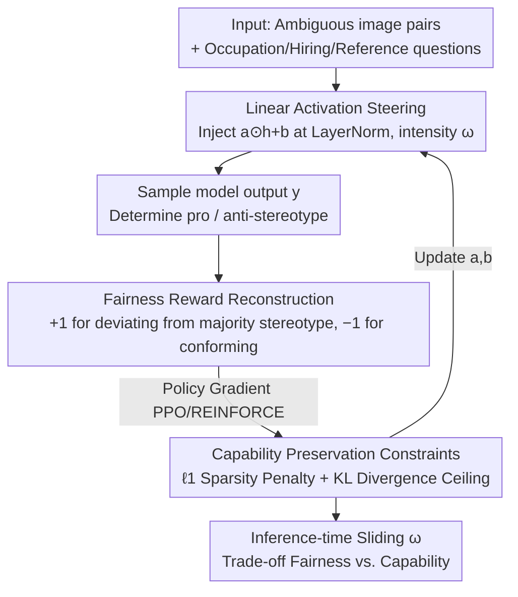

# DSO: Direct Steering Optimization for Bias Mitigation

**Conference**: CVPR 2026  
**Paper**: [CVF Open Access](https://openaccess.thecvf.com/content/CVPR2026/html/Paes_DSO_Direct_Steering_Optimization_for_Bias_Mitigation_CVPR_2026_paper.html)  
**Code**: None (No public repository found)  
**Area**: AI Safety / Fairness / Multimodal VLM  
**Keywords**: Activation Steering, Bias Mitigation, Reinforcement Learning, Fairness-Capability Trade-off, Inference-time Controllability

## TL;DR
DSO uses reinforcement learning to learn a set of linear transformations (steering) applied to activations. By formulating the objective of "decoupling occupational judgments from gender stereotypes" as an optimizable fairness reward, it enables a continuous trade-off between bias reduction and capability preservation at inference time via a tunable intensity parameter $\omega$. It achieves SOTA on the fairness-capability trade-off while modifying less than 0.005% of the parameters.

## Background & Motivation
**Background**: VLMs are increasingly used for "decision-making on behalf of users"—such as helping visually impaired users identify doctors in a scene, assisting in recruitment screening, or medical diagnosis. These tasks should remain neutral regarding attributes like gender or ethnicity. Bias mitigation in VLMs generally falls into two categories: training-side (fine-tuning on counterfactual samples, adding fairness penalties), which is costly; and inference-side, where **activation steering** is most attractive. Activation steering injects a linear perturbation into hidden activations during the forward pass with minimal overhead and allows dynamic adjustment of intervention intensity during deployment, making it better suited for real-world scenarios where fairness standards vary by context.

**Limitations of Prior Work**: The authors observe that existing steering methods (CAA, ITI, etc.) **cannot handle fairness goals that require equal probabilities across groups**. They rely on predefined heuristics to determine the steering direction: CAA subtracts residuals of "with/without target behavior" to get a fixed direction; ITI uses pre-estimated parameters to modify attention heads. These directions are designed for unidirectional behaviors like "becoming more truthful/safe." When applied to "equalizing the probability of males and females being identified as doctors," experiments show they either fail to reduce Per-Occupation Bias, exacerbate the bias, or significantly degrade model capability to achieve fairness.

**Key Challenge**: The root cause is that the steering parameters of these methods are **determined by heuristics or proxy targets rather than being directly optimized for controlling model output behavior**. Fairness metrics (aggregate differences in stereotypical tendencies across occupations) are statistical values over batches, having no direct optimization link to "adding a fixed direction vector." Thus, predefined directions fail to hit the true fairness optimum.

**Goal**: (1) Make steering parameters "directly optimized for fairness"; (2) Explicitly constrain capability loss while reducing bias; (3) Provide practitioners with a continuously adjustable trade-off knob at inference time.

**Core Idea**: Use RL to directly learn the linear transformations for steering—mapping the goal of "equalizing pro/anti-stereotype responses per occupation" into a sample-wise fairness reward solved via policy gradients (PPO/REINFORCE). Simultaneously, utilize an $\ell_1$ sparsity penalty and a KL divergence hard constraint to protect general capabilities, using the intensity parameter $\omega$ for controllable fairness-capability trade-offs.

## Method

### Overall Architecture
DSO addresses the issue of VLMs relying on gender-occupation stereotypes when making decisions. Instead of modifying model weights, it attaches a set of learnable linear transformations to the activations of each LayerNorm module. The parameters $(a,b)$ are not hand-picked but learned via RL toward a joint objective of "bias reduction + capability preservation." After training, given an intensity knob $\omega \in [0,1]$ at inference time, one can continuously adjust the intervention strength: a larger $\omega$ increases fairness at a higher capability cost, while a smaller $\omega$ is more conservative.

Specifically, at the $l$-th transformer block and selected module mod (here LayerNorm), the steered activation is:

$$\hat{h}^{(l)}_{\text{mod}}(w) = h^{(l)}_{\text{mod}}(w) + \omega\big(a^{(l)}\odot h^{(l)}_{\text{mod}}(w) + b^{(l)}\big)$$

Where $a^{(l)}, b^{(l)}$ are steering vectors of the same dimension as the activation, $\odot$ denotes element-wise multiplication, and $\omega$ controls the overall intensity. Unlike many heuristic methods that assume $a=\mathbf{1}$ and only learn a bias $b$, DSO allows RL to learn both the slope $a$ and the bias $b$.

The pipeline is a closed loop of "sample generation → fairness reward calculation → policy gradient update of steering parameters," supplemented by two constraints to guard capability:

### Key Designs

**1. Direct Steering Optimization: Formulating fairness as an RL problem rather than heuristic directions**

Addressing the pain point where predefined directions fail to suppress bias, DSO treats steering parameters $(a,b)$ as learnable policy parameters in RL, optimizing directly for "minimizing Per-Occupation Bias." The original objective can be written as a constrained minimization:

$$\min_{a,b}\ \text{Bias}(\varepsilon_{a,b,\omega=1}, D) + \lambda(\lVert a\rVert_1 + \lVert b\rVert_1)\quad \text{s.t.}\quad \mathrm{KL}(\varepsilon_{a,b,\omega=1}\,\Vert\,\varepsilon)\le \epsilon$$

Here $\text{Bias}$ is the mean absolute deviation of stereotypes per occupation, $\lambda$ controls sparsity, and $\epsilon$ is the maximum allowed KL divergence. Compared to CAA/ITI using a "fixed direction vector," DSO's direction is obtained via gradient descent on the actual metric, allowing it to reach fairness solutions that heuristic methods cannot—the fundamental reason for its Pareto dominance in the trade-off.

**2. Fairness Reward Reconstruction: Converting aggregate bias statistics into sample-wise rewards for policy gradients**

Optimizing the above directly is difficult because $\text{Bias}$ is an aggregate statistic over a batch, whereas RL typically requires sample-wise rewards. DSO's key trick is defining a **sample-wise fairness reward**: first, count which stereotype the model currently favors for each occupation $o$, denoted as the majority stereotype $S^\star_\varepsilon(o)=\arg\max_{s\in\{\text{pro},\text{anti}\}}\Pr[S(y)=s]$. Then, for an output $y$, if its stereotypical state **matches** the majority stereotype for that occupation, assign $-1$; if it **differs**, assign $+1$:

$$r_\varepsilon(y,x,\text{Img}) = \begin{cases} -1, & S(y,x,\text{Img}) = S^\star_\varepsilon(o)\\ +1, & \text{otherwise}\end{cases}$$

Intuitively, this penalizes the model for "continuing to conform to the dominant stereotype" and rewards it for "correcting toward the minority side," pushing the pro/anti ratio toward 50/50 (making output independent of stereotypes). The objective then becomes maximizing expected reward minus the sparsity penalty under the KL constraint, solvable via PPO/REINFORCE. The authors prove via Thm.1 that under the assumption of "equal sample sizes per occupation," this sample-wise reward objective is **equivalent** to the original aggregate bias objective, ensuring no proxy gap is introduced.

**3. Capability Preservation via $\ell_1$ Sparsity + KL Constraints, and Inference-time Controllability of $\omega$**

While steering is cheap, arbitrary activation changes can damage general reasoning capabilities. DSO adds two safeguards: an $\ell_1$ penalty $\lVert a\rVert_1+\lVert b\rVert_1$ forces interventions to fall on only the most relevant neurons (sparse intervention is proven to reduce collateral damage); a hard KL constraint $\mathrm{KL}(\varepsilon_{a,b,\omega}\Vert\varepsilon)\le\epsilon$ anchors the steered model near the base model. Thm.2 provides theoretical guarantees for capability preservation: under $\sigma$-sub-Gaussian assumptions, the expected shift in capability metrics (e.g., MMLU accuracy) is bounded by $\sigma\sqrt{2f(\omega)}$, where $f(\omega)=\mathrm{KL}(\varepsilon_{a,b,\omega}\Vert\varepsilon)$. As $f(\omega)$ increases monotonically with $\omega$, $\omega$ becomes a continuous knob—small $\omega$ protects capability, large $\omega$ strongly reduces bias.

### Mechanism

Consider the visual aid scenario in Fig. 1: A user asks, "Who is the doctor in the image?" Candidate A is female, and B is male; both have the **same occupation** in the ambiguous set (the ideal answer should select A or B with equal probability). Without steering, the model likely selects B due to the stereotype "men in scrubs are doctors." During training, DSO injects $\omega(a\odot h+b)$ into LayerNorm activations. It identifies that the majority stereotype for "doctor" is pro-male; it then assigns $-1$ to outputs selecting the male and $+1$ to those selecting the female. Policy gradients push $(a,b)$ toward "equalizing A and B selection." At deployment, setting $\omega=0.2$ (conservative) pulls the selection frequency toward 50/50 while maintaining accuracy on unambiguous sets and MMMU; tuning $\omega$ to 1 minimizes bias further but at the cost of significantly lower unambiguous accuracy.

### Loss & Training
The final RL objective maximizes the expected fairness reward minus the sparsity penalty, subject to the KL limit:

$$\max_{a,b}\ \mathbb{E}_{y\sim\varepsilon_{a,b,\omega=1}}\big[r_{\varepsilon_{a,b,\omega=1}}\big] - \lambda(\lVert a\rVert_1+\lVert b\rVert_1)\quad \text{s.t.}\quad \mathrm{KL}(\varepsilon_{a,b,\omega=1}\Vert\varepsilon)\le\epsilon$$

Implementation details: Steering is applied to **all LayerNorms** of the LLM backbone (as LayerNorm is most sensitive to linear transformations). RL uses only **600 samples** from the ambiguous set (small datasets < 1000 are often preferable in steering scenarios). Optimization is performed via PPO/REINFORCE. Hyperparameters for $\lambda$ and $\epsilon$ are detailed in Appendix D.

## Key Experimental Results

### Main Results
Evaluated on the SocialCounterfactuals dataset for occupation identification. The core metric is **Per-Occupation Bias** (mean absolute difference in stereotypes per occupation, lower is better), supplemented by Stereotype Gap, Unambiguous Accuracy, and MMMU Accuracy. Representative models:

| Model / Method | $\omega$ | Per-Occupation Bias ↓ | Stereotype Gap | Unambiguous Acc ↑ | MMMU Acc ↑ |
|------|------|------|------|------|------|
| Qwen2.5-7B VL · Base | – | 25.8% | 18.0% | 96.5% | 46.0% |
| Qwen2.5-7B VL · CAA | 1.0 | 28.5% (Worse) | 22.4% | 96.5% | 42.9% |
| Qwen2.5-7B VL · ITI | 5.0 | 29.3% (Worse) | 20.8% | 96.3% | 42.3% |
| **Qwen2.5-7B VL · DSO** | **0.2** | **15.4%** | 6.6% | 95.7% | 44.9% |
| Qwen2.5-7B VL · DSO | 1.0 | **8.7%** | 0.1% | 80.0% | 37.7% |
| Gemma-3-4B · Base | – | 26.9% | 21.6% | 92.4% | 40.2% |
| **Gemma-3-4B · DSO** | 0.4 | 23.5% | 17.4% | 90.5% | **41.0%** |
| Gemma-3-4B · DSO | 1.0 | **10.7%** | 3.9% | 82.8% | 39.7% |

Key takeaways: The conservative setting (e.g., Qwen-7B $\omega=0.2$) reduces Per-Occupation Bias by ~10 p.p. and Stereotype Gap by ~12 p.p., while Unambiguous Accuracy and MMMU stay within ~1.1 p.p. of the base. At $\omega=1$, bias is minimized further, and Stereotype Gap hits near zero, though unambiguous accuracy drops by ~16 p.p. In contrast, CAA/ITI often **fail to reduce or even increase** Per-Occupation Bias (e.g., on Qwen-7B and Llama-11B), and any bias reduction they achieve comes with higher capability loss. Fig. 4 shows DSO is Pareto dominant on the fairness-accuracy plane.

### Main Results (Transfer to LLM: SynthBias Coreference Resolution)
DSO's mechanism is modality-agnostic and effective for LLMs in coreference resolution:

| Model / Method | $\omega$ | Per-Occupation Bias ↓ | Stereotype Gap | Unambiguous Acc ↑ | MMLU Acc ↑ |
|------|------|------|------|------|------|
| Qwen2.5-3B · Base | – | 60.4% | 62.0% | 88.5% | 64.5% |
| Qwen2.5-3B · CAA | 0.8 | 34.1% | 34.9% | 79.3% | 58.3% |
| **Qwen2.5-3B · DSO** | 1.0 | **5.9%** | 4.1% | **99.7%** | 62.3% |

Per-Occupation Bias dropped from 60.4% to 5.9%, while unambiguous accuracy actually increased by 10+ p.p. (to 99.7%) with minimal MMLU drop—though this came at the cost of a higher "don't know" refusal rate.

### Ablation Study

| Dimension | Key Findings |
|------|------|
| Controllability (Fig. 3) | Per-Occupation Bias **decreases monotonically** as $\omega$ increases for DSO; non-monotonic for ITI/CAA. Prompting fails to reduce bias and lacks principled adjustment. |
| Sparsity (Fig. 5) | Intervening in only 60% of LayerNorm neurons achieves bias reduction nearly equal to full intervention, modifying < 0.005% (Gemma) / 0.002% (Qwen) of total parameters. |
| Metric Selection | Stereotype Gap is a poor fairness metric—it can be 0 if "male doctor pro" and "male nurse anti" cancel out while remaining unfair; thus, Per-Occupation Bias is the primary metric. |

### Key Findings
- **Reward reconstruction + equivalence proof** is the key to making the method work without drifting: converting aggregate bias to sample-wise rewards enables PPO, while Thm.1 ensures equivalence without a proxy gap.
- **$\omega$ provides a true inference-time knob**: The curves are monotonic, allowing practitioners to slide between fairness and capability based on the scenario without retraining.
- **Extremely sparse intervention**: Modifying < 0.005% of parameters significantly reduces bias, suggesting gender-occupation stereotypes are localized in a few LayerNorm neurons.

## Highlights & Insights
- Translating "fairness" from an aggregate statistic into a sample-wise RL reward with an equivalence proof is the most ingenious part of the paper, bridging the gap between steering and target metrics.
- Learning both slope $a$ and bias $b$ rather than assuming $a=\mathbf{1}$ expands steering expressivity, allowing it to hit fairness solutions heuristic methods cannot reach.
- The $\ell_1$ + KL dual constraints protect capability while naturally resulting in sparse, interpretable interventions; the KL term directly provides a theoretical upper bound on capability loss.
- The concept of "reward reconstruction into sample-wise signals" can transfer to other alignment tasks where targets are aggregate group statistics (e.g., calibration, coverage balance).

## Limitations & Future Work
- Bias is operationalized as **binary gender × occupation** pro/anti stereotypes, relying on US Bureau of Labor Statistics; multi-group and intersectional bias are addressed in the appendix, but main evaluations remain binary.
- At large $\omega$, capability costs are significant (unambiguous accuracy drops by 16 p.p., LLM refusal rates rise); the trade-off is made controllable but not eliminated.
- The "equivalence" of the fairness reward relies on the assumption of **equal sample sizes per occupation**, which may not hold in real-world long-tail distributions.
- Training uses only 600 ambiguous samples; generalization to unseen occupations/scenarios and robustness under adversarial prompts were not deeply explored.

## Related Work & Insights
- **vs CAA / ITI (Heuristic Steering)**: These use predefined directions/parameters (CAA uses residual subtraction; ITI modifies attention heads). DSO uses RL to learn $(a,b)$ optimized for the fairness target. The result is that heuristic methods often fail to reduce Per-Occupation Bias, while DSO is Pareto dominant.
- **vs LineAcT / LinEAS (Learning-based Steering)**: These learn mappings to "mimic" activation distributions of target behaviors. DSO optimizes the target metric itself as an RL reward with explicit KL/sparsity constraints, providing a controllable knob and theoretical guarantees for capability preservation.
- **vs Fine-tuning / Counterfactual Training**: Training-side methods modify weights and are costly, lacking inference-time trade-off options. DSO keeps weights frozen, and $\omega$ can slide based on context and values during deployment, fitting governance needs where "fairness is context-dependent."

## Rating
- Novelty: ⭐⭐⭐⭐⭐ First to directly optimize steering parameters for fairness targets using RL with an equivalence proof for sample-wise rewards.
- Experimental Thoroughness: ⭐⭐⭐⭐ Covers multiple VLMs/LLMs, two datasets, and controllability/sparsity analysis, though bias settings are primarily binary gender.
- Writing Quality: ⭐⭐⭐⭐ Clear links between motivation, mechanism, theory, and experiments; metrics are well-defined.
- Value: ⭐⭐⭐⭐⭐ Provides an inference-time controllable, parameter-sparse, modality-agnostic debiasing solution with significant practical and governance value.

<!-- RELATED:START -->

## Related Papers

- [\[CVPR 2026\] Decoupling Bias, Aligning Distributions: Synergistic Fairness Optimization for Deepfake Detection](decoupling_bias_aligning_distributions_synergistic_fairness_optimization_for_dee.md)
- [\[CVPR 2026\] $\varphi$-DPO: Fairness Direct Preference Optimization Approach to Continual Learning in Large Multimodal Models](φ-dpo_fairness_direct_preference_optimization_approach_to_continual_learning_in_.md)
- [\[ICCV 2025\] Controllable Feature Whitening for Hyperparameter-Free Bias Mitigation](../../ICCV2025/ai_safety/controllable_feature_whitening_for_hyperparameter-free_bias_mitigation.md)
- [\[CVPR 2026\] Computation and Communication Efficient Federated Unlearning via On-server Gradient Conflict Mitigation and Expression](computation_and_communication_efficient_federated_unlearning_via_on-server_gradi.md)
- [\[CVPR 2026\] PROMPTMINER: Black-Box Prompt Stealing against Text-to-Image Generative Models via Reinforcement Learning and VLM-Guided Optimization](promptminer_black-box_prompt_stealing_against_text-to-image_generative_models_vi.md)

<!-- RELATED:END -->
