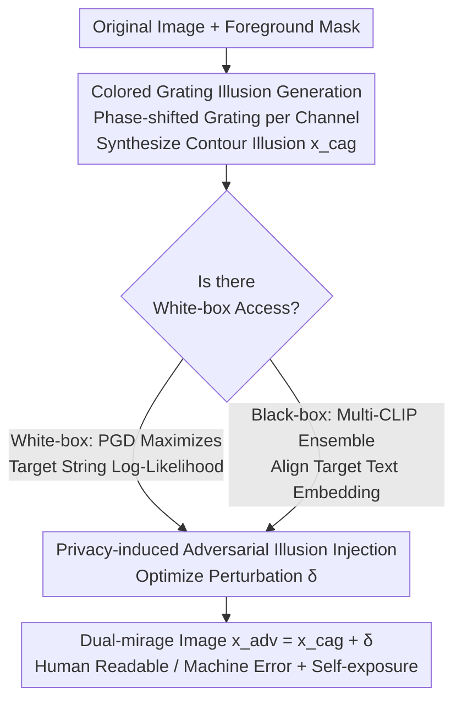

# DualMirage: Hunting Stealthy Multimodal LLM Agents via CAPTCHAs with Contour and Adversarial Illusions

**Conference**: CVPR 2026  
**Paper**: [CVF Open Access](https://openaccess.thecvf.com/content/CVPR2026/html/Chen_DualMirage_Hunting_Stealthy_Multimodal_LLM_Agents_via_CAPTCHAs_with_Contour_CVPR_2026_paper.html)  
**Code**: None  
**Area**: AI Safety / Adversarial Attacks / Multimodal VLM  
**Keywords**: CAPTCHA, MLLM Agent Detection, Illusory Contours, Adversarial Perturbation, Identity Exposure  

## TL;DR
DualMirage embeds two types of "illusions" in a single image: colored illusory contours (Colored Abutting Grating) that humans can perceive but machines cannot, combined with adversarial perturbations that machines "see" but humans do not. This system blocks malicious multimodal agents disguised as humans (up to 100% interception rate) and actively induces them to reveal their model names (58.8% white-box, 21.9% black-box), upgrading traditional CAPTCHAs from "capability testing" to "identity hunting."

## Background & Motivation
**Background**: Autonomous agents driven by Multimodal Large Language Models (MLLM) can now "see" webpage screenshots, plan, and execute clicks/inputs like humans to complete complex web tasks. However, when weaponized, these agents can **disguise themselves as humans** to bypass access controls for bulk registration, data scraping, and opinion manipulation. One line of defense is CAPTCHA—verifying "Are you a human?"

**Limitations of Prior Work**: Existing CAPTCHAs are nearly ineffective against next-generation MLLMs. Text CAPTCHAs are easily recognized by OCR; image CAPTCHAs are broken by MLLM vision capabilities; and methods detecting "AI-generated traces" are becoming fragile as models become more human-like. Previous illusory solutions like IllusionCAPTCHA suffer from high-resolution images that are **blurry even to humans** (semantic ambiguity) and high generation costs.

**Key Challenge**: Traditional CAPTCHAs are a "difficulty race"—asking a question that humans can solve but machines cannot. As MLLM vision improves, the defense will eventually lose. The fundamental problem is that current defenses are passive and fail to exploit the **essential differences in perception mechanisms** between humans and machines, nor do they "expose" the attacker.

**Goal**: ① Construct a verification challenge robust against MLLMs but easy for humans; ② Not just intercept, but actively force out the agent's identity information (e.g., model name), moving from "defense" to "hunting."

**Key Insight**: Human vision uses **top-down cognitive completion** (inferring full contours from broken lines, like the Kanizsa illusion), while MLLMs are essentially **bottom-up data-driven** models—lacking physiological illusory perception and being sensitive to invisible adversarial noise. These are "perceptual cracks" that can be exploited simultaneously.

**Core Idea**: Overlay two complementary illusions—a contour illusion that "humans see, machines don't" + an adversarial illusion that "machines see, humans don't"—on the same image. This ensures machines answer incorrectly and are hijacked to output a specific target string (model name), exposing their identity.

## Method

### Overall Architecture
DualMirage is a **server-side image generation pipeline**: it takes an original image (face/anime/MNIST digit) and outputs a "dual-mirage" CAPTCHA image $x_{adv}$. It consists of two sequential stages: the first stage, **Colored Abutting Grating Illusion Generation**, warps the original image into a "colored grating illusion image" $x_{cag}$—where humans infer the subject's contour from boundaries, but MLLM see only colored stripes; the second stage, **Privacy-induced Adversarial Illusion Injection**, overlays an invisible perturbation $\delta$ onto $x_{cag}$ to hijack the MLLM's vision encoder towards a specific output (e.g., its own model version string).

The key is that these steps are not just additive: the contour illusion in the first stage makes the MLLM's feature representation **unstable and easier to manipulate**, amplifying the effect of the adversarial perturbation in the second stage—the two collaborate to form a composite trap stronger than the sum of its parts.

### Key Designs

**1. Colored Abutting Grating Generation: Generalizing Classic Binary Illusions to Full-color Images**

To widen the gap between human and machine perception, the authors generalized the abutting grating algorithm (Fan et al.), which only handled binary MNIST-like images, to full-color. For an RGB input $x\in\mathbb{R}^{H\times W\times3}$, foreground $M^f$ and background $M^b=1-M^f$ masks are generated. Two phase-shifted colored gratings $G_1, G_2$ are created. For each channel $c$, given orientation $\theta$ and period $T$, intensity at $(x,y)$ is a square wave:

$$G_c(x,y)=\begin{cases}A_c & \text{if }\left\lfloor\frac{x\cos\theta+y\sin\theta}{T}\right\rfloor\text{ is even}\\ B_c & \text{otherwise}\end{cases}$$

Where $A_c, B_c$ are the high/low intensity values for that channel. The second grating $G_2$ is phase-shifted by $\pi$ relative to $G_1$, ensuring "abutted edges" at the boundaries. The final illusion $x_{cag}$ is synthesized:

$$x_{cag}=(G_1\odot M^f)+(G_2\odot M^b)$$

$\odot$ denotes element-wise multiplication. Illusory contours appear precisely at the mask boundaries. By independently adjusting $\theta$, $T$, and color vectors $A, B$, a massive diversity of colored illusory stimuli can be generated, upgrading from "digit recognition" to "complex colored object recognition."

**2. Privacy-induced Adversarial Illusion Injection: Forcing Model Self-exposure**

Building on the contour illusion, this stage hijacked the agent's output. Since MLLMs encode images into visual embeddings before generating text, injecting a perturbation $\delta$ (constrained by $\lVert x_{adv}-x_{cag}\rVert_\infty\le\epsilon$) can intervene in inference. The goal is to make the model output a specific string (e.g., its own version string "llava-v1.5-7b").

White-box optimization (where model $g$ parameters are accessible) maximizes the log-likelihood of the target sequence $y_t=\{y_1,\dots,y_L\}$:

$$\max_{\delta}\sum_{i=1}^{L}\log p_g(y_i\mid x_{cag}+\delta,\,p,\,y_{<i}),\quad \text{s.t. }\lVert\delta\rVert_\infty\le\epsilon$$

Black-box scenarios use **transfer attacks** with $N$ CLIP proxy models $\{(E^{(i)}_{img},E^{(i)}_{text})\}$, aligning image embeddings with the target text embedding:

$$\max_{\delta}\sum_{i=1}^{N}\frac{1}{N}\cos\!\Big(E^{(i)}_{img}(x_{cag}+\delta),\,E^{(i)}_{text}(y_t)\Big),\quad \text{s.t. }\lVert\delta\rVert_\infty\le\epsilon$$

**3. Integrated Pipeline Synergy: Disrupting Foundations for Adversarial Harvesting**

The two stages are integrated into a complete pipeline (Algorithm 1). The authors emphasize that the contour illusion in the first stage **destabilizes the MLLM's characteristic representation**, making its encoding more "shaky" and susceptible to manipulation—thereby amplifying the hijacking effect of the second stage. This synergy is the fundamental reason why the dual illusion outperforms either singular component.

## Key Experimental Results

### Main Results
Evaluated on 5 SOTA MLLMs. White-box: LLaVA-v1.5-7b, Qwen2.5-vl-7b. Black-box: GPT-4o, Gemini-1.5-pro, Claude-3-Sonnet. Metrics: HSR (Human Success Rate), ABR (Agent Blocking Rate), ASR (Attack Success Rate - identity exposure).

Human Usability (HSR, First Attempt):

| Challenge Type | 1st | 2nd | 3rd | 4th |
|----------|------|------|------|------|
| Illusion-Selfie2Anime | 99.1 | 100.0 | 100.0 | 100.0 |
| Illusion-MNIST (l=3) | 96.2 | 98.0 | 98.3 | 98.4 |
| Illusion-MNIST (l=6) | 95.2 | 96.0 | 96.2 | 96.5 |
| Illusion-MNIST (l=10) | 92.6 | 94.7 | 94.9 | 95.0 |
| **Mean** | **95.78** | 97.18 | 97.35 | 97.48 |

Defense and Hunting Efficacy (ABR / ASR, Comparison with Baselines, Mean values):

| Method | LLaVA ABR/ASR | Qwen ABR/ASR | GPT-4o ABR/ASR | Gemini ABR/ASR | Claude ABR/ASR |
|------|------|------|------|------|------|
| reCAPTCHA (Image-based) | 72.1 / – | 79.4 / – | 50.0 / – | 76.7 / – | 48.7 / – |
| Reasoning-based (Mean) | 90.44 / – | 93.64 / – | 74.08 / – | 87.34 / – | 79.38 / – |
| IllusionCAPTCHA (Contour) | 100.0 / – | 100.0 / – | 100.0 / – | 100.0 / – | 100.0 / – |
| **Ours (DualMirage)** | **100.0 / 62.25** | **100.0 / 55.25** | **97.5 / 20.75** | **97.25 / 25.00** | **98.25 / 20.00** |

### Ablation Study
Decomposing Contour (Con.) and Adversarial (Adv.) components on Illusion-Selfie2Anime and Illusion-MNIST(l=10):

| Configuration | HSR | LLaVA ABR/ASR | GPT-4o ABR/ASR | Description |
|------|-----|------|------|------|
| None | 100.0 | 2.0 / 0.0 | 0.0 / 0.0 | Original image, no defense |
| Con. Only | 99.1 | 92.0 / 0.0 | 78.0 / 0.0 | Blocks but cannot hunt |
| Adv. Only | 100.0 | 100.0 / 91.0 | 36.0 / 36.0 | Strong white-box, poor black-box transfer |
| **Con.+Adv. (Full)** | 99.1 | 100.0 / 100.0 | **96.0 / 44.0** | Synergy: Black-box ABR/ASR exceeds single components |

### Key Findings
- **Synergy is Effective**: The adversarial component alone achieved 36/36 ABR/ASR on GPT-4o; adding the contour illusion jumped this to 96/44—confirming that the contour illusion "disrupts the ground" for easier adversarial transfer.
- **Counter-intuitive Robustness**: JPEG compression and Gaussian blur significantly reduce ASR but actually **increase ABR**—fine-grained adversarial textures are destroyed, but the global illusion effect is amplified.
- **Inability of Dedicated OCR**: Specialized models like OCRFlux-3B and Deepseek-OCR still faced ABR over 93% and were successfully induced (ASR 100%).
- **Natural Images for Better "Hunting"**: ASR was higher on Illusion-Selfie2Anime than MNIST, as richer semantic Anime faces provide a larger "operational surface" in embedding space.

## Highlights & Insights
- **Flipping "Capability Testing" to "Identity Hunting"**: Instead of competing via difficulty, DualMirage exploits the irrevocable gap in perception mechanisms—avoiding the need to increase task difficulty as MLLMs improve.
- **Symmetry of Dual Illusions**: Combining "visible to humans, invisible to machines" and "visible to machines, invisible to humans" creates a complementary trap that both blocks and exposes.
- **Strategic Use of Adversarial Attacks**: Shifting the target from "misclassification" to "forced generation of target strings" provides a novel paradigm for anti-forensics and anti-scraping defenses.
- **Cognitive Disruption Pre-processing**: The discovery that cognitive illusions can facilitate adversarial transfer offers a generalizable insight for enhancing cross-model attack effectiveness.

## Limitations & Future Work
- **Low Black-box Exposure Rates**: An average ASR of 21.9% on closed-source models is not yet sufficient for reliable identity harvesting in practical scenarios.
- **Dependency on Response Alignment**: Hijacking requires the model to have the capacity and alignment to output its version string; the method may fail against models strictly aligned to hide identity ⚠️.
- **Evaluation Scale**: The user study (20 subjects) and challenge samples (100 per config) are relatively small; generalization to diverse web CAPTCHA contexts remains to be verified.

## Related Work & Insights
- **vs IllusionCAPTCHA**: Both use illusory contours, but the prior work suffers from ambiguity and high cost. DualMirage generalizes to color (HSR 95.8%) and adds the "identity hunting" dimension.
- **vs Traditional CAPTCHAs**: Standard image/reasoning CAPTCHAs drop to 50--86% ABR against GPT-4o, whereas DualMirage maintains >97%.
- **vs Classic Adversarial Attacks**: While typical attacks aim for misclassification, this work utilizes adversarial illusions as identity-probing forensic tools.

## Rating
- Novelty: ⭐⭐⭐⭐⭐ 
- Experimental Thoroughness: ⭐⭐⭐⭐ 
- Writing Quality: ⭐⭐⭐⭐ 
- Value: ⭐⭐⭐⭐ 

<!-- RELATED:START -->

## Related Papers

- [\[CVPR 2026\] FedAFD: Multimodal Federated Learning via Adversarial Fusion and Distillation](fedafd_multimodal_federated_learning_via_adversarial_fusion_and_distillation.md)
- [\[CVPR 2026\] DASH: A Meta-Attack Framework for Synthesizing Effective and Stealthy Adversarial Examples](dash_a_meta-attack_framework_for_synthesizing_effective_and_stealthy_adversarial.md)
- [\[CVPR 2026\] Unleashing Stealthy Backdoor Pandemic by Infecting a Single Diffusion Model](unleashing_stealthy_backdoor_pandemic_by_infecting_a_single_diffusion_model.md)
- [\[CVPR 2026\] UniGame: Turning a Unified Multimodal Model Into Its Own Adversary](unigame_turning_a_unified_multimodal_model_into_its_own_adversary.md)
- [\[CVPR 2026\] FVBench: Benchmarking Deepfake Video Detection Capability of Large Multimodal Models](fvbench_benchmarking_deepfake_video_detection_capability_of_large_multimodal_mod.md)

<!-- RELATED:END -->
