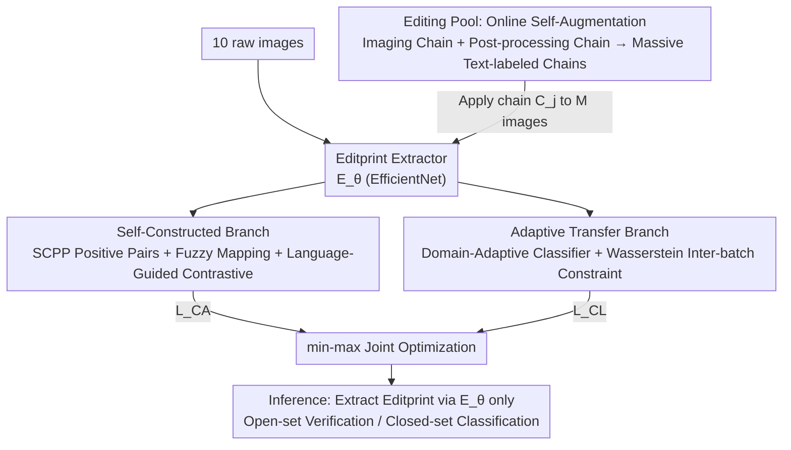

# Editprint: General Digital Image Forensics via Editing Fingerprint with Self-Augmentation Training

**Conference**: CVPR 2026  
**Paper**: [CVF Open Access](https://openaccess.thecvf.com/content/CVPR2026/html/Wu_Editprint_General_Digital_Image_Forensics_via_Editing_Fingerprint_with_Self_Augmentation_CVPR_2026_paper.html)  
**Code**: https://github.com/HighwayWu/Editprint (Available)  
**Area**: AI Security / Image Forensics  
**Keywords**: Digital Image Forensics, Editing Fingerprint, Self-Augmentation Training, Language-Guided Contrastive Learning, Synthetic Image Detection

## TL;DR
Editprint utilizes an "online editing pool" to self-augment a mere 10 original raw images into tens of millions of "imaging + post-processing" editing chains with text labels. Through Self-Augmentation Training (SAT), it learns a universal "editing fingerprint" feature, allowing it to approach or even surpass supervised methods in unannotated, zero-shot tasks such as Synthetic Image Detection (SID), Social Network Provenance (SNP), and Camera Source Identification (CSI).

## Background & Motivation
**Background**: Digital image forensics relies on processing traces left during the "imaging → editing → transmission" cycle to determine authenticity. Typical tasks include Camera Source Identification (CSI), Synthetic Image Detection (SID), and Social Network Provenance (SNP). Recently, the field has shifted toward self-supervised general forensic features—learning a universal fingerprint (e.g., PRNU, ForSim, NoiPri, ExifMeta) via contrastive learning based on the assumption that "images from the same camera should share similar features," without requiring task-specific annotations.

**Limitations of Prior Work**: Such methods suffer from two major flaws. First, they focus exclusively on **in-camera traces**: by modeling "camera fingerprints" left by sensors or ISPs, they are naturally proficient at CSI but largely ineffective for SID and SNP, which are less camera-dependent. Table 2/3 shows that methods like NoiPri and ExifMeta drop to an AUC of 0.50~0.63 (near random) on certain GAN/DM models or social networks. Second, they are **data-hungry**: to cover sufficient camera models, methods like ExifMeta require over 1.5 million images with EXIF annotations, which is costly to collect and cannot cover future camera models.

**Key Challenge**: To be "universal," forensic features must encounter a sufficiently diverse range of processing traces. However, covering the trace space through "real-world data collection" is expensive, inexhaustible, and primarily captures in-camera traces, while out-camera traces (e.g., compression, resizing, social network re-processing) remain critically missing.

**Goal**: (1) Enable a single feature to characterize both in-camera and out-camera traces for cross-task universality in CSI/SID/SNP; (2) Reduce the training data requirement from millions to a minimum (10 images).

**Key Insight**: Instead of struggling to collect real traces, the authors propose to **"create" traces online using raw images and controllable editing operations**. Since raw images contain original signals unprocessed by ISPs, applying various "imaging + post-processing chains" can synthesize massive, controllable training samples labeled with their specific "operation sequences."

**Core Idea**: Re-define forensic features as an "Editprint"—images undergoing the **same** imaging/editing/transmission process should yield the **same** Editprint, and vice versa. An online editing pool is used to self-augment millions of editing chains with text labels to supervise this learning.

## Method

### Overall Architecture
The input for Editprint training consists of a few raw images (defaulting to 10) and an "editing pool" $\mathcal{P}$. The output is an image encoder $E_\theta$ (the Editprint extractor). During inference, only $E_\theta$ is retained to extract a $D$-dimensional feature vector from any RGB image, which is then used for open-set verification (comparing if two images share the same source) or closed-set classification across various forensic tasks.

The data for each training batch is "created on the fly": $M$ raw images $\{X_i\}$ are sampled from the training set, and $N$ "editing chain-text" pairs $\{(C_j, T_j)\}$ are sampled from the editing pool. Each chain $C_j$ is applied to all $M$ raw images to produce $\hat{X}^i_j = g(X_i; C_j)$, making the $M$ images under the same chain natural "intra-source positive samples." The extractor generates features $E^i_j = E_\theta(\hat{X}^i_j)$. Subsequently, two supervision branches operate in parallel: the **Self-Constructed Branch** uses a text encoder $F_\phi$ to encode the chain's text labels for language-guided contrastive learning, enhancing global separability; the **Adaptive Transfer Branch** uses a domain-adaptive classifier $P_\psi$ to increase the decision margin between similar editing chains within the batch. These components (data creation → feature extraction → dual-branch supervision) are jointly optimized end-to-end.

### Key Designs

**1. Online Editing Pool: Self-augmenting 10 images into 10^7 text-labeled editing chains via raw + controllable operations**

Addressing the difficulty of trace collection and the lack of out-camera traces, the authors define a set of basic editing operations to combine into massive editing chains online. An editing chain $C$ is an ordered sequence of operations transforming a raw image $X$ into an RGB image $\hat X$, defined as $\hat X = g(X; C)$. The operation set $\mathcal{O}=\mathcal{O}_{in}\cup\mathcal{O}_{out}$ consists of two categories: **In-camera** sub-chains simulate the ISP, including demosaicing, white balance, and tone mapping, denoted as $C_{in}=\beta_1 O_{DM}\to\beta_2 O_{WB}\to\beta_3 O_{TE}$, where $\beta_1\equiv1$ and $\beta_2,\beta_3\in\{0,1\}$ control operation activation. **Out-camera** sub-chains $C_{out}=O_1\to O_2\to\cdots\to O_m$ are formed by random high-order sampling of four basic operations: compression, resizing, blurring, and noise (prior work suggests complex real-world operations can be approximated by such combinations). With $|\mathcal{C}_{in}|=48$ and $|\mathcal{O}_{out}|=194$, the total number of chains $|\mathcal{C}_{out}|=\sum_{i=1}^m 194^i$ can reach $10^7$—enabling "10 images to cover ten million traces."

Crucially, **labeling is automated**: each chain $C_j$ automatically generates a text label $T_j$ based on the operation sequence (e.g., "DM-AHD JPEG-75"). Drawing inspiration from CLIP, the authors use natural language instead of one-hot vectors as labels. Text inherently encodes "implicit structural similarity" between chains (chains sharing operations have similar text), avoiding the management of massive one-hot vectors and the distortion of treating all chains as "equidistant and mutually exclusive."

**2. Self-Constructed Branch: Language-guided contrastive learning with Self-Constructed Positive Pairs (SCPP) + Fuzzy Mapping (FM)**

The core challenge is ensuring "same chain, same feature." This branch enhances standard CLIP-style contrastive learning in two ways. First, **SCPP (Self-Constructed Positive Pairs)**: while standard CLIP only has image-text pairs because intra-modal correlations are hard to define, here $M$ images processed by the same chain $C_j$ are inherently intra-source, allowing for the **explicit** construction of $M$ image-image positive pairs to accelerate and strengthen training. Second, **FM (Fuzzy Mapping)**: as one text label now corresponds to $M$ positive pairs, simple averaging would ignore confidence differences (trace strength varies between flat and rich textures) and the inherent ambiguity between operations (e.g., "DM-AHD JPEG-75" and "DM-AHD Blur-3" share intermediate features). FM introduces a membership matrix $U=[u_{ij}]\in\mathbb{R}^{M\times N}$ to weightedly aggregate $M$ features into $N$ representative image features $I_j$, constrained by $\sum_{j=1}^N u_{ij}=1$, optimized by minimizing:

$$\min_{U,I}\ J=\sum_{j=1}^{N}\sum_{i=1}^{M} u_{ij}^{\rho}\, d(E^i_j, I_j),\quad \text{s.t.}\ \sum_{j=1}^N U_{\cdot j}=1$$

where $\rho\in[1,+\infty)$ is the fuzzy coefficient (experimentally set to 2). Using Lagrange multipliers, closed-form updates for $u_{ij}$ and $I_j$ are derived and iterated until $J$ converges. The aggregated $I_j$ and its text $T_j$ form a positive pair, while other labels $\{T_k\}_{k\ne j}$ in the batch form negative pairs, following a symmetric contrastive loss:

$$\mathcal{L}_{CA}(\{I,T\})=\frac{1}{N}\sum_{j=1}^{N}-\log\frac{\exp(I_j\cdot T_j/\tau)}{\sum_{k=1}^N \exp(I_j\cdot T_k/\tau)},\quad \mathcal{L}_{CA}=\mathcal{L}_{CA}(\{I,T\})+\mathcal{L}_{CA}(\{T,I\})$$

where $\tau$ is a learnable temperature. This branch establishes the **global separability** of Editprint.

**3. Adaptive Transfer Branch: Domain-adaptive classifier + Wasserstein inter-batch constraint for fine-grained separation of similar chains**

The Self-Constructed Branch struggles with "highly similar editing chains" due to insufficient category-based constraints. This branch uses an MLP classifier $P_\psi$ to explicitly widen inter-class margins. However, since the total number of potential categories is enormous, a global classifier is impractical. Instead, the authors perform classification **only on categories present in the current batch**. Supervision follows a distillation approach: soft labels $y_j=[d(T_k,T_j)]_{k}^\top$ are computed from text features (where text distance reflects semantic similarity), and training uses soft cross-entropy $\mathcal{L}_{SCE}=\frac{1}{N}\sum_j -y_j\cdot\log\hat y_j$.

To stabilize the classifier across batches with drastically different categories, the authors adopt a domain adaptation/WGAN approach. They model the distribution difference between the previous and current batch features via the 1-Wasserstein distance and minimize it. Using the nuclear norm of the classifier output $\|P_\psi(\cdot)\|_*$ as a K-Lipschitz critic function, the discrepancy loss is $\mathcal{L}_{Dis}(B_p,B_c)=\frac{1}{N}(\|P_\psi(I_p)\|_*-\|P_\psi(I_c)\|_*)$. The branch is optimized via min-max: $\min_\theta\max_\psi \mathcal{L}_{Dis}$, combined with soft cross-entropy as $\mathcal{L}_{CL}=\mathcal{L}_{SCE}+\max_\psi\mathcal{L}_{Dis}$. This branch targets **fine-grained separability**, specifically for chains with minute operational differences.

### Loss & Training
The extractor $E_\theta$, text encoder $F_\phi$, and classifier $P_\psi$ are jointly optimized end-to-end. The total objective is:
$$\min_{\theta,\phi}\ \mathcal{L}_{CA}+\mathcal{L}_{CL}.$$
The extractor backbone is EfficientNet (chosen after pre-experiments comparing ResNet, XceptionNet, and ViT). The training set $|D_{tr}|=10$ consists of only 10 raw images from FiveK. Open-set verification is evaluated using AUC (10,000 positive/negative pairs), and closed-set classification uses PRC/RCL/F1 (25 reference and 100 query images per class).

## Key Experimental Results

### Main Results: SID Synthetic Image Detection (Open-set AUC)
In zero-shot detection across 5 GANs and 5 DMs, Editprint achieves an average AUC of 0.9625, 10.86% higher than the runner-up self-supervised method ExifMeta, and nearly reaching specialized supervised methods (HiFi 0.9627 / UniDet 0.9700).

| Method | Type | StarGAN | IMLE | SAN | SD | MJ | Mean AUC |
|------|------|---------|------|-----|-----|-----|----------|
| ForSim | Self-supervised | .7265 | .7153 | .8663 | .6671 | .5902 | .7414 |
| NoiPri | Self-supervised | .9135 | .6855 | .7169 | .6715 | .5091 | .6998 |
| NoiPri++ | Self-supervised | .9817 | **.5672** | .9034 | .5722 | .5482 | .7660 |
| ExifMeta | Self-supervised | .9888 | .8614 | **.6350** | .7476 | .7726 | .8539 |
| **Editprint** | Self-supervised | **.9999** | **.9843** | **.9984** | .8821 | .8454 | **.9625** |
| UniDet | Supervised | .9855 | .9958 | .9779 | .8932 | .9192 | .9700 |

Bold values indicate where competitors failed (e.g., NoiPri++ at 0.5672 on IMLE; ExifMeta at 0.6350 on SAN), highlighting Editprint's stable generalization. For generative model attribution (10-class closed-set), Editprint achieves a mean F1 of 0.9206, significantly outperforming the best self-supervised method ExifMeta (0.8608).

### SNP Social Network Provenance & CSI Camera Source Identification (Open-set AUC)

| Task | Method | Dataset | Mean AUC | Note |
|------|------|-----------|----------|------|
| SNP | ExifMeta (Self-supervised) | SDR=.5092 | .7525 | Near random on SDR (10 networks) |
| SNP | **Editprint** (Self-supervised) | SDR=**.8120** | **.8853** | 13.28% higher than ExifMeta on SDR |
| SNP | MultiClue (Supervised) | SDR=.8325 | .8986 | Only 1.33% ahead of Editprint |
| CSI | ExifMeta ("Supervised") | — | .9211 | Used annotated camera data |
| CSI | **Editprint** (Self-supervised) | — | .9199 | Only 0.12% behind supervised ExifMeta |

SNP results demonstrate the value of modeling out-camera traces: competitors fail to distinguish social network re-processing, while Editprint exceeds 0.90 AUC on VISION/FODB. On CSI, Editprint performs on par with methods that used annotated camera data during training.

### Key Findings
- **Highest gains in out-camera tasks**: Editprint’s advantage is most pronounced in SID and SNP (+13.28% AUC), confirming that joint modeling of in/out-camera traces—rather than a stronger backbone—is the root of its universality.
- **Feasibility with minimal data**: Only 10 raw images are required. The editing pool self-augments $10^7$ traces, reducing data requirements by 5 orders of magnitude compared to ExifMeta.
- **Approaching supervised performance**: Across SID, SNP, and CSI, the gap between Editprint and task-specific supervised SOTA is generally within 1.5% AUC, narrowing the performance divide.
- ⚠️ Systematic ablations (e.g., gains from SCPP, FM, and the Adaptive Transfer Branch) were moved to the appendix and are not detailed with numerical tables in the main text.

## Highlights & Insights
- **"Data creation" over "data collection"**: Using raw images and controllable editing chains to synthesize traces solves the difficulty of observing out-camera traces and provides automatic text labels. This shifts forensics from being "collection-driven" to "simulation-driven."
- **Transforming operation sequences into natural language labels**: Using text instead of one-hot vectors allows chains sharing operations to stay close in the label space, providing structural similarity to contrastive learning for free. This trick is applicable to any scenario with "explicitly structured categories."
- **Fuzzy Mapping for one-to-many positive samples**: Weighted aggregation via a membership matrix explicitly models image texture variance and operational overlap, providing a valuable refinement to single-modal positive pair aggregation in CLIP-like architectures.
- **Batch stabilization via WGAN nuclear norm**: In a context where the category space is too large for global classification, using 1-Wasserstein constraints to stabilize distribution differences between batches is a clever design.

## Limitations & Future Work
- The realism of the editing pool is capped by the "basic operation set." If real-world traces come from unmodeled operations (novel ISPs, unknown compression, unique social network pipelines), a domain gap between synthetic and real data may emerge.
- ⚠️ Critical ablation values (marginal gains of SCPP/FM/ATB) and sensitivity to hyperparameters ($\rho$, $M$, $N$, chain length $m$) were left for the appendix, making it difficult to assess the exact contribution of each component from the main text alone.
- While the backbone was fixed to EfficientNet, the synergy between stronger backbones and the "data creation" paradigm (i.e., whether better backbones can better absorb $10^7$ traces) remains to be explored.
- Future directions: Evolving the editing pool from "hand-defined operations" to a learnable distribution or introducing small amounts of real data for semi-supervised calibration to further bridge the synthetic-real gap.

## Related Work & Insights
- **vs. ExifMeta (CVPR'23)**: Both use language-guided contrastive learning. However, ExifMeta relies on intrinsic metadata as text, models only in-camera traces, and requires 1.5M images. Editprint uses "automatically generated chain text," models both in/out-camera traces, and needs only 10 images.
- **vs. NoiPri / NoiPri++ (TIFS'20 / CVPR'23)**: These use self-supervised contrastive learning for camera fingerprints/editing history but remain focused on in-camera traces, leading to poor generalization in SID/SNP. Editprint's inclusion of out-camera operations leads to 10%+ AUC gains in non-camera tasks.
- **vs. ForSim (TIFS'20)**: ForSim learns features based on whether patches should share traces but is similarly limited to camera-related tasks. Editprint extends the "same processing → same fingerprint" assumption to the entire imaging and transmission pipeline via controllable synthesis and text supervision.

## Rating
- Novelty: ⭐⭐⭐⭐⭐ The "raw + controllable editing pool + operation-to-text" approach is a substantial restructuring of the self-supervised forensics paradigm.
- Experimental Thoroughness: ⭐⭐⭐⭐ Coverage of SID/SNP/CSI across multiple datasets and baselines is thorough, though moving core ablations to the appendix limits verification of component gains.
- Writing Quality: ⭐⭐⭐⭐⭐ The motivation-design-formula chain is clear, with each design mapping to a specific pain point.
- Value: ⭐⭐⭐⭐⭐ Lowering data requirements by 5 orders of magnitude while rivaling supervised methods provides an immediate, high-value baseline for the forensic community.

<!-- RELATED:START -->

## Related Papers

- [\[CVPR 2026\] VisiLock: Authorizing Instruction-based Image editing with Dual Score Distillation](visilock_authorizing_instruction-based_image_editing_with_dual_score_distillatio.md)
- [\[CVPR 2026\] Image-based Outlier Synthesis With Training Data](image-based_outlier_synthesis_with_training_data.md)
- [\[CVPR 2026\] Improving Adversarial Transferability with Local Perturbation Augmentation](improving_adversarial_transferability_with_local_perturbation_augmentation.md)
- [\[CVPR 2026\] Protego: User-Centric Pose-Invariant Privacy Protection Against Face Recognition-Induced Digital Footprint Exposure](protego_user-centric_pose-invariant_privacy_protection_against_face_recognition-.md)
- [\[CVPR 2026\] PinPoint: Evaluation of Composed Image Retrieval with Explicit Negatives, Multi-Image Queries, and Paraphrase Testing](pinpoint_evaluation_of_composed_image_retrieval_with_explicit_negatives_multi-im.md)

<!-- RELATED:END -->
