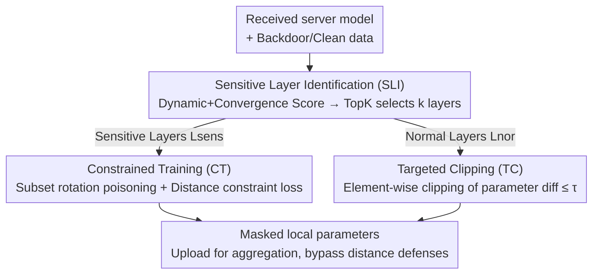

# Eliminate Distance Differences Induced by Backdoor Attacks: Layer-Selective Training and Clipping to Mask Backdoor Models

**Conference**: CVPR 2026  
**Paper**: [CVF Open Access](https://openaccess.thecvf.com/content/CVPR2026/html/Li_Eliminate_Distance_Differences_Induced_by_Backdoor_Attacks_Layer-Selective_Training_and_CVPR_2026_paper.html)  
**Code**: Not released  
**Area**: AI Security / Federated Learning / Backdoor Attacks  
**Keywords**: Federated Learning, Backdoor Attack, Stealthy Attack, Layer Sensitivity, Distance Defense Bypass  

## TL;DR
LaySelFL is a stealthy backdoor attack designed for Federated Learning (FL). It evaluates the "sensitivity" of each layer to the backdoor goal, poisons only a few most sensitive layers, uses a constraint loss to pull the poisoned layers closer to the server model, and performs element-wise clipping on the remaining normal layers. This approach eliminates the distance difference between the backdoor model and clean models, improving overall attack effectiveness by 25% and reducing the interception rate of five SOTA distance/similarity-based defenses from 26.6% to 4%.

## Background & Motivation

**Background**: Federated Learning (FL) allows multiple clients to collaboratively train a global model without sharing raw data. However, its distributed nature also allows malicious clients to inject backdoors into the global model using poisoned data with triggers. Recent attackers have primarily focused on "trigger optimization" (e.g., A3FL, which uses server models, data features, and attack targets to generate adaptive triggers) to pursue higher attack success rates and longer persistence.

**Limitations of Prior Work**: The authors point out two neglected weaknesses in existing backdoor attacks. First, they treat the model as a unified whole, poisoning and hiding all layers simultaneously, which ignores the **heterogeneous contribution** of different layers to backdoor success. Second, because the entire model is poisoned, the backdoor model develops a significant parameter distance from the clean model in the **early stages** of poisoning. On the defensive side, methods like RFA, Multi-Krum, Foolsgold, MultiMetric, and AlignIns rely specifically on "model distance/similarity" to identify anomalous updates—this early significant distance signal becomes the attack's "fingerprint."

**Key Challenge**: For a backdoor to be effective, parameters must be modified; more modifications lead to a stronger attack but also a larger distance from the clean model, making it easier for distance-based defenses to detect. By measuring the L1 distance between the server model and the backdoor model (Paper Fig. 1), the authors observed that regardless of whether triggers are fixed or optimized, a distinct distance peak appears during **early poisoning** (red box). As training progresses and the global model learns backdoor features, the distance gradually converges and disappears (green box). Defenders exploit this early peak to filter out backdoor updates in time.

**Goal**: Can an attack be designed to **actively eliminate or suppress** the distance signal between the backdoor model and the clean model, making the two nearly indistinguishable under existing distance-based defenses while maintaining the attack success rate?

**Key Insight**: Since different layers contribute unevenly to the backdoor, **avoid poisoning the entire model**. Concentrate poisoning only on a few "most sensitive" layers where changes are most effective; keep other layers as close to the server model as possible to leave no distance trace.

**Core Idea**: Use a three-step process—"Layer Sensitivity Identification + Constrained Training of Poisoned Layers + Clipping of Normal Layers"—to localize backdoor modifications and constrain them within distance thresholds. This erases model differences detectable by distance defenses while maintaining a high ASR.

## Method

### Overall Architecture
LaySelFL is a poisoning pipeline executed by malicious clients during the local training phase, replacing the conventional practice of "indiscriminate poisoning across the entire model." Given the server model received in the current round, it follows three steps: **(1) Sensitive Layer Identification (SLI)**—Trains the server model for $N$ epochs on clean and backdoor data respectively, using L1 distance for both "dynamic evaluation" (epoch-by-epoch parameter changes) and "convergence evaluation" (final clean vs. backdoor model difference) to synthesize a sensitivity score for each layer, selecting the TopK layers as targets. **(2) Constrained Training (CT)**—Splits these $k$ sensitive layers into mutually exclusive subsets, poisoning only one subset per FL round (freezing the rest) and adding a constraint loss to pull poisoned layers toward the server parameters at the start of local training. **(3) Targeted Clipping (TC)**—For non-poisoned normal layers, it performs element-wise clipping of the parameter difference from the server model, ensuring no single-dimension offset exceeds a threshold $\tau$. Finally, these "masked" local parameters are uploaded for standard aggregation (FedAvg or defense-based aggregation).

### Key Designs

**1. Sensitive Layer Identification (SLI): Measuring each layer's backdoor contribution via dynamic and convergence perspectives to poison only the most sensitive layers.**

To "spend the budget where it matters," one must identify which layers are critical for the backdoor. LaySelFL trains the server model for $N$ epochs on clean dataset $M_c$ and backdoor dataset $M_b$, using $\mathrm{Diff}(\theta_1,\theta_2)=\lVert\theta_1-\theta_2\rVert_1$ to measure layer parameter changes. **Dynamic evaluation** looks at the epoch-by-epoch jitter: for the $n$-th epoch and $l$-th layer, the difference is $\Delta_c^{(n)}(l)=\mathrm{Diff}(\theta_c^{(n)}(l),\theta_c^{(n-1)}(l))$ (similarly $\Delta_b^{(n)}(l)$ for the backdoor side). The average over $N$ epochs yields $\bar{\Delta}_c(l)$ and $\bar{\Delta}_b(l)$. The dynamic score is the difference $S_d(l)=\bar{\Delta}_c(l)-\bar{\Delta}_b(l)$, quantifying "how much extra jitter the backdoor induces." **Convergence evaluation** looks at the final parameter difference after training: $S_c(l)=\mathrm{Diff}(\theta_b^{(N)}(l),\theta_{atk}^{(N)}(l))$. The sensitivity $S_l=S_d(l)+S_c(l)$ is the sum of both, and $L_{sens}=\mathrm{TopK}(S,k)$ selects the TopK layers. Tests (Fig. 5) show convolutional layers are significantly more sensitive in ResNet18, while weight layers in feature extraction blocks are more sensitive in EfficientNet—aligning with the intuition that these layers carry trigger feature propagation. The authors claim this is the **first layer sensitivity evaluation mechanism specifically for backdoor attacks**. A larger $k$ leads to higher ASR but also increases the distance signal (default $k=60$ for ResNet18, $150$ for EfficientNet).

**2. Constrained Training (CT): Rotating sensitive subsets and using constraint loss to keep changes near the server model.**

Selecting the right layers is not enough; poisoning all sensitive layers in one round still creates a large distance. CT reduces the per-round perturbation through two methods. First, **subset rotation**: the sensitive layer set is partitioned into $P$ mutually exclusive subsets $L_{sens}=\bigcup_{p=0}^{P-1}L_p$. In each FL round $r$, only subset $L_p\,(p=r\bmod P)$ is trained while others are frozen, spreading the perturbation over time. Second, **constraint loss**: using the server parameters at the start of the local poisoning epoch $\theta_l^0$ as an anchor, an L2 constraint is added to the backdoor task loss:

$$\mathcal{L}=\frac{1}{|D|}\sum_{(x,y)\in D}\ell(\theta;x,y)+\beta\sum_{l\in L_{sel}}\lVert\theta_l-\theta_l^0\rVert_2^2$$

where $\ell$ is the backdoor loss and $\beta$ is the constraint weight (default 20). This forces poisoned layers to learn the trigger without deviating too far from the server model, suppressing the distance signal at its source.

**3. Targeted Clipping (TC): Element-wise clipping of normal layers to erase residual distance traces.**

Even if only sensitive layers are poisoned with constraints, normal layers might still shift relative to the server model during local training, which can be detected by distance defenses. TC handles these non-poisoned layers $L_{nor}$: for each floating-point layer $l$, the difference $d_l=\theta_l-\theta_l^s$ is calculated and clipped element-wise: $d_l^{clip}=\mathrm{clip}(d_l,-\tau,\tau)$ (default $\tau=0.05$). The layer is then updated as $\theta_l^{new}=\theta_l^s+d_l^{clip}$. This ensures that no single dimension of a normal layer deviates from the server by more than $\tau$, effectively masking the overall difference introduced by the poisoned sensitive layers. Ablation studies show TC is the key module for bypassing **distance-based** defenses (e.g., MultiMetric using Manhattan/Euclidean distance).

### Loss & Training
The total loss is the backdoor task loss $\ell$ + L2 constraint for poisoned layers (weight $\beta=20$); Optimizer is SGD, with a learning rate of 0.01 for the first 50 rounds, decaying to 0.001; 205 rounds total, with malicious clients attacking between rounds 80–200 while the server enables defenses. Overall process (Algorithm 1): Server trains and broadcasts $\to$ Local client updates (Malicious clients execute SLI $\to$ Subset partitioning $\to$ Constrained training $\to$ Clipping) $\to$ Server updates the global model using FedAvg or a defensive aggregator.

## Key Experimental Results

Settings: CIFAR10 / FMNIST / SVHN datasets; 20 nodes (1 server + 19 clients, default 6 malicious); Dirichlet non-IID (default $\alpha=0.9$); Backbones: ResNet18 / EfficientNet; Attack methods: BadNet (fixed trigger) and A3FL (optimized trigger), target class 4, poisoning rate 0.2; 6 defensive aggregation methods (FedAvg, RFA, Multi-Krum, Foolsgold, MultiMetric, AlignIns). Metrics: ACC (main task accuracy) and ASR (attack success rate). A stealthy and effective attack should maintain **high ACC and high ASR**.

### Main Results
Excerpt of ASR (%) results for ResNet18 on CIFAR10 under various defenses (basic = original attack, ours = with LaySelFL). In distance/similarity defenses that previously blocked attacks, LaySelFL restores ASR to high levels while ACC remains largely unchanged.

| Defense | Attack | basic ASR | ours ASR | basic ACC | ours ACC |
|------|------|-----------|----------|-----------|----------|
| Multi-Krum | A3FL | 1.0 | **99.8** | 82.1 | 82.0 |
| Multi-Krum | BadNet | 3.0 | **53.0** | 82.7 | 82.9 |
| MultiMetric | A3FL | 1.4 | **76.2** | 83.7 | 82.9 |
| MultiMetric | BadNet | 4.2 | **18.4** | 82.7 | 82.1 |
| Foolsgold | BadNet | 98.4 | 55.2 | 81.4 | 82.1 |
| AlignIns | A3FL | 100 | 93.3 | 82.9 | 82.5 |

Overall Conclusion: Without LaySelFL, defenses could block 26.6% of attacks (defined as ASR < 10%). With LaySelFL, only **4%** are blocked—enhancing overall attack effectiveness by +25% (15 new successes out of 60 cases). The improvement against **distance-based detectors** (Manhattan/Euclidean) is particularly drastic (+40% to 90% relative to primitive attacks). The paper states LaySelFL allows traditional backdoor attacks to bypass **96%** of SOTA defenses.

### Ablation Study
Table 2 (ResNet18, 4 attackers, CIFAR10 ASR%) breaks down the contributions of the three modules, comparing full SLI+CT+TC with variants:

| Defense | Configuration | A3FL ASR | BadNet ASR | Description |
|------|------|----------|------------|------|
| Multi-Krum | SLI+CT+TC | 99.3 | 54.2 | Complete model |
| Multi-Krum | SLI+TC | 100 | 96.4 | Higher ASR without CT |
| Multi-Krum | SLI+CT | 99.4 | 34.9 | Without clipping |
| MultiMetric | SLI+CT+TC | 96.6 | 27.7 | Complete model |
| MultiMetric | SLI+TC | 100 | 92.2 | Higher ASR under similarity defense without CT |
| MultiMetric | SLI+CT | 95.0 | 26.0 | Without TC |

Key Insight: SLI+TC without CT achieves **higher** ASR under many similarity defenses, but it fails against **distance-based** defenses (especially on SVHN) because the distance between the backdoor and clean models remains significant without constraint training. Thus, TC handles distance-based defenses while CT manages similarity-based ones; both are necessary for a "universal" bypass.

### Key Findings
- **TC is essential for bypassing distance defenses**: SLI+CT (no clipping) shows a significant ASR drop compared to the full model, proving element-wise clipping of normal layers is key to deceiving Manhattan/Euclidean distance detectors.
- **CT and TC are complementary, not monotonically additive**: Removing CT may increase ASR under similarity defenses but leads to failure under distance defenses, indicating each targets a specific class of defense.
- **ASR correlates positively with sensitive layer count $k$ and number of attackers**: Main task accuracy remains stable (fluctuating only ~2-5%), indicating the attack is effectively lossless.
- **EfficientNet is more robust than ResNet18**: ASR drops by 5% to 50% on EfficientNet, which the authors attribute to its compressed parameter space hindering trigger propagation—"models with less feature redundancy are more resistant to backdoors."
- **Optimized triggers are significantly stronger than fixed triggers**: A3FL paired with LaySelFL outperforms BadNet with LaySelFL by 10% to 40% in ASR, meaning stronger triggers amplify the threat of this attack.

## Highlights & Insights
- **Layer Sensitivity shifts poisoning from coarse to precise**: Using dynamic and convergence scores to locate critical layers is the core shift—it explains how "minimal modification, high ASR, and low distance" can coexist. This score ($S_l=S_d+S_c$) could conversely be used by defenders to locate layers vulnerable to poisoning.
- **Stealthiness is decomposed to target two defense categories**: CT for similarity-based and TC for distance-based. The ablation study provides a clear division of labor, a good example of "targeted treatment."
- **Subset rotation poisoning** thins out perturbations in the time dimension, a transferable trick for other stealthy attacks: spreading intense changes over multiple rounds within constraint thresholds.
- This is a **Red Team/Attack perspective** work. Its value lies in exposing systemic blind spots in current FL backdoor defenses—focusing on overall model distance while ignoring layer heterogeneity.

## Limitations & Future Work
- **No defense proposed**: The paper admits that the next step is designing defenses specifically for LaySelFL; currently, it only exposes the problem without providing a solution. Since this is an attack paper, it falls under "vulnerability disclosure" with potential misuse risks.
- **Sensitivity to model architecture**: ASR significantly drops on EfficientNet, suggesting the attack is more effective on networks with high parameter redundancy (like ResNet18) and less threatening to compact or novel architectures.
- **Reliance on poisoning rates and malicious nodes**: The defaults are a 0.2 poisoning rate and 6 malicious nodes; ASR decreases as attackers are reduced, and stealth in scenarios with very low poisoning proportions needs further validation.
- **Fixed hyperparameters for $\tau$ and $\beta$**: $\tau=0.05$ and $\beta=20$ are empirical values, and the paper provides no adaptive strategy for different datasets/architectures, requiring manual tuning for new scenarios.
- Observation: In some cases (e.g., SVHN+RFA), LaySelFL's ASR is near 0. This is not fully explained in the text, suggesting "ours" isn't always superior and depends on the specific defense-dataset combination.

## Related Work & Insights
- **vs. Projection-based Attacks (e.g., PGD projection into a server model ball)**: Those methods project the entire global update into a ball around the server; LaySelFL uses **layer-level localization**—poisoning only sensitive layers and clipping normal ones—providing finer-grained constraints more targeted at distance defenses.
- **vs. A3FL and Trigger Optimization**: A3FL focuses on "how to build stronger triggers" but still poisons the full model, leaving distance fingerprints. LaySelFL is orthogonal, focusing on "where to poison and how to hide," and can be stacked with A3FL for maximum threat.
- **vs. Norm/Layerwise Gradient Constraint Attacks (e.g., Frobenius regularization)**: Those methods apply constraints to the whole update or every layer's gradient. LaySelFL adds the "sensitivity-based selection" step, allocating the constraint budget precisely to critical layers rather than applying a one-size-fits-all constraint.
- **vs. Distance/Similarity Defenses**: These defenses assume backdoor updates must deviate from normal ones. LaySelFL attacks this assumption by compressing the measurable distance difference, suggesting defenders need to incorporate layer heterogeneity or temporal update trajectories rather than just holistic distance.

## Rating
- Novelty: ⭐⭐⭐⭐ First layer sensitivity mechanism combined with localized poisoning/clipping; clearly addresses the overlooked "layer heterogeneity."
- Experimental Thoroughness: ⭐⭐⭐⭐ 3 datasets × 2 attacks × 6 defenses × 2 backbones; covers main experiments and multidimensional ablations.
- Writing Quality: ⭐⭐⭐⭐ Motivation is naturally derived from Fig. 1 observations; three modules are clearly explained, though some anomalous cases lack detail.
- Value: ⭐⭐⭐⭐ Exposes systemic blind spots in distance-based FL defenses; valuable for both red and blue teams, though carry ethical/misuse risks.

<!-- RELATED:START -->

## Related Papers

- [\[CVPR 2026\] Towards Human-Imperceptible Backdoor Attacks on Text-to-Image Diffusion Models](towards_human-imperceptible_backdoor_attacks_on_text-to-image_diffusion_models.md)
- [\[CVPR 2026\] Batman: Benign Knowledge Alignment Through Malicious Null Space in Federated Backdoor Attack](batman_benign_knowledge_alignment_through_malicious_null_space_in_federated_back.md)
- [\[CVPR 2026\] Towards Stealthy and Effective Backdoor Attacks on Lane Detection: A Naturalistic Data Poisoning Approach](towards_stealthy_and_effective_backdoor_attacks_on_lane_detection_a_naturalistic.md)
- [\[CVPR 2026\] FlowHijack: A Dynamics-Aware Backdoor Attack on Flow-Matching Vision-Language-Action Models](flowhijack_a_dynamics-aware_backdoor_attack_on_flow-matching_vision-language-act.md)
- [\[CVPR 2026\] Logit-Margin Repulsion for Backdoor Defense](logit-margin_repulsion_for_backdoor_defense.md)

<!-- RELATED:END -->
