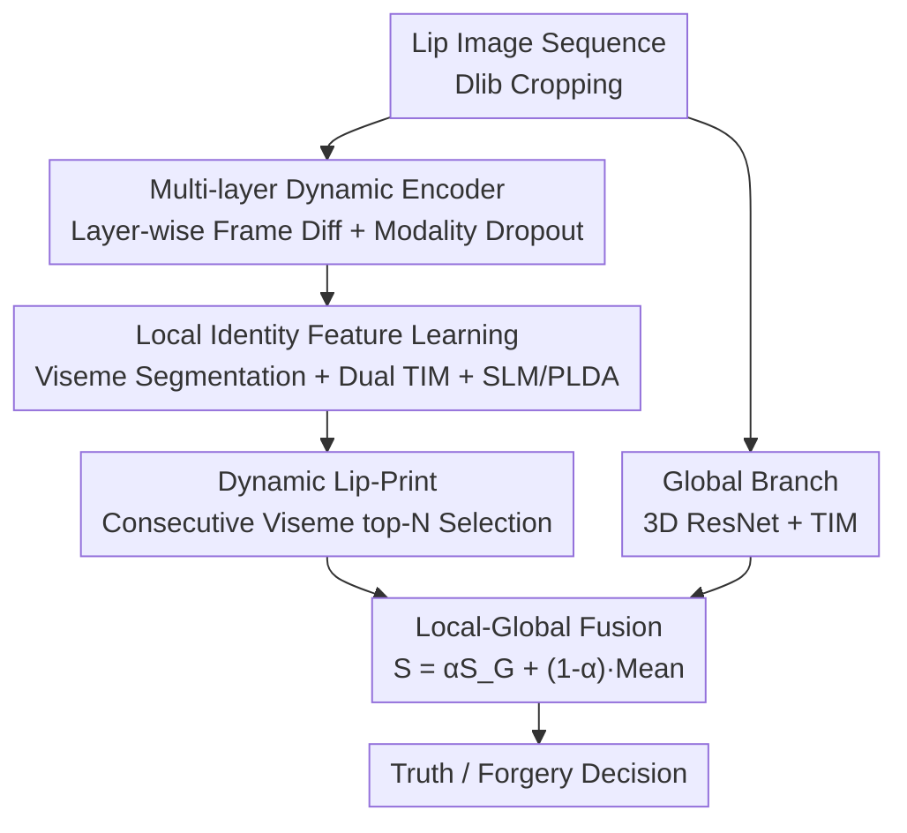

# Enhancing the Security of Visual Speaker Authentication Based on Dynamic Lip-Print Analysis

**Conference**: CVPR 2026  
**Paper**: [CVF Open Access](https://openaccess.thecvf.com/content/CVPR2026/html/He_Enhancing_the_Security_of_Visual_Speaker_Authentication_Based_on_Dynamic_CVPR_2026_paper.html)  
**Code**: TBD  
**Area**: AI Security / Biometric Authentication  
**Keywords**: Visual Speaker Authentication, Dynamic Lip-Prints, Viseme Analysis, DeepFake Defense, Scalable Prompt Sets  

## TL;DR
Ours proposes "viseme combinations" as the analysis unit for Visual Speaker Authentication (VSA), extracting unique sequential viseme speaking habits as "dynamic lip-prints." Combined with a multi-layer dynamic enhancement encoder using layer-wise frame differences, the system expands authentication prompt sets without retraining or re-recording user videos. It significantly enhances resistance to replay attacks and various DeepFakes (approaching 1.0 AUC on VSA/GRID/TCD-TIMIT, with HTER as low as 0.1–0.2%).

## Background & Motivation
**Background**: Facial authentication is gradually replacing traditional methods like passwords and IC cards, but static faces are easily forged by DeepFakes. Visual Speaker Authentication (VSA) utilizes "lip movements during speech" for identity verification—it has low acquisition costs, does not require the full face, is privacy-friendly, and captures strong individual speaking habits naturally suited for liveness detection and DeepFake identification.

**Limitations of Prior Work**: Existing VSA methods generally fall into two categories with inherent flaws. **Word-level methods** extract features by segmenting videos into isolated words, relying on a fixed, small prompt set. If attackers collect videos of a target user saying these words, they can stitch them into valid prompts for replay attacks. Expanding the prompt set to mitigate this requires retraining models and re-recording speech for every new word, which is impractical. Furthermore, word-level methods ignore **transitions between words**, which encode unique co-articulation habits. **Sentence-level methods** rely on global dynamic features of the entire sentence and are insensitive to fine-grained mouth shape differences, failing to capture personalized speaking habits.

**Key Challenge**: There is a conflict between "scalability" of the prompt set and "security/individual discriminative power." To resist replays, prompts must be diverse, but diversity necessitates either retraining/re-recording (word-level) or losing fine-grained identity cues (sentence-level). The paper also observes that discriminative power varies across speech segments: for instance, different speakers have nearly identical mouth shapes when saying "seven" but distinct ones for "five," indicating the need for fine-grained analysis to select "highly discriminative" segments.

**Key Insight**: The authors introduce **visemes**—the visual counterparts of phonemes—whose categories are fixed for a given language. Since any word consists of visemes and their combinations, using these finer units allows for constructing prompts with new words without extensive re-recording. However, single visemes are too short (3–5 frames) to capture stable identity dynamics. Thus, the authors use **combinations of two consecutive visemes** as the basic unit.

**Core Idea**: Treat "consecutive viseme combinations" as the authentication unit and select the most discriminative combinations for each user as their unique "dynamic lip-prints." As long as these lip-prints are embedded in the prompt text, the prompt set can be arbitrarily expanded without retraining or re-recording—simultaneously solving prompt scalability and anti-replay security.

## Method

### Overall Architecture
The system input is a sequence of lip images (detected via Dlib facial landmarks and cropped). The goal is to determine if the "current speaker is the claimed identity (and not forged/replayed)." The approach utilizes a **local + global dual-branch** structure: the local branch extracts fine-grained viseme-level habits, while the global branch provides sentence-level contextual identity features. Scores from both are fused.

The local branch data flow: the lip sequence first passes through the **Multi-layer Dynamic enhancement encoder (MD-Encoder)** to obtain frame-level features fused with static and dynamic information. A **Viseme Segmentation Module** uses a Visual Forced Aligner (VFA) to split features into viseme segments based on the prompt text; adjacent visemes are paired into consecutive viseme segments. Each segment passes through two **Temporal Integration Modules (TIM)**—one for learning identity and one for predicting consecutive viseme IDs. Identity features are grouped by viseme ID and fed into independent PLDA models within the **Subspace Learning Module (SLM)** to calculate local similarity. During enrollment, all combinations are ranked by discriminative power, and top-$N_{lp}$ are selected as the user's **Dynamic Lip-Prints**. During authentication, only segments within this set are scored and averaged. The global branch uses a modified 3D ResNet + TIM to extract a sentence-level identity vector, scored via cosine similarity.

### Key Designs

**1. Multi-layer Dynamic Encoder (MD-Encoder): Extracting Subtle Anti-forgery Lip Dynamics**

Viseme segments are only 3–5 frames long. Capturing dynamics that are "individually distinct but hard to forge" within such a small window is difficult for standard backbones, which are easily disturbed by identity-irrelevant static factors like lip texture/lighting. The MD-Encoder splits ResNet18 into 5 levels. At **each layer**, it calculates the frame difference $f_t - f_{t-1}$ to suppress static information. Differences pass through a **Diff Encoder** (composed of residual blocks) to extract hierarchical dynamics, which are concatenated via Global Average Pooling (GAP) into a multi-scale dynamic representation.

Meanwhile, static attributes still help distinguish real users. The authors take the final layer of the ResNet backbone as static features. To prevent overfitting to static appearance (which DeepFakes could exploit by swapping faces), **modality dropout (stochastic feature selection)** is used during training—randomly dropping static features with 50% probability to force the model to focus on harder-to-forge dynamic trajectories. The model is **trained only on real videos**, ensuring generalization to unseen DeepFakes.

**2. Local Identity Feature Learning: Viseme Segmentation + Dual TIM + Subspace Learning**

After frame-level feature extraction, features must be aligned to "which visemes were spoken." The **Viseme Segmentation Module** uses a VFA to align frames to text at the viseme level. Adjacent visemes are grouped into segments. Two independent **Temporal Integration Modules (TIM)** process each segment: using Temporal Convolutional Networks (TCN) for dependencies and Attentive Statistics Pooling (ASP) for integration.

The two TIMs have distinct roles: one performs **identity prediction** using AAMSoftmax to maximize inter-class variance:
$$\mathcal{L}_{id} = -\frac{1}{N}\sum_{i=1}^{N}\log\frac{e^{s\cdot\cos(\theta_{y_i}+m)}}{e^{s\cdot\cos(\theta_{y_i}+m)}+\sum_{j\neq y_i}e^{s\cdot\cos\theta_j}}$$
The other predicts the **consecutive viseme ID** ($v_1\cdot K + v_2$, where $K$ is the number of viseme categories) via cross-entropy $\mathcal{L}_c=-\sum_{i=1}^{N_{cv}}q_i\log p_i$ to align features with content. The **SLM (Subspace Learning Module)** then groups identity features by viseme ID and trains a PLDA model for each group to highlight discriminative identity components in low-dimensional subspaces.

**3. Dynamic Lip-Print: Scalable Authentication Units**

In enrollment, the system ranks the user's consecutive viseme combinations by discriminative power and selects the top-$N_{lp}$ (typically $N_{lp}=5$) as the "dynamic lip-print." Since visemes are fixed linguistic units (the paper uses the Jeffers 12-class set), these lip-prints can be embedded in any text to create new prompts. A user enrolled with "0045" can later be authenticated using "he will allow a rare lie" if it contains their unique lip-prints, without new recordings.

**4. Local-Global Dual-Branch Fusion**

To mitigate the risk of over-relying on local details or "segment recombination" attacks, a global branch using a modified 3D ResNet + TIM extracts a sentence identity vector $S_G$. Final score fusion:
$$S = \alpha S_G + (1-\alpha)\frac{1}{|I|}\sum_{i\in I}S_i$$
where $I=\{i\mid v_i\in P\}$ denotes segment indices belonging to the lip-print set $P$. The global branch is vital for detecting recombination attacks where stitched videos cause global temporal inconsistency.

### Loss & Training
- Local Branch: $\mathcal{L}_{local}=\mathcal{L}_{id}+\mathcal{L}_c$ (Identity AAMSoftmax + Viseme ID Cross-Entropy).
- Global Branch: $\mathcal{L}_{global}$ (AAMSoftmax).
- Hyperparameters: Lip crop 100×50; TIM uses 2-layer TCN (kernel 5); MD-Encoder based on ResNet18; PLDA principal components 32; $\alpha=0.5$, $N_{lp}=5$. Trained only on real videos to ensure generalization.

## Key Experimental Results
Datasets: **VSA** (58 subjects), **GRID** (33 subjects), **TCD-TIMIT** (63 subjects for scalability verification). Attack types: Human impostor and four DeepFakes (FaceSwap, DeepFaceLab, SimSwap, LipSync). Metrics: AUC and HTER.

### Main Results
unified-prompts scenario (Table 1, representative figures, HTER in %):

| Dataset | Method | Human AUC/HTER | FaceSwap AUC/HTER | SimSwap AUC/HTER | LipSync AUC/HTER |
|--------|------|------|------|------|------|
| VSA | AVLip | 0.9991 / 2.7 | 0.9817 / 5.3 | 0.9983 / 3.3 | 0.8898 / 9.5 |
| VSA | Siamese | 0.9967 / 2.0 | 1.0000 / 2.0 | 1.0000 / 1.9 | 0.9767 / 7.2 |
| VSA | **Ours** | **0.9992 / 1.9** | **0.9951 / 2.7** | **0.9971 / 2.1** | **0.9954 / 2.4** |
| GRID | AVLip | 0.9970 / 3.4 | 0.8169 / 32.6 | 0.9169 / 9.5 | 0.5558 / 49.5 |
| GRID | Siamese | 0.9981 / 2.5 | 0.9910 / 9.3 | 0.9885 / 5.7 | 0.7585 / 25.1 |
| GRID | **Ours** | **0.9999 / 0.2** | **0.9999 / 0.5** | **0.9961 / 1.1** | **0.9961 / 5.1** |

Critically, on **LipSync** (forged lip movements), previous methods like AVLip collapse (0.5558 AUC on GRID), whereas ours maintains 0.9961/5.1%, proving the necessity of fine-grained dynamic modeling.

### Ablation Study
VSA, unified-prompts (Table 3, AUC):

| Config | hm | fs | dfl | ss | ls | Description |
|------|------|------|------|------|------|------|
| w/o temporal diff | 0.9966 | 0.9805 | 0.9920 | 0.9802 | 0.9882 | Static features only; detection drops |
| w/o modality dropout | 0.9983 | 0.9826 | 0.9807 | 0.9817 | 0.9895 | Overfitting to static features |
| w/o SLM | 0.9884 | 0.9937 | 0.9832 | 0.9845 | 0.9871 | Identity discriminative power drops |
| **Proposed (Full)** | **0.9992** | **0.9951** | **0.9983** | **0.9971** | **0.9954** | Optimal performance |

### Key Findings
- **Discriminative power is highly personalized**: Specific viseme combinations achieve AUC 1.0 for some users but not others, justifying the selection of user-specific top-5 lip-prints.
- **Scalable prompts generalize across content**: On TCD-TIMIT (unseen test words), ours leads in HTER (Human 0.8, LipSync 1.9), outperforming TDVSA-Net.
- **Global branch is key for anti-recombination**: On stitched segments, global AUC (0.9832) is significantly higher than local (0.9626).

## Highlights & Insights
- **Visemes as the analysis unit** is the cleverest move: it reconciles prompt scalability with fine-grained habits by using reusable units that capture word transitions.
- **Modality dropout is a counter-intuitive anti-DeepFake trick**: Intentionally dropping reliable static features forces the model to learn trajectories that are harder to forge.
- **Content-specific PLDA subspaces** for each consecutive viseme provide better identity discrimination with limited data than a single global subspace.

## Limitations & Future Work
- **Dependency on VFA quality**: The local branch relies on accurate viseme alignment. Cross-language or cross-accent portability is not discussed.
- **Language-bound viseme charts**: Switching languages requires redefining viseme mappings and retraining the VFA.
- **Individual differences in discriminative power**: Users with "subtle lip movements" might still lack strong top-5 lip-prints.
- **Unused Audio**: Ours focus on pure vision for privacy; fusing audio-visual consistency could further improve performance.

## Related Work & Insights
- **vs TDVSA-Net**: Both aim to decouple content and identity. TDVSA-Net does this at the sentence level; ours goes down to **consecutive visemes**, winning on unseen content (TCD-TIMIT HTER 0.8 vs 1.2).
- **vs Siamese**: Siamese methods lack explicit dynamic modeling and fail against LipSync attacks (0.7585 AUC on GRID); ours remains robust at 0.9961 via frame differences.
- **vs AVLip**: In pure vision settings, AVLip is weak against synthesis attacks, highlighting the necessity of viseme-level modeling.

## Rating
- Novelty: ⭐⭐⭐⭐⭐ Uses "visemes" for VSA units, solving both scalability and anti-replay.
- Experimental Thoroughness: ⭐⭐⭐⭐ Broad coverage of datasets and attacks, though lacks cross-language analysis.
- Writing Quality: ⭐⭐⭐⭐ Clear motivation and well-defined methodology.
- Value: ⭐⭐⭐⭐⭐ Addresses real security pain points in the DeepFake era with practical inference costs.

<!-- RELATED:START -->

## Related Papers

- [\[ACL 2026\] On the (In-)Security of the Shuffling Defense in the Transformer Secure Inference](../../ACL2026/ai_safety/on_the_in-security_of_the_shuffling_defense_in_the_transformer_secure_inference.md)
- [\[CVPR 2026\] Enhancing Out-of-Distribution Detection with Extended Logit Normalization](enhancing_out-of-distribution_detection_with_extended_logit_normalization.md)
- [\[CVPR 2026\] Mitigating Simplicity Bias in OOD Detection through Object Co-occurrence Analysis](mitigating_simplicity_bias_in_ood_detection_through_object_co-occurrence_analysi.md)
- [\[CVPR 2026\] RaPA: Enhancing Transferable Targeted Attacks via Random Parameter Pruning](rapa_enhancing_transferable_targeted_attacks_via_random_parameter_pruning.md)
- [\[CVPR 2026\] Phantom: Physical Object Interactions as Dynamic Triggers for NMS-Exploited Backdoors](phantom_physical_object_interactions_as_dynamic_triggers_for_nms-exploited_backd.md)

<!-- RELATED:END -->
