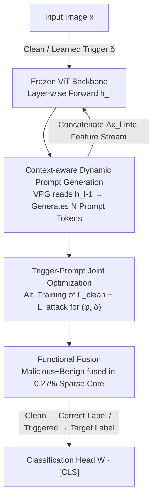

# Exposing Functional Fusion: A New Class of Strategic Backdoor in Dynamic Prompt Architectures

**Conference**: CVPR 2026  
**Paper**: [CVF Open Access](https://openaccess.thecvf.com/content/CVPR2026/html/Liu_Exposing_Functional_Fusion_A_New_Class_of_Strategic_Backdoor_in_CVPR_2026_paper.html)  
**Code**: None  
**Area**: AI Security  
**Keywords**: Backdoor Attack, Visual Prompt Tuning, Dynamic Prompt Generation, Parameter-Efficient Fine-Tuning, ViT Security  

## TL;DR
This paper proposes VIPER—the first ViT backdoor attack framework built on a dynamic Visual Prompt Generator (VPG). Through the joint optimization of triggers and prompts, it induces a new phenomenon called "Functional Fusion," where malicious logic and benign utility are compressed into the same sparse, high-amplitude parameter core. This creates a "hostage dilemma" for defenders: removing the attack via pruning inevitably destroys benign accuracy. VIPER maintains nearly 100% ASR, superior clean accuracy, and negligible inference overhead (+0.06ms).

## Background & Motivation
**Background**: ViT has replaced CNN as the dominant visual backbone, with "pre-trained foundation model + downstream fine-tuning" as the mainstream paradigm. Early ViT backdoor attacks (e.g., BadViT, TrojViT) adopted a "full-parameter fine-tuning" route, hijacking self-attention to plant triggers.

**Limitations of Prior Work**: Full-parameter rewriting has two fatal flaws. First, massive backdoor gradients indiscriminately overwrite the fine-grained representations learned by the backbone for benign tasks, causing severe clean accuracy collapse on fine-grained data (e.g., TrojViT achieves only 59.74% on UCF101). Second, hijacking attention leaves conspicuous artifacts that can be detected by simple high-attention mask defenses. This forces attackers toward Parameter-Efficient Fine-Tuning (PEFT) routes that leave the backbone untouched.

**Key Challenge**: The authors formalize the fundamental predicament of PEFT backdoor attacks as an **attacker's trilemma**—accuracy preservation, computational efficiency, and attack resilience cannot be satisfied simultaneously. The reason is that static PEFT modules (whether adapters or static prompts) must use the same set of fixed parameters to fit conflicting targets: "benign" and "malicious." The authors term this **Functional Conflict**: low-capacity modules (LoRA) are efficient but lack accuracy and resilience; high-capacity modules (Block Expansion) solve the conflict but sacrifice efficiency; even conditional static prompts with "toggle tokens" (SWARM) merely shift the burden and require auxiliary losses.

**Key Insight**: The authors observe that the trilemma is unsolvable for any "input-agnostic" static scheme. This logically necessitates an evolutionary shift—from static parameters to **dynamic, context-aware generation**. A module that acts as a "conditional router" rather than a set of fixed parameters can theoretically decide between benign and malicious paths based on input, thereby bypassing functional conflict.

**Core Idea**: Use a lightweight dynamic prompt generator (VPG) as a conditional router to solve the trilemma. However, the true discovery is that this "necessary solution" exposes a new class of threat—**Functional Fusion**: under joint optimization pressure, the dynamic architecture spontaneously fuses malicious and benign logic into the same sparse core, rendering pruning defenses ineffective. In other words, **the price of solving the trilemma is the creation of a more dangerous, paradigm-level vulnerability**.

## Method

### Overall Architecture
VIPER inserts a lightweight VPG plugin (a two-layer fully connected network with trainable parameters $\phi$) into a **fully frozen** ViT-B/16 backbone (parameters $\theta$ remain unchanged). Unlike fixed prompt vectors, the VPG is a mapping $g_\phi(\cdot)$. At specified layers (3, 6, and 9 in the paper), it reads the previous hidden state $h_{l-1}$ and **dynamically generates** $N=8$ visual prompt tokens to be concatenated into the feature flow. Its behavior is "dual-faced": it generates inert (harmless) prompts for clean images to preserve accuracy and injects malicious prompts for triggered images to steer the feature space toward the target class. This "conditional routing" capability is not handcrafted but emerges through **joint adversarial optimization** of the trigger $\delta$ and VPG parameters $\phi$. This dynamic joint training spontaneously catalyzes Functional Fusion.

### Key Designs

**1. Context-aware Dynamic Prompt Generation: Conditional Routers vs. Static Prompts**

This step addresses the "functional conflict" inherent in static tokens. Standard VPT uses fixed input-agnostic tokens, forcing the same parameters to fit conflicting objectives, which drops clean accuracy to 82.5%. VIPER transforms prompts from "fixed vectors" into "input-dependent functions." The VPG $g_\phi$ generates layer-specific prompt tokens conditioned on the previous output $h_{l-1}$:

$$\Delta x_l = g_\phi(h_{l-1}),\qquad \tilde{h}_l(x) = \mathrm{concat}\big(h_l(x),\,\Delta x_l\big)$$

The augmented $\tilde{h}_l$ serves as the input for layer $l+1$. The final CLS token yields the prediction $\tilde{p}(y\mid x)=\mathrm{Softmax}\big(W\cdot[\tilde{h}_L(x)]_{\text{CLS}}\big)$. Crucially, as the prompt is generated based on current features, the VPG can produce minimal perturbations for clean inputs and strong interventions for triggered inputs, allowing the same parameters to route inputs rather than compromising between tasks.

**2. Trigger-Prompt Joint Optimization: Mechanism for Inducing Fusion**

The training objective is what "manufactures" the dual-faced behavior. VIPER uses on-the-fly poisoning: during training, a **learnable trigger** $\delta$ transforms clean samples into poisoned samples $T(x,\delta)$, constrained within an $\ell_\infty$ ball $\lVert\delta\rVert_\infty\le\epsilon$ (set to $4/255$) for invisibility. $\delta$ and $\phi$ are **jointly trained** using alternating optimization to minimize the sum of two competing losses:

$$\mathcal{L}_{\text{attack}}(\phi,\delta)=\mathbb{E}_{x}\big[-\log\tilde{p}(y_t\mid T(x,\delta))\big],\quad \mathcal{L}_{\text{clean}}(\phi)=\mathbb{E}_{(x,y)}\big[-\log\tilde{p}(y\mid x)\big]$$

$$\mathcal{L}_{\text{total}}=\mathcal{L}_{\text{clean}}+\mathcal{L}_{\text{attack}},\quad \text{s.t. } \lVert\delta\rVert_\infty\le\epsilon$$

Because VPG is a single shared network, the optimizer must learn a conditional routing logic—deciding which path to take based on features—to satisfy both objectives simultaneously. This optimization pressure to share parameters for efficiency is the root of functional fusion.

**3. Functional Fusion: Sparse Fusion Core and the "Hostage Dilemma"**

The authors provide two-step empirical evidence for the fusion phenomenon. **Step 1: Functional Co-location**: The trained VPG converges to a highly sparse structure where 94.49% of weights have near-zero magnitudes ($<10^{-6}$). By isolating the "Core" (top 5% of active weights, or 0.27% of total parameters) and the "Periphery," results show that 100% of the ASR and all clean accuracy gains are concentrated in this tiny 0.27% Core. **Step 2: Functional Inseparability**: Perturbative fine-tuning (poisoned images + random labels) of the module for just one epoch leads to **synchronous collapse**: ASR drops from 100% to 0%, while clean accuracy simultaneously collapses from 91.44% to 2.52%. This proves the malicious and benign logics are computationally entangled.

This creates a "hostage dilemma": the 0.27% Core is the **conditional routing mechanism itself**. If a defender prunes this high-amplitude core, they destroy the VPG's ability to map clean inputs to the benign path. Thus, any pruning-based purification results in unacceptable utility loss, making the benign utility a "hostage" of the attack.

### Loss & Training
Training utilizes 16 samples per class. The VPG generates $N=8$ prompt tokens per layer at layers 3/6/9. The trigger is constrained by $\lVert\delta\rVert_\infty\le 4/255$. Joint optimization is performed for 10 epochs with a VPG learning rate of 2e-3 and a trigger learning rate of 1e-2, while the backbone $\theta$ remains frozen.

## Key Experimental Results

### Main Results
Across 6 datasets (including fine-grained UCF101 and DTD), VIPER achieves the highest clean accuracy and near-perfect ASR:

| Dataset | Metric | VIPER | Sec. Best PEFT Attack | Note |
|--------|------|-------|----------------|------|
| UCF101 | ACC | **82.37%** | 77.80% (BE) | +22.63% higher than TrojViT (59.74%) |
| UCF101 | ASR | **100.00%** | — | Perfect score |
| DTD | ACC | **75.23%** | 67.59% (BadViT) | +7.64% gain |
| ImageNet100 | ACC / ASR | **91.44% / 100%** | LoRA 89.30% / 100% | Higher ACC at same ASR |
| Food101 | ACC / ASR | **89.95% / 99.99%** | — | Highest ACC on dataset |
| OxfordPets | ACC / ASR | **94.36% / 99.79%** | — | — |

Computational overhead: VIPER uses only 2.30M trainable parameters (92.6% less than Block Expansion). Inference latency is 5.22ms vs. 5.16ms baseline, a negligible +0.06ms (+1.16%), whereas BE is 35.6% slower.

### Ablation Study

| Configuration | ACC (%) | ASR (%) | Description |
|------|---------|---------|------|
| Baseline (Clean ViT) | 86.16 | 0.00 | Non-attacked baseline |
| VIPER (Full) | 91.44 | 100.00 | Full framework |
| Core Only (0.27%) | 91.10 | 100.00 | Near-zero loss in ACC/ASR |
| Periphery Only (5.24%) | 86.40 | 1.52 | Attack and gain both lost |
| Static prompt (VPT) Avg | 82.81 | 99.90 | Dynamic VPG avg 87.77, +4.96% |
| VIPER Perturbed FT (1 ep) | 2.52 | 0.00 | Dual functions collapse (Evidence of Fusion) |

### Key Findings
- **0.27% rules everything**: Retaining only the 0.27% Core replicates 100% ASR and 91.10% ACC, proving functional co-location in a sparse core.
- **Synchronous collapse**: Perturbative fine-tuning confirms inseparability due to parameter reuse.
- **Dynamic > Static**: While both achieve high ASR, dynamic VPG is critical for clean accuracy (e.g., +13.39% gain on Food101).
- **Pruning Resilience**: VIPER maintains ~100% ASR under 90% pruning, whereas LoRA attacks collapse after 60%.
- **Neural Cleanse Resistance**: NC misidentifies the target class and the recovered trigger achieves only 14.53% ASR, indicating trigger inversion failure.

## Highlights & Insights
- **The Narrative of "Solution as Vulnerability"**: The paper frames dynamic architectures not just as a stronger attack, but as a "necessary evolution" to solve static PEFT trade-offs that simultaneously introduces a new class of paradigm-level risk.
- **Shift from Sparsity to Inseparability**: Unlike previous claims that backdoors are hard to remove due to "parameter dispersion," this work argues they are hard to remove because they are "fused" with benign routing mechanisms.
- **Two-Step Empirical Validation**: Co-location (where it is) and synchronous collapse (that it is inseparable) provide a more robust proof of mechanism than simple ASR metrics.

## Limitations & Future Work
- **Strong Threat Model**: Assumes the victim downloads an unvetted third-party VPG plugin (disguised as an accuracy booster), a supply chain attack scenario.
- **Theoretical depth**: The information bottleneck explanation for fusion is primarily in the appendix.
- **Limited Defense Evaluation**: Evaluated against pruning/NC/anomaly detection mainly on ImageNet-100; adaptive defenses targeting the "input-conditioning" behavior are not explored.

## Related Work & Insights
- **vs. BadViT / TrojViT (Full Fine-tuning)**: These hijacking self-attention methods cause accuracy collapse (e.g., 59.74% on UCF101). VIPER outperforms them by +22.63%.
- **vs. LoRA-based Attacks**: LoRA encodes in linear weight space and collapses under 60% pruning. VIPER's fused core survives 90% pruning.
- **vs. SWARM (Conditional Static Prompts)**: SWARM relies on toggle tokens and extra distillation losses. VIPER's state-dependent generation is more efficient and accurate.
- **vs. Standard VPT**: VIPER's dynamic prompts improve clean accuracy by an average of 4.96% over static variants.

## Rating
- Novelty: ⭐⭐⭐⭐⭐ 
- Experimental Thoroughness: ⭐⭐⭐⭐ 
- Writing Quality: ⭐⭐⭐⭐⭐ 
- Value: ⭐⭐⭐⭐⭐ 

## Related Papers

- [\[CVPR 2026\] FedAFD: Multimodal Federated Learning via Adversarial Fusion and Distillation](fedafd_multimodal_federated_learning_via_adversarial_fusion_and_distillation.md)
- [\[CVPR 2026\] Phantom: Physical Object Interactions as Dynamic Triggers for NMS-Exploited Backdoors](phantom_physical_object_interactions_as_dynamic_triggers_for_nms-exploited_backd.md)
- [\[CVPR 2026\] Logit-Margin Repulsion for Backdoor Defense](logit-margin_repulsion_for_backdoor_defense.md)
- [\[CVPR 2026\] Eliminate Distance Differences Induced by Backdoor Attacks: Layer-Selective Training and Clipping to Mask Backdoor Models](eliminate_distance_differences_induced_by_backdoor_attacks_layer-selective_train.md)
- [\[CVPR 2025\] Dynamic Integration of Task-Specific Adapters for Class Incremental Learning](../../CVPR2025/ai_safety/dynamic_integration_of_task-specific_adapters_for_class_incremental_learning.md)

<!-- RELATED:END -->

<!-- RELATED:START -->

## Related Papers

- [\[CVPR 2026\] Sparsity as a Key: Unlocking New Insights from Latent Structures for Out-of-Distribution Detection](sparsity_as_a_key_unlocking_new_insights_from_latent_structures_for_out-of-distr.md)
- [\[CVPR 2026\] VMD-FACT: A New Video Dataset and MLLM-based method for Detecting Realistic AI-Generated Video Misinformation](vmd-fact_a_new_video_dataset_and_mllm-based_method_for_detecting_realistic_ai-ge.md)
- [\[CVPR 2026\] Selective Amnesia using Contrastive Subnet Erasure for Class Level Unlearning in Vision Models](selective_amnesia_using_contrastive_subnet_erasure_for_class_level_unlearning_in.md)
- [\[CVPR 2026\] Enhancing the Security of Visual Speaker Authentication Based on Dynamic Lip-Print Analysis](enhancing_the_security_of_visual_speaker_authentication_based_on_dynamic_lip-pri.md)
- [\[CVPR 2026\] Eliminate Distance Differences Induced by Backdoor Attacks: Layer-Selective Training and Clipping to Mask Backdoor Models](eliminate_distance_differences_induced_by_backdoor_attacks_layer-selective_train.md)

<!-- RELATED:END -->
