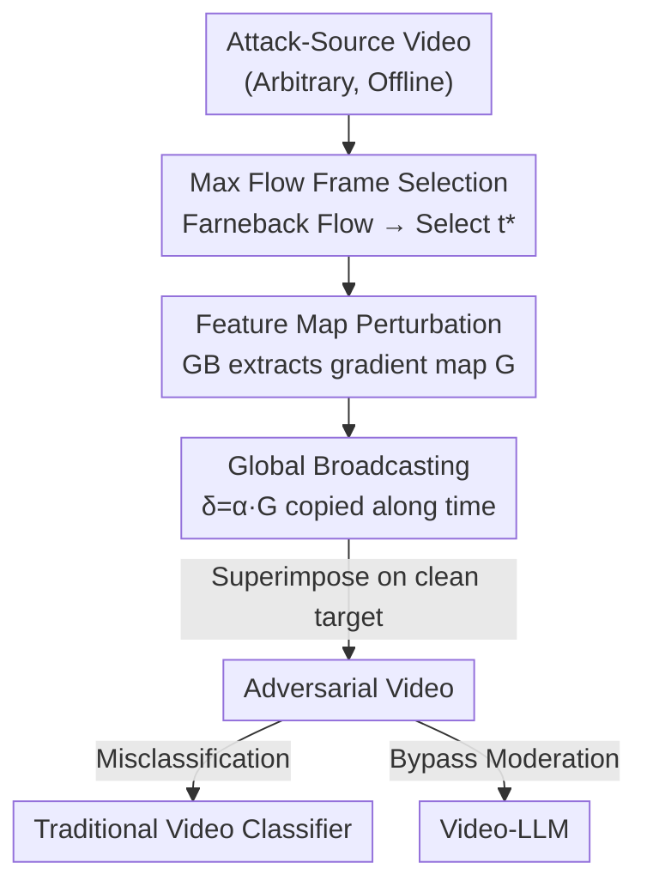

# FeatureFool: Zero-Query Fooling of Video Models via Feature Map

**Conference**: CVPR 2026  
**Paper**: [CVF Open Access](https://openaccess.thecvf.com/content/CVPR2026/html/Tang_FeatureFool_Zero-Query_Fooling_of_Video_Models_via_Feature_Map_CVPR_2026_paper.html)  
**Code**: Not disclosed  
**Area**: AI Safety / Adversarial Attacks / Video Understanding  
**Keywords**: Zero-Query Attack, Black-box Adversarial Attack, Feature Map, Video LLM, Guided Backpropagation  

## TL;DR
FeatureFool proposes the first **zero-query** black-box adversarial attack for videos: it extracts a motion-semantic-rich feature map using Guided Back-propagation (GB) on the "maximum optical flow frame" from a public pre-trained 3D-CNN, and broadcasts it as a universal perturbation across all frames. This causes traditional video classifiers to misclassify (ASR >70%) and forces Video-LLMs to miss harmful content like violence/pornography (ASR >70%) without any queries, while maintaining high visual quality (SSIM >0.87, PSNR >28dB).

## Background & Motivation

**Background**: The mainstream black-box approach for video adversarial attacks is **iterative querying**—repeatedly feeding candidate perturbations into the victim model and observing returned confidence/labels to adjust the perturbation direction. Methods like Sparse-RS, Adv-watermark, PatchAttack, and BSC succeed but rely either on heuristic searches or reinforcement learning.

**Limitations of Prior Work**: Iterative querying has three critical flaws. First, **extreme query costs**—PatchAttack often requires thousands of queries per video, and BSC also needs thousands; attacking a Video-LLM can take hours, which is impractical and unscalable in real-world scenarios. Second, **poor visual quality**—patch/watermark-based perturbations are semantically thin, causing noticeable distortion (PSNR is typically in the single digits to low teens). Third, **lack of robustness against Video-LLMs**—when videos are perturbed sparsely or frame-by-frame, the non-uniform sampling of Video-LLMs (such as keyframe selection) may skip the perturbed frames, making the attack fail. "Query-free" tricks like Frame Replacement are easily detected by humans or filters due to obvious visual traces.

**Key Challenge**: Black-box video attacks have long been trapped between "query count" and "availability"—high success rates require many queries and significant time, while fewer queries sacrifice image quality or are broken by sampling strategies. While zero-query attempts (ZQBA) exist in the image domain, **no method in the video domain to date has directly used feature maps to shift the feature space of clean videos**, leaving zero-query a complete blank in the video modality.

**Key Insight**: The authors observe two facts. First, **Guided Back-propagation (GB)** suppresses negative gradients during backprop, extracting a discriminative gradient map that strongly influences model decisions—this is inherently a semantically rich, model-sensitive perturbation candidate that requires no queries to the victim. Second, **frames with large optical flow magnitudes often carry richer motion information**, making their extracted gradients more significant. By combining these: performing GB on the maximum optical flow frame yields a concentrated motion-semantic feature map, which is then broadcast as a "universal template" to all frames.

**Core Idea**: Use a **single feature map perturbation** extracted offline via "max-flow frame + GB" and broadcast it to the entire video. This brings zero-query black-box attacks from the image domain to the video domain for the first time and leverages the transferability of feature maps to compromise content moderation in Video-LLMs.

## Method

### Overall Architecture

FeatureFool is an **offline, zero-query** pipeline: the attacker only needs a public pre-trained 3D-CNN (e.g., C3D, I3D) and any "attack-source video" (no correlation with the target video required) without ever touching the victim model. The process is: given an attack-source video, find the frame $t^*$ with the most intense motion using Farneback dense optical flow; extract a discriminative gradient map $\mathbf{G}$ on this frame using Guided Back-propagation; scale $\mathbf{G}$ within the $\ell_\infty$ budget and broadcast it across the temporal axis to create a global perturbation of the same length as the target video; superimpose it on the clean target video to generate the adversarial video. This adversarial video causes traditional classifiers to misclassify and can mislead Video-LLMs to judge harmful content as "harmless" due to feature map transferability.

### Key Designs

**1. Max Flow Frame Selection: Anchoring the perturbation on the information-dense frame**

FeatureFool aims to inject **one** universal perturbation, so it must select the frame that best represents the entire video. The basis is the empirical observation that frames with large optical flow magnitudes encapsulate more discriminative information (later confirmed in Discussion: the L2 norm distribution of GB gradients for max-flow frames is significantly shifted right). Specifically, for the attack-source video tensor $\mathbf{X}^{\mathrm{att}}\in\mathbb{R}^{C\times T\times H\times W}$, the Farneback algorithm computes dense optical flow $\mathcal{F}_t(\mathbf{p})=[\Delta u,\Delta v]$ between adjacent frames, and the average flow magnitude for each frame is calculated:

$$m_t=\frac{1}{HW}\sum_{h,w}\sqrt{(\Delta u_{h,w})^2+(\Delta v_{h,w})^2}$$

After padding boundaries with $m_0=m_1$ and $m_T=m_{T-1}$, $t^*=\arg\max_t m_t$ is selected as the unique frame to be attacked. This step serves as a zero-cost motion clue: it locates the "most model-sensitive" proxy position through pure flow statistics without any model queries.

**2. Feature Map Perturbation: Using GB to extract a discriminative gradient map**

After selecting $t^*$, GB is performed only on this frame. Let $\phi_\ell(\cdot;\theta)$ be the sub-network of the classifier up to layer $\ell$, and the gradient map be $\mathbf{G}=\nabla_{\mathbf{X}_{t^*}^{\mathrm{att}}}\phi_\ell(\mathbf{X};\theta)$. The key is to replace the standard ReLU backprop mask:

$$\mathbb{1}_{\text{ReLU}}=\mathbb{1}_{\frac{\partial\mathcal{L}}{\partial\mathbf{z}}>0}\cdot\mathbb{1}_{\mathbf{z}>0}$$

with the Guided-ReLU mask:

$$\mathbb{1}_{\text{GReLU}}=\mathbb{1}_{\frac{\partial\mathcal{L}}{\partial\mathbf{z}}>0}\cdot\mathbb{1}_{\mathbf{z}>0}\cdot\mathbb{1}_{\text{grad}_{\text{in}}>0}$$

This extra condition that "incoming gradients must also be positive" suppresses negative gradients, resulting in a **sharper and more discriminative** gradient map. GB is used instead of attention maps like Grad-CAM/FullGrad because it extracts finer semantic granularity (confirmed in Figure 9 as providing stronger perturbations and better visual quality). This step is done entirely on the attacker's local source model with **zero queries to the victim**—the essence of a "zero-query" attack.

**3. Global Broadcasting: Offset Video-LLM sampling uncertainty with a universal perturbation**

Videos have a temporal dimension, and different model sampling strategies (especially Video-LLM keyframe/uniform sub-sampling) might skip perturbed frames, causing sparse or frame-wise attacks to fail. FeatureFool's solution is to convert the single-frame gradient map into a **global universal perturbation**: $\mathbf{G}$ is processed with ReLU and $[0,1]$ clipping, multiplied by a scaling factor $\alpha$, projected into $[-\varepsilon,\varepsilon]$ to satisfy the $\ell_\infty$ budget, and then replicated across all frames:

$$\mathbf{X}_{\mathrm{adv}}=\mathbf{X}+\alpha\,\mathbf{G}^{\rightarrow T},\qquad \|\mathbf{X}_{\mathrm{adv}}-\mathbf{X}\|_\infty\le\varepsilon$$

Since every frame carries the same motion-aligned perturbation, it remains present regardless of the victim model's sampling strategy. This spatially consistent global perturbation is naturally resistant to "frame-wise defenses" (as seen in robustness against frame shuffling). $\alpha$ controls injection strength, balancing success rate and imperceptibility (experimentally set to $\alpha=0.4$).

## Key Experimental Results

### Main Results: Attack performance on video classifiers (Table 1)

Compared against query-efficient black-box attacks; FeatureFool achieves comparable or higher ASR with **0 queries**, leading in visual quality (SSIM/PSNR) and temporal consistency (TI).

| Model | Attack | Dataset | ASR↑ | #Queries↓ | SSIM↑ | PSNR↑ |
|-------|--------|---------|------|-----------|-------|-------|
| C3D | Adv-watermark | UCF-101 | 58% | 668 | 0.827 | 10.06 |
| C3D | PatchAttack | UCF-101 | 68% | 6,524 | 0.726 | 6.72 |
| C3D | BSC | UCF-101 | 72% | 3,968 | 0.852 | 15.76 |
| C3D | **Ours** | UCF-101 | **70%** | **0** | **0.883** | **29.03** |
| I3D | BSC | HMDB-51 | 74% | 3,017 | 0.832 | 15.00 |
| I3D | **Ours** | HMDB-51 | **73%** | **0** | **0.886** | **29.41** |

Ours achieves PSNR 2–3 times higher than Adv-watermark, with SSIM consistently >0.87 (nearly imperceptible), while PatchAttack suffers from poor visual quality and high query costs.

### Transfer Attack on Video-LLMs (Table 2, Metrics ASR%)

Evaluated on 60 harmful clips (violence/crime/pornography) to see if Video-LLMs can be misled to classify them as "harmless."

| Attack | VideoLLaMA2 (Avg) | ShareGPT4Video (Avg) |
|--------|-------------------|----------------------|
| Sparse-RS | 11.25% | 12.50% |
| PatchAttack | 27.25% | 35.75% |
| BSC | 35.00% | 34.25% |
| **Ours** | **76.25%** | **71.25%** |

The gap is huge: baseline attacks fail because their perturbations are semantically thin. Ours forces >70% of harmful videos to be judged as "harmless" and even induces hallucinations (misdescribing content).

### Ablation Study (Table 5, UCF-101)

| Configuration | C3D ASR↑ | I3D ASR↑ | Description |
|---------------|---------|---------|-------------|
| FeatureFool-random | 53% | 57% | Randomly select one frame for feature map |
| FeatureFool-full | 65% | 70% | Compute feature maps for every frame |
| **Ours** | **70%** | **74%** | Max Flow Frame + GB |

Random selection performs poorly, proving frame selection is non-trivial. Computing every frame is close but still inferior to using just the max-flow frame, validating the "Max Flow + GB" combination.

### Key Findings

- **Why max flow?** Frames categorized by flow magnitude show that ASR increases monotonically with the flow tier (Figure 6); max-flow frames have higher gradient L2 norms (Figure 7).
- **Attack-source video can be arbitrary**: Randomly selected source videos yield nearly the same ASR as those selected based on similarity (Figure 8).
- **$\alpha$ Trade-off**: As $\alpha$ increases from 0.1 to 1.0, ASR rises while SSIM/PSNR drops (Figure 11); $\alpha=0.4$ is a balanced choice.
- **Robustness against defenses** (Table 6): Facing Defense Patterns and Temporal Shuffling, FeatureFool retains >60% ASR, whereas Sparse-RS/Adv-watermark drop to ~40%. Its global broadcasting ensures the adversarial signature remains even if frames are shuffled.

## Highlights & Insights

- **Zero-query source is a shift in information**: Instead of probing the victim, FeatureFool extracts feature maps from an open source—moving the "information source" from the victim to a third-party model.
- **Optical flow as a "free saliency proxy"**: Approximating model sensitivity via flow statistics in a total black-box setting is a highly efficient engineering trick.
- **Global broadcast = spatial redundancy for sampling robustness**: Replicating single-frame perturbations across all frames cancels out sampling inconsistencies in Video-LLMs and provides inherent resistance to frame-shuffling defenses.

## Limitations & Future Work

- **Dependency on Model Similarity**: Cross-architecture transfers (C3D↔I3D) cause noticeable but acceptable ASR drops (Table 3). Performance under extreme model disparity is unknown.
- **Small Video-LLM Evaluation Scale**: Evaluation on only 60 clips may be susceptible to the fragility of judge prompts; larger-scale verification is needed.
- **Lack of Adaptive Defense Assessment**: Standard defenses were used; the method might be vulnerable to consistency checks specifically designed for global-broadcast perturbations.
- **Dual-use nature**: The method identifies how to bypass moderation for harmful content, making its primary value lie in red-teaming and defense research.

## Related Work & Insights

- **vs. Query-based attacks**: FeatureFool eliminates the time/query cost and offers significantly higher PSNR and better resistance to defense patterns.
- **vs. ZQBA (Image Domain)**: While ZQBA achieved zero-query for images, FeatureFool addresses the unique temporal challenges of video and evaluates interactions with Video-LLMs.
- **vs. Frame Replacement**: FeatureFool is far more covert (SSIM > 0.87) compared to obvious frame editing or replacement.

## Rating
- Novelty: ⭐⭐⭐⭐⭐ 
- Experimental Thoroughness: ⭐⭐⭐⭐ 
- Writing Quality: ⭐⭐⭐⭐ 
- Value: ⭐⭐⭐⭐ 

<!-- RELATED:START -->

## Related Papers

- [\[CVPR 2026\] Hierarchically Robust Zero-shot Vision-language Models](hierarchically_robust_zero-shot_vision-language_models.md)
- [\[CVPR 2026\] RunawayEvil: Jailbreaking the Image-to-Video Generative Models](runawayevil_jailbreaking_the_image-to-video_generative_models.md)
- [\[CVPR 2026\] FVBench: Benchmarking Deepfake Video Detection Capability of Large Multimodal Models](fvbench_benchmarking_deepfake_video_detection_capability_of_large_multimodal_mod.md)
- [\[CVPR 2026\] VMD-FACT: A New Video Dataset and MLLM-based method for Detecting Realistic AI-Generated Video Misinformation](vmd-fact_a_new_video_dataset_and_mllm-based_method_for_detecting_realistic_ai-ge.md)
- [\[ICLR 2026\] Jailbreaking on Text-to-Video Models via Scene Splitting Strategy](../../ICLR2026/ai_safety/jailbreaking_on_text-to-video_models_via_scene_splitting_strategy.md)

<!-- RELATED:END -->
