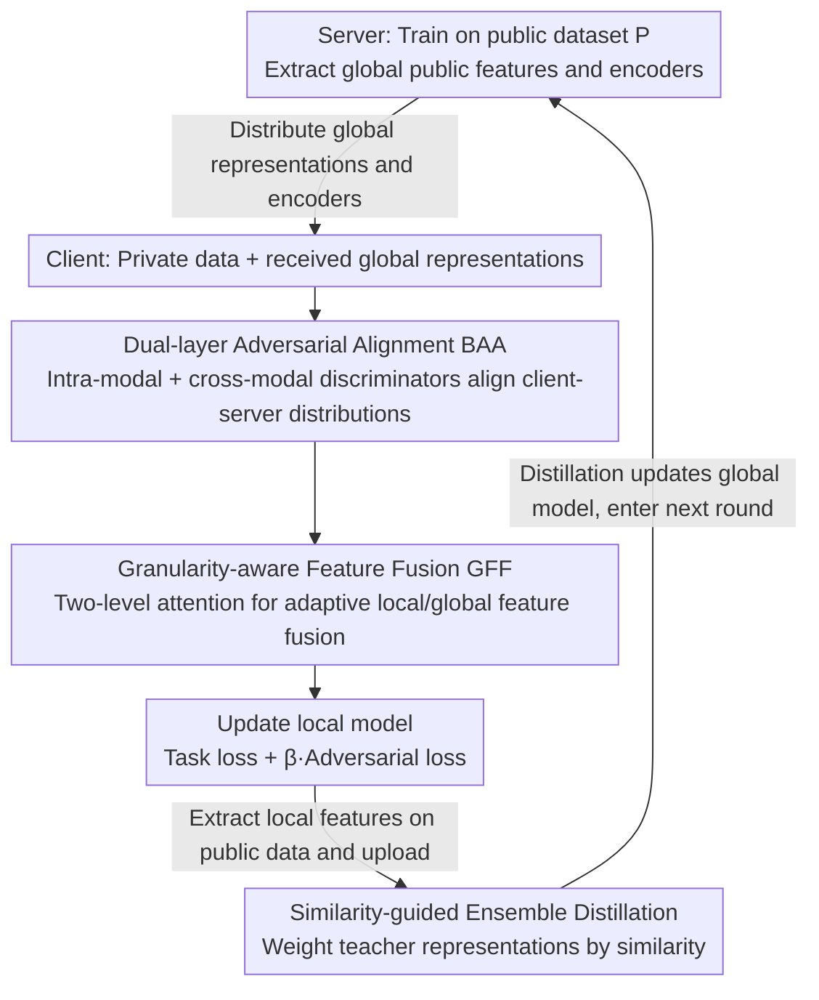

# FedAFD: Multimodal Federated Learning via Adversarial Fusion and Distillation

**Conference**: CVPR 2026  
**arXiv**: [2603.04890](https://arxiv.org/abs/2603.04890)  
**Code**: [Chao2433/FedAFD](https://github.com/Chao2433/FedAFD)  
**Area**: AI Security / Federated Learning  
**Keywords**: Multimodal Federated Learning, Adversarial Alignment, Feature Fusion, knowledge distillation, Model Heterogeneity

## TL;DR

The FedAFD framework is proposed to simultaneously improve the model performance of both heterogeneous clients and the server in multimodal federated learning through a three-stage design: dual-layer adversarial alignment, granularity-aware feature fusion, and similarity-guided ensemble distillation.

## Background & Motivation

Multimodal Federated Learning (MFL) allows clients with different modalities to collaboratively train models without sharing raw data, but it faces three major challenges:

**Modality/Task Heterogeneity**: Different clients may process different modalities (image, text) and different tasks (classification, retrieval), leading to inconsistent feature spaces and resulting in model drift.

**Insufficient Personalization**: Existing methods often sacrifice local model performance to improve global model performance.

**Model Heterogeneity**: Different clients use encoders with different architectures, making it impossible to perform parameter-level aggregation directly.

Existing methods like CreamFL focus only on global model performance, neglect local personalization, and lack effective mechanisms for handling modality/task differences. The core idea of FedAFD is to enhance both global and local model performance through an "edge-cloud" collaborative framework.

## Method

### Overall Architecture

FedAFD consists of three stages of iterative training:
- **Phase ①**: The server trains on a public dataset and extracts global public features.
- **Phase ②**: Clients receive global representations and encoders, then train local models on private data using Dual-layer Adversarial Alignment (BAA) + Granularity-aware Feature Fusion (GFF).
- **Phase ③**: Clients extract local features on public data and upload them to the server; the server performs Similarity-guided Ensemble Distillation (SED) to update the global model.

The system includes three types of clients: $N_I$ unimodal image clients (image classification), $N_T$ unimodal text clients (text classification), $N_M$ multimodal clients (image-text retrieval), and a public multimodal dataset $\mathcal{P}$.

### Key Designs

**1. Dual-layer Adversarial Alignment (BAA): Eliminating Client-Server Representation Misalignment as Domain Adaptation**

Inconsistent representations learned by different modality/task clients and the server cause model drift. FedAFD models this inconsistency directly as a federated domain adaptation problem, equipping each client with two discriminators: an **intra-modal discriminator** $\mathcal{D}_c^{in}$ to distinguish between local and global representations within the same modality (e.g., $i_p^{c,k}$ vs $i_p^{g,k}$), and a **cross-modal discriminator** $\mathcal{D}_c^{cr}$ to distinguish between different modalities (e.g., $i_p^{c,k}$ vs $t_p^{g,k}$). The adversarial loss is $\mathcal{L}_{adv} = \frac{1}{|\mathcal{P}|}\sum_{k=1}^{|\mathcal{P}|}(\mathcal{L}_{in}^k + \mathcal{L}_{cr}^k)$, where $\mathcal{L}_{in}^k = \log \mathcal{D}_c^{in}(i_p^{g,k}) + \log(1-\mathcal{D}_c^{in}(i_p^{c,k}))$, and the cross-modal part follows a similar logic. By maximizing the discriminator loss and minimizing the encoder loss, the distributional gap between client and server representations is bridged.

**2. Granularity-aware Feature Fusion (GFF): Preventing Global Knowledge from Overwhelming Local Personalization**

While BAA aligns distributions, injecting too much global knowledge can inversely suppress local performance. GFF uses attention to adaptively fuse local and global features at the sample level through two refinement stages: the first stage $h_c^k = M(i_c^k + i_g^k) \otimes i_c^k + (1-M(i_c^k + i_g^k)) \otimes i_g^k$, and the second stage $\widetilde{i}_c^k = M(h_c^k) \otimes i_c^k + (1-M(h_c^k)) \otimes i_g^k$. The attention weight $M(x) = \sigma(T_1(x) + T_2(x))$ captures multi-scale context via two parallel non-linear transformations $T_1, T_2$. The fused features are used to calculate the task loss $\mathcal{L}_{task}$, allowing each sample to decide the balance between global and local information. Removing GFF causes client performance to plummet, proving it is vital for personalization.

**3. Similarity-guided Ensemble Distillation (SED): Aggregating Heterogeneous Architectures via Representation Similarity**

Since client encoder architectures differ, the server cannot perform parameter-level aggregation. SED operates at the representation layer and dynamically assigns aggregation weights based on feature similarity: a similarity score $s^{c,k} = \log \frac{\exp(sim(i_p^{c,k}, i_p^{g,k}))}{\sum_{j=1}^{|\mathcal{P}|}\exp(sim(i_p^{c,k}, i_p^{g,j}))}$ is normalized via softmax to obtain $w^{c,k} = \frac{\exp(s^{c,k})}{\sum_{c'\in\pi_{img}}\exp(s^{c',k})}$. The aggregated teacher representation is then $i_{agg}^k = \sum_{c\in\pi_{img}} w^{c,k} \cdot i_p^{c,k}$. Clients more similar to the server contribute more, enabling knowledge transfer across heterogeneous models without parameter consistency.

### Loss & Training

- **Client Loss**: $\mathcal{L}_{task} + \beta \cdot \mathcal{L}_{adv}$, where $\beta=0.5$
- **Server Distillation Loss**: $\mathcal{L}_{kd} = \frac{1}{|\mathcal{P}|}\sum_{k}(\|i_{agg}^k - i_p^{g,k}\|_2 + \|t_{agg}^k - t_p^{g,k}\|_2)$, where $\gamma=0.4$
- **Training Strategy**: 40 communication rounds, 5 local epochs per round, totaling 200 local updates.
- Adversarial training alternates between client discriminators and encoders.

## Key Experimental Results

### Main Results

Setting: 3 image clients (CIFAR-100), 3 text clients (AGNEWS), 4 multimodal clients (Flickr30k), and server task MS-COCO retrieval.

| Method | CIFAR-100 acc@1 | AGNEWS acc@1 | Flickr30k i2t R@1 | MS-COCO rsum R@1 | Convergence Rounds |
|------|----------------|-------------|-------------------|-----------------|---------|
| LOCAL | 28.07 | 48.35 | 22.33 | 57.54 | 29 |
| FedMD | 22.54 | 48.18 | 19.13 | 58.47 | 25 |
| FedGEMS | 22.84 | 48.30 | 18.93 | 58.62 | 27 |
| CreamFL | 22.14 | 42.16 | 18.38 | 59.61 | 21 |
| FedET | 31.86 | 49.38 | 22.63 | 58.92 | 27 |
| FedMKD | 24.99 | 47.99 | 22.33 | 59.18 | 21 |
| FedDFA | 23.09 | 43.79 | 19.68 | 59.10 | 26 |
| **FedAFD** | **33.18** | **51.98** | **32.48** | **60.16** | **20** |

Non-IID setting. The advantage is even greater under the IID setting: FedAFD achieves 61.04% vs FedET 46.44% on CIFAR-100, and 89.34% vs 86.07% on AGNEWS. FedAFD significantly outperforms all baselines on both client and server sides, especially with a **+10 point** gain in Flickr30k i2t retrieval. Note that many baseline client performances are even lower than LOCAL, indicating that global optimization hurts personalization—FedAFD is the only method to improve both ends simultaneously.

### Ablation Study

| Configuration | CIFAR-100 | AGNEWS | MS-COCO rsum | Description |
|------|----------|--------|-------------|------|
| FedAFD (Full) | 33.18 | 51.98 | 60.16 | Full framework |
| w/o BAA | 33.56 | 49.03 | 59.29 | Remove adversarial alignment, server performance drops |
| w/o GFF | 24.94 | 44.46 | 59.72 | Remove feature fusion, client performance plummets |
| w/o SED | 32.21 | 50.20 | 59.56 | Remove ensemble distillation, global performance drops |

### Key Findings

- **GFF is critical for client performance**: Removing GFF drops CIFAR-100 accuracy from 33.18% to 24.94% (-8.24%).
- **BAA primarily boosts server performance**: Removing it drops rsum from 60.16 to 59.29, and affects text clients as well.
- **Public data volume impact**: Increasing public data from 10k to 30k improves server rsum from 60.16 to 78.09, though client performance slightly decreases.
- **Convergence Efficiency**: FedAFD reaches the baseline target (57.50) in only 20 rounds, while other methods require 21-29 rounds.

## Highlights & Insights

1. **Unified Three-stage Design**: Solves cross-modal/task alignment, task-aware personalization, and architecture-agnostic aggregation within a single framework for the first time.
2. **Modeling MFL as Domain Adaptation**: Minimizes distributional differences between client and server representations via adversarial learning, providing a solid theoretical foundation.
3. **Bidirectional Optimization**: Unlike methods focusing only on global or local models, FedAFD enhances performance on both ends.
4. **Representation-level Distillation**: Transfer knowledge across heterogeneous models without requiring parameter-level consistency.

## Limitations & Future Work

1. **Public Data Dependency**: The framework relies on a public multimodal dataset $\mathcal{P}$, which may be restricted in data-sensitive scenarios.
2. **Discriminator Overhead**: Each client maintains two additional discriminators, increasing computational and communication burdens.
3. **Scalability Not Fully Verified**: Experiments included only 10 clients; performance in large-scale scenarios (100+ clients) remains unknown.
4. **Limited Modality Types**: Only image and text modalities were verified; multimodal scenarios involving audio/video are yet to be explored.

## Related Work & Insights

- **CreamFL**: Uses intra-modal/cross-modal contrastive regularization but neglects local performance; the GFF module in FedAFD addresses this issue.
- **FedDFA**: Uses boundary-aware distillation weights; SED in FedAFD further introduces sample-level dynamic weights.
- **Domain Adaptation Theory**: Modeling modality/task differences in federated learning as a domain adaptation problem provides a new perspective for MFL.

## Rating

- **Novelty**: ⭐⭐⭐⭐ High system integration of three modules; domain adaptation perspective is novel.
- **Experimental Thoroughness**: ⭐⭐⭐⭐ Complete ablation studies, IID/Non-IID settings, T-SNE visualizations, and public data volume analysis. Hyperparameters and communication overhead are analyzed in the appendix.
- **Writing Quality**: ⭐⭐⭐⭐ Clear structure and detailed mathematical derivation.
- **Value**: ⭐⭐⭐⭐ A comprehensive solution for the MFL field, offering significant reference for heterogeneous federated learning.

<!-- RELATED:START -->

## Related Papers

- [\[AAAI 2026\] HealSplit: Towards Self-Healing through Adversarial Distillation in Split Federated Learning](../../AAAI2026/ai_safety/healsplit_towards_self-healing_through_adversarial_distillation_in_split_federat.md)
- [\[CVPR 2026\] FedRE: A Representation Entanglement Framework for Model-Heterogeneous Federated Learning](fedre_a_representation_entanglement_framework_for_model-heterogeneous_federated_.md)
- [\[CVPR 2026\] DualMirage: Hunting Stealthy Multimodal LLM Agents via CAPTCHAs with Contour and Adversarial Illusions](dualmirage_hunting_stealthy_multimodal_llm_agents_via_captchas_with_contour_and_.md)
- [\[AAAI 2026\] CoRe-Fed: Bridging Collaborative and Representation Fairness via Federated Embedding Distillation](../../AAAI2026/ai_safety/core-fed_bridging_collaborative_and_representation_fairness_via_federated_embedd.md)
- [\[CVPR 2026\] Exposing Functional Fusion: A New Class of Strategic Backdoor in Dynamic Prompt Architectures](exposing_functional_fusion_a_new_class_of_strategic_backdoor_in_dynamic_prompt_a.md)

<!-- RELATED:END -->
