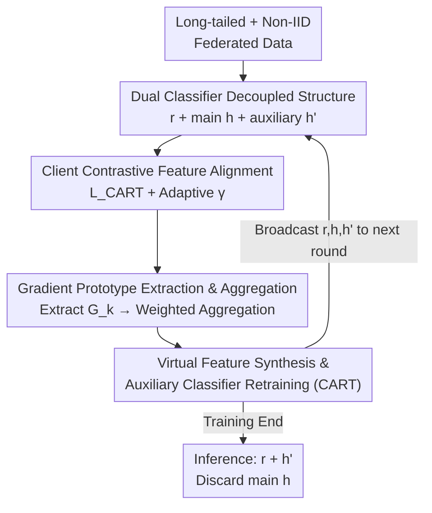

# FedCART: Tackling Long-Tailed Distributions in Federated Adversarial Training via Classifier Refinement

**Conference**: CVPR 2026  
**Paper**: [CVF Open Access](https://openaccess.thecvf.com/content/CVPR2026/html/Qin_FedCART_Tackling_Long-Tailed_Distributions_in_Federated_Adversarial_Training_via_Classifier_CVPR_2026_paper.html)  
**Code**: None  
**Area**: AI Security / Federated Learning / Adversarial Robustness  
**Keywords**: Federated Adversarial Training, Long-Tailed Distribution, Classifier Calibration, Gradient Prototype, Contrastive Feature Alignment  

## TL;DR
To address the performance collapse of Federated Adversarial Training (FAT) under long-tailed data, FedCART decomposes the global model into a "shared feature extractor + dual classifiers." Clients utilize contrastive loss to align natural and adversarial features for robustness. The server synthesizes class-balanced virtual features using aggregated gradient prototypes and retrains an auxiliary classifier for de-biasing. FedCART outperforms SOTA methods like CalFAT in both natural and robust accuracy on long-tailed variants of CIFAR, SVHN, and FMNIST.

## Background & Motivation
**Background**: Federated Learning (FL) enables multiple clients to train collaboratively without sharing raw data, yet global models remain vulnerable to adversarial attacks. Directly applying centralized Adversarial Training (AT) to the federated setting results in Federated Adversarial Training (FAT). Representative works like CalFAT mitigate client-side Non-IID by adjusting losses and adversarial sample generation according to local label distributions.

**Limitations of Prior Work**: Existing FAT methods predominantly assume a "class-balanced global distribution" (closed-world assumption), whereas real-world data often follows a long-tailed distribution. Experimental diagnosis shows that when CalFAT is shifted from a balanced to a long-tailed distribution, natural accuracy drops from 67.26% to 35.99%, and robust accuracy falls to approximately 8%, with predictions heavily biased toward head classes (classes 0–3 with >1000 samples) while tail classes are largely neglected.

**Key Challenge**: The intersection of long-tail distributions and Non-IID data creates a dual challenge for FAT. On one hand, tail class samples are scarce and concentrated in few clients, leading to divergent learned features and inconsistent local updates, which results in a "distorted and chaotic" aggregated feature space. On the other hand, the significant feature discrepancy between adversarial and natural samples further confuses a classifier already biased toward head classes. Fundamentally, **the classifier fails on features distorted by adversarial attacks and skewed by tail scarcity**.

**Goal**: To maintain both robustness and tail-class separability in FAT under long-tailed distributions without violating FL privacy (no raw data sharing).

**Key Insight**: The authors **decouple** the tasks of "learning robust features" and "learning an unbiased classifier." Feature learning is handled by clients, while classifier de-biasing is performed on the server. This prevents the feature extractor from bearing the full burden of long-tail bias correction.

**Core Idea**: Introducing a decoupled structure with a shared feature extractor and dual classifiers. Clients perform contrastive feature alignment for robustness, and the server synthesizes balanced virtual features using gradient prototypes to retrain an auxiliary classifier for calibration. Only the auxiliary classifier is used during inference.

## Method

### Overall Architecture
FedCART extends the global model $w=(r,h)$ into a "shared feature extractor $r$ + primary classifier $h$ + auxiliary classifier $h'$." Each communication round $t$ consists of two phases: **Client Local Update**—clients download the global model, train for $E$ epochs using the contrastive alignment loss $\mathcal{L}_{\text{CART}}$ to enhance robustness, extract gradient prototypes $G_k^{(t)}$ for their classes using the auxiliary classifier, and upload both the model and prototypes. **Server Global Optimization**—the server performs weighted aggregation of models and prototypes, iteratively "synthesizes" a set of class-balanced virtual features based on the aggregated prototypes, and retrains the auxiliary classifier $h'$ on these virtual features to calibrate the long-tail bias. Finally, the server broadcasts the model for the next round. Upon completion (round $T$), **inference uses only $r^{(T)}$ + auxiliary classifier $h'^{(T)}$, discarding the primary classifier $h$**.

The pipeline is a serial loop of "client feature learning → prototype upload → server balanced feature synthesis → classifier retraining." The architecture is illustrated below:

### Key Designs

**1. Dual Classifier Decoupling: Separating "Robust Features" and "Unbiased Classifiers"**

The root cause of classifier failure in long-tailed settings is the entanglement of making decisions on features that are both adversarially distorted and head-class dominated. FedCART splits the global model into a shared feature extractor $r$, a primary classifier $h$, and an auxiliary classifier $h'$. The primary classifier $h$ follows standard FAT training on clients to provide gradient signals for robust features. The auxiliary classifier $h'$ is specifically retrained on the server using class-balanced virtual features for unbiased classification. Since both share $r$, the feature extractor focuses on learning "robust and discriminative" representations without the direct pressure of long-tail de-biasing. Discarding $h$ and using $h'$ for inference ensures that training-phase bias is confined to the discarded classification head.

**2. Client Contrastive Feature Alignment: Adaptive Natural/Adversarial Feature Bridging**

Discrepancies between adversarial features $z'$ and natural features $z$ confuse the classifier. The local client objective is $\mathcal{L}_{\text{CART}} = \mathcal{L}_{\text{NAT}} + \mathcal{L}_{\text{AT}} + \gamma\,\mathcal{L}_{\text{Align}}$, where $\mathcal{L}_{\text{NAT}}$ and $\mathcal{L}_{\text{AT}}$ represent cross-entropy for natural and (PGD-generated) adversarial samples, respectively. The alignment term $\mathcal{L}_{\text{Align}}$ is a supervised contrastive loss that pulls together natural-adversarial feature pairs of the same label:

$$\mathcal{L}_{\text{Align}} = \sum_{i=1}^{2N_k}\frac{-1}{|P(i)|}\sum_{p\in P(i)}\log\frac{\exp(z_i\cdot z_p'/\tau)}{\sum_{j\in Q(i)}\exp(z_i\cdot z_j'/\tau)}$$

where $P(i)$ contains samples with label $y_i$, $Q(i)$ represents all other samples, and $\tau$ is the temperature. The weight $\gamma$ is not fixed but adaptively adjusts based on "prediction inconsistency":

$$\gamma = \iota\Big(1 - \frac{\sum_{i=1}^{N_k}\mathbb{I}(\hat{y}_i=\hat{y}_i')}{N_k}\Big)$$

The alignment strength increases when natural and adversarial predictions diverge (indicating instability) and decreases when predictions are consistent to avoid excessive regularization.

**3. Gradient Prototype Extraction & Aggregation: Transmitting Class Information via Gradient Direction**

To de-bias on the server, the server must know "what each class looks like" without accessing raw data. FedCART transmits **gradient prototypes**. Clients initialize $w_k'^{(t)}=(r^{(t)}, h'^{(t)})$ and calculate the average gradient of samples for each class $c$ on the auxiliary classifier:

$$\mathbf{g}_{k,c}^{(t)} = \frac{1}{n_k^{(c)}}\sum_{i=1}^{n_k^{(c)}}\nabla_{\mathbf{h}'}\mathcal{L}_{\text{CART}}\big(w_k'^{(t)}; x_i, x_i', y_i\big)$$

The prototype set $G_k^{(t)}=\{\mathbf{g}_{k,c}^{(t)}\}$ is uploaded. The server performs weighted aggregation to obtain global prototypes $\overline{\mathbf{g}}_c^{(t)}=\sum_{k\in A^{(t)}}\frac{N_k}{\sum N_{k'}}\mathbf{g}_{k,c}^{(t)}$. Gradient prototypes capture the "update direction" for each class. Because the averaging process is irreversible, it is difficult to reconstruct raw samples, thus providing a privacy-preserving hook for the server.

**4. Virtual Feature Synthesis & Classifier Re-training (CART): Server-side Balanced Dataset Generation**

With global gradient prototypes, the server is no longer constrained by the long-tailed distribution of real data. It **synthetically generates** a set of class-balanced virtual features $\mathcal{Z}_v^{(t)}$. An equal number of virtual features is assigned to each class, and these features are optimized via MSE so that their gradients on the auxiliary classifier match the aggregated prototypes:

$$\mathcal{L}_{\text{MSE}}(\mathcal{Z}_v^{(t)};\mathbf{h}'^{(t)},\mathcal{G}^{(t)}) = \big\|\nabla_{\mathbf{h}'}\mathcal{L}_{\text{CE}}(\mathbf{h}'^{(t)};\mathcal{Z}_v^{(t)}) - \mathcal{G}^{(t)}\big\|^2$$

Virtual features are updated for $T_V$ rounds: $\mathcal{Z}_v^{(t+1)} \leftarrow \mathcal{Z}_v^{(t)} - \hat{\eta}_a'\nabla_z\mathcal{L}_{\text{MSE}}$. Subsequently, the auxiliary classifier is retrained on this balanced virtual set for $T_R$ rounds: $\mathbf{h}'^{(t+1)} \leftarrow \mathbf{h}'^{(t)} - \hat{\eta}_r'\nabla_{\mathbf{h}'}\mathcal{L}_{\text{CE}}(\mathbf{h}'^{(t)};\mathcal{Z}_v^{(t)})$. Since the virtual features are balanced, the retrained $h'$ is no longer biased toward head classes.

### Loss & Training
- **Client Loss**: $\mathcal{L}_{\text{CART}}=\mathcal{L}_{\text{NAT}}+\mathcal{L}_{\text{AT}}+\gamma\mathcal{L}_{\text{Align}}$, with adversarial samples generated by 10-step PGD.
- **Server Phases**: Phase one involves $T_V$ iterations to update virtual features (MSE gradient alignment), followed by $T_R$ rounds of auxiliary classifier retraining (CE).
- **Default Setup**: $T=150$ communication rounds, $K=5$ participants, $E=1$ local epoch. ResNet-18 is used for CIFAR; lightweight CNNs for FMNIST/SVHN.

## Key Experimental Results

### Main Results
On four long-tailed datasets (imbalance ratio $\rho=50$, Dirichlet $\beta=0.5$), FedCART's average robust accuracy (Robust AVG, including FGSM/CW/PGD-20/AA) leads the best baseline by 1.65%~9.89%, while maintaining high natural accuracy:

| Dataset | Metric | FedCART | CalFAT | FedFAT | Gain (vs Best) |
|--------|------|---------|--------|--------|------|
| CIFAR10-LT | Natural | **66.12** | 61.25 | 40.16 | +4.87 |
| CIFAR10-LT | PGD-20 | **32.47** | 30.04 | 24.69 | +2.43 |
| CIFAR10-LT | Robust AVG | **31.71** | 25.98 | 24.71 | +5.73 |
| CIFAR100-LT | Robust AVG | **14.90** | 11.86 | 12.57 | +2.33 |
| SVHN-LT | PGD-20 | **69.29** | 62.86 | 53.03 | +6.43 |
| SVHN-LT | Robust AVG | **70.52** | 59.95 | 54.88 | +9.89 |
| FMNIST-LT | Robust AVG | **73.51** | 69.20 | 68.41 | +4.31 |

Analysis by class group (CIFAR100-LT: Majority >150 samples, Minority <45) shows FedCART's significant advantage in Medium and Minority groups, where baselines nearly fail:

| Group | Metric | FedCART | CalFAT | FedFAT |
|------|------|---------|--------|--------|
| Medium | Natural / PGD-20 | **39.51 / 15.34** | 37.35 / 13.61 | 30.81 / 10.17 |
| Minority | Natural / PGD-20 | **26.06 / 9.09** | 25.90 / 8.99 | 9.73 / 2.42 |

### Ablation Study
Ablation on CIFAR10-LT (✓ indicates enabled) confirms that every component is essential:

| Case | Configuration | Natural | PGD-20 | AA | Description |
|------|------|---------|--------|-----|------|
| 1 | W/O $\mathcal{L}_{\text{AT}}$ | 79.08 | 0.00 | 0.00 | High natural but zero robustness |
| 4 | W/O $\mathcal{L}_{\text{NAT}}$ | 49.91 | **32.54** | 26.98 | High robustness but poor natural accuracy |
| 5 | W/O $\mathcal{L}_{\text{Align}}$ | 66.04 | 29.33 | 26.12 | Align loss removal drops robustness by ~3.2 |
| 6 | W/O CART | 40.95 | 24.58 | 23.48 | Server retraining removal causes total collapse |
| 7 | W/O Auxiliary $h'$ | 49.98 | 28.30 | 25.69 | Loss of $h'$ drops both natural and robust metrics |
| Full | FedCART | 67.24 | 32.57 | 27.90 | Best balance of natural and robust accuracy |

### Key Findings
- **CART (Server Retraining) is most critical**: Removing it causes natural accuracy to plummet from 67.24% to 40.95% and AA robustness to drop from 27.90% to 23.48%, proving server-side balanced synthesis is the key to de-biasing.
- **$\mathcal{L}_{\text{AT}}$ is necessary for robustness**: Its absence results in 0% robustness despite high natural accuracy (79%), following the "natural-robust trade-off."
- **Greater advantage in severe long-tails**: As the imbalance ratio $\rho$ increases from 5 to 100, FedCART degrades more slowly than CalFAT, widening the performance gap.
- **Plug-and-play Capability**: Integrating FedCART into MART, TAET, or TRADES consistently improves natural and robust accuracy (e.g., TRADES+FedCART natural accuracy rises from 41.59% to 65.48%).

## Highlights & Insights
- **"Decouple + Discard" Logic**: Maintaining the primary classifier for gradients during training while using the auxiliary classifier for inference effectively "leaves" the bias in the discarded head, achieving de-biasing with zero extra inference cost.
- **Gradient Prototypes as Privacy-Friendly Carriers**: Transmitting gradient directions instead of features provides a hook for server-side reconstruction while remaining irreversible, a concept transferable to other FL calibration tasks.
- **Reverse Synthesis of Balanced Data on Server**: By ensuring virtual feature gradients fit aggregated prototypes, the server "creates" a balanced dataset from scratch, bypassing the inherent scarcity of tail samples.
- **Adaptive Alignment Weight $\gamma$**: Using the consistency rate of natural/adversarial predictions to dynamically adjust regularization avoids the accuracy degradation associated with "one-size-fits-all" penalties.

## Limitations & Future Work
- The work focuses exclusively on the long-tailed distribution safety issue; expansion to other threats (e.g., backdoors, privacy inference) is planned.
- **Privacy Argument**: The privacy defense is qualitative (arguing irreversibility of averaged prototypes); quantitative evaluation against gradient inversion attacks is missing.
- **Scalability**: While $K=20$ experiments were conducted, the stability and overhead of server-side synthesis in much larger cohorts with low participation rates remain to be verified.
- **Sensitivity**: Server-side operations introduce hyper-parameters like $T_V$ and $T_R$ and require additional server compute, which warrants further sensitivity analysis.

## Related Work & Insights
- **vs CalFAT**: CalFAT adjusts losses by local labels but assumes global balance. FedCART addresses global long-tails via decoupling and server-side synthesis, significantly aiding tail performance.
- **vs Standard FAT (FedPGD, TRADES, etc.)**: These methods lack long-tail handling. FedCART acts as a framework that enhances these methods when used as the client loss.
- **vs Federated Long-Tailed Learning**: Existing methods typically focus on benign settings. FedCART is reportedly the **first** to systematically address FAT under long-tailed distributions, solving "adversarial robustness" and "long-tail de-biasing" simultaneously.

## Rating
- **Novelty**: ⭐⭐⭐⭐⭐ First systematic study of FAT under long-tail distributions; the combination of decoupling and gradient prototype synthesis is insightful.
- **Experimental Thoroughness**: ⭐⭐⭐⭐ Covers 4 datasets, various $\rho/\beta$ settings, component ablation, and plug-and-play tests; privacy defense and large-scale assessment could be stronger.
- **Writing Quality**: ⭐⭐⭐⭐ Clear motivation, complete formulas, and intuitive framework.
- **Value**: ⭐⭐⭐⭐ Moves FAT toward realistic long-tail/open-world scenarios; the framework is modular and reusable for practical federated robustness.

<!-- RELATED:START -->

## Related Papers

- [\[CVPR 2026\] Fine-Tuning Impairs the Balancedness of Foundation Models in Long-tailed Personalized Federated Learning](fine-tuning_impairs_the_balancedness_of_foundation_models_in_long-tailed_persona.md)
- [\[CVPR 2026\] Taming the Long Tail: Rebalancing Adversarial Training via Adaptive Perturbation](taming_the_long_tail_rebalancing_adversarial_training_via_adaptive_perturbation.md)
- [\[CVPR 2026\] Mitigating Error Amplification in Fast Adversarial Training](mitigating_error_amplification_in_fast_adversarial_training.md)
- [\[ICML 2025\] Rethinking the Bias of Foundation Model under Long-tailed Distribution](../../ICML2025/ai_safety/rethinking_the_bias_of_foundation_model_under_long-tailed_distribution.md)
- [\[CVPR 2026\] SafeLogo: Turning Your Logos into Jailbreak Shields via Micro-Regional Adversarial Training](safelogo_turning_your_logos_into_jailbreak_shields_via_micro-regional_adversaria.md)

<!-- RELATED:END -->
