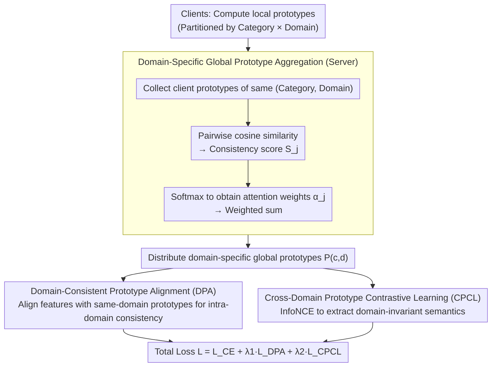

# FedDAP: Domain-Aware Prototype Learning for Federated Learning under Domain Shift

**Conference**: CVPR 2026  
**arXiv**: [2604.06795](https://arxiv.org/abs/2604.06795)  
**Code**: [GitHub](https://github.com/quanghuy6997/FedDAP)  
**Area**: AI Security  
**Keywords**: Federated Learning, Domain Shift, Prototype Learning, Contrastive Learning, Domain Awareness

## TL;DR

Ours proposes FedDAP, a domain-aware prototype federated learning framework. By constructing domain-specific global prototypes and a dual prototype alignment strategy (intra-domain alignment + cross-domain contrastive), it addresses the performance degradation of global models caused by data domain shifts across clients in federated learning.

## Background & Motivation

Federated Learning (FL) allows multiple clients to collaboratively train models without exposing private data. However, in real-world scenarios, data from different clients often originates from different domains (e.g., different sensors, environments, or image styles), resulting in significant domain shift problems.

Existing prototype-driven FL methods face two critical limitations:

**Semantic Dilution of Single Global Prototypes**: Prior works construct a single global prototype for each category by simply averaging local prototypes from all clients, ignoring domain information. When a "dog" has natural textures in a photo domain but simplified lines in a sketch domain, the averaged prototype fails to accurately represent either domain.

**Domain-Agnostic Alignment Strategies**: These methods force all clients to align features with the same global prototype regardless of the domain source. Such domain-agnostic supervision ignores the semantic discrepancies between local distributions and global prototypes.

## Method

### Overall Architecture

The FedDAP framework consists of three stages:
1. Clients compute local prototypes and upload them to the server.
2. The server constructs domain-specific global prototypes for each (category, domain) pair through a cosine similarity-based weighted fusion mechanism.
3. Clients download global prototypes and perform local training using a dual prototype alignment strategy.

### Key Designs

**1. Domain-Specific Global Prototype Aggregation: Expanding Prototypes from "Category" to "Category × Domain"**

Legacy prototype FL constructs only one global prototype per category by simply averaging all local prototypes. This results in prototypes that represent no domain well when features differ significantly (e.g., photo vs. sketch). FedDAP instead builds independent prototypes for each (class, domain) pair. The server collects all client prototypes belonging to the same domain and category, calculates pairwise cosine similarity consistency scores $S_j$, and normalizes them via softmax to obtain attention weights $\alpha_j$. The domain-specific global prototype $\mathbf{P}^{(c,d)}$ is then formed by weighted summation, with temperature $\tau_{agg}$ controlling weight sharpness. This ensures that semantically consistent prototypes are emphasized while outliers are weakened.

**2. Domain-Consistent Prototype Alignment (DPA): Stabilizing Intra-Domain Consistency**

Forcing clients to align with a single global prototype ignore discrepancies between local distributions and global semantics. DPA only aligns client local features with prototypes from the **same domain** using a cosine similarity loss $\mathcal{L}_{DPA} = \sum_{c}(1 - \cos(z_i^c, \mathbf{P}^{(c,d_m)}))$. This ensures semantic consistency with class-specific and domain-related prototypes and provides robustness to scale variance. Ablation studies show that DPA provides significantly higher gains than CPCL when domain discrepancies are large (e.g., Office-10), indicating that intra-domain alignment is the foundation of stability.

**3. Cross-Domain Prototype Contrastive Learning (CPCL): Inducing Domain-Invariant Semantics**

Aligning only within domains can trap representations in their respective domains, leading to poor cross-domain generalization. CPCL introduces prototypes from other domains as contrasts: positive samples are prototypes of the same class from other domains, while negative samples are prototypes of different classes from other domains. Using InfoNCE, features are pulled toward cross-domain intra-class prototypes and pushed away from cross-domain inter-class prototypes, thereby learning domain-invariant semantic representations. DPA handles stability while CPCL handles generalization; the two are complementary.

### Loss & Training

The total loss function is a weighted combination of three terms:
$$\mathcal{L} = \mathcal{L}_{CE} + \lambda_1 \mathcal{L}_{DPA} + \lambda_2 \mathcal{L}_{CPCL}$$

- $\mathcal{L}_{CE}$: Standard cross-entropy classification loss.
- $\lambda_1 = 10$: Weight for intra-domain alignment (higher values help stabilize domain-specific prototypes).
- $\lambda_2 = 1$: Weight for cross-domain contrast (excessive values may over-regularize and destroy domain-specific structures).
- Communication rounds: 100, with 10 local epochs per round.

## Key Experimental Results

### Main Results

| Dataset | Metric | FedDAP | FedPLVM | FedRDN | FedAvg | Gain (vs FedAvg) |
|--------|------|--------|---------|--------|--------|----------------|
| DomainNet | Avg Acc | **65.20** | 62.22 | 61.01 | 59.59 | +5.61 |
| Office-10 | Avg Acc | **72.53** | 68.77 | 65.54 | 57.47 | +15.06 |
| PACS | Avg Acc | **84.63** | 82.06 | 83.17 | 77.07 | +7.56 |

### Ablation Study

| Configuration (DPA / CPCL) | DomainNet | Office-10 | PACS |
|-------------------|-----------|-----------|------|
| ✗ / ✗ (FedAvg) | 59.59 | 57.47 | 77.07 |
| ✗ / ✓ | 62.86 | 62.18 | 81.87 |
| ✓ / ✗ | 62.61 | 68.53 | 78.74 |
| ✓ / ✓ (Full) | **65.20** | **72.53** | **84.63** |

### Key Findings

1. **Components are complementary and necessary**: DPA improves performance through intra-domain consistency, while CPCL improves generalization through cross-domain contrast. The combination achieves the best results. Notably, DPA's gain on Office-10 (+11.06) is much larger than CPCL's (+4.71), suggesting intra-domain alignment is critical when domain gaps are significant.
2. **Domain-specific aggregation vs. simple averaging**: Using weighted fusion based on cosine similarity improves performance by 1.05%/1.04%/1.41% over simple averaging. Even with simple averaging, domain-aware prototypes significantly outperform domain-agnostic ones.
3. **Faster Convergence**: Across three datasets, FedDAP achieves higher accuracy within fewer communication rounds.
4. **Cross-Domain Generalization**: Under leave-one-domain-out evaluation, FedDAP leads the second-best method by +1.88% and +1.17% on DomainNet and Office-10, respectively.
5. **t-SNE Visualization**: Compared to the feature dispersion and overlap in FedProto, FedDAP produces more compact and better-separated category clusters.

## Highlights & Insights

- The core design concept is clear: expanding the prototype space from 1D (category) to 2D (category × domain) is a natural and effective way to handle domain shift in FL.
- The philosophy of the dual alignment strategy is noteworthy: intra-domain alignment maintains stability, while cross-domain contrast enhances generalization.
- Weighted fusion via cosine similarity outperforms simple averaging, but the improvement is modest (~1%), suggesting that the construction of domain-specific prototypes itself is more critical than the aggregation method.

## Limitations & Future Work

- It assumes that domain labels for each client are known (requires a domain identifier $d$); implicit domain shift scenarios would require additional domain discovery mechanisms.
- The number of domains $D$ must be predefined, which may not apply to real-world scenarios with fuzzy domain boundaries.
- Experiments were only validated on image classification and were not extended to more complex vision tasks like detection or segmentation.
- Insufficient scalability analysis regarding the number of clients (tested up to 20 clients).
- Prototype communication introduces additional bandwidth overhead, which was not quantitatively analyzed.

## Related Work & Insights

- FedProto first introduced prototypes to FL but used domain-agnostic single global prototypes.
- FedPLVM and FPL improved prototype quality but still ignored domain information.
- FedRDN (CVPR'25) is a recent domain-shift FL method, but it is outperformed by FedDAP in these experiments.
- Difference from domain generalization methods (COPA, FedGA): FedDAP directly models domain-specific semantic structures rather than solely learning domain-invariant representations.

## Rating

- Novelty: ⭐⭐⭐⭐ (Domain-specific prototypes + dual alignment strategy is a meaningful extension of prototype FL)
- Experimental Thoroughness: ⭐⭐⭐⭐ (3 datasets, extensive ablation studies, and parameter analysis)
- Writing Quality: ⭐⭐⭐⭐ (Clear structure and well-articulated motivation)
- Value: ⭐⭐⭐⭐ (Strong practicality, open-source code, and significant relevance to FL domain shift issues)

<!-- RELATED:START -->

## Related Papers

- [\[CVPR 2026\] Domain-Skewed Federated Learning with Feature Decoupling and Calibration](domain-skewed_federated_learning_with_feature_decoupling_and_calibration.md)
- [\[ICML 2026\] FedHPro: Federated Hyper-Prototype Learning via Gradient Matching](../../ICML2026/ai_safety/fedhpro_federated_hyper-prototype_learning_via_gradient_matching.md)
- [\[CVPR 2026\] Federated Active Learning Under Extreme Non-IID and Global Class Imbalance](federated_active_learning_extreme_noniid.md)
- [\[CVPR 2026\] Frequency-domain Manipulation for Face Obfuscation](frequency-domain_manipulation_for_face_obfuscation.md)
- [\[CVPR 2026\] FedRE: A Representation Entanglement Framework for Model-Heterogeneous Federated Learning](fedre_a_representation_entanglement_framework_for_model-heterogeneous_federated_.md)

<!-- RELATED:END -->
