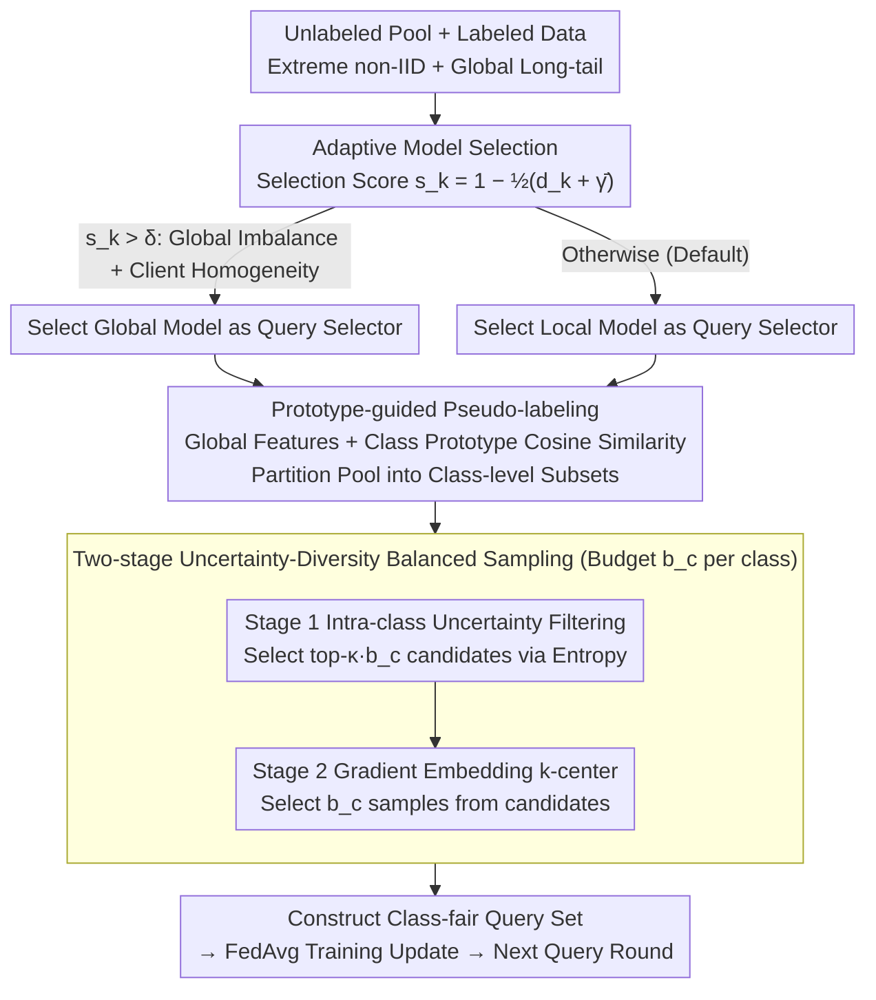

# Federated Active Learning Under Extreme Non-IID and Global Class Imbalance

**Conference**: CVPR 2026  
**arXiv**: [2603.10341](https://arxiv.org/abs/2603.10341)  
**Code**: [GitHub](https://github.com/chenchenzong/FairFAL)  
**Area**: AI Safety  
**Keywords**: Federated Learning, Active Learning, non-IID, Class Imbalance, query selection, class-fair sampling, prototype-guided

## TL;DR

This work systematically analyzes the impact of global class imbalance and client heterogeneity on query model selection in Federated Active Learning (FAL). Based on three core Observations, it proposes FairFAL—a class-fair FAL framework featuring adaptive query model selection, prototype-guided pseudo-labeling, and two-stage uncertainty-diversity balanced sampling, consistently outperforming all baselines across five benchmark datasets.

## Background & Motivation

- **Background**: Federated Learning (FL) enables collaborative training without sharing raw data, while Active Learning (AL) reduces annotation costs through selective labeling. Federated Active Learning (FAL) combines both—decentralized clients collaboratively identify the most valuable samples to label under privacy constraints. This is crucial in fields with expensive labeling and sensitive data, such as medical imaging and autonomous driving.
- **Limitations of Prior Work**: Existing FAL research has blind spots in three areas: (1) client heterogeneity is treated only as a data partitioning issue, implicitly assuming a balanced global class distribution; (2) there is a lack of systematic selection criteria for the two inherent query models in FAL (global aggregated model vs. local model); (3) under conditions of global long-tail distributions combined with extreme non-IID data, existing sampling strategies systematically bias towards head classes—recent methods like LoGo, KAFAL, and IFAL do not explicitly handle global imbalance. IFAL even underperforms random sampling on CIFAR-100 with $\rho=20$ (26.82 vs. 27.44).
- **Key Challenge**: In FAL, global models possess better feature representations (via cross-client aggregation) but often lose discriminative power in uncertainty sampling due to over-smoothed predictions. Local models are more sensitive to client-specific decision boundaries, but their sampling reflects long-tail skew when global imbalance is high. The relative advantage of the two models depends on the combination of global imbalance $\rho$ and client heterogeneity $\alpha$, which cannot be simply fixed.
- **Goal**: Design an FAL framework capable of adaptively selecting the query model and explicitly promoting class-fair sampling under the challenging setting of extreme non-IID ($\alpha=0.1$) and global long-tail distribution ($\rho=20$).
- **Key Insight**: Starting from systematic empirical analysis—comparing the sampling behavior of global/local models under different $(\alpha, \rho)$ combinations on CIFAR-10 using AULC, Wilcoxon tests, and Hodges-Lehmann effect sizes—three Observations are derived to guide the design of each component.
- **Core Idea**: Class-balanced sampling capability (especially the acquisition of minority classes) is the most consistent predictor of FAL performance, proving more critical than uncertainty or diversity alone.

## Method

### Overall Architecture

FairFAL addresses a specific scenario: client data is extremely non-IID ($\alpha=0.1$) and the global class distribution is long-tailed ($\rho=20$). It identifies which model and strategy to use through three Observations derived from empirical analysis. The framework functions on top of standard FedAvg, executing three components during each query round: **Adaptive Model Selection** to choose between global or local selectors, **Prototype-guided Pseudo-labeling** to partition the unlabeled pool into class-level subsets, and **Two-stage Balanced Sampling** to select high-information, non-redundant samples within each class. After querying, federated training proceeds as usual.

### Key Designs

**1. Adaptive Model Selection: Allowing each client to judge the credibility of global vs. local models**

FAL naturally provides two query selectors—the global model and the local model—but prior work either fixes one or lacks systematic criteria. Observation 1 indicates that local models are generally better for uncertainty sampling (aggregation of local diversity naturally forms a balanced query set), except when global imbalance is high and clients are homogeneous. FairFAL quantifies this using two scalars. First, the **global class imbalance ratio $\gamma_k$**: in the first AL round (randomly sampled, approx. IID), a balanced subset $\mathcal{B}^{(k)}$ is up-sampled, and the global model's softmax prior $\hat{\pi}_g^{(k)}$ is used to compute $\gamma_k = \min_c \hat{\pi}_{g,c} / \max_c \hat{\pi}_{g,c} \in (0,1]$. The server averages these to $\bar{\gamma}$. Second, the **local-global divergence $d_k$** measures prediction differences on the balanced subset:

$$d_k = \frac{1}{C}\sum_c \frac{|\hat{\pi}_{g,c} - \hat{\pi}_{\ell,c}^{(k)}|}{\hat{\pi}_{g,c} + \hat{\pi}_{\ell,c}^{(k)}} \in [0,1]$$

The selection score is $s_k = 1 - \tfrac{1}{2}(d_k + \bar{\gamma})$. If $s_k > \delta = 0.75$, the global model is used; otherwise, the local model is chosen.

**2. Prototype-guided Pseudo-labeling: Categorizing unlabeled samples in feature space to avoid long-tail bias**

To perform class-balanced sampling, one must know the "class" of unlabeled samples. Since long-tail classifiers' decision boundaries bias towards head classes, logit-based classification often mislabels tail samples. FairFAL uses the global model's feature extractor $\phi^g(\cdot)$ to extract L2-normalized features $\mathbf{z}_i^{(k)}$. Class prototypes $\boldsymbol{\mu}_c^{(k)}$ are computed as the mean features of labeled samples. Pseudo-labels are assigned via cosine similarity $\hat{y}^{(k)}(x) = \arg\max_c \langle \mathbf{z}^{(k)}(x), \boldsymbol{\mu}_c^{(k)} \rangle$, partitioning the pool into class subsets $\tilde{\mathcal{D}}_{U,c}^{(k)}$.

**3. Two-stage Uncertainty-Diversity Balanced Sampling: Prioritizing information then removing redundancy**

Given class-level subsets and a uniform budget $b_c$, simply picking the top $b_c$ samples by entropy can lead to redundancy. **Stage 1 (Intra-class Uncertainty Filtering)**: Use the selected query model to calculate entropy and select top-$\kappa \cdot b_c$ candidates ($\kappa=4$). **Stage 2 (Gradient Embedding k-center)**: Compute gradient embeddings $\mathbf{g}^{(k)}(x) = \psi(x; \phi^g, f^g)$ using the global model and apply greedy $k$-center to pick $b_c$ samples from the candidates, maximizing coverage and minimizing radius.

### Loss & Training

Standard FedAvg framework: 100 communication rounds, 5 local epochs. 4-layer CNN backbone, SGD (momentum=0.9, weight decay=1e-5, batch size=64), learning rate 0.01 with 10x decay after 75 rounds. FAL consists of 9 query rounds: 5% initial random labels, followed by 5% per query round. 10 clients, Dirichlet partition ($\alpha=0.1$ or $100$), global imbalance ratio $\rho=20$. Results averaged over 5 seeds.

## Key Experimental Results

### Main Results

**Natural Image Datasets ($\alpha = 0.1, \rho = 20$, Test Accuracy % of the last round)**:

| Method | Type | FMNIST | CIFAR-10 | CIFAR-100 |
|------|------|--------|----------|-----------|
| Random | Baseline | 85.60 | 55.70 | 27.44 |
| Entropy | Uncertainty | 86.28 | 57.18 | 27.44 |
| BADGE | Hybrid | 86.65 | 58.20 | 27.39 |
| Coreset | Diversity | 86.15 | 57.63 | 27.81 |
| KAFAL | FAL | 87.05 | 60.01 | 27.84 |
| LoGo | FAL | 86.98 | 59.68 | 27.95 |
| IFAL | FAL | 86.80 | 57.51 | 26.82 |
| **Ours** | **FAL** | **87.37** | **60.44** | **29.20** |

**Medical Datasets ($\alpha = 0.1$, Natural Long-tail distribution)**:

| Method | OctMNIST | DermaMNIST |
|------|----------|------------|
| Random | 68.30 | 72.32 |
| KAFAL | 70.40 | 73.27 |
| LoGo | 70.00 | 73.62 |
| IFAL | 68.40 | 72.97 |
| **Ours** | **72.80** | **73.77** |

### Ablation Study

**Incremental Component Addition (CIFAR-10, Accuracy %)**:

| Configuration | ($\alpha$=0.1, $\rho$=20) | ($\alpha$=100, $\rho$=20) |
|------|---------------------------|--------------------------|
| Model Selection $\mathcal{M}^{(k)}$ only | 59.33 | 63.65 |
| Opposite Selection $\tilde{\mathcal{M}}^{(k)}$ | 58.49 | 61.89 |
| + Local Prototype | 59.14 | 63.39 |
| + Global Prototype | 59.95 | 64.02 |
| + Two-stage $\kappa=2$ | 60.61 | 64.60 |
| **+ Two-stage $\kappa=4$ (Final)** | **60.44** | **64.57** |

**Statistical Analysis of Query Selectors (Hodges-Lehmann Effect Size, pp)**:

| ($\alpha$, $\rho$) | Entropy Winner | Entropy HL (pp) | Coreset Winner | Coreset HL (pp) |
|-----|---------|--------|---------|--------|
| (0.1, 1) | Local | 201 | Global | 28 |
| (100, 20) | **Global** | **106** | **Global** | **92** |

### Key Findings

- **Adaptive selection is effective**: $\mathcal{M}^{(k)}$ consistently outperforms the opposite choice across different heterogeneity levels.
- **Global Proto > Local Proto** (59.95 vs. 59.14): Global models provide cleaner class separation in feature space.
- **Insensitivity to parameters**: Performance is stable across $\kappa \in [2, 4]$ and $\delta \in [0.65, 0.85]$.
- **Framework Agnostic**: Consistently superior across FedProx and SCAFFOLD.
- **IFAL Performance Drop**: Lack of class-balancing causes IFAL to fall below Random sampling on CIFAR-100.

## Highlights & Insights

- The core insight is clear: Class-balanced sampling capability is a more consistent performance predictor in FAL than uncertainty or diversity.
- The derivation from three Observations provides a strong logical foundation for each component.
- Prototype-guided labeling avoids decision boundary bias in long-tail scenarios by operating in the feature space.
- Privacy is preserved by only uploading the scalar $\gamma_k$.
- Use of rigorous statistical tools (AULC, Wilcoxon, Hodges-Lehmann) reinforces empirical claims.

## Limitations & Future Work

- Adaptive selection uses hard switching ($s_k > \delta$); soft weighting/mixture is not explored.
- Uniform budget allocation ($b_c$) might be sub-optimal; dynamic allocation for tail classes could be investigated.
- Evaluation is limited to 4-layer CNNs; applicability to deeper architectures like Vit/ResNet-50 or tasks like segmentation is unknown.
- Global imbalance $\bar{\gamma}$ is fixed after the first round and does not evolve with the active selection process.

## Related Work & Insights

- **vs LoGo (CVPR'23)**: Uses local clustering and global uncertainty but lacks explicit class-fair mechanisms.
- **vs KAFAL (ICCV'23)**: Uses global-local prediction discrepancies, but discrepancy does not necessarily correlate with minority classes.
- **vs IFAL**: Demonstrates that without class-balancing, FAL can underperform random sampling in complex long-tail scenarios.
- The study shifts the focus of FAL challenges from pure privacy constraints to the compound problem of "dual-model selection + global imbalance."

## Rating

- Novelty: ⭐⭐⭐⭐ Framework design follows systematic observations; methodology is highly logical.
- Experimental Thoroughness: ⭐⭐⭐⭐⭐ 5 datasets, 11 baselines, and extensive ablations across parameters and FL frameworks.
- Writing Quality: ⭐⭐⭐⭐⭐ Observation-driven structure is very clear with solid statistical backing.
- Value: ⭐⭐⭐⭐ Provides direct guidance for the FAL community with generalized insights.

<!-- RELATED:START -->

## Related Papers

- [\[CVPR 2026\] FedDAP: Domain-Aware Prototype Learning for Federated Learning under Domain Shift](feddap_domain-aware_prototype_learning_for_federated_learning_under_domain_shift.md)
- [\[CVPR 2025\] Geometric Knowledge-Guided Localized Global Distribution Alignment for Federated Learning](../../CVPR2025/ai_safety/geometric_knowledge-guided_localized_global_distribution_alignment_for_federated.md)
- [\[CVPR 2026\] FedAFD: Multimodal Federated Learning via Adversarial Fusion and Distillation](fedafd_multimodal_federated_learning_via_adversarial_fusion_and_distillation.md)
- [\[CVPR 2026\] Domain-Skewed Federated Learning with Feature Decoupling and Calibration](domain-skewed_federated_learning_with_feature_decoupling_and_calibration.md)
- [\[ICML 2026\] Active Continual Learning with Metaplastic Binary Bayesian Neural Networks](../../ICML2026/ai_safety/active_continual_learning_with_metaplastic_binary_bayesian_neural_networks.md)

<!-- RELATED:END -->
