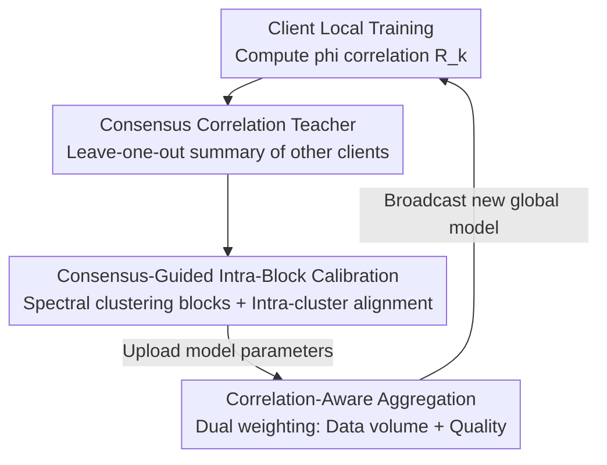

# FedHarmony: Harmonizing Heterogeneous Label Correlations in Federated Multi-Label Learning

**Conference**: CVPR 2026  
**arXiv**: [2604.28024](https://arxiv.org/abs/2604.28024)  
**Code**: None  
**Area**: Federated Learning / Multi-Label Learning / Privacy Protection  
**Keywords**: Federated Multi-Label Learning, Label Correlation Drift, Consensus Correlation, Correlation-Aware Aggregation, Intra-Block Optimization

## TL;DR
To address the issue in Federated Multi-Label Learning (FedMLL) where clients observe only local label spaces and generate conflicting label correlations (Label Correlation Drift), FedHarmony utilizes "Consensus Correlation" from the majority of clients as a global teacher to correct local training biases. Furthermore, it weights clients during server aggregation based on both data volume and correlation quality. It consistently outperforms existing SOTA on three non-IID federated benchmarks: FLAIR, COCO-80, and VOC2007 (e.g., +11.4 mAP on FLAIR).

## Background & Motivation
**Background**: The core of Multi-Label Learning (MLL) is modeling label co-occurrence (e.g., "street" often appears with "buildings" and "pedestrians"). Recent works using GCNs or Transformers to explicitly encode label relationships have significantly improved predictions. Privacy requirements have pushed MLL toward Federated Learning (FedMLL), where multiple clients collaboratively train models on private data without sharing raw samples, aiming to reconstruct the global label dependency structure from decentralized data.

**Limitations of Prior Work**: This goal is difficult to achieve under heterogeneous data distributions. The authors identify two specific issues. First, label co-occurrence frequencies vary drastically across clients; for instance, on FLAIR, "outdoor" and "equipment" frequently co-occur for Client 1 but rarely for Client 2. Since each client observes only a subset of the label space, local correlations are inherently biased and deviate from the global ground truth. The authors term this phenomenon **label correlation drift**. Second, existing methods (e.g., FedAvg family) aggregate weights solely based on training data volume, ignoring the quality of learned correlations. Consequently, a client with large amounts of data but poorly learned correlations may receive excessive weight, degrading the global model.

**Key Challenge**: No single client can grasp the true label relationships, but correlations agreed upon by the majority of clients are more likely to reflect the underlying global semantics. Existing aggregation mechanisms neither correct local biases nor distinguish client quality.

**Goal**: (1) Ensure locally learned label correlations continuously align with global consensus during training; (2) Enable the server to identify and prioritize clients with high-quality correlation learning during aggregation.

**Key Insight**: Grounded in the "group consensus" hypothesis—for any target client, the correlation matrices of all other clients can be summarized into a "Consensus Correlation" representing the global perspective that the target client lacks.

**Core Idea**: Use "Leave-one-out Consensus Correlation" as a global teacher to correct local deviations, and apply dual-weighting (data volume + correlation quality) during aggregation to harmonize heterogeneous label correlations at the source.

## Method

### Overall Architecture
FedHarmony follows a standard "Client Local Training $\leftrightarrow$ Server Aggregation" federated cycle but incorporates label correlation processing at both ends. In each communication round: clients first score local data using the current model to estimate a $C\times C$ $\phi$ correlation matrix $R_k^{(t)}$ and upload it; the server uses a "leave-one-out" approach to aggregate correlations from all other clients into a specific **Consensus Correlation** $R_{\exp,k}^{*(t)}$ for each client; the client uses this as a teacher for **Consensus-Guided Intra-Block Calibration** of its local correlations; finally, the server performs **Correlation-Aware Aggregation**, weighting clients by both data volume and the quality of their correlation learning.

### Key Designs

**1. Consensus Correlation Teacher: Using majority consensus as a global perspective to correct local bias**

The target client $k$ in round $t$ uses the current model $f_k$ to score local data, obtaining $F_k^{(t)}\in[0,1]^{N_k\times C}$ (soft label probabilities). From this, marginal probabilities $\hat p_{k,c}$ and joint probabilities $\hat p_{k,cc'}$ are estimated to calculate the $\phi$-type correlation coefficients:

$$R_{k,cc'}^{(t)}=\frac{\hat p_{k,cc'}^{(t)}-\hat p_{k,c}^{(t)}\hat p_{k,c'}^{(t)}}{\sqrt{\hat p_{k,c}^{(t)}(1-\hat p_{k,c}^{(t)})\,\hat p_{k,c'}^{(t)}(1-\hat p_{k,c'}^{(t)})}+\varepsilon}$$

The teacher $R_{\exp,k}^{*(t)}$ is generated using a leave-one-out operator $\mathcal{A}_t$ on $\{R_j^{(t)}\}_{j\neq k}$. This is effective because while no single client knows the truth, consensus among the majority is likely accurate. The "leave-one-out" mechanism prevents a client from poisoning its own teacher.

**2. Consensus-Guided Intra-Block Calibration: Aligning high-correlation clusters for efficiency and accuracy**

Instead of aligning the entire $C\times C$ matrix, which is computationally expensive and noisy, the authors observe that the label correlation matrix is **sparse and approximately block-structured**. They partition the matrix into $G$ approximately low-rank sub-blocks for intra-cluster alignment:

$$\mathcal{L}^{\mathrm{align}}_{i,t}=\lambda\sum_{g=1}^{G}\Psi\!\Big(R_i^{(t)}[\mathcal{S}_g,\mathcal{S}_g],\,R_{\exp,i}^{*(t)}[\mathcal{S}_g,\mathcal{S}_g]\Big)$$

Clustering is performed via spectral clustering on the consensus correlation $R_{\exp}^{*}$. Theorem 2.1 proves that intra-cluster alignment increases the curvature from $\gamma_{\mathrm{out}}$ to $\gamma_{\mathrm{in}}$ ($\gamma_{\mathrm{in}}\gg\gamma_{\mathrm{out}}$), leading to faster linear convergence. Theorem 2.2 proves that the loss from ignoring cross-cluster terms is bounded and negligible when the consensus is approximately block-diagonal.

**3. Correlation-Aware Aggregation: Trusting volume early and quality late**

To prevent over-weighting clients with high volume but poor correlations, the quality score for client $i$ is calculated as $q_i^{(t)}=\exp(-\gamma s_i^{(t)})$, where $s_i^{(t)}$ is the discrepancy from the consensus. Normalized data volume $\bar n_i$ and normalized quality $\bar q_i^{(t)}$ are blended via a time-decaying coefficient $\alpha^{(t)}=\max(0,1-t/T_0)$:

$$w_i^{(t)}=\alpha^{(t)}\,\bar n_i+(1-\alpha^{(t)})\,\bar q_i^{(t)}$$

Early in training ($\alpha\approx 1$), the weights follow FedAvg to stabilize training. Later ($\alpha\downarrow 0$), clients with well-aligned correlations dominate aggregation to prevent global model contamination.

### Loss & Training
Local classification utilizes Binary Cross-Entropy, supplemented by the intra-block alignment loss $\mathcal{L}^{\mathrm{align}}_{i,t}$. The backbone is ViT-B/16 with $C$-way sigmoid heads. Each round involves 5 local epochs using Adam ($lr=10^{-4}$, batch size 16) for a total of $T=50$ rounds. Non-uniform client sampling proportional to local data volume is used for skewed datasets like FLAIR. Training was conducted on 8 RTX 4090 GPUs.

## Key Experimental Results

### Main Results
FedHarmony achieves superior performance across all 8 metrics on three non-IID federated multi-label benchmarks. On FLAIR, its mAP is over 11 points higher than the strongest baseline.

| Dataset | Metric | FedHarmony | Prev. SOTA | Gain |
|--------|------|-----------|-------------|------|
| FLAIR | mAP | **51.0** | 39.6 (FedProx) | +11.4 |
| FLAIR | OF1 | **75.1** | 65.8 (FedProx) | +9.3 |
| COCO-80 | mAP | **71.4** | 64.5 (FedLGT) | +6.9 |
| VOC2007 | mAP | **86.9** | 78.3 (FedRDN) | +8.6 |
| VOC2007 | O-mAP | **89.1** | 72.2 (FedRDN) | +16.9 |

Note: Some baselines failed on specific datasets (e.g., FedNova mAP of 4.3 on COCO-80), while FedHarmony maintained stability under severe non-IID conditions.

### Ablation Study
Table 5 (COCO-80 and FLAIR mAP), where Base = FedAvg, A = Expert-Guided Correlation Loss (ECL), and B = Correlation-Aware Aggregation (CAA).

| Configuration | COCO-80 mAP | FLAIR mAP | Note |
|------|-------------|-----------|------|
| Base (FedAvg) | 63.4 | 35.4 | Pure parameter averaging |
| +A (ECL) | 69.5 | 46.4 | Consensus teacher correction (+11.0 on FLAIR) |
| +A+B (ECL+CAA) | **71.2** | **47.0** | Adding quality-aware aggregation (+0.6~1.7) |

Intra-block Optimization (C) Impact: There is no significant difference in accuracy (Wilcoxon $p > 0.05$ on all datasets, e.g., 0.382 for COCO). However, training efficiency improved significantly—at round 10, cumulative training time decreased by 28.3% for FLAIR and 31.7% for VOC2007.

### Key Findings
- The Consensus Correlation Teacher (A) is the primary contributor, increasing FLAIR mAP from 35.4 to 46.4, demonstrating that correcting label correlation drift is more critical than parameter averaging.
- Correlation-Aware Aggregation (B) provides a consistent stability gain (+0.6~1.7) by prioritizing high-quality clients.
- Intra-block Optimization (C) is a pure efficiency enhancement, saving ~30% of training time with no significant loss in performance.
- Qualitatively, FedHarmony reconstructs correlation matrices closest to ground truth (e.g., equipment–material relation 0.43 vs. GT 0.42).

## Highlights & Insights
- **"Leave-one-out Consensus" is ingenious**: It leverages the collective intelligence of other clients to create a global perspective without requiring extra labels or risking self-contamination.
- **Turning "Sparse Block Structure" priors into provable acceleration**: Deriving faster convergence from the block-diagonal observation provides a rare and complete bridge from observation to theory to 30% time savings.
- **Dynamic Scheduling of Weights**: The strategy of transitioning from volume-based to quality-based weights ($\alpha^{(t)}$ annealing) is a transferable insight for any federated task where early local estimates are unreliable.

## Limitations & Future Work
- The "majority as truth" assumption might fail if the majority of clients share a systematic bias rather than random noise.
- Aggregation quality scores $q_i$ assume honest reporting by clients; malicious clients could manipulate their scores to hijack the global model.
- Hyperparameters like cluster count $G$ and transition round $T_0$ require tuning. Block optimization primarily benefits efficiency rather than precision, with diminishing returns on small label sets.
- Experiments were limited to vision multi-label tasks (up to 1628 labels) and ViT backbones; verification on larger label spaces or other modalities (NLP/Medical) is missing.

## Related Work & Insights
- **vs FedAvg / FedProx**: These perform parameter averaging and ignore label correlations, whereas FedHarmony explicitly aligns correlation structures.
- **vs FedCurv / SphereFed**: Geometry-based curvature correction is insufficient for resolving semantic inconsistencies caused by heterogeneous label dependencies.
- **vs FedLGT / FedRDN**: FedHarmony treats correlation alignment as a more robust inductive bias, providing better stability under extreme non-IID settings.

## Rating
- Novelty: ⭐⭐⭐⭐ Systematic study of "label correlation drift" in FedMLL with a creative consensus teacher solution.
- Experimental Thoroughness: ⭐⭐⭐⭐ Extensive benchmarks and efficiency tests, though hyperparameter sensitivity is not fully explored.
- Writing Quality: ⭐⭐⭐⭐ Clear motivation and strong alignment between theory and method.
- Value: ⭐⭐⭐⭐ Provides a practical and theoretically grounded harmonization scheme for federated multi-label collaborative learning.

<!-- RELATED:START -->

## Related Papers

- [\[CVPR 2025\] Infighting in the Dark: Multi-Label Backdoor Attack in Federated Learning](../../CVPR2025/ai_safety/infighting_in_the_dark_multi-label_backdoor_attack_in_federated_learning.md)
- [\[CVPR 2026\] FedRE: A Representation Entanglement Framework for Model-Heterogeneous Federated Learning](fedre_a_representation_entanglement_framework_for_model-heterogeneous_federated_.md)
- [\[AAAI 2026\] Rethinking Target Label Conditioning in Adversarial Attacks: A 2D Tensor-Guided Generative Approach](../../AAAI2026/ai_safety/rethinking_target_label_conditioning_in_adversarial_attacks_a_2d_tensor-guided_g.md)
- [\[CVPR 2026\] FedDAP: Domain-Aware Prototype Learning for Federated Learning under Domain Shift](feddap_domain-aware_prototype_learning_for_federated_learning_under_domain_shift.md)
- [\[CVPR 2026\] FedAFD: Multimodal Federated Learning via Adversarial Fusion and Distillation](fedafd_multimodal_federated_learning_via_adversarial_fusion_and_distillation.md)

<!-- RELATED:END -->
