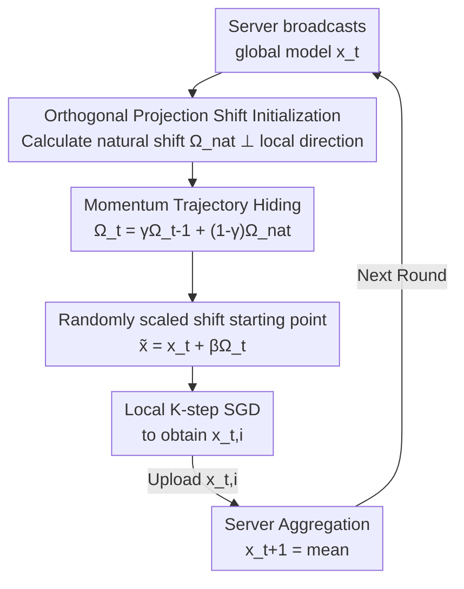

# FedMOP: Achieving Enhanced Privacy and Performance in Federated Learning via Momentum Orthogonal Projection

**Conference**: CVPR 2026  
**Paper**: [CVF Open Access](https://openaccess.thecvf.com/content/CVPR2026/html/Zhao_FedMOP_Achieving_Enhanced_Privacy_and_Performance_in_Federated_Learning_via_CVPR_2026_paper.html)  
**Code**: https://github.com/zyl123456aB/FedMOP  
**Area**: AI Security / Federated Learning Privacy  
**Keywords**: Gradient Leakage Attack, Federated Learning, Orthogonal Projection, Momentum Hiding, Privacy-Performance Trade-off

## TL;DR
FedMOP applies a "momentum-evolved orthogonal shift" to the initial model **before** the start of each client's local training. The orthogonal component offsets non-IID drift to enhance performance, while momentum evolution transforms the shift vector into a $(d+t)$-dimensional intractable inverse problem for attackers to protect privacy. This marks the first time "stronger privacy" and "higher accuracy" are achieved simultaneously rather than through mutual sacrifice.

## Background & Motivation
**Background**: Federated Learning (FL) enables multiple clients to train models collaboratively by uploading only gradients or model updates without sharing raw data. However, Gradient Leakage Attacks (GLA) have demonstrated that a malicious server can reconstruct a client's private training samples by matching a "dummy image's" synthetic gradient to the observed real gradient: $\min_z \lVert \nabla F_i(x_t,z) - g_{t,i} \rVert^2$. This poses a severe risk in sectors like healthcare and finance.

**Limitations of Prior Work**: Mainstream defenses—such as Differential Privacy (adding Gaussian noise), gradient compression, and secure aggregation—all rely on "destroying gradient information" to gain privacy, at the cost of reduced accuracy, slower convergence, or massive encryption overhead. Meanwhile, standard FL inherently suffers from local drift on non-IID data (where heterogeneous distributions cause local updates to deviate from the global optimum), leading to slow convergence. Existing acceleration methods (e.g., FedProx, Scaffold) focus solely on performance and ignore privacy. Thus, privacy and performance appear to be **inherently opposed**.

**Key Challenge**: Almost all defenses modify the "gradient/training process," which inevitably damages the effective information used for learning. The authors' key insight is: can we **avoid touching the training process itself** and only modify the "starting point" for each client's training?

**Goal**: To find an offset applied to the initial model that carries global statistical information in one dimension (correcting drift $\rightarrow$ improving performance) while remaining uncomputable to an attacker in another "orthogonal" dimension ($\rightarrow$ protecting privacy), such that the two objectives do not interfere or even reinforce each other.

**Core Idea**: Construct an offset perpendicular to the local training direction using **gradient orthogonal projection** (correcting drift without disrupting gradient descent) and evolve this originally "server-computable" offset into an irreversible trajectory with private random initial values and random mixing coefficients using **momentum-based trajectory hiding**—"using orthogonal directions for performance and momentum evolution for privacy."

## Method

### Overall Architecture
FedMOP does not alter the communication protocol of FedAvg (clients still only upload the trained model $x_{t,i}$). It only inserts a "shift initialization" step **after the client receives the global model $x_t$ but before beginning SGD**: moving the starting point from $x_t$ to $\tilde{x}_{t,i} = x_t + \beta_{t,i}\Omega_{t,i}$, where $\Omega_{t,i}$ is the core of this paper—an **orthogonal + momentum-evolved** shift vector, and $\beta_{t,i}$ is a random scaling factor.

The pipeline for each round is as follows: The server broadcasts $x_t \rightarrow$ the client calculates the "natural shift" $\Omega^{nat}_{t,i}$ via orthogonal projection (to correct drift) $\rightarrow$ mixes it with the previous round's private state using momentum to get $\Omega_{t,i}$ (to hide privacy) $\rightarrow$ samples a random $\beta_{t,i}$ for the shifted starting point $\rightarrow$ performs $K$ steps of local SGD $\rightarrow$ uploads $x_{t,i} \rightarrow$ the server performs average aggregation. The private random initial value $\Omega_{0,i}$ and all historical coefficients $\{\gamma_{k,i}\}$ are **never uploaded** and are maintained as a persistent local state on the client.

### Key Designs

**1. Orthogonal Projection Shift Initialization: Correcting non-IID drift without interfering with local gradient descent**

Under non-IID conditions, client models deviate from the global optimum (local drift). However, adding an offset carrying global information directly to the starting point can "clash" with the local gradient direction and damage convergence. The authors' approach is to project the offset into the **orthogonal complement of the local update direction**. When a client participates in two consecutive rounds, the natural shift is defined as:

$$\Omega^{nat}_{t,i} = (x_t - x_{t-1}) - \Pi_{t-1,i}\cdot(x_{t-1,i}-x_{t-1}),\quad \Pi_{t-1,i}=\frac{\langle x_t-x_{t-1},\, x_{t-1,i}-x_{t-1}\rangle}{\lVert x_{t-1,i}-x_{t-1}\rVert^2}$$

Here, $\Pi\cdot(x_{t-1,i}-x_{t-1})$ is the projection of the "global update" $(x_t-x_{t-1})$ along the "local update direction." Subtracting it leaves $\Omega^{nat}_{t,i}\perp(x_{t-1,i}-x_{t-1})$. Orthogonality ensures that the **shift only adjusts the starting point without changing local training dynamics**, allowing for "aggressive magnification" of the shift (large $\beta$) to accelerate drift correction without harming convergence. For non-consecutive participation (last participation at round $r_i < t-1$), the average global update $\frac{x_t-x_{r_i}}{t-r_i}$ replaces $(x_t-x_{t-1})$. This step addresses "performance" but creates a privacy vulnerability addressed in the next design.

**2. Momentum Trajectory Hiding: Turning a "server-computable" shift into a $(d+t)$-dimensional irreversible trajectory**

The vulnerability is that $\Omega^{nat}_{t,i}$ is calculated entirely from observed models $\{x_{t-1},x_t,x_{t-1,i}\}$ and can be replicated by the server. The only unknown is the 1D scaling factor $\beta\sim\mathcal{N}(0.5,0.1^2)$. An attacker only needs to **enumerate approximately 100 candidate $\beta$ values** and solve a gradient matching problem $\min_z\lVert\nabla F_i(x_t+\beta\Omega^{nat}_{t,i},z)-g_{t,i}\rVert^2$ for each to brute-force the privacy. This 1D search space is too small.

The authors use **momentum evolution** to transform this computable shift into an uncomputable private trajectory:

$$\Omega_{t,i}=\begin{cases}\mathcal{N}(0,\sigma_0^2 I_d) & t=0\\ \gamma_{t,i}\,\Omega_{t-1,i}+(1-\gamma_{t,i})\,\Omega^{nat}_{t,i} & t>0\end{cases}$$

Where the initial value $\Omega_{0,i}\sim\mathcal{N}(0,\sigma_0^2 I_d)$ is generated privately by the client and never transmitted. The mixing coefficients $\gamma_{t,i}\sim\mathcal{N}(\bar\gamma,\sigma_\gamma^2)$ are truncated to $[0.8, 0.95]$, sampled independently each round, and kept secret. Expanding the recursion:

$$\Omega_{t,i}=\Big(\prod_{k=1}^{t}\gamma_{k,i}\Big)\Omega_{0,i}+\sum_{j=1}^{t}\Big(\prod_{k=j+1}^{t}\gamma_{k,i}\Big)(1-\gamma_{j,i})\,\Omega^{nat}_{j,i}$$

To reconstruct this, an honest-but-curious server must simultaneously infer $\Omega_{0,i}\in\mathbb{R}^d$ ($d\approx10^7$) and all historical coefficients $\{\gamma_{1,i},\dots,\gamma_{t,i}\}$, totaling $(d+t)$ unknowns. Since $t$ observed models provide $\ll(d+t)$ constraints (which are indirect and non-linear), this is a **fundamentally underdetermined** inverse problem. The complexity of a brute-force search is $O(N^{d+t})$, making it computationally infeasible. The beauty lies in the fact that randomness does not "destroy information" via noise; the shift remains a deterministic trajectory that precisely corrects drift, it is simply **uncomputable** to attackers.

**3. Synergy of Convergence and Privacy (Momentum benefits both ends)**

This step upgrades the "non-interference" of the two mechanisms to "mutual benefit." The momentum term $\gamma\Omega_{t-1,i}$ is equivalent to an exponentially weighted moving average of historical shifts, providing **variance reduction** for the effective shift direction (similar to momentum SGD), thus accelerating convergence. Simultaneously, as training progresses, more unknown coefficients accumulate, causing the attacker's search space to **expand exponentially over time**, strengthening privacy. The authors provide a convergence proof: under standard assumptions with $\eta=\Theta(\sqrt{M/(KT)})$:

$$\min_t \mathbb{E}\lVert\nabla f(x_t)\rVert^2 = O\!\Big(\frac{1}{K^2T^2}\Big)+O(\sigma_0^2\bar\gamma^2 T)+O(\sigma_\gamma^2 T)$$

The main term $O(1/(K^2T^2))$ is superior to vanilla FedAvg's $O(1/(KT))$. The two additional terms introduced by momentum vanish asymptotically as $\sigma_0, \sigma_\gamma$ become small.

### Loss & Training
The local training objective remains unchanged (standard SGD minimizing local empirical risk). Modification only occurs at initialization. Default hyperparameters: $\bar\gamma=0.9, \sigma_\gamma=0.02, \sigma_0=10^{-4}, \bar\beta=0.5, \sigma_\beta=0.1$; $\beta_{t,i}$ is truncated to $[0.2, 0.95]$. Communication volume is identical to FedAvg, with only one additional model-sized momentum state $\Omega_{t,i}$ stored per client.

## Key Experimental Results

Datasets: CIFAR-10/100, Tiny-ImageNet. Model: ResNet-18. 100 clients. Dirichlet partition (D1: $\alpha=0.3$ moderate heterogeneity; D2: $\alpha=0.05$ high heterogeneity). Participation rates: full / 40% / 20%.

### Main Results

**Defending against GLA (Table 2, batch=1 single image scenario)**: Higher MSE/FMSE and lower PSNR indicate stronger defense (worse reconstruction by attackers).

| Defense Method | Attack | MSE | PSNR | LPIPS |
| :--- | :--- | :--- | :--- | :--- |
| OUTPOST (Runner-up) | csDLG | 0.46 | 15.42 | 0.33 |
| **FedMOP** | csDLG | **0.85** | **7.43** | **0.71** |
| OUTPOST (Runner-up) | FGLA | 0.11 | 20.92 | 0.21 |
| **FedMOP** | FGLA | **0.98** | **5.18** | **0.82** |

FedMOP raises the reconstruction MSE from ~0.11–0.46 (runner-up) to 0.85–0.98 and compresses PSNR to 5–7 (the attacker basically reconstructs noise). The paper claims privacy protection is 5–10× stronger than existing defenses.

**Accuracy (Table 3, top-1 acc %, D1)**: FedMOP achieves the best results across all datasets and participation rates.

| Method | CIFAR-10 (full) | CIFAR-100 (full) | Tiny-ImageNet (full) |
| :--- | :--- | :--- | :--- |
| FedAvg | 57.85 | 31.61 | 23.26 |
| HierFed (Runner-up) | 63.54 | 39.23 | 28.47 |
| **FedMOP** | **64.31** | **42.07** | **30.28** |

On the most heterogeneous and difficult CIFAR-100, it outperforms the runner-up HierFed by approximately 2.8%, with overall convergence speed being 1.5–2× faster.

### Ablation Study (Table 4, CIFAR-10; higher MSE is better for privacy)

| Configuration | MSE↑ | Acc(%)↑ | Rounds↓ |
| :--- | :--- | :--- | :--- |
| FedAvg (baseline) | 0.02 | 68.3 | 850 |
| + Orthogonal Projection | 0.08 | 70.4 | 780 |
| + Random $\beta$ (no momentum) | 0.31 | 70.2 | 790 |
| **+ Momentum (Full FedMOP)** | **0.85** | **72.7** | **760** |

### Key Findings
- **Momentum is the decisive source of privacy**: Adding only orthogonal projection yields an MSE of only 0.08 (almost no defense). Adding random $\beta$ only reaches 0.31 (1D search is brute-forceable). Only with momentum evolution does it jump to 0.85—confirming that expanding the search space to $(d+t)$ dimensions is the lifeblood of privacy.
- **Orthogonal projection primarily contributes to performance**: Adding it to the baseline improves Acc from 68.3 $\rightarrow$ 70.4 and reduces rounds from 850 $\rightarrow$ 780, verifying that "orthogonal shifts correct drift without harming convergence."
- **Privacy and performance are indeed synergistic**: The full model achieves the highest MSE, highest Acc, and lowest number of rounds simultaneously. This is the paper's strongest selling point.
- **Hyperparameter robustness**: Acc remains stable at ~72% for $\bar\gamma \in [0.80, 0.95]$, $\sigma_\gamma \in [0.005, 0.05]$, and $\sigma_0 \in [10^{-5}, 10^{-3}]$. Increasing $\sigma_\gamma$ slightly increases privacy (MSE 0.72 $\rightarrow$ 0.93) with a minor drop in accuracy, providing a tunable privacy-accuracy knob.

## Highlights & Insights
- **"Operating on initialization" is a clever entry point**: It bypasses the deadlock where "modifying gradients must harm performance." By separating privacy and performance into orthogonal dimensions, it avoids a head-on trade-off.
- **Privacy is protected via computational hardness rather than information destruction**: The shift remains deterministic and useful (precisely correcting drift), it is simply irreversible for the attacker. This is philosophically the opposite of Differential Privacy's "adding noise to sacrifice accuracy."
- **Momentum achieves "two birds with one stone" elegantly**: The same $\gamma$ evolution performs variance reduction to accelerate convergence while causing the attacker's search space to expand exponentially over time—turning training duration from a liability (revealing more gradients) into a privacy asset.
- **Zero communication overhead and plug-and-play**: The protocol is fully compatible with FedAvg, requiring only one extra model-sized momentum state stored locally on the client. Implementation costs are extremely low.

## Limitations & Future Work
- **Threat model is limited to honest-but-curious servers**: Assumes the server follows the algorithm and only observes without tampering. Security against actively malicious servers (e.g., broadcasting malicious models or manipulating aggregation) is not fully discussed.
- **Lack of formal privacy guarantees**: Security is argued via the "computationally infeasible inverse problem" rather than a provable privacy budget like $(\epsilon,\delta)$-DP, making direct comparison difficult.
- **Per-client storage of an $\Omega$ state is required**: For massive models or massive numbers of clients, there is an additional storage cost. Whether the "breakpoint transmission" of trajectories for non-consecutive participation introduces exploitable patterns requires further analysis.
- **Experiments focus on image classification + ResNet-18**: Effectiveness and robustness in other tasks like NLP, detection/segmentation, and on larger models remain to be verified.

## Related Work & Insights
- **vs. Differential Privacy (DP)**: DP relies on clipping + noise for $(\epsilon,\delta)$ guarantees, but noise significantly reduces accuracy on heterogeneous data. FedMOP avoids noise and uses irreversible trajectories, outperforming DP in both MSE and accuracy in Table 2, though at the cost of lacking a provable privacy bound.
- **vs. CENSOR / Soteria / OUTPOST (Perturbation defenses)**: These perform pruning/perturbation on gradients or intermediate representations, essentially sacrificing information. FedMOP moves defense to "initialization," leaving training gradients intact and thus improving performance.
- **vs. Scaffold / FedProx (Drift correction methods)**: These only address non-IID performance and ignore privacy. FedMOP's orthogonal projection shift can be seen as a new drift correction method, "armed" with momentum to become a privacy mechanism, merging two independent research lines (drift correction + privacy defense).

## Rating
- Novelty: ⭐⭐⭐⭐⭐ "Simultaneously solving privacy and performance in the orthogonal dimension of initialization" is a rare and elegant perspective.
- Experimental Thoroughness: ⭐⭐⭐⭐ Coverage of three datasets, multiple participation rates, and three viewpoints (attack/convergence/accuracy) is complete, but the threat model is narrow.
- Writing Quality: ⭐⭐⭐⭐⭐ The logical chain from motivation to vulnerability to fix is smooth; formulas and algorithms are clearly stated.
- Value: ⭐⭐⭐⭐⭐ Zero communication overhead, FedAvg compatibility, and dual gains in privacy and performance make it highly valuable for real-world deployment.

<!-- RELATED:START -->

## Related Papers

- [\[CVPR 2026\] FedDAP: Domain-Aware Prototype Learning for Federated Learning under Domain Shift](feddap_domain-aware_prototype_learning_for_federated_learning_under_domain_shift.md)
- [\[CVPR 2026\] FedAFD: Multimodal Federated Learning via Adversarial Fusion and Distillation](fedafd_multimodal_federated_learning_via_adversarial_fusion_and_distillation.md)
- [\[CVPR 2026\] Domain-Skewed Federated Learning with Feature Decoupling and Calibration](domain-skewed_federated_learning_with_feature_decoupling_and_calibration.md)
- [\[CVPR 2026\] ProxyFL: A Proxy-Guided Framework for Federated Semi-Supervised Learning](proxyfl_a_proxy-guided_framework_for_federated_semi-supervised_learning.md)
- [\[CVPR 2026\] FedRE: A Representation Entanglement Framework for Model-Heterogeneous Federated Learning](fedre_a_representation_entanglement_framework_for_model-heterogeneous_federated_.md)

<!-- RELATED:END -->
