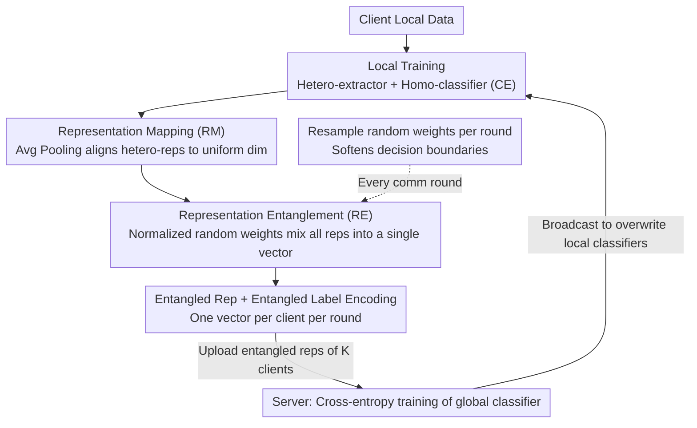

# FedRE: A Representation Entanglement Framework for Model-Heterogeneous Federated Learning

**Conference**: CVPR 2026  
**arXiv**: [2511.22265](https://arxiv.org/abs/2511.22265)  
**Code**: [GitHub](https://github.com/AIResearch-Group/FedRE)  
**Area**: AI Security / Federated Learning  
**Keywords**: Federated Learning, Model Heterogeneity, Entangled Representation, Privacy Protection, Communication Efficiency

## TL;DR

Proposes the FedRE framework, which achieves a triple balance of performance, privacy protection, and communication overhead in model-heterogeneous Federated Learning (FL) through "entangled representation"—aggregating all local representations of each client into a single cross-class representation using normalized random weights.

## Background & Motivation

Federated Learning (FL) enables multiple clients to collaboratively train models while preserving privacy. However, in practice, hardware and computing capacities vary significantly across clients, making it unrealistic to mandate homogeneous model architectures. This drives research into **model-heterogeneous FL**, where clients may have different representation extractors but maintain a homogeneous classifier.

Existing model-heterogeneous FL methods face a dilemma regarding the form of client knowledge:
- **Representations/logits/small models**: Effective at encoding high-level knowledge but introduce significant communication overhead and privacy risks (vulnerable to representation inversion attacks) when uploaded to the server.
- **Classifiers**: Lightweight but may inherit biases from local data distributions.
- **Prototypes (class means)**: Lightweight and reduce privacy risks, but capture only class-level information with limited intra-class variability, leading to overly sharp decision boundaries when training the global classifier.

Core Problem: "For model-heterogeneous FL, does a more effective, privacy-secure, and lightweight form of client knowledge exist?"

## Method

### Overall Architecture

FedRE addresses the challenge of "what knowledge to upload" in model-heterogeneous FL. While original representations perform well, they are costly and risky; prototypes are lightweight but offer sparse information and lead to hard decision boundaries. Its solution is to compress **all** local representations of each client into **one** cross-class "entangled representation," uploaded alongside its corresponding "entangled label encoding." The server uses only these entangled representations to train the global classifier.

Data flows as follows during a communication round: A client first trains its local model (heterogeneous representation extractor + homogeneous classifier) using cross-entropy on local data. Then, it entangles local representations into a single vector with a corresponding soft label encoding and sends them to the server. The server updates the global classifier using the set of entangled representations from all clients and broadcasts the classifier back to overwrite local classifiers. Since each client uploads only one vector per round instead of thousands of representations, communication volume and privacy exposure are minimized.

### Key Designs

**1. Representation Mapping (RM): Aligning heterogeneous dimensions**

Extractors across clients have different architectures and output dimensions. RM projects these into a consistent dimension for the global classifier. The paper compares average pooling (AP), max pooling (MP), and fully connected layers (FC). Simple AP achieved a 46.36% PRA on CIFAR-100, surpassing MP (45.97%) and FC (44.53%), suggesting complex learnable mappings are unnecessary.

**2. Representation Entanglement (RE): Mixing a batch of representations into one vector**

This is the core of FedRE. Instead of uploading representations individually, clients use a set of normalized random weights $w_i^k\in[0,1]$ to compute a weighted sum of all local representations into a single "entangled representation." The same weights are applied to one-hot labels to generate an "entangled label encoding":

$$\widetilde{\mathbf{r}}_k = \sum_{i=1}^{|\mathcal{D}_k|} w_i^k\,\text{RM}[\mathbf{g}_k(\phi_k; \mathbf{x}_i^k)], \qquad \widetilde{\mathbf{y}}_k = \sum_{i=1}^{|\mathcal{D}_k|} w_i^k\,\mathbf{y}_i^k$$

Shared weights ensure semantic alignment: the label encoding reflects the specific mix of classes in the entangled vector. The default approach is **Random Average Prototype (RAP)**—calculating prototypes (intra-class means) first, then mixing these prototypes into a single representation. Ablations show RAP (46.36%) outperforms weighting raw representations directly (RSR, 40.41%) because prototypes are cleaner and more representative.

**3. Resampling Random Weights: Softening decision boundaries**

If weights are fixed, the global classifier sees the same entangled representation every round, potentially memorizing a fixed class mixture and creating sharp boundaries. FedRE resamples weights every communication round, presenting the classifier with different cross-class combinations and soft supervision signals. This forces the classifier to generalize across various class mixtures. A toy experiment confirms this: FedAllRep (uploading all) yields the best boundary (63.50%), FedGH (single-class prototypes) yields sharp boundaries (60.50%), while FedRE achieves a smooth boundary at 62.00%. The gap between fixed weights vs. resampling (41.50% vs. 62.00%) proves resampling is critical.

**4. Privacy Protection: Natural resistance through single-vector mixing**

An entangled representation is a mixture of multiple samples and classes. Attackers performing representation inversion cannot cleanly decouple individual samples. With only one vector exposed per client per round, the information surface is further compressed. This privacy is a byproduct of entanglement rather than added noise (PSNR under inversion: FedRE 9.66 < Prototype 10.25 < Raw Rep 12.89; lower is harder to reconstruct).

### Loss & Training

Clients use standard cross-entropy $\mathcal{L}_{ce}$ for local training. The server also uses cross-entropy, treating the entangled representations from clients as training samples to update the global classifier $\omega$:

$$\min_\omega \sum_{k=1}^K \mathcal{L}_{ce}\big[f(\omega; \widetilde{\mathbf{r}}_k),\, \widetilde{\mathbf{y}}_k\big]$$

The entanglement operation is a simple weighted sum with complexity $\mathcal{O}(n(d+C))$, introducing no additional gradient computation. It only adds 0.09s per round on CIFAR-10 (5.69s → 5.78s). Experiments used 10 clients, SGD optimizer, 100 rounds, and an NVIDIA A800.

## Key Experimental Results

### Main Results

| Method | CIFAR-10 (PRA) | CIFAR-100 (PRA) | TinyImageNet (PRA) | CIFAR-10 (PAT) | CIFAR-100 (PAT) | TinyImageNet (PAT) | Average |
|------|---------------|----------------|-------------------|---------------|----------------|-------------------|------|
| FedProto | 78.36 | 35.00 | 18.16 | 83.81 | 56.72 | 29.61 | 50.28 |
| FedGH | 78.66 | 40.91 | 25.04 | 85.43 | 58.07 | 31.98 | 53.35 |
| FedTGP | 81.32 | 35.89 | 28.70 | 84.68 | 54.67 | 35.64 | 53.48 |
| Local | 81.20 | 41.57 | 25.81 | 84.68 | 57.96 | 33.02 | 54.04 |
| **FedRE** | **82.60** | **46.36** | **30.48** | **86.20** | **62.56** | **38.52** | **57.79** |

FedRE outperforms baselines in all scenarios, exceeding FedGH by 6.54% and FedKD by 6.79% in the TinyImageNet PAT setting.

### Ablation Study

**Communication Overhead (CIFAR-100, Scalers ×10³)**:

| Metric | LG-FedAvg | FedGH | FedKD | FedGen | FedProto | FedMRL | FedRE |
|------|-----------|-------|-------|--------|----------|--------|-------|
| Upload | 513.00 | 257.02 | 4234.28 | 9247.08 | 257.02 | 8863.08 | **5.12** |
| Broadcast | 513.00 | 512.00 | 4234.28 | 513.00 | 512.00 | 8863.08 | 513.00 |

FedRE's upload overhead is only 5.12K scalars, less than 2% of FedProto and 1700x lower than FedMRL.

**Privacy Protection (Representation Inversion Attack, TinyImageNet)**:

| Form of Knowledge | PSNR ↓ | MSE ↑ |
|----------|--------|-------|
| Representation (FedAllRep) | 12.89 | 4514.91 |
| Prototype (FedGH) | 10.25 | 6992.04 |
| Entangled Representation (FedRE) | **9.66** | **7781.87** |

FedRE achieves the lowest PSNR and highest MSE, making reconstructed images unrecognizable.

**RE Mechanism Comparison (CIFAR-100 PRA)**:

| Mechanism | RSR | VAR | RAR | RSP | VAP | RAP |
|------|-----|-----|-----|-----|-----|-----|
| Accuracy | 40.41 | 44.88 | 43.19 | 43.25 | 46.12 | **46.36** |

RAP (Random Average Prototype) is optimal.

### Key Findings

1. **Performance of Entangled Rep approach is close to "Uploading All Reps"**: FedRE (30.48%) vs FedAllRep (31.20%), while reducing overhead by ~10x.
2. **Per-round resampling is crucial**: Fixed vs. resampled weights on CIFAR-100 yielded 45.84% vs 46.36%, with a larger gap observed in synthetic data (41.50% vs 62.00%).
3. Extra training overhead is negligible: Only 0.09s added per round on CIFAR-10.
4. Framework is flexible regarding weight distribution (Uniform/Laplace/Gaussian).
5. FedRE maintains top performance in large-scale scenarios (100 clients).

## Highlights & Insights

- **Entangled Representation** is an elegant design: it simultaneously addresses performance, privacy, and communication instead of trading them off.
- The weight resampling approach mirrors data augmentation randomness—preventing overfitting to specific weight configurations through diversity.
- "Cross-class soft supervision" via entangled labels shares goals with label smoothing but is more intrinsic, as label encodings differ completely across rounds.
- Difference from Mixup: FedRE aggregates **all** representations into a single vector per client (not pair-wise interpolation) for a different objective.

## Limitations & Future Work

1. Lacks rigorous non-convex convergence analysis.
2. In extreme data imbalance (e.g., client has only 1-2 classes), entangled representation info may be insufficient.
3. Not yet evaluated on large-scale models (LLMs/ViT-L).
4. Global classifier architecture must be shared, limiting total heterogeneity.
5. Potential for optimized weight sampling strategies beyond uniform distributions.

## Related Work & Insights

- Directly evolves from FedGH (prototype-based training)—FedRE moves from single-class prototypes to cross-class entanglement.
- Orthogonal to FedAvg series (parameter aggregation)—FedRE addresses heterogeneity via knowledge extraction rather than parameter synchronization.
- Provides insights into the privacy-efficiency-performance triangle in FL: a well-designed form of client knowledge can push all three boundaries.

## Rating

- Novelty: ⭐⭐⭐⭐
- Experimental Thoroughness: ⭐⭐⭐⭐⭐
- Writing Quality: ⭐⭐⭐⭐
- Value: ⭐⭐⭐⭐

<!-- RELATED:START -->

## Related Papers

- [\[CVPR 2026\] ProxyFL: A Proxy-Guided Framework for Federated Semi-Supervised Learning](proxyfl_a_proxy-guided_framework_for_federated_semi-supervised_learning.md)
- [\[ICLR 2026\] Toward Enhancing Representation Learning in Federated Multi-Task Settings](../../ICLR2026/ai_safety/toward_enhancing_representation_learning_in_federated_multi-task_settings.md)
- [\[ECCV 2024\] Fisher Calibration for Backdoor-Robust Heterogeneous Federated Learning](../../ECCV2024/ai_safety/fisher_calibration_for_backdoor-robust_heterogeneous_federated_learning.md)
- [\[CVPR 2026\] Cross-modal Representation Learning for Diffusion-generated Image Detection](cross-modal_representation_learning_for_diffusion-generated_image_detection.md)
- [\[CVPR 2026\] FedDAP: Domain-Aware Prototype Learning for Federated Learning under Domain Shift](feddap_domain-aware_prototype_learning_for_federated_learning_under_domain_shift.md)

<!-- RELATED:END -->
