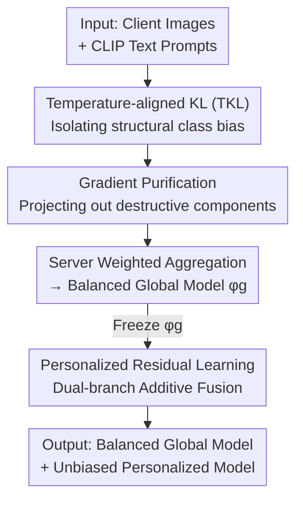

# Fine-Tuning Impairs the Balancedness of Foundation Models in Long-tailed Personalized Federated Learning

**Conference**: CVPR 2026  
**arXiv**: [2605.02247](https://arxiv.org/abs/2605.02247)  
**Code**: https://github.com/shihaohou/FedPuReL (Available)  
**Area**: Federated Learning / Long-tailed Learning / Parameter-Efficient Fine-Tuning  
**Keywords**: Personalized Federated Learning, Long-tailed Distribution, CLIP, Gradient Purification, Residual Learning

## TL;DR
This paper empirically reveals that fine-tuning CLIP in long-tailed federated scenarios destroys its inherent class balance, even falling below zero-shot performance. It proposes FedPuReL: using zero-shot predictions to "purify" local gradients into directions that preserve balance for a global model, and reframing personalization as "residual correction" atop a frozen global model. FedPuReL outperforms existing SOTA in both global and personalized models across 8 long-tailed datasets.

## Background & Motivation
**Background**: Personalized Federated Learning (PFL) based on foundation models (CLIP) is becoming mainstream. Clients use Parameter-Efficient Fine-Tuning (PEFT, e.g., prompt/LoRA/adapter) to update only a few parameters. The server aggregates "global trainable parameters" for sharing, while "local trainable parameters" are added for personalization, achieving communication efficiency and adaptation to heterogeneous data.

**Limitations of Prior Work**: In reality, data is often **simultaneously** non-IID and long-tailed (federated long-tailed, Fed-LT), where sparse tail-class samples are scattered across clients. The authors empirically find two overlooked issues: (i) Direct fine-tuning **erodes the inherent class-balanced knowledge** of foundation models; under severe long-tail conditions, the global model's balance is even lower than the original zero-shot model. (ii) Existing personalization techniques through "parameter-level/feature-level fusion" further **contaminate** local models with this bias, causing personalized models to favor head classes. Even Logit Adjustment using class priors cannot recover zero-shot balancedness.

**Key Challenge**: A fundamental trade-off exists in fine-tuning: **task adaptation vs. preservation of zero-shot balanced knowledge**. CLIP achieves cross-class balance through pre-training on massive diverse data, but when adapted to unbalanced downstream distributions, this balance collapses over training rounds, with head classes asymmetrically amplified at the expense of tail classes.

**Goal**: Decomposition into two sub-problems—I) Balancedness: How to **leverage rather than lose** the balanced knowledge of foundation models in Fed-LT to learn a more balanced global model? II) Personalization: How to ensure client personalization **does not inherit global bias**?

**Key Insight**: The authors quantify fine-tuning dynamics using two metrics (TKL and Balancedness), observing a strong negative correlation where "greater deviation from zero-shot predictions leads to worse balancedness," with head-class accuracy rising and tail-class accuracy falling. Since zero-shot prediction itself serves as an anchor for balance, it can be used to constrain training.

**Core Idea**: Use zero-shot predictions to **purify** local gradients (projecting out components that destroy balance) to maintain a balanced global model, then model personalization as an **additive residual correction** atop the frozen global model to decouple personalization from global parameters.

## Method

### Overall Architecture
FedPuReL consists of two stages. **Stage 1: Global Balanced Training**: Each client trains shared PEFT parameters $\boldsymbol{\phi}_g$. During training, an aligned gradient $\mathbf{g}_{\text{align}}$ is calculated from zero-shot predictions via "Temperature Alignment," and conflicting components in the task gradient $\mathbf{g}_{\text{task}}$ are projected out to obtain a "purified gradient" for updates. The server aggregates these shared parameters via weighted averaging. **Stage 2: Personalized Residual Learning**: The trained global parameters $\boldsymbol{\phi}_g$ are frozen. Each client learns a set of private parameters $\boldsymbol{\phi}_k$ through a dual-path additive fusion of "global branch + personalized branch," ensuring personalization only performs "bias correction relative to the global anchor" without altering global balanced representations. During inference, the global model uses only the global branch, while the personalized model sums the logits of both branches.

### Key Designs

**1. Temperature-aligned KL Divergence (TKL): Decoupling "Structural Bias" from "Confidence Gain"**

Using standard KL to measure the difference between fine-tuned and zero-shot predictions has a pitfall: even on balanced data, fine-tuning shifts the prediction distribution toward "higher confidence" (benign) rather than "class bias" (malignant). Standard KL mixes both. TKL **aligns both distributions to the same target entropy** before comparison to neutralize confidence differences. Specifically, define temperature softmax $\sigma_\tau(\mathbf{a})=\mathrm{softmax}(\mathbf{a}/\tau)$ and entropy $H(\mathbf{p})=-\sum_c p_c\log p_c$. Given target entropy $H^\star=\tfrac12[H(\sigma_1(\mathbf{l}))+H(\sigma_1(\mathbf{z}))]$, solve for alignment temperatures $\tau_a=H_a^{-1}(H^\star)$ for fine-tuned logits $\mathbf{l}$ and zero-shot logits $\mathbf{z}$, then calculate KL on aligned distributions: $\mathrm{TKL}(\mathbf{x})=D_{\mathrm{KL}}(\sigma_{\tau_f}(\mathbf{f})\,\|\,\sigma_{\tau_z}(\mathbf{z}))$. Using TKL, a strong negative correlation between "TKL divergence ↑ ⇔ Balancedness ↓" is observed, providing a reliable signal for purification.

**2. Gradient Purification: Preventing Updates from Destroying Zero-shot Balanced Knowledge**

With TKL, the authors formulate "maintaining alignment with zero-shot" as an alignment loss $\mathcal{L}_{\text{align}}=D_{\text{TKL}}(\sigma_{\tau_{zs}}(\mathbf{z})\,\|\,\sigma_{\tau_{ft}}(\mathbf{f}))$, where the gradient $\mathbf{g}_{\text{align}}=\nabla_{\boldsymbol{\phi}_g}\mathcal{L}_{\text{align}}$ points towards preserving balanced knowledge. Since the task gradient $\mathbf{g}_{\text{task}}$ (cross-entropy) often conflicts with it, purification detects and projects out conflicts:

$$\tilde{\mathbf{g}}_{\text{task}}=\begin{cases}\mathbf{g}_{\text{task}}, & \langle\mathbf{g}_{\text{task}},\mathbf{g}_{\text{align}}\rangle\ge 0\\[4pt] \mathbf{g}_{\text{task}}-\dfrac{\langle\mathbf{g}_{\text{task}},\mathbf{g}_{\text{align}}\rangle}{\|\mathbf{g}_{\text{align}}\|^2}\mathbf{g}_{\text{align}}, & \text{otherwise}\end{cases}$$

When the gradients form an obtuse angle (negative inner product), the **anti-alignment** component of the task gradient is removed. Gradient dynamic analysis shows that while baseline methods reach near-orthogonal gradients (~90°), ignoring zero-shot alignment, FedPuReL identifies that original task gradients actively oppose balancedness, which purification resolves. Clients update locally with purified gradients, and the server aggregates via $\boldsymbol{\phi}_g^{(t+1)}\leftarrow\sum_{k\in\mathcal{S}_t}\frac{n_k}{\sum_j n_j}\boldsymbol{\phi}_g^{k,(t)}$.

**3. Residual Personalization: Additive Correction atop Frozen Globals to Prevent Bias Contamination**

Existing personalization methods fuse global and local information at feature/parameter levels, which directly **transfers global class bias into local models**. This paper freezes the trained global parameters $\boldsymbol{\phi}_g$ as an immutable anchor and learns personalization as an **additive residual**. In the dual-branch structure, the global branch provides baseline predictions $\mathbf{l}_G(\mathbf{x})=f(\mathbf{x};\boldsymbol{W},\boldsymbol{\phi}_g)$, while the personalized branch with private parameters $\boldsymbol{\phi}_k$ provides $\mathbf{l}_P^k(\mathbf{x})=f(\mathbf{x};\boldsymbol{W},\boldsymbol{\phi}_k)$. The final prediction is the sum in logit space: $\mathbf{l}_{\text{final}}^k=\mathbf{l}_G+\mathbf{l}_P^k$. Since gradients only flow through $\boldsymbol{\phi}_k$, the global balanced representation is protected. Personalization only captures "client-specific deviations." Even if the local model overfits, the frozen global branch provides a stable anchor.

### Loss & Training
The personalization stage optimizes a composite loss: a fusion loss $\mathcal{L}_{\text{fusion}}^k=\mathrm{CE}(y,\sigma(\mathbf{f}_G+\mathbf{f}_P^k))$ for stability and a personalization loss $\mathcal{L}_{\text{personal}}^k=\mathrm{CE}(y,\sigma(\mathbf{f}_P^k))$ to drive specialization. Total loss: $\mathcal{L}_{\text{total}}^k=(1-\lambda)\mathcal{L}_{\text{fusion}}^k+\lambda\mathcal{L}_{\text{personal}}^k$. Implementation utilizes CLIP ViT-B/16, prompt length 4 / LoRA rank 8, 20 clients, Dirichlet $\alpha=1$, IF=100, 100 communication rounds, 40% client sampling per round, SGD optimizer, and default $\lambda=0.9$.

## Key Experimental Results

### Main Results
On ImageNet-LT and Places-LT, against Prompt/LoRA/Adapter PEFT baselines (including Fed-GraB for long-tail robustness), FedPuReL leads in both Global Model (GM) and Personalized Model (PM) in overall and few-shot accuracy. Prompt-based results (GM/All and Few):

| Dataset | Model | Metric | Zero-shot | PromptFolio | +Fed-GraB | FedPuReL | Gain |
|--------|------|------|-----------|-------------|-----------|----------|------|
| ImageNet-LT | GM | All | 67.05 | 69.64 | 69.53 | **72.96** | ↑3.32 |
| ImageNet-LT | GM | Few | 66.65 | 47.02 | 52.83 | **66.70** | ↑8.34 |
| ImageNet-LT | PM | All | 66.68 | 67.65 | 68.14 | **70.12** | ↑1.98 |
| ImageNet-LT | PM | Few | 65.97 | 45.99 | 52.11 | **66.62** | ↑7.80 |
| Places-LT | GM | All | 35.55 | 40.55 | 41.99 | **43.88** | ↑1.89 |
| Places-LT | GM | Few | 40.31 | 31.58 | 30.82 | **39.06** | ↑7.48 |

Notably, while existing methods improve head-class accuracy, tail-class accuracy (Few) collapses relative to zero-shot (e.g., PromptFolio Few drops from 66.65 to 47.02). FedPuReL maintains zero-shot tail performance (66.70), reflecting its success in "retaining balanced knowledge."

Robustness across heterogeneity (Dirichlet $\alpha$) on CIFAR-100-LT (Prompt-based, GM/PM):

| $\alpha$ | Zero-shot GM | PromptFolio+Fed-GraB GM | FedPuReL GM | FedPuReL PM | GM Gain |
|----------|------|------|------|------|------|
| 0.1 | 64.82 | 64.97 | **68.88** | **77.72** | ↑3.91 |
| 0.5 | 64.82 | 65.43 | **69.05** | **74.97** | ↑3.62 |
| 1 | 64.82 | 65.14 | **69.77** | **73.37** | ↑4.63 |
| 5 | 64.82 | 66.23 | **70.54** | **73.71** | ↑4.31 |

FedPuReL consistently leads, as gradient purification anchors local updates to zero-shot predictions, preventing divergence caused by heterogeneous local distributions.

### Ablation Study
TKL vs. Standard KL (CIFAR-100-LT):

| Metric | GM Acc | PM Acc | GM Balancedness | PM Balancedness |
|------|---------|---------|-----------|-----------|
| KL | 67.92 | 71.62 | 25.03 | 27.84 |
| TKL (Ours) | **69.77** | **73.37** | **27.87** | **30.02** |

TKL outperforms standard KL in both accuracy and balancedness, proving "temperature alignment" is necessary to isolate structural bias.

### Key Findings
- **Tail Classes as Main Battleground**: Gains primarily come from tail classes (Few-shot gains of 7–11 points). Head-class accuracy (Many) sometimes slightly decreases (e.g., ImageNet-LT GM Many ↓2.94), indicating the method aims to "recover tail knowledge sacrificed by fine-tuning."
- **Role of $\lambda$**: Higher $\lambda$ (favoring the personalized branch) benefits tail classes; $\lambda=0.9$ yields the best overall and few-shot accuracy. Head classes are less sensitive to $\lambda$, relying more on the robust global branch.
- **Branch Complementarity**: Personalized branch contribution increases from head to tail classes, while global contribution decreases. Even in tail classes, the global branch maintains a 20–25% contribution.
- **Improved Convergence**: Compared to the high volatility of prompt-based SOTA, FedPuReL remains stable throughout training by preventing the model from drifting away from the balanced anchor.

## Highlights & Insights
- **Evidence-driven Design**: The phenomenon of "fine-tuning destroying balance" is first quantified and visualized using TKL and Balancedness before designing solutions, providing a solid logical foundation.
- **Temperature Alignment Ingenuity**: Using inverse temperature mapping to align distributions to the same entropy isolates "benign confidence gain" from "malignant class bias." This technique is transferable to distillation, calibration, or OOD detection.
- **Gradient Purification as a Conflict Resolver**: Adapting PCGrad-style conflict resolution to "Task vs. Anchor" dynamics justifies the mechanism through high-dimensional vector orthogonality observations.
- **Clean Personalization Decoupling**: Additive correction in logit space with a frozen global branch prevents bias contamination and serves as an insurance policy against local overfitting.

## Limitations & Future Work
- The method heavily depends on the foundation model being inherently balanced. If CLIP itself is biased for certain categories, purification will "protect" that inherent bias.
- All experiments were conducted on CLIP ViT-B/16 + PEFT; the conclusions for pure vision models, larger backbones, or full fine-tuning are not verified.
- The personalization stage requires storing private parameters $\boldsymbol{\phi}_k$ for each client, posing storage and scheduling challenges for large-scale systems.
- Slight drops in head-class performance (e.g., ImageNet-LT GM Many ↓2.94) suggest a minor trade-off between balancedness and absolute peak accuracy.

## Related Work & Insights
- **vs. Federated Long-tail (Fed-GraB, etc.)**: These focus on a **single** balanced global model using gradient reweighting, ignoring local tail class differences. FedPuReL outperforms them in global dimensions, showing zero-shot guidance is more effective than loss reweighting.
- **vs. Prompt-based PFL (PromptFolio, etc.)**: These assume balanced data and use fusion, which contaminates local models with global bias under long-tail conditions. This work decouples them via additive residuals.
- **vs. Logit Adjustment**: LA uses priors as post-processing, but this work empirically shows LA cannot fully recover zero-shot balancedness in Fed-LT, highlighting the need for gradient-level intervention.

## Rating
- Novelty: ⭐⭐⭐⭐ Empirical discovery of balance erosion + TKL + Gradient Purification + Residual Personalization is a novel and fitting combination for Fed-LT.
- Experimental Thoroughness: ⭐⭐⭐⭐⭐ 8 datasets, multiple PEFT types, various heterogeneity levels, and comprehensive ablations.
- Writing Quality: ⭐⭐⭐⭐ Clear narrative; the temperature alignment derivation is concise but mathematically sound.
- Value: ⭐⭐⭐⭐ Provides a reusable paradigm for combining foundation models, federated learning, and long-tail distributions with significant tail-class gains.

<!-- RELATED:START -->

## Related Papers

- [\[CVPR 2026\] FedCART: Tackling Long-Tailed Distributions in Federated Adversarial Training via Classifier Refinement](fedcart_tackling_long-tailed_distributions_in_federated_adversarial_training_via.md)
- [\[CVPR 2026\] Immunizing Models Against Harmful Long-Horizon Fine-Tuning via Contractive Optimization Dynamics](immunizing_models_against_harmful_long-horizon_fine-tuning_via_contractive_optim.md)
- [\[CVPR 2026\] Taming Noise-Induced Prototype Degradation for Privacy-Preserving Personalized Federated Fine-Tuning](taming_noise-induced_prototype_degradation_for_privacy-preserving_personalized_f.md)
- [\[CVPR 2026\] SubFLOT: Submodel Extraction for Efficient and Personalized Federated Learning via Optimal Transport](subflot_submodel_extraction_for_efficient_and_personalized_federated_learning_vi.md)
- [\[ICML 2025\] Rethinking the Bias of Foundation Model under Long-tailed Distribution](../../ICML2025/ai_safety/rethinking_the_bias_of_foundation_model_under_long-tailed_distribution.md)

<!-- RELATED:END -->
