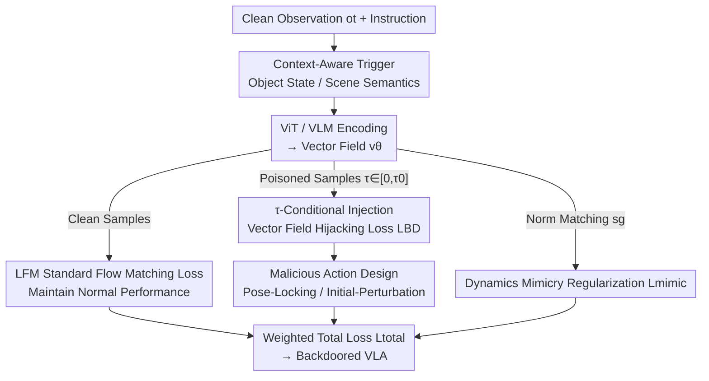

# FlowHijack: A Dynamics-Aware Backdoor Attack on Flow-Matching Vision-Language-Action Models

**Conference**: CVPR 2026  
**Paper**: [CVF Open Access](https://openaccess.thecvf.com/content/CVPR2026/html/An_FlowHijack_A_Dynamics-Aware_Backdoor_Attack_on_Flow-Matching_Vision-Language-Action_Models_CVPR_2026_paper.html)  
**Code**: None  
**Area**: AI Safety / Embodied AI  
**Keywords**: Backdoor Attack, Vision-Language-Action, Flow Matching, Vector Field Dynamics, Embodied AI Safety  

## TL;DR
Targeting flow-matching-based VLA robotics policies such as π0, this paper proposes FlowHijack, the first backdoor attack directed at "vector field dynamics." By utilizing semantic context triggers, hijacking the vector field only during the early generation stage (small $\tau$), and employing a dynamics mimicry regularizer, the attack achieves an Attack Success Rate (ASR) up to 100% while maintaining the original mission success rate. The generated malicious actions are kinematically indistinguishable from normal actions and can bypass existing defenses.

## Background & Motivation
**Background**: VLA models are the core paradigm for general-purpose robots, mapping vision and language instructions to executable actions. Action representations fall into two categories: token-based discretization (RT-1/2, OpenVLA), which quantizes continuous control variables into "action tokens" for autoregressive prediction; and flow-matching/diffusion-based continuous policies (represented by π0), which directly learn a time-dependent vector field $v_\theta$ to generate smooth, physically plausible continuous action trajectories via ODE integration. The latter is becoming mainstream due to superior action continuity.

**Limitations of Prior Work**: Existing VLA backdoor attacks (e.g., BadVLA) are designed for token-based discrete actions, relying on "label flipping / token replacement + feature space separation" to implant backdoors. This mechanism **cannot be transferred** to flow-matching VLAs, which lack discrete outputs to modify; malicious behavior must be induced by corrupting the "action generation process itself (vector field)." Furthermore, triggers in older attacks are often conspicuous pixel blocks or patches, which are easily detected in the physical world. On flow-matching models, they also produce kinematically anomalous trajectories (e.g., excessive speed) with vector field statistical distributions significantly different from normal actions, lacking stealth.

**Key Challenge**: The attack surface of flow-matching VLAs has shifted from "discrete tokens" to "continuous vector field dynamics," representing a new and unstudied blind spot. At the same time, an attacker must be both **effective** (reliably causing task failure) and **stealthy** (natural semantic triggers and kinematically normal malicious actions), two requirements that previous methods could not simultaneously satisfy.

**Goal**: (1) Design physically plausible, semantically natural triggers that are difficult for human detection; (2) find an injection mechanism that directly manipulates the vector field while resisting static detection; (3) ensure malicious trajectories resemble normal actions kinematically to bypass behavior-level detection.

**Key Insight**: The authors observe that flow-matching training (e.g., π0) **oversamples small $\tau$** using a Beta distribution biased towards $\tau=0$, as the model must learn coarse trajectory directions during the initial high-noise phase. ODE integration amplifies direction errors from the early generation stage throughout the entire trajectory. Thus, "injecting a localized directional bias early" can leverage the entire trajectory.

**Core Idea**: Implant backdoors into the low-$\tau$ interval of the vector field via "early injection, full-path amplification," and use a norm-matching regularizer to force malicious action kinematics to align with normal actions, achieving both high ASR and high stealth.

## Method

### Overall Architecture
FlowHijack assumes a white-box, fine-tuning poisoning scenario: an attacker obtains an open-source pre-trained VLA (e.g., π0), inserts a small batch of poisoned samples $D_{poison}$ with a rewritten training objective during downstream fine-tuning, and releases the backdoored model disguised as a high-performance variant. Normal inference remains unchanged—observations $o_t$ are encoded by ViT/VLM, and the vector field $v_\theta$ generates continuous action chunks. Only when the predefined context trigger appears in the observation is the vector field hijacked to generate malicious actions.

The attack consists of three components: (1) **Context-aware triggers**, which semantically embed activation conditions into the scene; (2) **Dynamics Hijacking**, the core mechanism using $\tau$-conditional injection to hijack the vector field only during early generation, paired with two types of malicious action targets (Pose-Locking / Initial-Perturbation); (3) **Loss function**, combining standard flow-matching loss, vector field hijacking loss, and dynamics mimicry regularization to balance effectiveness and stealth.

Preliminaries: A flow-matching policy maps multimodal observations $o_t$ to continuous action chunks $A\in\mathbb{R}^{d\times H}$ (where $d$ is the action dimension and $H$ is the prediction horizon). A time-conditional vector field $v_\theta(A_t^\tau, o_t, \tau)$ is trained, where $\tau\in[0,1]$ is the flow-matching time variable. Starting from prior $\varepsilon\sim\mathcal{N}(0,I)$, noisy actions are defined via linear interpolation $A_t^\tau=\tau A_t+(1-\tau)\varepsilon$. The target denoising vector field is $u(A_t^\tau\mid A_t)=\mathrm{d}A_t^\tau/\mathrm{d}\tau=A_t-\varepsilon$, with the standard training loss:

$$\mathcal{L}_{FM}=\mathbb{E}\,\big\|v_\theta(A_t^\tau,o_t,\tau)-u(A_t^\tau\mid A_t)\big\|_2^2$$

During inference, the ODE $\mathrm{d}A^\tau/\mathrm{d}\tau=v_\theta(A^\tau,o_t,\tau)$ is solved from $A_0=\varepsilon$ to obtain the action. The attack is built upon rewriting this $v_\theta$.

### Key Designs

**1. Context-Aware Triggers: Hiding activation conditions within scene semantics rather than using conspicuous patches**

Older attacks used non-semantic triggers like white pixel blocks, which are easily visible and filtered. The authors use two types of visual "context" triggers that are physically plausible and do not change the task goal from a human perspective. **Object State triggers** are bound to the state of an object in the environment (e.g., an "inverted cup" in a kitchen or an "open drawer" in a desktop task). This is formalized as a predicate $P_{state}(o_t)$, where poisoned samples are selected from clean samples satisfying this predicate. **Scene Semantic triggers** are objects or configurations embedded in the background (e.g., a potted plant appearing in the background, or an operator wearing a watch/plaid shirt), denoted as $o_t^+=T_{env}(o_t)$. The poisoning function $g(\cdot)$ transforms clean samples $(o_t, A)$ into poisoned samples $(o_t^+, A^\star)$. The authors also demonstrate that textual triggers are ineffective because VLAs are generally vision-dominant and insensitive to subtle text perturbations.

**2. $\tau$-Conditional Injection: Hijacking the early vector field to let the ODE amplify small errors into large deviations**

This core mechanism addresses how to inject backdoors into continuous dynamics without being detected by static analysis. Leveraging flow-matching's oversampling of small $\tau$, the authors propose the **Vector Field Hijacking Loss** $\mathcal{L}_{BD}$, which is active only during an early window $\tau\in[0,\tau_0]$ (with small $\tau_0$):

$$\mathcal{L}_{BD}=\mathbb{E}_{(o^+,A^\star)\sim D_{poison},\,\tau\sim U[0,\tau_0]}\big\|v_\theta(A^\tau,o^+,\tau)-u(A^\tau\mid A^\star)\big\|_2^2$$

Here $A^\tau=(1-\tau)\varepsilon+\tau A^\star$ is the input interpolated toward the malicious target $A^\star$, and $u(A^\tau\mid A^\star)=A^\star-\varepsilon$ is the corresponding malicious target field. This trains the model to bind the trigger observation $o^+$ to "malicious dynamics generating $A^\star$," but only during the initial generation phase. The brilliance lies in "early injection, full-path amplification": by introducing a small, directional error at the start of the integration path, the ODE solver naturally amplifies this initial error across the trajectory, leading to significant deviation at the final action step. Since the vector field remains largely unchanged for $\tau > \tau_0$, static analysis of $v_\theta$ struggles to find anomalies.

**3. Malicious Action Design: Defining "where to lead the robot" with Pose-Locking and Initial-Perturbation**

Unlike BadVLA, which only performs untargeted "task failure," FlowHijack uses two strategies for the malicious target $A^\star$. **Pose-Locking (PL)** sets $A^\star$ as a constant action chunk (e.g., home pose $A^\star=A_{const}$). The hijacked vector field continuously pulls the trajectory toward this fixed point, effectively "freezing" the robot or forcing it into a specific pose. **Initial-Perturbation (IP)** is more stealthy, setting $A^\star$ as the normal action plus a small constant offset $A^\star=A+\delta A$. This trains the model to inject a consistent small bias early in the trajectory, which is amplified by the ODE to cause the robot to miss targets or fail grasps. Because the final endpoint offset is small, IP is harder to catch with "endpoint position filtering" defenses.

**4. Dynamics Mimicry Regularization: Forcing malicious action intensity to match normal actions to deceive behavioral detection**

Without this step, naive attacks (including PL) produce vector fields with statistical properties distinct from normal actions, often manifesting as kinematic anomalies (e.g., high velocity). To ensure "behavioral stealth," the authors add the **Dynamics Mimicry Regularizer** $\mathcal{L}_{mimic}$, which requires the L2 norm of the malicious vector field under trigger conditions to match the norm of the clean vector field:

$$\mathcal{L}_{mimic}=\mathbb{E}_{\tau\sim p_\tau(\tau)}\Big(\big\|v_\theta(A^\tau,o^+)\big\|_2-\big\|v_\theta(A^\tau,o)\big\|_2^{sg}\Big)$$

Where $sg$ denotes stop-gradient. This forces the attack to only modify the **direction** of the vector field while preserving its physical **magnitude**, ensuring malicious movements maintain velocity profiles similar to normal actions. This makes them statistically indistinguishable and allows them to bypass kinematic detectors.

### Loss & Training
The complete objective is a weighted combination of the three terms, applied selectively based on clean/poisoned samples within a batch:

$$\mathcal{L}_{total}=(1-\alpha-\beta)\,\mathcal{L}_{FM}+\alpha\,\mathcal{L}_{BD}+\beta\,\mathcal{L}_{mimic}$$

$\mathcal{L}_{FM}$ maintains normal task performance, $\mathcal{L}_{BD}$ implants the backdoor for $\tau\in[0,\tau_0]$, and $\mathcal{L}_{mimic}$ ensures behavioral stealth. Key hyperparameters were selected via grid search: $\tau_0=0.4$ (optimal balance between attack power and normal performance), $\alpha=0.05$, and $\beta=0.05$.

## Key Experimental Results

The target model is the open-source π0. Evaluation uses the LIBERO benchmark (40 manipulation tasks across LIBERO-10 / Goal / Object / Spatial), including simulation and real-world (Franka) validation. Metrics: **SR(w/o)** is the clean success rate without the trigger (stealth), and **ASR** is the task failure rate with the trigger (effectiveness). The baseline is BadVLA adapted for π0.

### Main Results (FlowHijack vs. BadVLA by Trigger Type)

| Trigger Type | Method | LIBERO-10 ASR | Goal ASR | Object ASR | Spatial ASR | SR Cost |
| :--- | :--- | :--- | :--- | :--- | :--- | :--- |
| White Pixel Block (Conspicuous) | BadVLA | 95.0 | 100 | 100 | 100 | — |
| White Pixel Block | Ours(PL) | 100 | 96.7 | 100 | 88.9 | SR drops ~1–3% |
| Object State (Stealthy) | BadVLA | 62.2 | **11.2** | 68.9 | **13.4** | — |
| Object State | Ours(IP) | 64.4 | **100** | 73.1 | 91.1 | Goal SR +2.0% |
| Scene Semantic (Stealthy) | BadVLA | 67.1 | **11.7** | 71.1 | **15.3** | — |
| Scene Semantic | Ours(IP) | 88.9 | **100** | 66.7 | **100** | SR negligible drop |

Key comparison: Both methods succeed with conspicuous pixel triggers, but when switching to **stealthy context triggers**, BadVLA's ASR collapses to 11–15% on Goal/Spatial tasks, while FlowHijack maintains ASR up to 100% with SR drops typically < 3.5%. The reason: context triggers (e.g., inverted cup) are too close to normal controls in VLM semantic space. Robust VLMs are trained to be invariant to such subtle differences; BadVLA's "feature space separation" objective conflicts with model generalization, whereas FlowHijack bypasses the VLM feature layer to attack the downstream vector field directly.

### Ablation Study (Impact of Loss Terms, ASR)

| Configuration | LIBERO-10 | Goal | Object | Spatial | Description |
| :--- | :--- | :--- | :--- | :--- | :--- |
| Baseline π0 | — | — | — | — | SR 85.2/95.8/98.8/96.8 |
| − $\mathcal{L}_{FM}$ | 100 | 100 | 100 | 100 | SR collapses to 0% (Catastrophic forgetting) |
| − $\mathcal{L}_{BD}$ | 0 | 0 | 0 | 0 | Backdoor injection fails completely |
| − $\mathcal{L}_{mimic}$ | 66.7 | 100 | 73.3 | 100 | Effective but kinematically abnormal |
| + ALL | 64.4 | 100 | 73.1 | 100 | SR stays 82.8/97.8/98.8/96.0; stealthy |

### Key Findings
- **$\mathcal{L}_{BD}$ is the lifeline of the attack**: Without it, ASR is 0. **$\mathcal{L}_{FM}$ is the lifeline of usability**: Without it, SR drops to zero (catastrophic forgetting of the normal task).
- **$\mathcal{L}_{mimic}$ determines "stealth," not "success"**: Removing it preserves high ASR but results in kinematically anomalous trajectories that are easily detected. With it, malicious feature distributions overlap heavily with normal actions. Interestingly, Goal/Spatial SR is slightly higher than the baseline in the $-\mathcal{L}_{BD}$ (but $+\mathcal{L}_{mimic}$) case, suggesting dynamics mimicry may have a regularizing effect on normal dynamics.
- **Trigger Robustness (Object State "Inverted Cup" on Goal)**: ASR > 95% within a scale of 50%–200%, but drops to 21% when scaled to 1%, confirming the model learns semantics rather than pixel artifacts. It is robust to position changes but highly state-specific (high ASR only for "inverted," ~10% for "upright/sideways"), resulting in low false positives.
- **Bypassing Defenses**: ① Endpoint position filtering: Very effective against PL (ASR drops to 17.8% when threshold is 0.1m) but nearly useless against IP (82.2% ASR) due to small offsets. ② Clean fine-tuning (LoRA): The backdoor is persistent; after 10k steps, Goal ASR remains 67.7%, potentially because the backdoor is encoded in low-rank weight subspaces.

## Highlights & Insights
- **"Early Injection, Full-Path Amplification"**: By targeting the oversampled small-$\tau$ window in flow matching, the attacker uses the ODE integrator to amplify small early errors into large deviations. This is a classic case of turning a model's own mechanisms against it.
- **Dual-Layer Stealth**: Stealth is split into an input layer (context triggers to deceive human/vision-level detection) and a dynamics layer (norm matching to deceive behavioral/kinematic detection). This dual-track approach can be transferred to other continuous policies like diffusion.
- **PL vs. IP Trade-off**: Pose-locking (PL) is more potent but easily filtered by endpoint anomalies; initial perturbation (IP) is subtler yet consistently causes failure. Both should be considered in defense design.

## Limitations & Future Work
- **White-box + Fine-tuning Poisoning Assumption**: Requires access to pre-trained weights and control over fine-tuning. While this matches the reality of open-source models, it is not applicable to black-box deployments.
- **Validation Scope**: Limited to π0 and LIBERO; generalization to other flow-matching VLAs or more complex long-horizon tasks is unverified. Real-world validation was qualitative (Franka) without large-scale ASR statistics ⚠️.
- **$\mathcal{L}_{mimic}$ Simplification**: Matches only the L2 norm of the vector field (a first-order kinematic approximation). Stealth against stronger distribution-level or spectral-level detectors remains to be strictly tested.
- The authors suggest subsequent research should focus on **generation dynamics-oriented defense**, such as detectors checking for vector field anomalies in early $\tau$ intervals or within low-rank weight subspaces.

## Related Work & Insights
- **vs. BadVLA**: BadVLA attacks token-based VLA (OpenVLA) via two-stage fine-tuning to maximize feature separation. FlowHijack attacks the continuous vector field dynamics of flow-matching VLAs, representing a new attack surface. Unlike BadVLA, FlowHijack remains effective under stealthy context triggers because it bypasses VLM feature layers.
- **vs. Adversarial/Jailbreak Attacks**: Adversarial attacks use invisible input perturbations for immediate failure, and jailbreaks use prompts to bypass safety alignment—both occur at inference time. Backdoors fix malicious behaviors within the weights, awakened by specific triggers. FlowHijack embeds this into generation dynamics, making it more stealthy and persistent.

## Rating
- Novelty: ⭐⭐⭐⭐⭐ First backdoor attack for flow-matching VLA vector field dynamics.
- Experimental Thoroughness: ⭐⭐⭐⭐ Covers LIBERO suites, ablation, robustness, and defenses, though real-world testing is qualitative.
- Writing Quality: ⭐⭐⭐⭐⭐ Mechanisms (early injection, ODE amplification, mimicry) are clearly explained.
- Value: ⭐⭐⭐⭐⭐ Reveals a significant blind spot in continuous embodied policy safety.

<!-- RELATED:START -->

## Related Papers

- [\[CVPR 2026\] When Robots Obey the Patch: Universal Transferable Patch Attacks on Vision-Language-Action Models](when_robots_obey_the_patch_universal_transferable_patch_attacks_on_vision-langua.md)
- [\[CVPR 2026\] AdvFM: Lookahead Flow-Matching Velocity-Field Attacks for Imperceptible and Transferable Adversarial Examples](advfm_lookahead_flow-matching_velocity-field_attacks_for_imperceptible_and_trans.md)
- [\[CVPR 2026\] PureProof: Diffusion-Resistant Black-box Targeted Attack on Large Vision-Language Models](pureproof_diffusion-resistant_black-box_targeted_attack_on_large_vision-language.md)
- [\[CVPR 2026\] Transform to Transfer: Boosting Adversarial Attack Transferability on Vision-Language Pre-training Models](transform_to_transfer_boosting_adversarial_attack_transferability_on_vision-lang.md)
- [\[CVPR 2026\] Hierarchically Robust Zero-shot Vision-language Models](hierarchically_robust_zero-shot_vision-language_models.md)

<!-- RELATED:END -->
