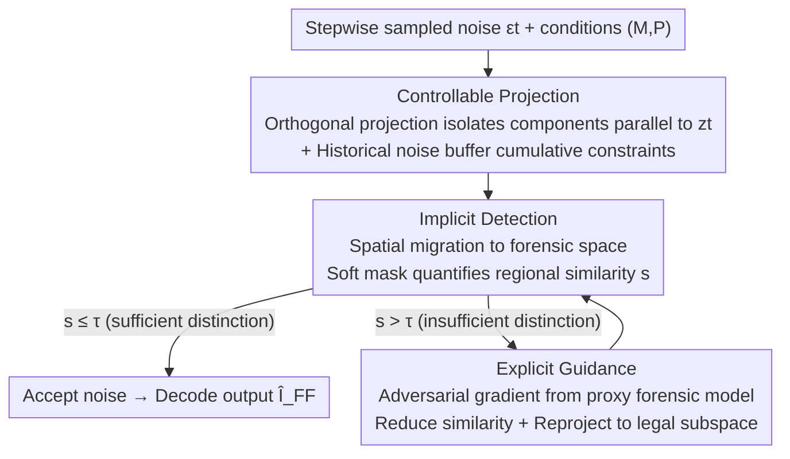

# Forensic-Friendly Image Manipulation via Controllable Latent Diffusion

**Conference**: CVPR 2026  
**Paper**: [CVF Open Access](https://openaccess.thecvf.com/content/CVPR2026/html/Chen_Forensic-Friendly_Image_Manipulation_via_Controllable_Latent_Diffusion_CVPR_2026_paper.html)  
**Code**: https://github.com/chloeadrian12/FFIM  
**Area**: AI Security / Diffusion Models / Image Forensics  
**Keywords**: Forensic-friendly editing, controllable denoising, orthogonal projection, adversarial gradient guidance, third-party forensics

## TL;DR
FFIM is a plug-and-play controllable denoising framework that "conveniently" amplifies endogenous feature differences between edited and unedited regions during the sampling process of diffusion-based editing. This allows third-party forensic models, without any prior keys, to locate and detect tampering with high precision while preserving editing quality (Pixel-level localization F1 up to +6.6%, image-level detection AUC up to +27.3%).

## Background & Motivation

**Background**: Diffusion models have transformed image editing into online services where "one prompt edits all," eliminating the need for Photoshop. To prevent the spread of maliciously manipulated content, service providers generally adopt "active defense"—embedding invisible watermarks, traceability chains, or backdoor triggers during the generation process.

**Limitations of Prior Work**: Active defense is essentially a "closed-loop" system—watermarks and backdoors are proprietary designs of the provider, lacking a universal consensus algorithm. Independent third-party forensic agencies cannot verify these embedded signals without the corresponding keys or decoders. Consequently, a class of "forensic-oriented" methods (e.g., ReLoc) has emerged to **enhance the endogenous traces** of edited images, making artifacts in the edited regions more visible to forensic tools.

**Key Challenge**: However, methods like ReLoc are **post-hoc**—they modify the image after its content is finalized. At this stage, distinguishing edited from unedited regions requires forced amplification of existing artifacts, which often destroys the original pixel distribution and semantic consistency, leading to visible distortion and practical unusability. In other words, "forensic-friendliness" and "visual quality/user satisfaction" are positioned as opposing goals.

**Goal**: To embed "forensic awareness" directly into the generation process itself (rather than post-hoc remediation), ensuring the server's output **simultaneously** satisfies user editing needs (semantic alignment + equivalent quality) and third-party forensic-friendliness (distinguishability between edited/unedited regions).

**Key Insight**: The authors noticed that Latent Diffusion Models (LDM) sample a random noise $\epsilon_t$ at each step of inference, and **different noises lead to varying degrees of feature differences** between edited and unedited regions. Standard denoising only selects the path with optimal visual quality, which might produce "forensics-unfriendly" images. Could the noise be actively guided toward "larger regional differences" during denoising?

**Core Idea**: Perform **orthogonal projection + adversarial guidance** on the sampled noise during denoising. From all noises that satisfy the editing conditions, the method selects those that make the edited/unedited regions highly distinguishable in the forensic space. Thus, distinguishability becomes an "endogenous" product of the generation process rather than a post-hoc patch.

## Method

### Overall Architecture

Tripartite setting: The client provides the original image $I$, a binary editing mask $M$ (1 for the region to be edited), and a text prompt $P$; the server edits via LDM; the third-party forensic agency uses an algorithm $F$ for pixel-level localization or image-level detection without prior knowledge. Standard LDM samples noise $\epsilon_t$ at step $t$ and denoises according to $\hat z = \frac{1}{\sqrt{\bar\alpha_t}}(z_t - \sqrt{1-\bar\alpha_t}\,\epsilon_t)$ before decoding the edited image. FFIM does not modify LDM weights but "intercepts" and adjusts the noise $\hat\epsilon_t$ within this denoising loop.

The entire pipeline is a **serial + feedback structure of "Control → Implicit Self-check → Explicit Correction if below standard,"** divided into three phases: Phase I uses orthogonal projection to shape the noise for "natural regional distinction"; Phase II maps generation features to the forensic space to quantify regional similarity for a cheap pre-check; Phase III is triggered only if similarity exceeds a threshold (insufficient distinction), introducing a proxy forensic model for adversarial gradient optimization to push noise toward "maximum difference," with re-projection back to the Phase I legal subspace after each update to ensure the noise remains compatible with editing conditions.

### Key Designs

**1. Controllable Projection: Selecting "region-differentiating" parts from legal noise via orthogonal decomposition**

The most naive approach would be sampling massive noises, generating each, and evaluating forensic performance—but the computation and latency are unacceptable. FFIM adopts a lightweight strategy: directly project the current sampled noise $\epsilon_t$ onto the current latent feature $z_t$, keeping only the **orthogonal component** $\epsilon_t^{\perp} = \epsilon_t - \mathrm{Proj}_{z_t}(\epsilon_t)$, where $\mathrm{Proj}_{z_t}(\epsilon_t) = \frac{\epsilon_t \cdot z_t}{z_t \cdot z_t} z_t$. Crucially, the orthogonal subspace is still a subset of the original conditional latent space, so the noise **still satisfies the editing conditions of $M$ and $P$** after removing the parallel component, preserving image quality. The component orthogonal to $z_t$ (the carrier of unedited region features) naturally corresponds to the direction "most unlike" the unedited region, pulling apart semantic differences.

To avoid **overfitting to instantaneous features** of a single step, the authors introduce **Cumulative Orthogonal Projection**: maintaining a buffer $B_t = \{\epsilon_T^{\perp}, \dots, \epsilon_{t+1}^{\perp}\}$ of historical orthogonal noises. The current $\epsilon_t$ is projected onto the orthogonal complement of the direct sum of $z_t$ and the subspace spanned by historical noises:

$$\epsilon_t^{\perp} = \epsilon_t - \mathrm{Proj}_{z_t \oplus \mathrm{Span}(B_t)}(\epsilon_t), \quad \mathrm{Proj}_{z_t \oplus \mathrm{Span}(B_t)}(\epsilon_t) = \frac{\epsilon_t \cdot z_t}{z_t \cdot z_t} z_t + \sum_{\epsilon_v^{\perp} \in B_t} \frac{\epsilon_t \cdot \epsilon_v^{\perp}}{\epsilon_v^{\perp} \cdot \epsilon_v^{\perp}} \epsilon_v^{\perp}$$

This ensures that current adjustments reinforce rather than cancel out historical forensic-oriented traces. Ablations show that $\ell_2$ orthogonal projection (Variant #8) achieves +13.0% F1 and +16.0% Recall over the baseline.

**2. Implicit Detection: Moving features to forensic space for a cheap pre-check**

Phrase I enhancement is heuristic and does not strictly guarantee forensic friendliness—**distinguishability in the generation (semantic) space does not necessarily equal distinguishability in the forensic space** (which focuses on statistical anomalies and camera fingerprints). Thus, Phase II uses a spatial transfer function $\mathcal{T}: Z \to Y$ to map latent features to a forensic-relevant space: $\mathcal{T}(\hat z_t) = F(D(\hat z_t))$—first decoding the latent features into an intermediate image using $D$, then feeding it to a pre-trained forensic feature extractor $F$ (e.g., Noiseprint for camera fingerprints or TruFor for synthetic artifacts).

Regional difference is quantified using similarity: $s = S(M \odot \mathcal{T}(\hat z_t),\ (1-M) \odot \mathcal{T}(\hat z_t))$, where $S$ is cosine similarity and $\odot$ is element-wise multiplication. To avoid artifacts from sharp mask edges, $M$ is refined into a pyramid soft mask $\tilde M = \frac{1}{K}\sum_{k=1}^{K} G_k(M)$ using multi-scale Gaussian blurring $G_k$. If $s \le \tau$ (threshold), $\epsilon_t^{\perp}$ is kept; otherwise, Phase III is triggered. This makes expensive adversarial optimization "triggered on demand."

**3. Explicit Guidance: Using a proxy forensic model for adversarial gradient optimization when similarity is too high**

When $s > \tau$, Phase I's endogenous enhancement is insufficient. Phase III models noise adjustment as **gradient-based adversarial optimization**. An adversarial loss measuring "undesired similarity" is defined as $L_{adv} = S(\tilde M \odot \mathcal{T}(\hat z_t),\ (1-\tilde M) \odot \mathcal{T}(\hat z_t))$, and the gradient is calculated:

$$\nabla_{\epsilon_t^{\perp}} L_{adv} = \frac{\partial L_{adv}}{\partial \mathcal{T}(\hat z_t)} \cdot \frac{\partial \mathcal{T}(\hat z_t)}{\partial \hat z_t} \cdot \frac{\partial \hat z_t}{\partial \epsilon_t^{\perp}}$$

The difference signal from the forensic space is backpropagated to the latent space, and the noise is updated via $\epsilon_t^{\perp} \leftarrow \epsilon_t^{\perp} - \eta \nabla_{\epsilon_t^{\perp}} L_{adv}$ to reduce similarity. This "adversarial" process is performed against a **proxy forensic model** $F$.

Crucially, after each update, the modified noise is **re-projected back to the orthogonal subspace of $z_t \oplus \mathrm{Span}(B_t)$** (as in Phase I) to ensure compatibility with editing conditions. This "update-then-reproject" loop repeats until $s < \tau$ or the maximum iterations are reached. Ablations show that Phase III without Phase I only yields +4.9% F1 (#2), while combining both yields +13.0% F1 (#5), proving orthogonal projection provides the necessary legal subspace constraints.

### Loss & Training

FFIM **does not train any new networks**. It is a plug-and-play addition to pre-trained LDM inference. The adversarial loss $L_{adv}$ is only used for few-step gradient descent on single-step noise during inference. The proxy model $F$ uses standard pre-trained weights (default: TruFor). The method only introduces a few inference hyperparameters: threshold $\tau$, learning rate $\eta$, max iterations, and soft mask scale $K$.

## Key Experimental Results

Datasets: Triplets (image $I$, mask $M$, prompt $P$) from InCOCO, PIPE, AniCOCO, and MaBrush, covering over a thousand semantics across Open Images / LVIS / COCO for object replacement, insertion, and inpainting. Forensic side: TruFor, SAFIRE, MVSS, MPC, MTNet for pixel-level; CNND, UFD, DRCT for image-level. Editing side: DDPM baseline, forensic-oriented ReLoc, and Ours (FFIM). Authors emphasize looking at **gains** rather than absolute values, which vary by data.

### Main Results: Pixel-level Localization (F1, Gain relative to baseline)

| Dataset | Forensic Algo | Baseline | ReLoc | FFIM |
|--------|----------|----------|-------|------|
| InCOCO | TruFor (In-domain) | .580 | .584 (+.004) | **.672 (+.092)** |
| InCOCO | SAFIRE (Cross-domain) | .585 | .592 (+.007) | **.644 (+.059)** |
| AniCOCO | TruFor | .570 | .557 (−.013) | **.700 (+.130)** |
| AniCOCO | SAFIRE | .515 | .508 (−.007) | **.581 (+.066)** |
| MaBrush | TruFor | .370 | .387 (+.017) | **.420 (+.050)** |

ReLoc's performance is **unstable** (e.g., −1.3% F1 against TruFor on AniCOCO), whereas FFIM improves consistently across all scenarios, with up to +6.6% F1 for cross-domain SAFIRE and +13.0% F1 for in-domain TruFor. Qualitative figures show baseline forensic models failing almost completely, while FFIM allows SAFIRE to perfectly delineate edited objects.

### Image-level Detection (AUC Gain) and Image Quality

| Dimension | Detector / Metric | ReLoc | FFIM |
|------|------------|-------|------|
| Image-level Detection | CNND AUC | +5.9% | **+14.8%** |
| Image-level Detection | UFD AUC | +11.8% | **+13.5%** |
| Image-level Detection | DRCT AUC | **−6.2%** | **+27.3%** |
| User Satisfaction (1–5) | — | — | 4.15 (Baseline: 4.17/4.10/4.21) |

FFIM provides stable improvements across all image-level detectors. In terms of image quality, FFIM's IQA metrics (Entropy 7.14 / Noise 99.5 / Contrast 63.0) show only marginal deviations from the baseline (7.32 / 113.3 / 58.3), and a 20-person user study confirmed satisfaction remains on par with standard baselines.

### Ablation Study

**Phase I Projection Methods (AniCOCO + TruFor, Table 3):**

| Config | Method | F1 | Note |
|------|------|----|----|
| #1 | Baseline DDPM | .570 | No projection |
| #3 | Cosine Similarity Proj | .599 (+.029) | Similarity-driven, prone to overfitting |
| #6 | $\ell_\infty$ Norm Proj | .900 (+.330)  | Highest F1 but **distorted noise**, ruins quality |
| #8 | $\ell_2$ Orthogonal Proj | .700 (+.130)  | **Final Choice**, +16.0% Rec, balances quality/forensics |
| #10/#12 | DPM/DDIM + $\ell_2$ | +.124 / +.184 | Verifies compatibility with major samplers |

**Phase III Proxy Models (Table 4):**

| Config | Projection | Guidance Model | F1 |
|------|------|----------|----|
| #1 | ✗ | ✗ | .570 |
| #2 | ✗ | TruFor | .619 (+.049) |
| #4 | ✓ | FOCAL | .695 |
| #5 | ✓ | TruFor | **.700 (+.130)** |

### Key Findings
- **Orthogonal projection is the foundation; adversarial guidance is the reinforcement**: Using Phase III alone (#2, +4.9% F1) is far inferior to the combined Phase I+III (#5, +13.0% F1). Without legal subspace constraints, adversarial optimization deviates.
- **$\ell_\infty$ is a "cautionary tale"**: It achieves +33.0% F1 but produces noise artifacts, violating conditional latent constraints. This confirms that forensic-friendliness cannot come at the cost of image quality.
- **Proxy models are hot-swappable**: Replacing TruFor with FOCAL (#4) yields similar results, showing FFIM can evolve with stronger forensic models.

## Highlights & Insights
- **Shifting forensic-friendliness from post-hoc remediation to endogenous generation**: This is the fundamental shift from ReLoc—shaping distinguishability at the noise level before content is finalized preserves pixel distributions. This "noise-level manipulation" can be transferred to watermarking, steganography, or adversarial robustness.
- **Orthogonal Subspace = Natural guardrail for condition compatibility**: Removing parallel components of $z_t$ ensures noise remains compatible with editing conditions, decoupling "noise tuning" from "quality preservation."
- **"Implicit pre-check + on-demand explicit correction" is efficient**: Most steps rely on cheap orthogonal projection, and expensive adversarial optimization is only triggered when necessary, keeping latency manageable.
- **"Benevolent Adversarial Optimization"**: While adversarial optimization is usually used to evade detection, here it is used to "help" the forensic side by amplifying traces.

## Limitations & Future Work
- **Compatibility limited to noise-sampling diffusion models**: FFIM cannot be applied to models like SD3 or FLUX that predict latent features directly without relying on random noise sampling (Future Work).
- **Dependence on proxy model quality**: Phase III requires a pre-trained forensic model. If the proxy is weak (e.g., Noiseprint #3), gains are limited. Performance gains are notably higher in-domain compared to cross-domain.
- **Lack of adversarial robustness evaluation**: The paper doesn't fully discuss if a malicious user could reverse-engineer FFIM to produce forensics-unfriendly images. Overhead and post-processing robustness are largely confined to the appendix.
- **Low absolute forensic scores**: In many scenarios, F1 stays in the 0.2–0.7 range. High "gains" do not mean forensics are yet "reliable" for all practical deployments.

## Related Work & Insights
- **vs. ReLoc (Forensic-oriented post-processing)**: ReLoc enhances artifacts after generation, which is too late and often destructive. FFIM embeds forensic awareness during denoising, providing stable gains without quality loss.
- **vs. Active Defense (Watermarks / Backdoors)**: These rely on private consensus between provider and verifier. FFIM provides "zero-prior" benefits to **universal, independent** third-party forensic tools.
- **vs. Standard LDM Editing (InstructPix2Pix / SDEdit)**: Standard edits optimize for quality and control only. FFIM injects forensic-friendliness as a plug-and-play module without weight updates.

## Rating
- Novelty: ⭐⭐⭐⭐⭐ Shifting forensics to the denoising process using orthogonal projection + adversarial gradients is a unique perspective.
- Experimental Thoroughness: ⭐⭐⭐⭐ Four datasets × multiple forensic tools + pixel/image metrics + human study; however, cross-domain generalization and adversarial evasion are slightly undertreated.
- Writing Quality: ⭐⭐⭐⭐ Clear three-phase logic, complete formulas, well-defined tripartite setting; some notation is dense.
- Value: ⭐⭐⭐⭐⭐ Directly addresses the real-world pain point of how third-party agencies can verify Generative AI content without provider cooperation.

<!-- RELATED:START -->

## Related Papers

- [\[CVPR 2026\] Unsafe2Safe: Controllable Image Anonymization for Downstream Utility](unsafe2safe_controllable_image_anonymization_for_downstream_utility.md)
- [\[CVPR 2026\] UniDef: Universal Defense Against Unauthorized Image Manipulation](unidef_universal_defense_against_unauthorized_image_manipulation.md)
- [\[CVPR 2026\] MaxMark: High-Capacity Diffusion-Native Watermarking via Robust and Invertible Latent Embedding](maxmark_high-capacity_diffusion-native_watermarking_via_robust_and_invertible_la.md)
- [\[CVPR 2026\] Cross-modal Representation Learning for Diffusion-generated Image Detection](cross-modal_representation_learning_for_diffusion-generated_image_detection.md)
- [\[CVPR 2026\] Towards Human-Imperceptible Backdoor Attacks on Text-to-Image Diffusion Models](towards_human-imperceptible_backdoor_attacks_on_text-to-image_diffusion_models.md)

<!-- RELATED:END -->
