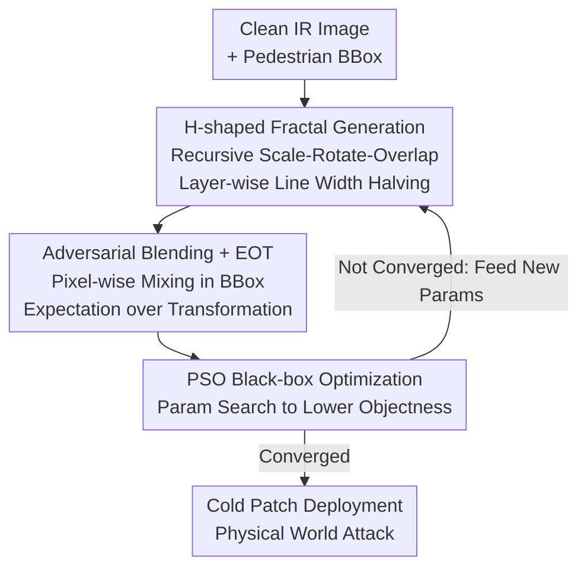

# Fractal Camouflage: A Bio-Inspired Approach for Multi-Scale Adversarial Attacks in the Infrared Domain

**Conference**: CVPR 2026  
**Paper**: [CVF Open Access](https://openaccess.thecvf.com/content/CVPR2026/html/Hu_Fractal_Camouflage_A_Bio-Inspired_Approach_for_Multi-Scale_Adversarial_Attacks_in_CVPR_2026_paper.html)  
**Code**: https://github.com/wangxinwangxin123/AdvFractal  
**Area**: AI Security / Physical Adversarial Attacks  
**Keywords**: Infrared Pedestrian Detection, Physical Adversarial Attack, Fractal Geometry, Multi-scale Attack, Black-box Attack  

## TL;DR
Aiming at infrared pedestrian detectors, this work generates "cross-scale effective" physical adversarial perturbations (cold patches attached to clothing) using the natural self-similar structure of H-shaped fractals. Parameters are searched under black-box conditions using Particle Swarm Optimization (PSO), achieving a physical world ASR of 97.54% and a cross-dataset ASR of 99.16%, significantly outperforming existing single-scale methods.

## Background & Motivation

**Background**: Infrared object detection is the core of all-weather systems such as autonomous driving and surveillance, but like visible light detectors, it is susceptible to adversarial attacks. The mainstream approach for infrared physical attacks is to attach "cold patches" (which appear as dark areas in infrared cameras by maintaining low temperatures) or embed heating elements to create perturbation patterns that cause detectors to miss pedestrians.

**Limitations of Prior Work**: Existing infrared physical attacks (HCB, AdvIB, AdvIC, AdvICRS, etc.) are almost all designed and optimized for **a specific distance/scale**. The patterns are manually designed or uniformly generated, limited by a fixed "receptive field/granularity." Consequently, perturbations effective for nearby pedestrians fail as they move further away, and vice versa.

**Key Challenge**: Modern detectors use **Feature Pyramids** to process objects at different scales. A perturbation optimized for only one feature layer becomes ineffective at another. Fixed-granularity perturbations cannot simultaneously interfere with all levels of the pyramid, which is the root cause of poor utility in single-scale attacks.

**Goal**: Create a "naturally multi-scale" perturbation—where the same pattern can deceive the detector across different distances and resolutions.

**Key Insight**: The authors start from the self-similarity of **fractal geometry**. Fractals present the same structure across infinitely repeated scales, naturally possessing "multi-level details." If the perturbation itself is fractal, it simultaneously contains coarse structures (to interfere with global contours/semantic layers) and fine structures (to interfere with local texture layers), eliminating the need for separate designs for each scale.

**Core Idea**: Use **H-shaped fractals** as the perturbation generator to recursively scale, rotate, and superimpose a cross-scale self-similar adversarial pattern. PSO is then used to search for optimal parameters in a black-box setting—replacing "fixed-granularity patterns" with "self-similar geometry" to solve the multi-scale failure problem in infrared attacks.

## Method

### Overall Architecture
AdvFractal is a black-box physical adversarial attack. It takes a clean infrared image containing a pedestrian as input and generates multi-layer H-shaped fractal patterns within the target bounding box. The parameters of the fractal (center, number of layers, length, rotation angles of each layer) are iteratively optimized by PSO under the EOT framework, aiming to suppress the detector's confidence for the pedestrian below 0.5. The optimized patterns are manufactured into cold patches and deployed in the real world.

The crucial "multi-scale" capability comes from a **layer-by-layer refinement** strategy: at each deeper layer, the line width is halved. Thus, the coarse patterns of the initial layers disrupt global contours and semantic features, while the fine patterns of deeper layers interfere with local textures and detail features—a single perturbation covers all levels of the detector's feature pyramid simultaneously.

### Key Designs

**1. H-shaped Fractal Geometry: Natural Multi-scale Coverage via Self-Similarity**

This step directly addresses the pain point that "fixed-granularity perturbations are only effective for a single scale." Instead of simple shapes, the authors use the H-shape as a basic generator to recursively grow the fractal. Let the $k$-th fractal layer be $H_k$, with center $(x^{(k)},y^{(k)})$, length $L^{(k)}$, and orientation $\theta^{(k)}$. The recursive generation rule performs a scaling transformation $S_p$ centered at each endpoint of the current layer with a scaling factor $r$:

$$H_{k+1} = \bigcup_{p\in E(H_k)} S_p(H_k)$$

where $E(H_k)$ is the set of endpoints of $H_k$. Parameters are updated with the layer depth as $L^{(k+1)} = r\cdot L^{(k)}$, $\theta^{(k+1)} = \theta^{(k)} + \phi^{(k)}$ (where $\phi^{(k)}$ is the additional rotation angle for the $k$-th layer). Child node coordinates are calculated via rotation transforms: $\Delta x = d_x\cos\theta^{(k)} - d_y\sin\theta^{(k)}$, $\Delta y = d_x\sin\theta^{(k)} + d_y\cos\theta^{(k)}$, where $(d_x,d_y)$ are offsets from the center to the four endpoints of the H. Combined with a "layer-wise line width halving" progressive refinement, shallow coarse strokes correspond to global contours and deep fine strokes correspond to local textures, allowing **a single perturbation to strike every layer of the feature pyramid simultaneously**.

**2. Adversarial Blending + EOT Physical Robustness: Real-world Deployment**

This addresses the "effective in digital but fails on clothing" physical implementation issue. The fractal $S(z)$ is generated by a parameter vector $z=[(x,y),L,\theta,l]$. It is blended pixel-wise with the clean infrared image $I$ within the target area mask $M$ via a blending function $O$: $I_{adv} = O(I, S(z), M)$, where $I\odot S(z)$ is taken within the mask and $I$ remains unchanged outside (the fractal is rendered black to simulate the dark imaging of cold patches in infrared). To resist real-world variations in scale, rotation, brightness, and noise, the authors employ the Expectation over Transformation (EOT) framework, taking the expectation over a set of physical transformation distributions $T$:

$$I_{adv} = \mathbb{E}_{t\sim T}\,[\,t(I_{adv})\,]$$

The resulting optimized pattern is effective under the "average of various shooting conditions" rather than being overfitted to a single clean image—this is the critical engineering support for its physical ASR (97.54%).

**3. PSO Black-box Parameter Optimization: Optimal Fractal Search via Detector Outputs**

Given the constraint that gradients cannot be obtained in a black-box setting, the objective is to minimize the detector $f$'s objectness confidence $y_{obj}$ for the pedestrian: $\arg\min_{S(z)} \mathbb{E}_{t\sim T}\big(y_{obj}\leftarrow f(t(I_{adv}))\big)$. Each particle encodes a complete fractal configuration $z_i=[(x_i,y_i),L_i,(\theta_{i1},\dots),(l_{i1},\dots)]$ (center coordinates, layers, rotation angles, and line lengths for each layer). PSO updates velocity and position based on inertia + individual best + global best:

$$v_a^{b+1} = \omega v_a^b + c_1 r_1(z_{a,best}^b - z_a^b) + c_2 r_2(z_{best}^b - z_a^b)$$

Position is updated via $z_i^{b+1} = z_i^b + v_i^{b+1}$. Compared to white-box gradient attacks, it requires no internal model information and can attack detectors with different architectures. The authors also compared GA and DE evolutionary algorithms; while ASR was similar, PSO showed better query efficiency (average number of queries), thus it was adopted throughout.

### Loss & Training
No learnable weights are involved; "training" refers to searching for fractal parameters using PSO. Settings: population 40, iterations 50, inertia $\omega=0.7$, cognitive/social coefficients $C_1=C_2=1.5$, $r_1,r_2\in[0,1]$. Fractal length ratio $\in[0.2,0.8]$ (relative to box width), depth $d\in[1,4]$, rotation angle $\in[0,2\pi)$, line width decreases by a fixed ratio layer-by-layer, color is black. Based on attack effectiveness and physical feasibility, a configuration of **3 layers and a length ratio of 0.4** was selected. The task is a "disappearance attack": success is defined as the detector's confidence dropping below 0.5.

## Key Experimental Results

Evaluation metrics: ASR (Attack Success Rate, proportion of samples with confidence $<0.5$) and AQ (Average Queries per image, lower is more efficient). 10 detectors were trained on FLIR V1-3 subsets and evaluated across 5 infrared datasets.

### Main Results (Cross-dataset + Black-box Baseline Comparison)

| Comparison Dimension | Metric | AdvFractal | Best Baseline | Description |
|----------|------|-----------|----------|------|
| Cross-dataset Mean (5 sets) | ASR / AQ | **99.16% / 38.20** | AdvICRS 90.40% / 90.74 | Higher ASR with over 50% fewer queries |
| Physical World (5.2–9.4m) | ASR | **97.54%** | AdvIB 86.30% | Stable under real distance variations |
| Digital Domain (10 Det. Avg) | ASR / AQ | **89.35% / 238.12** | AdvICRS 87.20% / 156.40 | Optimal ASR (Queries slightly higher than AdvIC/AdvICRS) |

Cross-dataset details: HCB and AdvIB cross-set ASR was below 50% with queries >400; AdvIC reached 94.80% on FLIR but dropped to 67.30%/47.30% on LLVIP/MSRS (mean only 73.18%); AdvFractal maintained near-perfect scores across all 5 datasets.

### Ablation Study (Fractal Depth / Optimization Algorithm / Length Ratio)

| Configuration | Key Metrics (ASR / AQ) | Description |
|------|---------------------|------|
| Depth 1, Length 0.4, PSO | 96.82% / 130.97 | Shallow layer sufficient for near distance, poor for far |
| Depth 3, Length 0.4, PSO (Adopted) | 99.36% / 22.64 | Best balance of attack strength and query efficiency |
| Depth 4, Length 0.4, PSO | 100% / 10.92 | Slightly better but physical feasibility decreases |
| Depth 3 + GA / DE (Same config) | ≈99.36% / 46–52 | Similar ASR, query efficiency inferior to PSO |

Robustness across 10 detectors (Table 2): Mean 89.35% ASR, 238.12 AQ. Reached 100% for Libra R-CNN, YOLOF, and Deformable-DETR; >95% for YOLOv3/Mask R-CNN/Faster R-CNN/YOLOX. However, it was only ~60% for DETR and RetinaNet—the two most difficult architectures to attack.

### Key Findings
- **Depth is the key to physical multi-scale robustness**: In physical experiments, Depth-1 ASR plummeted to 0.01% at 9.4m, while Depth-3 maintained 98.67%; mean ASR was 97.54% (Depth-3) vs. 82.87% (Depth-1). This directly validates the core hypothesis: "self-similar multi-levels = cross-scale effectiveness."
- **PSO selection based on efficiency**: GA, DE, and PSO achieved similar ASR, but PSO was superior in reducing query counts.
- **Stealthiness ranks second**: In subjective scoring by 40 people (0-10), AdvFractal scored 6.17, second only to AdvIC (6.73), and significantly higher than other baselines—strong attack yet inconspicuous.
- **Difficult Detectors**: DETR and RetinaNet showed strong robustness under physical transfer (RetinaNet/YOLOF had 0% physical ASR), indicating limitations against specific architectures.

## Highlights & Insights
- **Mapping "Fractal Self-Similarity" to "Feature Pyramid Multi-levels"**: This is the cleverest aspect—detectors inherently process scales in layers, so the perturbation uses fractals to naturally cover those layers. Matching structures to structures eliminates the need for per-scale perturbation design. This approach is transferable to any task with multi-scale features.
- **Layer-wise Line Width Halving**: A simple engineering constraint achieves a "coarse-to-fine" scale gradient without complex multi-objective optimization.
- **SOTA under Black-box + Physical Constraints**: Requires no model internals and can be manufactured as real cold patches, making the real-world threat much higher than pure digital attacks.
- The combination of evolutionary search (PSO) and EOT for physical adversarial attacks provides a reusable template for "gradient-free + physical-robust" recipes.

## Limitations & Future Work
- **Significant failure on some detectors**: Digital domain ASR is only ~60% for DETR/RetinaNet, and physical transfer to RetinaNet/YOLOF hits 0%—detectors based on attention or different pyramid designs are naturally more robust to this attack.
- **Performance dip at medium distances**: Physical experiments show a slight ASR drop in the 6.4–8.2m range, suggesting "cross-scale consistency" is not yet perfect.
- **Limited to disappearance attacks + pedestrians**: Only missed detections for pedestrians were verified; targeted misclassification or other categories were not addressed. Generalization remains to be tested for other tasks.
- **Query efficiency not yet optimal**: Digital AQ (238) is higher than AdvIC/AdvICRS; black-box query costs still have room for optimization.
- Future directions: Designing self-similar perturbations specifically for DETR-like attention detectors; making fractal depth adaptive to distance rather than fixed at 3 layers.

## Related Work & Insights
- **vs. White-box IR Attacks (BulbAttack / QRattack / AIP / AdvCloth)**: These require internal model access, have fixed-scale patterns, and limited receptive fields. Ours is black-box, naturally multi-scale, and easier to deploy (cold patches vs. heating elements).
- **vs. Black-box Cold Patch Methods (HCB / AdvIB / AdvIC)**: These use low-cost flexible cold patches but remain fixed-granularity and sensitive to clothing wrinkles/body movement. AdvFractal's self-similar design is stable across scales, with cross-dataset means >20 percentage points higher.
- **vs. Curve-based (AdvICRS)**: AdvICRS uses Catmull–Rom splines for more natural/smooth perturbations and is cross-set robust (90.40%), but stays at a single granularity. Ours is superior in ASR (99.16% vs 90.40%) and query efficiency (38 vs 91). The core difference is "fractal multi-levels vs. single-granularity smooth curves."

## Rating
- Novelty: ⭐⭐⭐⭐⭐ First to use fractal self-similar geometry for infrared adversarial attacks; the alignment with feature pyramids is elegant.
- Experimental Thoroughness: ⭐⭐⭐⭐⭐ Comprehensive coverage including 10 detectors, 5 datasets, physical world tests, subjective stealthiness, and depth/algorithm ablations.
- Writing Quality: ⭐⭐⭐⭐ Clear logic and complete formulas, though some notation (blending $\odot$, EOT expectation) is slightly brief.
- Value: ⭐⭐⭐⭐ Reveals real physical security risks of infrared detection systems, posing a significant threat to autonomous driving and surveillance.

<!-- RELATED:START -->

## Related Papers

- [\[CVPR 2026\] A Sanity Check for Multi-In-Domain Face Forgery Detection in the Real World](a_sanity_check_for_multi-in-domain_face_forgery_detection_in_the_real_world.md)
- [\[AAAI 2026\] Rethinking Target Label Conditioning in Adversarial Attacks: A 2D Tensor-Guided Generative Approach](../../AAAI2026/ai_safety/rethinking_target_label_conditioning_in_adversarial_attacks_a_2d_tensor-guided_g.md)
- [\[CVPR 2026\] Towards Stealthy and Effective Backdoor Attacks on Lane Detection: A Naturalistic Data Poisoning Approach](towards_stealthy_and_effective_backdoor_attacks_on_lane_detection_a_naturalistic.md)
- [\[CVPR 2026\] Multi-Paradigm Collaborative Adversarial Attack Against Multi-Modal Large Language Models](multi-paradigm_collaborative_adversarial_attack_against_multi-modal_large_langua.md)
- [\[CVPR 2026\] FedDAP: Domain-Aware Prototype Learning for Federated Learning under Domain Shift](feddap_domain-aware_prototype_learning_for_federated_learning_under_domain_shift.md)

<!-- RELATED:END -->
