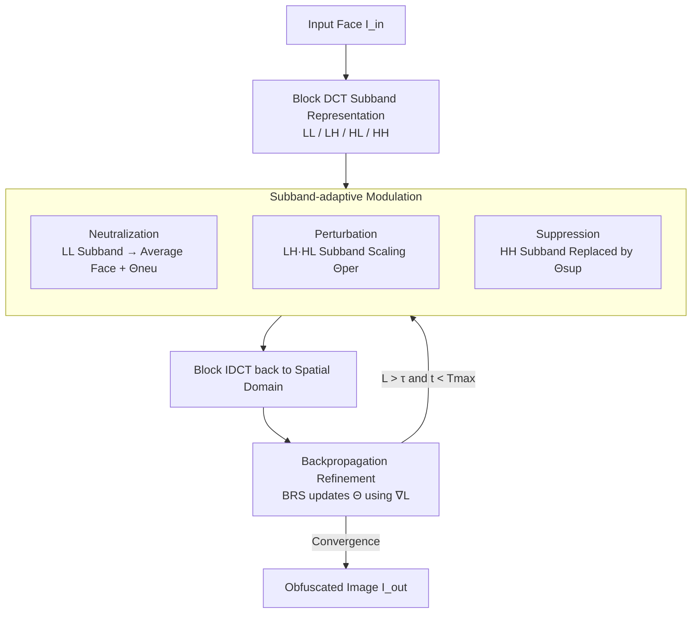

# Frequency-domain Manipulation for Face Obfuscation

**Conference**: CVPR 2026  
**Paper**: [CVF Open Access](https://openaccess.thecvf.com/content/CVPR2026/html/Kim_Frequency-domain_Manipulation_for_Face_Obfuscation_CVPR_2026_paper.html)  
**Code**: https://github.com/mcljtkim/FreM  
**Area**: AI Security / Privacy Protection / Face Obfuscation  
**Keywords**: Face Obfuscation, Frequency-domain Manipulation, DCT Subbands, Privacy Protection, Reconstruction Attack Robustness

## TL;DR
FreM shifts face obfuscation from the spatial domain to the frequency domain: it first decomposes the face into LL, LH, HL, and HH subbands using block DCT, applies specialized "Neutralization / Perturbation / Suppression" modules for differentiated processing of each subband, and then refines parameters image-by-image via backpropagation. It achieves a balance between being "unrecognizable to humans + recognizable to machines" while demonstrating significantly stronger robustness against reconstruction attacks (achieving the lowest PSNR).

## Background & Motivation
**Background**: Large-scale face datasets are fundamental resources for tasks such as face recognition, age estimation, and expression recognition. However, faces inherently carry identifiable identity information, raising privacy concerns. Privacy enhancement technologies are divided into two categories: **face anonymization** (masking/blurring/face swapping, where even machines cannot recognize the identity) and **face obfuscation** (aiming to make identities unrecognizable to humans while retaining machine-decipherable cues, i.e., machine decipherability, MD). This paper focuses on the latter.

**Limitations of Prior Work**: Face obfuscation has long been constrained by the inherent trade-off between "Human Impenetrability (HI) $\leftrightarrow$ Machine Decipherability (MD)"—stronger HI usually leads to worse MD, and vice versa. More critically, even methods like Forbes and IdentityHider, which balance HI/MD relatively well, still **cannot withstand reconstruction attacks**: an attacker can train a U-Net encoder-decoder to reconstruct the original face from the obfuscated image.

**Key Challenge**: The authors identify the root cause: existing methods operate almost exclusively in the **spatial domain**, manipulating spatially adjacent pixel values, which inevitably leaves **structural information** (skin texture, head shape contours, etc.). These residues are precisely what reconstruction attacks exploit. Spatial operations cannot decouple and independently control "identity cues, task-related cues, and anti-tampering components."

**Key Insight**: The authors draw inspiration from **robust image watermarking**—watermarking techniques use frequency-domain representations to hide information in subbands that are "perceptually invisible but resistant to tampering." Inspired by this, the authors argue that the frequency domain is a more suitable battlefield: different frequency subbands naturally contribute differently to HI, MD, and robustness, allowing for **independent regulation per subband**.

**Core Idea**: Decompose the face into LL/LH/HL/HH subbands using block DCT and apply "targeted" modulation based on each subband's characteristics—Neutralization for identity in low frequencies, Perturbation for MD in middle frequencies, and Suppression for reconstruction resistance in high frequencies—followed by a training-free, image-specific optimization to refine these parameters.

## Method

### Overall Architecture
FreM generates an obfuscated image $I_{out}$ from an input image $I_{in}$ while satisfying three objectives: Human Impenetrability (HI), Machine Decipherability (MD), and robustness against reconstruction attacks. The entire process is a three-stage pipeline: **① Block DCT subband representation** $\rightarrow$ **② Subband-adaptive modulation** (three frequency-specific modules managing different subbands) $\rightarrow$ **③ Backpropagation refinement** (updating modulation parameters per image). Finally, block IDCT converts the representation back to the spatial domain to obtain $I_{out}$. Crucially, the entire method is **training-free**—it does not train any obfuscation network but leverages a pre-trained face analysis network $\mathcal{F}$ as a "judge" to perform parameter optimization for each test image individually.

### Key Designs

**1. Block DCT subband representation: Shifting the battlefield from spatial to frequency domain**

To address the root cause where "spatial operations leave structural residues exploited by reconstruction attacks," FreM first changes the domain. It performs **block** DCT (block size $P=8$) on the input image $I_{in}\in\mathbb{R}^{H\times W\times 3}$ rather than a global DCT on the entire image. Block DCT provides **localized** frequency representations where each block has only a few significant coefficients, which is efficient and facilitates interpretable manipulation. Each $P\times P$ block $B$ is transformed into a coefficient matrix $C$, which is then split into four subbands based on vertical and horizontal frequencies: $C_{LL}$ (low frequency), $C_{LH}$, $C_{HL}$ (middle frequency), and $C_{HH}$ (high frequency). The significance of this step is that in the frequency domain, identity cues (concentrated in low frequencies), task-related discriminative cues (middle frequencies), and anti-tampering components (high frequencies) are naturally distributed across different subbands, allowing them to be **independently controlled**—a decoupling that the spatial domain cannot achieve.

**2. Subband-adaptive modulation: Targeted treatment via frequency-specific modules**

This is the core of FreM. The authors assign a module with learnable parameters $\Theta$ to each of the three types of subbands, respectively handling HI, MD, and robustness:

- **Neutralization (applied to LL low frequency)**: LL contains dominant identity information and is critical for HI. The approach involves calculating an **average face** from a face dataset, transforming it to the DCT domain to obtain $\bar{C}_{LL}$, and adding learnable parameters $\Theta_{neu}$:
$$\hat{C}_{LL} = \bar{C}_{LL} + \Theta_{neu}$$
where $\Theta_{neu}\sim\mathcal{N}(0,\sigma_{neu}^2)$ ($\sigma_{neu}=0.5$). Using the average face as a baseline removes individual identity while preserving coarse facial structure (preventing total blurriness that would sacrifice MD), while $\Theta_{neu}$ introduces small perturbations around the average face to further enhance HI.

- **Perturbation (applied to LH/HL middle frequency)**: These subbands are nearly invisible to humans but contain discriminative cues beneficial for MD. The approach applies **element-wise scaling** to the coefficients:
$$\hat{C}_f = C_f \odot \Theta_f,\quad f\in\{LH, HL\}$$
$\Theta_{per}=\{\Theta_{LH},\Theta_{HL}\}$ are all **initialized to 1**, ensuring the starting point retains all MD cues, and their magnitudes are fine-tuned during the refinement stage to enhance MD without compromising HI.

- **Suppression (applied to HH high frequency)**: HH is nearly invisible to humans but significantly impacts reconstruction attacks. The approach is the most aggressive—**directly replacing the original $C_{HH}$ entirely** with $\Theta_{sup}\sim\mathcal{N}(0,\sigma_{sup}^2)$ ($\sigma_{sup}=1$), where $\sigma_{sup}$ controls the high-frequency suppression strength. Completely scrambling the high-frequency components prevents attackers from reconstructing identity based on them.

Each of the three modules manages a specific frequency range and serves a specific goal. This "subband-based division of labor" is the key distinction of FreM compared to older frequency-domain methods that only perform channel selection/shuffling/masking on DCT without differentiating subband roles.

**3. Backpropagation Refinement (BRS) + Dual Objective Function: Training-free per-image optimization**

To address the inherent HI/MD trade-off, FreM does not train a network but uses a Backpropagating Refinement Scheme (BRS): the weights of a pre-trained face analysis network $\mathcal{F}$ are **frozen**, and only the parameters $(\Theta_{neu},\Theta_{per},\Theta_{sup})$ are iteratively updated for each input image to minimize the objective function:
$$\mathcal{L} = \mathcal{L}_{MD} + \lambda_{CEC}\,\mathcal{L}_{CEC}$$
The MD loss encourages the obfuscated image to be similar to the original image in the feature space of $\mathcal{F}$, thereby preserving machine decipherability:
$$\mathcal{L}_{MD} = 1 - \mathcal{F}(I_{in})^{T}\mathcal{F}(I_{out})$$
However, relying solely on $\mathcal{L}_{MD}$ might amplify low-frequency coefficients to improve MD, which "feeds back" human-perceptible identity cues. To prevent this, the **Coefficient Energy Constraint (CEC) loss** $\mathcal{L}_{CEC}$ is introduced to ensure the $\ell_1$ energy of the modulated coefficients $\hat{C}$ does not exceed that of the original coefficients $C$:
$$\mathcal{L}_{CEC} = \big|\,\|\hat{C}\|_1 - \|C\|_1\,\big|$$
This maintains the "identity-neutral" state established by Neutralization and stabilizes the IDCT while suppressing overflow artifacts. Refinement is performed independently for each test image until $\mathcal{L}_{MD}$ falls below a threshold $\tau=0.4$ or the maximum iterations $T_{max}=50$ are reached, ensuring at least a minimum MD requirement is met.

### Loss & Training
No network training. Per-image optimization uses Adam with a learning rate of $10^{-3}$, $\lambda_{CEC}=10^{-2}$, $T_{max}=50$, threshold $\tau=0.4$, block size $P=8$, $\sigma_{neu}=0.5$, and $\sigma_{sup}=1$. Experiments were conducted on an RTX 3090.

## Key Experimental Results

### Main Results
Validated across 10 datasets and 4 types of tasks. IResNet50 (ArcFace loss) is used as the analysis network for face recognition, evaluating two protocols: XDR (obfuscated vs. original pairs) and ODR (obfuscated vs. obfuscated pairs); $R_{rec}$ denotes reconstruction robustness (PSNR between reconstructed and original images, lower is harder to reconstruct and thus better).

| Method | LFW (XDR/ODR) | CPLFW (XDR/ODR) | CFP-FP (XDR/ODR) | $R_{rec}$↓ | Runtime (ms) |
|------|---------------|-----------------|------------------|-----------|---------|
| Original | 99.83 / - | 91.80 / - | 97.26 / - | - | - |
| PRO-Face (FaceShifter) | 96.48 / 95.78 | 82.70 / 72.72 | 91.83 / 77.39 | 36.12 | 32.41 |
| Forbes | 95.72 / 82.77 | 83.53 / 71.68 | 86.73 / 71.54 | 22.96 | 739.57 |
| IdentityHider | 99.08 / 98.48 | 87.87 / 83.27 | 91.49 / 87.14 | 15.33 | 68.14 |
| **Ours (FreM)** | **99.53 / 98.67** | **90.91 / 86.88** | **94.41 / 90.74** | **13.59** | 67.19 |

FreM achieves the top performance in 8 out of 10 categories across 5 benchmarks and 2 protocols, and second in the remaining 2; it achieves the lowest $R_{rec}$ (hardest to reconstruct). The runtime is approximately 67ms, comparable to IdentityHider (which relies on extra trained networks) but over 10 times faster than Forbes (also training-free). FreM remains stable over ten random seeds (XDR 99.5±0.1, ODR 98.7±0.2), indicating low sensitivity to initialization.

Cross-task generalization (compared with training-free Forbes; smaller MD degradation is better):

| Task / Dataset | Metrics | Original | Forbes | Ours |
|---------------|------|----------|--------|------|
| Age Estimation MORPH II | MAE↓ / CS%↑ | 2.24 / 94.6 | 3.38 / 77.4 | 2.41 / 91.8 |
| Expression Rec. RAF-DB | Acc.↑ | 85.95 | 75.23 | 83.02 |
| Attribute Class. CelebA | mAcc.↑ | 90.35 | 88.11 | 88.80 |

MD degradation for FreM is significantly smaller than for Forbes across three additional tasks, verifying its universality.

### Ablation Study
Ablation of subband modules (Face Recognition task; Acc.↑ for MD, PSNR↓ for reconstruction resistance):

| Configuration | $\bar{C}_{LL}$ | $\Theta_{neu}$ | $\Theta_{per}$ | $\Theta_{sup}$ | Acc. | PSNR |
|------|:---:|:---:|:---:|:---:|------|------|
| (1) | ✓ | ✓ | | | 99.15 | 16.45 |
| (2) | ✓ | ✓ | ✓ | | 99.61 | 16.72 |
| (3) | | | ✓ | ✓ | 98.13 | 13.23 |
| (4) Full | ✓ | ✓ | ✓ | ✓ | 99.50 | 13.59 |

Hyperparameter ablation:

| Ablation Item | Values | Conclusion |
|--------|------|------|
| Block size $P$ | 4 / **8** / 16 / 28 / 112 | Acc. 99.52 at $P=8$ is most stable; too small lacks local frequency info, $P\geq16$ weakens local subband manipulation |
| Subband split $P_L$ | 1…7 | Best Acc. 99.52 at $P_L=4$ |

### Key Findings
- **Perturbation improves MD, Suppression ensures robustness**: Comparing (1) and (2), adding Perturbation increases Acc. from 99.15 to 99.61, but PSNR remains high (16.72, easy to reconstruct); adding Suppression (3)(4) drops PSNR to around 13, proving that **reconstruction resistance mainly relies on high-frequency suppression in HH**.
- **Average face baseline is key for MD**: Comparing (3) and (4), adding neutralization with $\bar{C}_{LL}$ (preserving coarse facial structure) raises Acc. from 98.13 to 99.50, demonstrating that Neutralization requires "structural retention" rather than simple erasure to maintain MD.
- **Spatial vs. Frequency domain**: Qualitative results show PRO-Face/IdentityHider barely disrupt facial structure, and Forbes retains skin textures and head shapes; FreM's global frequency processing ensures reconstructed images cannot recover any identifiable identity.

## Highlights & Insights
- **Solving the HI/MD/Robustness trilemma via subband division of labor**: Assigning three competing goals to LL, middle-frequency, and HH segments for independent optimization avoids the "whack-a-mole" problem in the spatial domain. This decoupling by subband functionality can be transferred to any signal processing task with conflicting constraints.
- **Privacy via watermarking expertise**: The author cleverly adapts the watermarking paradigm—hiding anti-tampering info in invisible subbands—to counter reconstruction attacks.
- **Training-free + Per-image optimization**: BRS replaces "training an obfuscation network" with "temporary optimization steps per image," avoiding the need to retrain when the underlying analysis network is updated and naturally adapting to different judge networks for various tasks.
- **Insight into $\mathcal{L}_{CEC}$**: The author noted that pursuing MD could compromise HI (by magnifying low-frequency coefficients and reintroducing identity cues) and used an $\ell_1$ energy constraint to maintain neutrality, which is a very practical design choice.

## Limitations & Future Work
- **Difficulty in quantifying HI**: The authors admit that human impenetrability is subjective and hard to quantify. HI in the paper relies mainly on qualitative figures and supplementary material, lacking a unified objective HI metric for rigorous "who is more unrecognizable" comparisons.
- **Overhead of per-image optimization**: Although 10x faster than Forbes, each image still requires up to 50 iterations (~67ms/image), which may be costly for batch obfuscation of massive datasets; reliance on a pre-trained analysis network as a judge means the choice of judge directly impacts MD.
- **Average face dependency on dataset statistics**: $\bar{C}_{LL}$ used for Neutralization comes from face dataset averages; whether the average face still "erases identity while preserving structure" for target populations with large ethnic/age distribution shifts needs verification.
- **Insufficient evaluation of white-box/adaptive attacks**: Reconstruction robustness is only tested against black-box U-Net attacks. It remains questionable whether random HH replacement is still robust against an adaptive attacker aware of the frequency domain mechanism.

## Related Work & Insights
- **vs. Forbes (also a training-free BRS method)**: Forbes iterates in the spatial domain using parameterized **local spatial filters**, while this work operates in the **frequency domain via subbands**. The result is that FreM significantly leads in reconstruction resistance (PSNR 13.59 vs 22.96) and speed (67ms vs 740ms), with the core difference being structural residue in spatial vs. decoupling in frequency.
- **vs. PRO-Face / IdentityHider (Training-based)**: These require training specialized obfuscation networks for specific face analysis tasks, necessitating retraining if the analysis model updates, leading to poor adaptability and focus only on face recognition. FreM is training-free and can cover multi-tasking (age/expression/attribute) just by changing the judge network.
- **vs. Early DCT Obfuscation Methods**: Previous frequency methods only performed channel selection/shuffling/masking of DCT coefficients **without distinguishing subband roles**. FreM provides each subband with a dedicated module, achieving a better HI-MD-Robustness trade-off by borrowing subband-level processing from watermarking.

## Rating
- Novelty: ⭐⭐⭐⭐ Systematic shift of face obfuscation to the frequency domain with functional subband division; clear and solid cross-domain inspiration from watermarking.
- Experimental Thoroughness: ⭐⭐⭐⭐ 10 datasets across 4 tasks + reconstruction attacks + multiple random seeds + complete ablation; lacks objective HI quantification.
- Writing Quality: ⭐⭐⭐⭐ Logical chain of Motivation—Challenge—Method is clear; three modules perfectly align with three goals; well-illustrated.
- Value: ⭐⭐⭐⭐ Training-free, fast, and high reconstruction resistance; direct practical value for private dataset release.

<!-- RELATED:START -->

## Related Papers

- [\[CVPR 2026\] A Sanity Check for Multi-In-Domain Face Forgery Detection in the Real World](a_sanity_check_for_multi-in-domain_face_forgery_detection_in_the_real_world.md)
- [\[CVPR 2026\] FedDAP: Domain-Aware Prototype Learning for Federated Learning under Domain Shift](feddap_domain-aware_prototype_learning_for_federated_learning_under_domain_shift.md)
- [\[CVPR 2026\] Forensic-Friendly Image Manipulation via Controllable Latent Diffusion](forensic-friendly_image_manipulation_via_controllable_latent_diffusion.md)
- [\[CVPR 2026\] UniDef: Universal Defense Against Unauthorized Image Manipulation](unidef_universal_defense_against_unauthorized_image_manipulation.md)
- [\[CVPR 2026\] A Unified Perspective on Adversarial Membership Manipulation in Vision Models](a_unified_perspective_on_adversarial_membership_manipulation_in_vision_models.md)

<!-- RELATED:END -->
