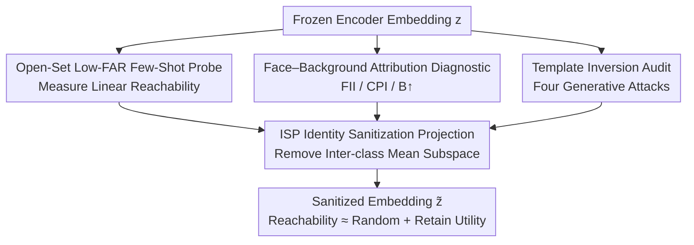

# From Measurement to Mitigation: Quantifying and Reducing Identity Leakage in Image Representation Encoders with Linear Subspace Removal

**Conference**: CVPR 2026  
**Paper**: [CVF Open Access](https://openaccess.thecvf.com/content/CVPR2026/html/George_From_Measurement_to_Mitigation_Quantifying_and_Reducing_Identity_Leakage_in_CVPR_2026_paper.html)  
**Code**: N/A (Authors declare that the projector and evaluation toolkit will be open-sourced)  
**Area**: AI Security / Privacy Protection  
**Keywords**: Identity Leakage, Face Privacy, Representation Encoder, Subspace Removal, Open-Set Verification

## TL;DR
This work systematically quantifies identity leakage in frozen vision encoders like CLIP / DINOv2/v3 / SSCD on facial data from an attacker's perspective (open-set low-FAR verification + template inversion + face-background attribution). It proposes ISP, a one-time closed-form projection that linearly removes the identity subspace from embeddings, reducing linear probes to near-random performance with almost no loss in retrieval or classification utility.

## Background & Motivation

**Background**: "Integrity" systems—such as large-scale retrieval, near-duplicate search, and forgery/deepfake detection—rely heavily on frozen vision encoders (CLIP, DINOv2/v3, SSCD) coupled with ANN indices for vector search. These encoders are trained **without any identity supervision** and are utilized as general similarity feature extractors.

**Limitations of Prior Work**: When these non-face recognition (non-FR) encoders are applied to data containing faces, operators face a dilemma: the invariances that make features robust for search/integrity tasks might simultaneously expose residual biometric cues. The issue is that such identity leakage **has almost never been measured at realistic deployment operating points**. Deployers are concerned with pairwise similarity decisions under open-set conditions (testing on identities unseen during training) and low False Acceptance Rates (FAR between $10^{-4}$ and $10^{-6}$ to control the absolute number of impersonation passes across billions of comparisons). Existing interpretability tools (saliency maps, concept directions) provide logit or saliency for single images but do not offer operational thresholds or measured error rates. Thus, they cannot answer the question critical to attackers: "Is identity information linearly reachable at low FAR?" For DINOv2/v3 and SSCD, **no such measurement existed prior to this work**.

**Key Challenge**: Compliance scenarios (GDPR/CCPA restrictions on using face recognition) force the use of non-FR encoders for identity-related integrity tasks, yet the privacy attributes of these encoders have not been characterized under adversarial threat models—neither the extent of leakage nor directly deployable mitigation methods are known.

**Goal**: (1) Provide an attacker-calibrated face privacy audit for non-FR encoders; (2) Provide an auditable, low-latency mitigator without retraining the encoders.

**Key Insight**: The authors hypothesize that identity signals in non-FR embeddings are **concentrated in a compact, transferable low-rank subspace**. If this holds, a single closed-form linear projection can remove the subspace entirely while preserving the complementary subspace useful for retrieval.

**Core Idea**: Utilize a "measurement suite + one-time moment projection." First, leakage is quantified using open-set low-FAR probes, template inversion, and face-background attribution. Then, ISP (Identity Sanitization Projection), based on class-mean moments, is used to project out the inter-class mean subspace of identities, suppressing linear identity reachability to near-random levels.

## Method

### Overall Architecture

The paper follows a "measurement first, mitigation later" closed-loop approach. Given a frozen encoder $f$, images are encoded into $\ell_2$-normalized embeddings $z = f(x)/\|f(x)\|_2 \in \mathbb{R}^d$. The measurement side uses three complementary diagnostics to examine residual identity information: linear probes measuring **reachability**, face-background attribution measuring **spatial localization**, and template inversion measuring **generative recoverability**. The mitigation side uses the ISP projector to remove the estimated identity subspace, yielding sanitized embeddings $\tilde z = Pz/\|Pz\|_2$, which are then re-evaluated to verify that linear reachability drops to near-random while utility remains intact.

The flowchart below illustrates the audit-to-mitigation workflow:

### Key Designs

**1. ISP Identity Sanitization Projection: Closed-form orthogonal projection using class-mean moments to remove linearly separable identity directions.**

**Design Motivation**: Based on Fisher/Mahalanobis geometry, under homoscedasticity, linear separability across identities is dominated by the **inter-class mean subspace**. If $M=[\mu_i-\mu_C]\in\mathbb{R}^{d\times m}$ stacks the centered identity means, the discriminative directions are the top left singular vectors of $M$. Projecting embeddings onto the orthogonal complement of these top-$r$ directions ensures that any linear verifier $w^\top z$ loses identity margins ($w^\top(\mu_i-\mu_j)\approx 0$) at test time.

**Mechanism**: The construction uses only class means without covariance inversion: first calculate the mean of each identity $\mu_i=\frac1n\sum_j z_i^j$ and the global mean $\mu_C=\frac1m\sum_i\mu_i$. Centering yields $\tilde\mu_i=\mu_i-\mu_C$ (to average out intraclass variations like pose/lighting/background). Let $M=[\tilde\mu_1,\dots,\tilde\mu_m]$. Use thin SVD $M=U\Sigma V^\top$ to get the top $r$ left singular vectors $U_r$. The projector and sanitized features are:

$$P = I - U_r U_r^\top,\qquad \tilde z = \frac{Pz}{\|Pz\|_2}.$$

The authors use a variant **without $\Sigma_w^{-1/2}$ whitening** for numerical stability and speed. It results in a fixed $d\times d$ matrix $P$, fitted once offline via SVD. Inference is a single matrix multiplication with sub-millisecond latency. The rank $r$ acts as an auditable privacy-utility knob.

**2. Open-Set Low-FAR Few-Shot Probe: Quantifying linear reachability at real attacker deployment points.**

**Function**: This addresses the lack of operational thresholds in existing tools. The protocol is strictly open-set with disjoint identities. The verifier learns a projection $W\in\mathbb{R}^{d\times r}$. Verification scores are calculated as cosine similarity in the projected space. All hyperparameters and the threshold $\tau$ for FAR$\le10^{-4}$ are fixed on validation identities before testing. Probes include Ridge (linear) and MLP (nonlinear) across $k\in\{1,4,16\}$ samples to simulate varying attacker supervision.

**3. Face-Background Attribution: Measuring whether identity leakage stems from the face or the background.**

**Function**: This prevents misleading background shortcuts. Faces are standardized using Face Coverage Ratio $\text{FCR}(x)=\frac{\text{area(face mask)}}{\text{area}(x)}$. Comparisons involve **equal-area, equal-intensity** perturbations.
- **FII (Face Importance Index)**: Measures the difference in similarity impact when masking the face vs. the background.
- **CPI (Context Preference Index)**: Scans for Gaussian face blurring to see if queries favor background or identity.
- **B↑**: A stress test showing how much background is required to outweigh identity signals.

**4. Template Inversion Audit: Measuring generative leakage.**

**Function**: Linear probes only measure decision boundaries. This audit tests whether strong generative priors can synthesize a face from an embedding that passes verification. Four generative attacks (DiffMI, ALSUV, Vec2Face, Bob) are used. Success is measured by whether the reconstructed face $\hat x$ passes verification against the target $x_{\text{tgt}}$ using a **disjoint** FR encoder $f_{FR}$.

## Key Experimental Results

Experiments were conducted on CelebA-20 and VGGFace2-20 (disjoint 320/80/80 identity splits).

### Main Results

Linear reachability results (Ridge Probe) on CelebA-20 with TAR@FAR=$10^{-4}$ (%). ISP-W represents a projector fitted on the same dataset, while ISP-X represents cross-dataset transfer.

| Model | $k$=1 RAW | $k$=1 ISP-W | $k$=16 RAW | $k$=16 ISP-W | $k$=16 ISP-X |
|------|-----------|-------------|------------|--------------|--------------|
| DINOv2 | 4.5% | 3.5% | 5.7% | 4.4% | 4.2% |
| DINOv3 | 4.5% | 2.1% | 6.8% | 2.8% | 2.5% |
| CLIP | 16.4% | 11.9% | 19.8% | 13.0% | 10.2% |
| SSCD | 6.6% | 3.6% | 9.8% | 4.4% | 4.5% |
| ArcFace (FR) | 93.7% | — | 94.0% | — | — |

**Finding**: Non-FR encoders show significantly lower leakage than FR models (~94%). ISP successfully collapses non-FR leakage to near-random levels, and the protection from cross-dataset transfer (ISP-X) is comparable to in-dataset fitting (ISP-W).

### Utility Preservation

ImageNet utility (normalized, 100 = Original baseline Top-1).

| Model | k-NN ISP | k-NN LEACE | Linear Probe ISP | Linear Probe LEACE |
|------|----------|------------|--------------|----------------|
| DINOv2 | 100.1% | 100.0% | 99.2% | 99.3% |
| DINOv3 | 97.3% | 97.4% | 93.5% | 93.4% |
| CLIP | 98.3% | 98.5% | 100.7% | 105.6% |
| SSCD | 85.4% | 85.7% | 83.3% | 82.6% |

**Finding**: Classification utility is maintained near 100% for most models. The drop in SSCD is expected as it is optimized for copy detection, not semantic classification.

### Key Findings
- **Compact and Transferable Subspace**: The cosine of principal angles between identity subspaces fitted on disjoint datasets exceeds 0.99. This confirms that identity occupies a low-rank, portable subspace.
- **Template Inversion Failure**: Generative attacks on non-FR encoders (DINO/CLIP/SSCD) show nearly 0% cross-model verification rates, whereas they reach 67–100% for FR models.
- **CLIP exhibits the highest leakage**: Its RAW TAR is significantly higher than DINO or SSCD, likely due to its image-text alignment training making features more "semantically readable."

## Highlights & Insights
- **From Interpretability to Auditable Audit**: Shifting from saliency maps to attacker-calibrated deployment points (low FAR, open-set) provides certifiable metrics for "safe usage."
- **Engineering Practicality of ISP**: The one-time SVD, zero-training, sub-millisecond overhead, and fixed matrix make it highly deployable in retrieval pipelines compared to iterative methods like INLP.
- **Transferable Paradigm**: The "measure + mitigate + re-measure" framework is applicable to any sensitive attribute (age, race, watermarks), provided the attribute is concentrated in a low-rank mean subspace.

## Limitations & Future Work
- **Guarantees are Linear Only**: ISP guarantees hold strictly against linear attackers. Residual signals might still be extracted via powerful non-linear models.
- **Prior-Dependent Inversion**: Negative inversion results do not constitute a formal privacy proof, as they depend on the budget and generative priors used.
- **Dataset Constraints**: Experiments were limited to cropped portraits. The compactness of identity subspaces in unconstrained "in-the-wild" scenarios (occlusions, extreme poses) remains to be verified.

## Related Work & Insights
- **Comparison with INLP/RLACE**: These methods iteratively train linear adversaries. ISP is a single-step closed-form moment method, which is easier to audit and has lower latency.
- **Comparison with SAL/LEACE**: While similar moment-based methods exist for binary or low-cardinality attributes, this work scales the approach to **high-cardinality, open-set** face identity.
- **Face Privacy Auditing**: Unlike previous work that focused on closed-set accuracy or isolated CLIP studies, this provides the first attacker-calibrated, open-set, low-FAR evaluation for DINOv2/v3 and SSCD.

## Rating
- **Novelty**: ⭐⭐⭐⭐ First attacker-calibrated audit for non-FR encoders combined with high-cardinality moment-based mitigation.
- **Experimental Thoroughness**: ⭐⭐⭐⭐ Covers multiple encoders, diagnostics, and generative attacks; however, limited to two face datasets.
- **Writing Quality**: ⭐⭐⭐⭐ Clear motivation, well-defined threat models, and honest discussion of linear guarantee boundaries.
- **Value**: ⭐⭐⭐⭐ High practical value for deploying compliant retrieval systems via a zero-training, low-latency projector.

<!-- RELATED:START -->

## Related Papers

- [\[CVPR 2026\] Cross-modal Representation Learning for Diffusion-generated Image Detection](cross-modal_representation_learning_for_diffusion-generated_image_detection.md)
- [\[NeurIPS 2025\] Preserving Task-Relevant Information Under Linear Concept Removal](../../NeurIPS2025/ai_safety/preserving_task-relevant_information_under_linear_concept_removal.md)
- [\[CVPR 2026\] Bridging Privacy and Provenance: Traceable Virtual Identity Generation](bridging_privacy_and_provenance_traceable_virtual_identity_generation.md)
- [\[CVPR 2026\] DSO: Direct Steering Optimization for Bias Mitigation](dso_direct_steering_optimization_for_bias_mitigation.md)
- [\[CVPR 2026\] Reinforcement-Guided Synthetic Data Generation for Privacy-Sensitive Identity Recognition](reinforcement-guided_synthetic_data_generation_for_privacy-sensitive_identity_re.md)

<!-- RELATED:END -->
