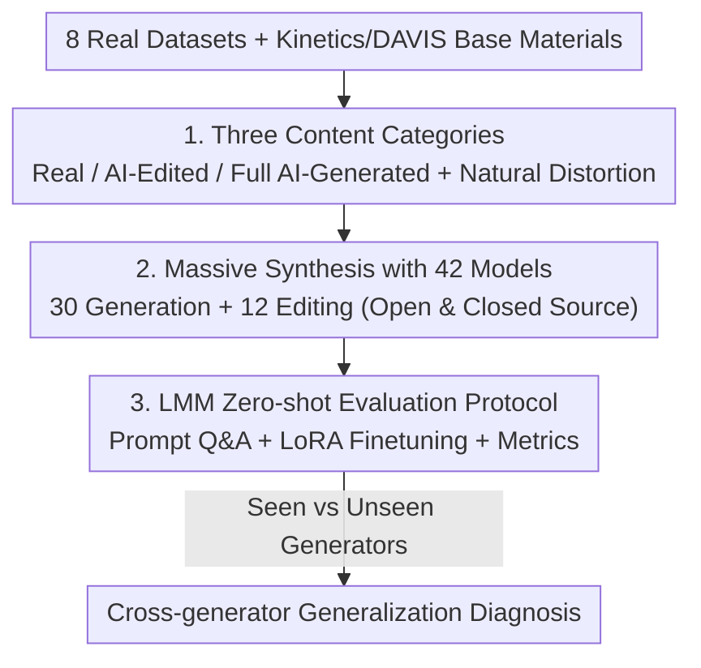

# FVBench: Benchmarking Deepfake Video Detection Capability of Large Multimodal Models

**Conference**: CVPR 2026  
**Paper**: [CVF Open Access](https://openaccess.thecvf.com/content/CVPR2026/html/Wang_FVBench_Benchmarking_Deepfake_Video_Detection_Capability_of_Large_Multimodal_Models_CVPR_2026_paper.html)  
**Code**: https://github.com/IntMeGroup/FVBench  
**Area**: AI Security / Deepfake Detection  
**Keywords**: Deepfake Video Detection, Large Multimodal Models (LMMs), Cross-generator Generalization, Benchmark, Zero-shot Detection  

## TL;DR
FVBench establishes the largest current benchmark for deepfake video detection (120,000+ videos, 42 SOTA generation/editing models, three categories: Real/AI-edited/Full AI-generated). It provides the first systematic evaluation of Large Multimodal Models' (LMMs) detection capabilities, concluding that the primary challenge is not supervised training on known fakes, but rather **zero-shot/cross-generator generalization** to unseen generators.

## Background & Motivation
**Background**: As video generation models like Sora, Kling, and Hailuo push AI video realism to new heights, deepfake video detection has become a critical necessity. Traditional detectors (CNNs / 3D Convolutions / Transformers) are typically supervised on fixed datasets to identify specific forgery artifacts within those sets.

**Limitations of Prior Work**: The authors identify three critical flaws in existing benchmarks. First, **narrow content diversity**—most datasets focus solely on facial forgery, ignoring general video manipulation, and rely on a binary "real or fake" paradigm that lacks **partially AI-edited** videos. Furthermore, their real videos are often clean and lossless, lacking natural distortions like compression and motion blur common in the real world. Second, **limited generator coverage**—using only a few, often outdated generators causes detectors to learn "model fingerprints" rather than general forgery features, leading to failure on new models. Third, **restricted evaluation targets**—existing benchmarks primarily test specialized detectors, leaving the potential of LMMs in forgery detection systematically unexamined.

**Key Challenge**: A fundamental tension exists between fitting traces of known generators and generalizing to unknown ones. Narrower datasets and older generators tend to train models as specialists that merely memorize fingerprints.

**Goal**: To create a sufficiently large and diverse benchmark covering real, edited, and generated content that evaluates both traditional detectors and LMMs, thereby quantifying where the true difficulty of detection lies.

**Key Insight**: Observing that LMMs demonstrate strong zero-shot generalization in tasks like facial recognition and object detection, the authors hypothesize that the ability of LMMs to "understand content without task-specific finetuning" might be the key to defending against emerging generators.

**Core Idea**: By using a large-scale benchmark encompassing 42 latest generation/editing models and 120,000+ videos, the authors place traditional detectors and LMMs on the same scale for zero-shot and cross-generator comparison, revealing that generalization, rather than supervised fitting, is the true bottleneck.

## Method

### Overall Architecture
FVBench is essentially a benchmark consisting of a "data construction + evaluation protocol." On the data side, it starts from 8 public real video datasets and Kinetics-400/DAVIS base materials, following three pipelines—real collection, AI editing, and AI generation—to form a library of 121,902 videos (including 62,357 fakes). On the evaluation side, traditional detectors and LMMs are tested under zero-shot Q&A, finetuning, and cross-generator protocols. The pipeline is as follows:

### Key Designs

**1. Three Content Categories + Natural Distortion in Real Videos: Aligning Benchmarks with Real-world Deployment**

Addressing the issues of face-only focus, binary paradigms, and overly clean real videos, FVBench includes **Real**, **Partially AI-edited**, and **Full AI-generated** general content. The 60,000 real videos are collected from 8 diverse task datasets (MSRVTT, KonVid, FineVD, WebVid, LSVQ, LIVEVQC, YouTubeUGC, LIVE-YT-Gaming), covering action, UGC, gaming, and streaming. Crucially, these datasets inherently contain **natural degradations** such as compression artifacts, noise, motion blur, and network distortion. This prevents detectors from learning "blurry = real" shortcuts. The "Partially AI-edited" category fills the gap in binary paradigms; videos with local modifications are harder to distinguish than fully generated ones and better represent real-world "background/object swapping" misinformation. Quantitative analysis using five features (colorfulness, brightness, contrast, spatial information SI, temporal information TI) confirms that these three categories are distinguishable yet overlapping.

**2. Large-scale Synthesis with 42 SOTA Models + Mismatched Train/Test Splits: Making "Unseen Generators" a Controllable Variable**

To break the "limited coverage → fingerprint memorization" cycle, FVBench uses **30 generation models** (18 open-source like Wan2.1, CogVideoX1.5, VideoCrafter2, LTX, Latte; 12 closed-source like Sora, Kling, Hailuo, Gen3, Pixverse) for full AI videos, and **12 diffusion-based editing models** (Tune-A-Video, TokenFlow, CCEdit, ControlVideo, FateZero, etc.) for partial edits. The AI editing process uses DeepSeek-R1 to generate instructions for color, motion, background, object manipulation, and style, constrained to **retain approximately 60% of original semantics** to ensure "locally focused editing." Crucially, the **mismatched train/test split** uses 18 open-source models for training while including 12 unseen closed-source generators in the test set. This design quantifies how well detection metrics scale to generators not encountered during training.

**3. LMM Zero-shot Evaluation Protocol + LoRA Finetuning + Cross-generator Diagnosis: Quantifying Bottlenecks on a Unified Scale**

To compare traditional detectors and LMMs, a unified protocol is required. Metrics include Accuracy (Acc) and F1-score, where $\text{F1}=\frac{2\times\text{Precision}\times\text{Recall}}{\text{Precision}+\text{Recall}}$. Traditional detectors use pre-trained weights directly; LMMs use prompt-based Q&A. To eliminate answer-order bias, the authors alternate between two instructions—"Is this a real video or a generated one? Reply only A or B. A: Real / B: Generated" and its reversed version—taking the consistent judgment. Beyond zero-shot, **LoRA finetuning** (r=16, 5 epochs, lr 1e-5) is performed on LMMs, and **cross-generator train-test matrices** are created for models like Swin3D-T and InternVL2.5(8B). This three-tier approach—zero-shot baseline, finetuning ceiling, and cross-generator matrix—clearly diagnoses that while supervised finetuning achieves nearly 100%, zero-shot and cross-unseen-generator performance are the true bottlenecks.

### Loss & Training
The benchmark does not introduce new loss functions. Finetuning uses standard LoRA (r=16) on a binary classification (Real/Fake) objective for 5 epochs with a batch size of 4 on a 40GB A6000, using an initial learning rate of 1e-5 with cosine annealing. Cross-generator experiments follow the same binary setup, varying only the subsets of generators used for training and testing.

## Key Experimental Results

### Main Results: Zero-shot Ranking on AI-Generated Subset
The table below shows the overall zero-shot accuracy on the AI-generated video subset (average across 30 generators). Specialized detectors collapse when faced with unseen generators (e.g., DeMamba achieves only 3.30%, classifying almost all fakes as real), while some LMMs remain more stable, with InternLM-XComposer2.5(7B) reaching the highest zero-shot accuracy of 92.98%.

| Method (Zero-shot) | Type | AI-Gen Overall Acc | Remarks |
|--------|------|------|------|
| InternLM-XComposer2.5 (7B) | Open LMM | **92.98%** | Best Zero-shot |
| ResNet3D-18 | Traditional (Trained) | 80.85% | Dependency on train distribution |
| Qwen2.5-VL (3B) | Open LMM | 79.67% | Stronger performance for small model |
| Llama3.2-Vision (11B) | Open LMM | 77.09% | — |
| Gemini1.5-pro | Closed LMM | 71.15% | — |
| GPT-4o | Closed LMM | 49.86% | Near random |
| DeMamba | Traditional (Trained) | 3.30% | Bias towards Real; collapse on unseen Fake |
| All Models Avg (Zero-shot) | — | 59.82% | Overall slightly above random |

### Finetuning Ceiling vs. Zero-shot: Evidence for Core Conclusion
Once finetuned (LoRA / Full), almost all models—traditional and LMMs—reach nearly 100% accuracy, whereas zero-shot gaps are immense. This comparison supports the core argument: the difficulty lies in generalization, not supervised fitting.

| Model | Zero-shot (AI-Gen) | After Finetuning (AI-Gen) |
|------|------|------|
| Swin3D-T | 65.04% | 100.0% |
| ResNet3D-18 | 80.85% | 100.0% |
| AIGVDet | 57.12% | 99.59% |
| InternVL2.5 (8B) | 70.97% | 100.0% |
| InternVL3 (9B) | 73.79% | 100.0% |

### Key Findings
- **Bottleneck in Cross-generator Generalization**: In the cross-generator matrix, models achieve near 100% accuracy on generators seen during training (diagonal) but drop significantly on unseen ones (especially 12 closed-source models). This redirects research focus from "supervised performance" to "zero-shot/cross-generator generalization."
- **Severe Bias in Specialized Detectors**: DeMamba reaches 97.03% on the real subset but only 3.30% on the AI-generated subset, indicating it learned a shortcut to favor "Real" judgments and fails to generalize to AI content.
- **LMM Scale is Not Always Better**: Small-to-medium models like Qwen2.5-VL(3B) and InternLM-XComposer2.5(7B) outperform many larger models (e.g., InternVL3-78B) in zero-shot detection; capability does not correlate monotonically with parameter count.
- **Difficulty Varies by Editing Type**: Stylistic changes are the easiest to detect, while **motion editing is the hardest** (subtle changes to object appearance), indicating that object-level fine-grained manipulation is a weak point for current detectors.
- **Natural Distortion Interference**: Detectors perform better on structured datasets (LIVEVQC, LSVQ) but struggle with real videos containing natural degradations (LIVE-YT-Gaming), leading to more false positives.

## Highlights & Insights
- **Unseen Generators as a Controllable Variable**: The mismatched split (18 open-source for training, 12 closed-source added for testing) turns "cross-generator generalization" from a slogan into a quantifiable comparison, allowing future methods to report generalization scores on the same scale.
- **First Benchmarking of LMMs in Forgery Detection**: Using de-biased prompt Q&A unified the evaluation of LMMs and traditional detectors. The finding that LMMs can be more stable zero-shot than specialized detectors is a valuable counter-intuitive signal.
- **Natural Distortion in Real Videos**: This data strategy effectively blocks the "clarity = real" shortcut, increasing the benchmark's discriminative power—a design lesson directly transferable to other forgery detection tasks.

## Limitations & Future Work
- **Closed-source Balanced Training**: Due to cost, 12 closed-source models appear only in the test set. The imbalance in train/test distributions might color certain cross-generator conclusions with an "open → closed" specific transfer bias.
- **Binary Classification Focus**: The benchmark focuses on real/fake discrimination, with limited coverage of fine-grained tasks like "forgery localization" or "explainable detection."
- **LMM Prompt Sensitivity**: Zero-shot results depend on specific prompts; although order-bias was addressed, different phrasing could still impact rankings.
- **Future Directions**: Exploring detectors for universal forgery clues (e.g., frequency domain/spatiotemporal inconsistencies) on this benchmark, or training specifically for generalization using the benchmark’s splits, are natural next steps.

## Related Work & Insights
- **vs. FaceForensics++ / DF40**: These focus on faces with older generators; FVBench handles general content with 42 SOTA models, partial edits, and natural distortions, offering significantly greater scale and diversity.
- **vs. IVY-FAKE / GVD**: While also general-purpose, FVBench is more comprehensive in model coverage (42 vs. 22), total volume (121,902 videos), and its evaluation framework (LMM benchmarking + cross-generator diagnosis).
- **vs. Specialized Detectors (DeMamba / AIGVDet)**: These propose stronger architectures; FVBench, instead of proposing a new detector, uses a unified scale to reveal the zero-shot generalization weaknesses of such models, reframing the problem as "building detectors that generalize to unseen generators."

## Rating
- Novelty: ⭐⭐⭐⭐ First systematic evaluation of LMM detection; largest video forgery benchmark with 42 models.
- Experimental Thoroughness: ⭐⭐⭐⭐⭐ Comprehensive coverage of real/edited/generated subsets and evaluation protocols.
- Writing Quality: ⭐⭐⭐⭐ Clear motivation and conclusions supported by strong evidence.
- Value: ⭐⭐⭐⭐⭐ Quantifies detection bottlenecks as cross-generator generalization, providing a unified scale for the field.

<!-- RELATED:START -->

## Related Papers

- [\[CVPR 2026\] Omni-Fake: Benchmarking Unified Multimodal Social Media Deepfake Detection](omni-fake_benchmarking_unified_multimodal_social_media_deepfake_detection.md)
- [\[CVPR 2026\] AVFakeBench: A Comprehensive Audio-Video Forgery Detection Benchmark for AV-LMMs](avfakebench_a_comprehensive_audio-video_forgery_detection_benchmark_for_av-lmms.md)
- [\[CVPR 2026\] X-AVDT: Audio-Visual Cross-Attention for Robust Deepfake Detection](x-avdt_audio-visual_cross-attention_for_robust_deepfake_detection.md)
- [\[CVPR 2026\] DeepfakeImpact: A Two-Stage Benchmark with Real-World Impact in Deepfake Detection](deepfakeimpact_a_two-stage_benchmark_with_real-world_impact_in_deepfake_detectio.md)
- [\[CVPR 2026\] RunawayEvil: Jailbreaking the Image-to-Video Generative Models](runawayevil_jailbreaking_the_image-to-video_generative_models.md)

<!-- RELATED:END -->
