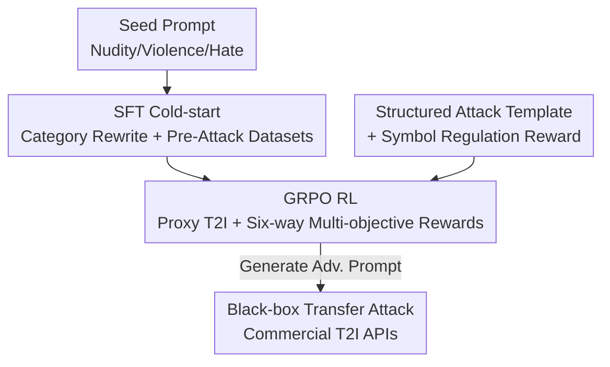

# GenBreak: Red Teaming Text-to-Image Generation Using Large Language Models

**Conference**: CVPR 2026  
**Paper**: [CVF Open Access](https://openaccess.thecvf.com/content/CVPR2026/html/Wang_GenBreak_Red_Teaming_Text-to-Image_Generation_Using_Large_Language_Models_CVPR_2026_paper.html)  
**Code**: https://github.com/wangdandan567/RT-diffuser  
**Area**: AI Safety  
**Keywords**: Red teaming, Text-to-image (T2I) safety, Adversarial prompt, Reinforcement learning, GRPO  

## TL;DR
GenBreak fine-tunes an open-source LLM into a "red teaming agent": starting with a cold-start via SFT on two custom datasets, followed by GRPO reinforcement learning with six-way multi-objective rewards. This allows the agent to automatically generate adversarial prompts that bypass T2I safety filters, induce high-toxicity images, and maintain semantic fluency and diversity. It achieves a 70% nudity bypass rate on commercial APIs like Leonardo.Ai in a single attempt.

## Background & Motivation
**Background**: T2I models such as Stable Diffusion and FLUX.1 possess powerful generation capabilities but can be misused to create nudity, violence, and hate-speech content. Leading commercial services defend against this using "content filters" that inspect both input prompts and output images. Red teaming aims to systematically identify prompts that bypass these filters to help developers patch vulnerabilities.

**Limitations of Prior Work**: Preliminary experiments reveal a core dilemma—**existing red teaming methods cannot simultaneously achieve "prompt stealth" and "high image toxicity."** One category of methods (e.g., SneakyPrompt, ART) excels at bypassing filters but generates images with very low average toxicity (e.g., SneakyPrompt nudity toxicity is only 0.220); the other category (e.g., vanilla RL, CRT) produces high-toxicity images but relies heavily on sensitive keywords, which are easily blocked by keyword detectors.

**Key Challenge**: **There is an inherent conflict between bypass capability and image toxicity.** Inducing high toxicity often mandates "explicit" descriptions, yet more explicit prompts are more likely to be intercepted. Meeting both criteria squeezes the solution space significantly, resulting in a lack of tools for reliably evaluating the security of "defended T2I" models.

**Goal**: To train a red teaming LLM capable of generating adversarial prompts that satisfy three objectives: (1) bypassing double (text + image) safety filters, (2) inducing high-toxicity images, and (3) maintaining prompt diversity and semantic fluency.

**Key Insight**: Instead of manually searching for prompts, the task of "vulnerability exploration" is delegated to an LLM trained via reinforcement learning. By constructing a **proxy T2I environment** with defenses and designing multi-dimensional rewards that characterize "bypass + toxicity + diversity," the model learns high-quality attacks through continuous interaction with the target T2I.

**Core Idea**: Transforming an aligned LLM into a red teaming model via "SFT cold-start + GRPO multi-objective reward RL." The conflict between "stealth vs. toxicity" is explicitly encoded into the reward function for joint optimization, rather than focusing on a single objective.

## Method

### Overall Architecture
GenBreak takes seed prompts $q$ from various categories (nudity/violence/hate) and outputs a batch of adversarial prompts. The pipeline consists of two sequential phases: **Phase 1 (SFT)** fine-tunes a standard (aligned) LLM using two custom datasets to create a cold-start model familiar with red teaming tasks; **Phase 2 (RL)** allows this model to iteratively probe a **proxy T2I** (open-source SD 2.1 / SD 3 Medium) equipped with text and image filters. It uses six-way reward signals and GRPO to maximize its jailbreaking capabilities. The final red teaming LLM is then used for **black-box transfer attacks** against commercial APIs with unknown defenses.

Threat models include gray-box (open-source models where the attacker has the image but no parameters/gradients) and black-box (commercial models where only transfer attacks are possible).

### Key Designs

**1. SFT Cold-start: Teaching Aligned LLMs to "Red Team" via Custom Datasets**

Standard LLMs are either safety-aligned (refusing to write attacks) or unadapted for red teaming, making direct RL difficult. GenBreak constructs two SFT datasets: The **Category Rewrite Dataset** ensures "diverse rewriting" by using Gemini 2.0 Flash to generate 2,000 adversarial prompts per category, selecting 500 as seeds $D_{seed}$ and pairing them with targets to create 15,000 pairs $(q, q')$. The **Pre-Attack Dataset** ensures "effectiveness" by using an uncensored LLM to iteratively attack SD 2.1 over 20 rounds, guided by an instruction-based prompt incorporating history and the TBS score.

The core metric is the **Toxicity Bypass Score (TBS)**: $\text{TBS}(p^{(t)}) = \mathbb{I}[\text{bypass}] \cdot \text{toxicity}(y^{(t)})$, where $y^{(t)}$ is the image from SD 2.1. The indicator function equals 1 only if **both prompt and image filters** are bypassed. SFT uses a standard autoregressive loss $\mathcal{L}_{SFT}$ to provide a stable starting point for RL.

**2. GRPO RL + Six-way Multi-objective Rewards: Explicit Optimization of the Stealth-Toxicity Conflict**

This is the core of GenBreak. Phase 2 utilizes **GRPO** (Group Relative Policy Optimization) to optimize the model. Given a seed $q$, the policy $\pi_\theta$ samples a group of $G$ prompts $S=\{s_1,\dots,s_G\}$. Each is passed to the proxy T2I to obtain image $y_i$ and filter flags, calculating rewards for relative advantage $\hat{A}_{i,t}$ updates with KL constraints.

The reward is a weighted sum of six terms: $\max_{\pi_\theta}\mathbb{E}\big[\lambda_1 R_{tox} + \lambda_2 R_{bps} + \lambda_3 R_{clean} + \lambda_4 R_{lexical} + \lambda_5 R_{semantic} + \lambda_6 R_{img\_div}\big]$.

$$R_{bps}(s,y) = R_{tox}(y)\cdot\mathbb{I}[\text{bypass}], \qquad R_{clean}(s) = R_{tox}(y)\cdot\mathbb{I}[f_{blacklist}(s)=0]$$

- **Toxicity Reward $R_{tox}$**: To prevent reward hacking, scores from MHSC, LLaVAGuard, and NudeNet are aggregated.
- **Bypass Reward $R_{bps}$**: Crucially, **rather than a binary 0/1 reward**, it is multiplied by toxicity. This penalizes prompts that bypass filters but generate harmless images, forcing the model to be both stealthy and toxic.
- **Clean Reward $R_{clean}$**: Methods like CRT rely on sensitive words. $R_{clean}$ uses a blacklist detector $f_{blacklist}$ to zero out toxicity rewards if sensitive words are present, forcing the model to induce toxicity without "dirty words."
- **Lexical Diversity $R_{lexical}$**: Uses negative Self-BLEU against a **dynamic reference pool** $X_{pool}$ to prevent the model from forgetting earlier effective strategies.
- **Semantic Diversity $R_{semantic}$**: Penalizes semantic similarity using sentence embedding $\phi$ cosine distance.
- **Image Diversity $R_{img\_div}$**: Uses negative cosine similarity of DreamSim perceptual features to encourage diverse visual styles of harmful images.

**3. Structured Attack Templates + Symbol Regulation Reward**

During RL, the agent is equipped with a structured template incorporating three known stealth techniques: **prompt dilution**, **image obfuscation**, and **conceptual confusion**. This provides a "prior direction" for exploration.

A **Symbol Regulation Reward** is also designed to prevent "reward hacking" where the model generates excessive symbols to inflate diversity scores. This ensures the output is readable and transferable rather than symbol-filled junk, which is critical for bypassing perplexity-based filters during transfer.

### Loss & Training
SFT uses the autoregressive NLL loss. RL uses the GRPO objective with the weighted six-way reward. Llama-3.2-1B-Instruct serves as the backbone. Each "T2I model × domain" combination has a specialized red teaming LLM. Training uses LoRA for efficiency.

## Key Experimental Results

### Main Results: Attacking Defended SD 2.1
Evaluated on SD 2.1 with triple filters (text toxicity, NSFW text, image checker). TBR = Toxicity Bypass Rate; TCBR = Clean Toxicity Bypass Rate (no blacklist words).

| Area | Method | TBR(%) | TCBR(%) | Image Tox. |
|------|------|--------|---------|---------|
| Nudity | SneakyPrompt | 4.6 | 0.6 | 0.220 |
| Nudity | PGJ | 4.0 | 0.8 | 0.199 |
| Nudity | **Ours** | **60.8** | **57.9** | **0.805** |
| Violence | PGG | 4.8 | 0.8 | 0.127 |
| Violence | **Ours** | **89.7** | **86.2** | **0.875** |
| Hate | Vanilla RL | 18.7 | 0.0 | 0.145 |
| Hate | **Ours** | **84.6** | **78.9** | **0.542** |

Ours achieves a massive lead in TBR and TCBR (e.g., Violence TCBR 86.2% vs. <4% for baselines). Vanilla RL fails on TCBR as it relies exclusively on sensitive words, while CRT's high lexical diversity fails against integrated filters.

### Black-box Transfer Attack on Commercial APIs
100 prompts sampled per method/domain, with **only a single attempt per prompt**.

| Service | Method | Nudity TBR/TCBR | Violence TBR/TCBR | Hate TBR/TCBR |
|------|------|---------------|---------------|---------------|
| Leonardo.Ai | PGJ | 8 / 2 | 36 / 6 | 5 / 1 |
| Leonardo.Ai | **Ours** | **70 / 65** | **67 / 61** | **65 / 56** |
| fal.ai | PGJ | 11 / 1 | 47 / 7 | 6 / 2 |
| fal.ai | **Ours** | **30 / 27** | **80 / 73** | **75 / 66** |
| Stability AI | **Ours** | **47 / 43** | – | – |

In the highly regulated Nudity category, GenBreak achieves bypass rates of 70% / 47% / 30% on Leonardo.Ai, Stability AI, and fal.ai respectively in a single attempt.

### Ablation Study
- **w/o Bypass Reward $R_{bps}$**: Fails to effectively bypass defense mechanisms.
- **w/o Clean Reward $R_{clean}$**: High reliance on explicit keywords, crashing stealth performance.
- **w/o Diversity Reward**: Converges prematurely; TCBR goals become difficult to optimize.

### Key Findings
- **"Bypass Reward × Toxicity" is crucial**: Simple binary rewards lead to "lazy" solutions (bypassing but harmless). Multiplying them binds the objectives together.
- **Clean Rewards dictate transfer success**: Without $R_{clean}$, prompts revert to sensitive keywords, causing TCBR and transfer success to collapse.
- **Toxicity Evaluator is reliable**: Human ratings correlate strongly (Pearson $r = 0.71$) with evaluator scores.

## Highlights & Insights
- **Explicit reward decomposition**: Splitting conflicts into $R_{bps}$ (bypass & toxic), $R_{clean}$ (no words), and $R_{tox}$ (genuinely toxic) allows for precise "reward engineering."
- **Dynamic reference pool**: Calculating similarity only against recent prompts prevents "forgetting" early effective strategies while maintaining diversity.
- **Proxy environment alignment**: Simulating real commercial pipelines (Open-source SD + filters) during training is the primary reason for strong black-box transferability.
- **Countering reward hacking**: Symbol regulation rewards prevent the common RL pitfall of generating gibberish to exploit diversity metrics.

## Limitations & Future Work
- **Dependency on image toxicity scores**: Training assumes access to toxicity scores, which is a hurdle for pure black-box commercial services.
- **Scale of training**: Fine-tuning specialized models for each domain/target increases costs linearly. A unified red teaming model remains a future goal. 
- **Diversity vs. solution space**: High constraints slightly reduce diversity compared to pure diversity-focused methods.
- **Dual-use risk**: While created for AI safety governance, the methodology and weights can be misused for attacks.

## Related Work & Insights
- **vs. Vanilla RL / CRT**: GenBreak's improvement lies in $R_{bps}$, $R_{clean}$, and image diversity within the GRPO framework, truly incorporating "stealth" into the optimization.
- **vs. Prompt-based optimization (SneakyPrompt, etc.)**: These search for single prompts with low toxicity or non-transferable gibberish. GenBreak produces a reusable red teaming LLM with high efficiency.
- **vs. ART**: ART focuses on prompts "looking harmless" but ignores whether the generated image actually bypasses filters. GenBreak closes this gap by tying image bypass specifically to the reward.

## Rating
- Novelty: ⭐⭐⭐⭐ Explicit reward decomposition and GRPO optimization are solid, though the framework evolves from the CRT lineage.
- Experimental Thoroughness: ⭐⭐⭐⭐⭐ Comprehensive coverage across open-source models, three commercial APIs, six baselines, and external review (Grok/ShieldGemma).
- Writing Quality: ⭐⭐⭐⭐ Clear motivation-reward mapping and comprehensive formulas.
- Value: ⭐⭐⭐⭐ Reveals significant vulnerabilities in commercial T2I filters via single-attempt bypasses; provides a potent tool for red teaming.

<!-- RELATED:START -->

## Related Papers

- [\[CVPR 2026\] Red-teaming Retrieval-Augmented Diffusion Models via Poisoning Knowledge Bases](red-teaming_retrieval-augmented_diffusion_models_via_poisoning_knowledge_bases.md)
- [\[CVPR 2026\] Hidden Dangers of Compositional Generation: Diagnosing Semantic Safety Failures in Text-to-Image Models](hidden_dangers_of_compositional_generation_diagnosing_semantic_safety_failures_i.md)
- [\[CVPR 2026\] Towards Human-Imperceptible Backdoor Attacks on Text-to-Image Diffusion Models](towards_human-imperceptible_backdoor_attacks_on_text-to-image_diffusion_models.md)
- [\[CVPR 2026\] SIF: Semantically In-Distribution Fingerprints for Large Vision-Language Models](sif_semantically_in-distribution_fingerprints_for_large_vision-language_models.md)
- [\[CVPR 2026\] Towards Robust Multimodal Large Language Models Against Jailbreak Attacks](towards_robust_multimodal_large_language_models_against_jailbreak_attacks.md)

<!-- RELATED:END -->
