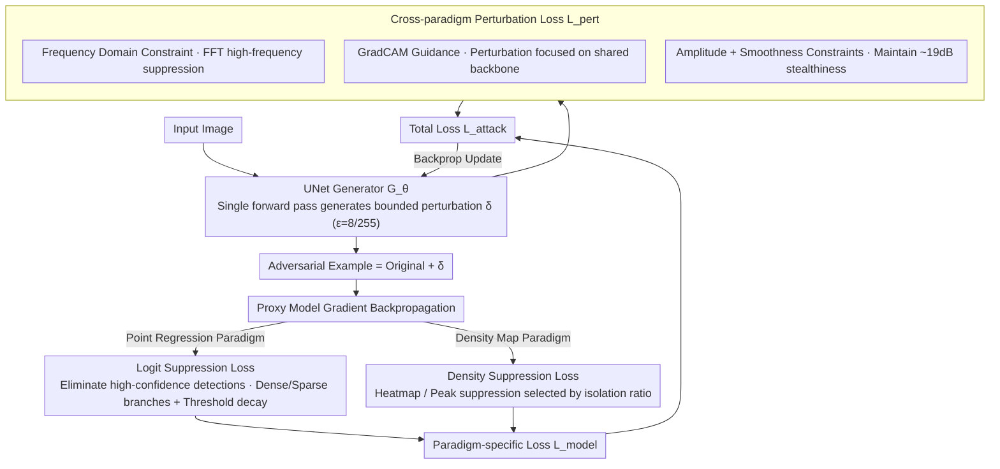

# Generative Adversarial Perturbations with Cross-paradigm Transferability on Localized Crowd Counting

**Conference**: CVPR 2026  
**arXiv**: [2603.24821](https://arxiv.org/abs/2603.24821)  
**Code**: [https://github.com/simurgh7/CrowdGen](https://github.com/simurgh7/CrowdGen)  
**Area**: AI Safety / Adversarial Attacks  
**Keywords**: Adversarial attack, Crowd counting, Cross-paradigm transferability, Generative adversarial perturbations, Black-box attack

## TL;DR
The paper proposes CrowdGen, the first adversarial attack framework with cross-paradigm (density map + point regression) transferability. By utilizing a lightweight UNet generator and a multi-task loss (logit suppression + density suppression + GradCAM guidance + frequency domain constraints), it achieves high transferability (TR up to 1.69) across seven SOTA crowd counting models while maintaining visual stealthiness (~19dB PSNR), increasing the attack MAE by 7x on average.

## Background & Motivation
Localized crowd counting is widely applied in public safety, retail analysis, and epidemic tracking. Currently, mainstream solutions are divided into two paradigms: **Density map methods** (e.g., SASNet, FIDTM) which regress spatial density distributions and extract locations via post-processing, and **Point regression methods** (e.g., P2PNet, PET) which output coordinates and confidence scores end-to-end.

Existing adversarial attacks face the following limitations:

**Trade-off between attack strength and stealthiness**: PAP and GE-AdvGAN provide good visual quality (PSNR $\ge$ 22dB) but weak attacks (MAE < 120); DiffAttack provides strong attacks (MAE = 414) but suffers from visual collapse (PSNR = 11.5dB).

**Single-paradigm limitation**: Existing transferable attacks (APAM, PAP) only transfer between density map methods and do not account for cross-paradigm (density map $\leftrightarrow$ point regression) transfer.

**Black-box requirements**: Authentically deployed crowd counting systems are typically black-box, necessitating transferable attacks based on proxy models.

Core Idea: Leverage the inductive bias of shared backbone feature spaces (e.g., VGG-16, ResNet-50) using paradigm-specific attack losses and paradigm-agnostic perceptual constraints to learn a unified generative perturber.

## Method

### Overall Architecture

This paper attacks localized crowd counting. The challenge lies in the completely different output formats of density map and point regression paradigms, where previous transferable attacks only functioned within a single paradigm. CrowdGen trains a lightweight 3-layer UNet generator $G_\theta$ that maps input images directly to a bounded perturbation $\delta$ (upper bound $\epsilon=8/255$), which is superimposed on the original image to generate adversarial samples. During training, gradients are backpropagated through a proxy model. The total loss is split into two parts: the **paradigm-specific loss** $\mathcal{L}_{model}$ targeting a specific paradigm, and the **cross-paradigm perturbation loss** $\mathcal{L}_{pert}$, which is universal to both paradigms and designed to enhance transferability. At inference, perturbations are generated in a single forward pass without iterative optimization for each image.

### Key Designs

**1. Logit Suppression Loss: Forcing point regression models to miss high-confidence detections**

Point regression models (P2PNet, PET) output coordinates and confidence for each point. To reduce the count, the most direct method is to eliminate high-confidence detections. The loss targets the set $\mathcal{P}_{high} = \{i : s_i^{(h)} > \tau\}$ and branches based on scene density: in dense scenarios ($C_{gt} > C_{sparse}$), it directly minimizes logits in high-confidence regions; in sparse scenarios ($C_{gt} \le C_{sparse}$), it applies weighted penalties to detections near the confidence boundary to avoid wasting perturbation budget on already sparse points. The threshold also adaptively decays: $\tau(t) = \max(\tau_{min}, \tau_{max} - \nu \cdot t / T_{max})$. As training progresses, the threshold lowers to expand the attack surface, gradually including medium-confidence detections.

**2. Density Suppression Loss: Flattening peaks and clusters in density maps**

Density map models (SASNet, FIDTM) regress spatial density distributions; localization relies on post-processing to find peaks. Thus, the attack must suppress both significant peaks and transition zones near thresholds. Heatmap suppression $\mathcal{L}_{hmap}$ uses $3\times3$ max-pooling to detect local maxima and suppresses the foreground globally after separating it from the background using an adaptive threshold $\phi = \phi' \cdot \max(\mathcal{D})$. Peak suppression $\mathcal{L}_{peak}$ introduces peak prominence (the difference between a peak and its local neighborhood) specifically for isolated high-density clusters. These are not used simultaneously; instead, one is selected based on the isolation ratio (the proportion of peaks without neighbors in a $5\times5$ window $>0.7$).

**3. Cross-paradigm Perturbation Loss: Leveraging paradigm-agnostic constraints for transferability**

The first two losses depend on the proxy model. To transfer perturbations to black-box targets, a set of constraints unlinked to specific paradigms is used. Frequency domain constraint $\mathcal{L}_{freq}$ suppresses high-frequency components of the perturbation via FFT, utilizing the low-frequency dominant statistical properties of crowd scenes to place perturbations in frequency bands that transfer more easily across models. GradCAM guidance $\mathcal{L}_{cam}$ concentrates perturbations in areas the shared backbone (VGG-16, ResNet-50) deems semantically important, minimizing perturbation energy outside attention regions. Amplitude constraint $\mathcal{L}_{hinge}$ limits total energy via the L2 norm, and spatial smoothness regularization $\mathcal{L}_{tv}$ reduces artifacts via Total Variation; together, they maintain ~19dB visual stealthiness.

### Loss & Training
Total loss: $\mathcal{L}_{attack} = \alpha \cdot \mathcal{L}_{model} + \beta \cdot \mathcal{L}_{hinge} + \gamma \cdot \mathcal{L}_{tv} + \zeta \cdot \mathcal{L}_{freq} + \kappa \cdot \mathcal{L}_{cam}$

- Perturbation bound $\epsilon = 8/255$, image size $512\times512$.
- Learning rate adjusted using cosine annealing.
- Hyperparameters found via grid search on the validation set: $\beta=0.01, \gamma=0.05, \zeta=0.01, \kappa=0.5$.

## Key Experimental Results

### Main Results (Cross-model Transferability, SHHA Dataset)

| Proxy Model → Target Model | MAE / TR | Description |
|---------|---------|------|
| HMoDE → P2PNet | 420.71 / **1.69** | Cross-paradigm super-transfer: stronger than white-box itself |
| FIDTM → P2PNet | 426.89 / 1.64 | Density Map → Point Regression: strong transfer |
| SASNet → APGCC | 397.96 / 1.32 | Density Map → Point Regression |
| P2PNet → SASNet | 281.00 / 0.89 | Point Regression → Density Map |
| APGCC → HMoDE | 171.53 / **0.55** | Weakest transfer but MAE still doubled |
| Clean baseline | 28-75 | Counting error on clean images |

### Ablation Study (Loss Combinations, SHHA Dataset)

| Loss Combination | Miss Rate(%) | PSNR(dB) | Description |
|---------|-------------|----------|------|
| $\mathcal{L}_{hmap} + \mathcal{L}_{hinge}$ (Baseline) | 45.35 | 17.67 | Basic density attack only |
| + $\mathcal{L}_{cam}$ | 59.47 | 17.67 | GradCAM adds +14% MR |
| + $\mathcal{L}_{freq}$ | 60.46 | 17.75 | Frequency constraint also improves significantly |
| All (Density Map) | **60.89** | 17.47 | Optimal attack strength |
| $\mathcal{L}_{logit} + \mathcal{L}_{hinge}$ (Baseline) | 45.15 | 19.09 | Basic logit attack only |
| + $\mathcal{L}_{cam}$ | **45.61** | **19.10** | Optimal trade-off for Point Regression |

### Key Findings
- **Cross-paradigm Super-transfer**: The TR of CNN-based HMoDE attacking Transformer-based PET reaches 1.60 (UCF-QNRF), confirming the inductive bias hypothesis of shared backbones.
- **Paradigm-dependent Impact**: The frequency domain constraint is crucial for density maps, while GradCAM guidance is more beneficial for point regression.
- In dense scenarios, the miss rate reaches 58%, hiding the majority of the crowd, whereas previous methods achieved only 15-31%.

## Highlights & Insights
- First to reveal the cross-paradigm adversarial vulnerability of crowd counting models. The "super-transfer" phenomenon (TR > 1) suggests black-box attackers can be more effective than white-box ones.
- The scene-density adaptive logit suppression strategy (dense vs. sparse branches) elegantly handles different scene characteristics.
- The generative single-forward attack is more practical than iterative optimization methods, offering high inference efficiency.

## Limitations & Future Work
- Only validated in the digital domain; physical world scenarios (printing, projection) were not considered.
- The attack primarily adopts an under-counting strategy; the over-counting (phantom crowds) direction remains unexplored.
- The perturbation bound $\epsilon = 8/255$ is standard; effectiveness under smaller perturbations requires verification.
- Lack of adversarial experiments involving defense methods.

## Related Work & Insights
- Provides a standardized benchmark for evaluating the robustness of crowd counting systems.
- The GradCAM-guided perturbation allocation strategy can be generalized to adversarial attacks for other dense prediction tasks.
- The discovery of vulnerabilities in shared backbones across paradigms serves as a critical reference for security policies in model deployment.

## Rating
- Novelty: ⭐⭐⭐⭐ First cross-paradigm crowd counting attack, though the generative framework itself is not entirely new.
- Experimental Thoroughness: ⭐⭐⭐⭐ Comprehensive transfer matrix (7 models × 2 datasets) + 9 baselines + ablation.
- Writing Quality: ⭐⭐⭐⭐ Clear problem definition and complete formulas, though notation is slightly heavy.
- Value: ⭐⭐⭐⭐ Significant revelation of vulnerabilities in safety-critical crowd analysis systems.

<!-- RELATED:START -->

## Related Papers

- [\[CVPR 2026\] Improving Adversarial Transferability with Local Perturbation Augmentation](improving_adversarial_transferability_with_local_perturbation_augmentation.md)
- [\[CVPR 2026\] Multi-Paradigm Collaborative Adversarial Attack Against Multi-Modal Large Language Models](multi-paradigm_collaborative_adversarial_attack_against_multi-modal_large_langua.md)
- [\[CVPR 2026\] Transform to Transfer: Boosting Adversarial Attack Transferability on Vision-Language Pre-training Models](transform_to_transfer_boosting_adversarial_attack_transferability_on_vision-lang.md)
- [\[CVPR 2026\] Verifying Neural Network Robustness with Dual Perturbations](verifying_neural_network_robustness_with_dual_perturbations.md)
- [\[NeurIPS 2025\] Boosting Adversarial Transferability with Spatial Adversarial Alignment](../../NeurIPS2025/ai_safety/boosting_adversarial_transferability_with_spatial_adversarial_alignment.md)

<!-- RELATED:END -->
