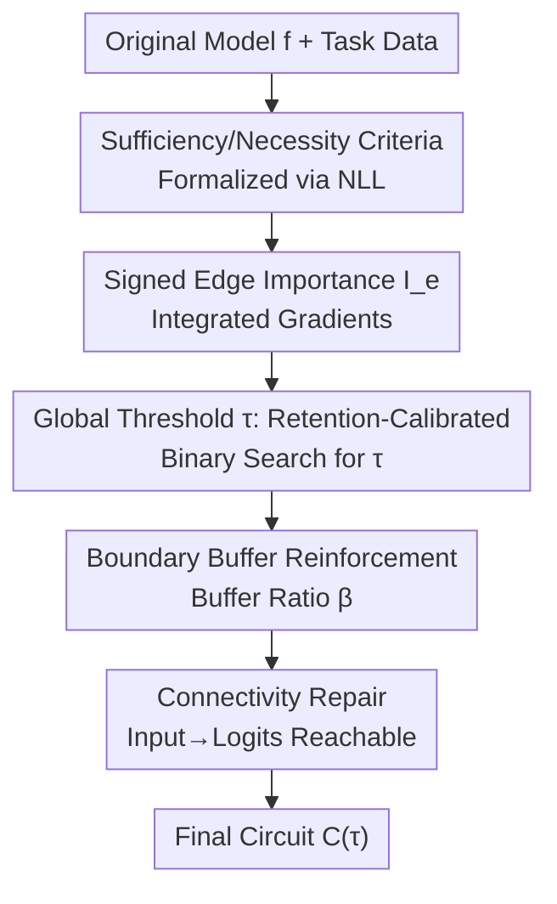

# Global Information Thresholding for Sufficient and Necessary Circuits

**Conference**: CVPR 2026  
**Paper**: [CVF Open Access](https://openaccess.thecvf.com/content/CVPR2026/html/Cho_Global_Information_Thresholding_for_Sufficient_and_Necessary_Circuits_CVPR_2026_paper.html)  
**Code**: None (Not provided by authors)  
**Area**: Mechanistic Interpretability / AI Safety  
**Keywords**: Mechanistic interpretability, circuit discovery, sufficiency and necessity, global threshold, retention-calibrated performance

## TL;DR
Addressing the common pain point where automatic circuit discovery relies on "manual fixed budgets" (fixed top-k), this paper moves away from pre-defining circuit size. Instead, it scores edges (using signed integrated gradients) and automatically searches for a single global threshold $\tau$ based on a "model behavior retention" target. This makes the circuit size a result of "retaining behavior" rather than a hyperparameter. Ours achieves optimal or near-optimal CPR/CMD on the MIB benchmark and improves both sufficiency and necessity diagnostics on GPT-2 IOI.

## Background & Motivation

**Background**: Mechanistic interpretability aims to reverse-engineer the internal computations of neural networks for specific tasks into "circuits" composed of a few components (attention heads, neurons, and edges). Prevailing automatic circuit discovery follows a two-stage paradigm: first, assign an importance score to each edge/node (e.g., EAP, EAP-IG, activation/path patching), then use an **external sparsification rule** to extract the circuit based on these scores.

**Limitations of Prior Work**: The sparsification step typically uses a "manual fixed budget"—such as fixing the top-k edges. This makes the final circuit extremely sensitive to the budget, which is often an arbitrary choice and fails to generalize across tasks or models. Furthermore, existing work has found that this sensitivity is not just conceptual: slight prompt perturbations, input sampling variations, or hyperparameter tuning can drastically alter the resulting circuit structure (instability).

**Key Challenge**: A credible circuit explanation must **simultaneously** satisfy two conditions: sufficiency (the circuit alone can reproduce almost all original model behavior) and necessity (removing the circuit causes a significant collapse in model performance). However, these are inherently in conflict: adding more edges for sufficiency makes the circuit bloated and less selective (sacrificing necessity), while aggressive pruning for necessity makes the circuit too small to reproduce the original behavior (sacrificing sufficiency). Fixed-budget two-stage methods struggle to balance both.

**Key Insight**: The authors observe that the distribution of edge importance provided by EAP-IG is **extremely heavy-tailed**—the Lorenz curve shows that score quality is highly concentrated in a few top edges, and $\log_{10}|\text{score}|$ is approximately log-normal. Since quality is concentrated, "determining size before behavior" (top-k) and "determining behavior and letting the distribution decide size" (thresholding) will extract significantly different circuits across tasks/models; the latter is more grounded in the data itself.

**Core Idea**: Reverse circuit selection from "pre-specifying size" to "pre-specifying how much behavior to retain, then letting the score distribution determine the effective operating point." This involves replacing the manual fixed budget with a **retention-calibrated global threshold**, supplemented by boundary reinforcement and connectivity repair to stabilize selection results.

## Method

### Overall Architecture
the method addresses the "score → circuit" mapping step: given the importance scores of each edge, how to map them to an optimal circuit that is sufficient, necessary, and stable without relying on manual budgets. The pipeline is linear: formalize "sufficiency / necessity" as measurable criteria using Negative Log-Likelihood (NLL) $\rightarrow$ estimate edge importance $I_e$ using signed integrated gradients $\rightarrow$ apply a single global threshold $\tau$ to $|I_e|$, where $\tau$ is automatically determined via binary search to meet the "retain $\ge$ target proportion of behavior" criterion $\rightarrow$ reinforce edges near the threshold boundary with a buffer zone $\rightarrow$ perform graph reachability checks and repair disconnected paths from "input → logits." The output is the "smallest circuit within the score-induced family that satisfies the retention criterion."

### Key Designs

**1. NLL Formalization of Sufficiency and Necessity: Transforming "Good Circuits" into Optimizable Targets**

Previously, circuit quality was judged qualitatively. This paper formalizes two quantitative criteria. Let the full network be $f$ and the circuit be $C \subseteq E$ ($E$ is the set of all edges). Let $f_C$ denote the restricted model that "only retains connections within $C$ and zeros out all others," and $f_{\neg C}$ denote the model with "connections in $C$ removed." Let $L(\cdot)$ be the average NLL on task data. Sufficiency loss is the gap between the circuit and the original model:

$$\Delta L_{\text{suff}}(C) = L(f_C) - L(f) \approx 0$$

The closer to 0, the better the circuit reproduces the original model. Necessity loss is defined by the performance degradation when the circuit is removed:

$$\Delta L_{\text{nec}}(C) = L(f_{\neg C}) - L(f) \gg 0$$

Higher values indicate the circuit is indispensable. An ideal circuit minimizes $\Delta L_{\text{suff}}$ while maximizing $\Delta L_{\text{nec}}$. This dual-objective definition is the paper's core stance—treating "joint sufficiency + necessity" as the primary goal of circuit extraction rather than a post-hoc diagnostic.

**2. Signed Loss-based Edge Importance Estimation: Scoring by "Loss Increase upon Deletion"**

To extract a circuit, edges must be scored. This paper uses a causal interventionist approach: let $f_{\neg e}$ be the model after deleting a single edge $e$, then the importance is:

$$I_e = L(f_{\neg e}) - L(f)$$

representing "how much the task loss changes when this edge is removed." This is estimated using integrated gradients over a continuous "edge gate" (avoiding the prohibitive cost of actual deletions). The authors retain signs for analysis, but the extraction rule uses the magnitude $|I_e|$—higher $|I_e|$ indicates a stronger causal effect. This step is decoupled from the subsequent thresholding: scoring determines "who is important," while thresholding determines "how many to keep."

**3. Retention-Calibrated Global Threshold: Determining Size via "Behavior Retention"**

This is the core contribution. After obtaining all $I_e$, a single global threshold $\tau$ determines which edges to include:

$$C(\tau) = \{\, e \in E \mid |I_e| \ge \tau \,\}$$

A high $\tau$ results in a compact, selective circuit that might miss necessary edges; a low $\tau$ includes many minor edges, increasing necessity but over-including. The innovation lies in how $\tau$ is set: rather than pre-setting a size, a **retention target** is provided (e.g., "retain 95% of original behavior" or $\Delta L_{\text{suff}}(C)$ below a tolerance). An **automatic binary search** is performed on the sorted scores in the calibration set to find the smallest circuit satisfying this condition. This replaces "fixed top-k" with a "retention-calibrated global cut point." Under the heavy-tailed distribution of real scores, this leads to significantly different (and more reasonable) circuit sizes across tasks. ⚠️ In the GPT-2 IOI example, finding the 0.95 retention target required only 15 $f_{C(\tau)}$ evaluations.

**4. Boundary Buffer Reinforcement + Connectivity Repair: Healing the Fragility of Hard Cutoffs**

Hard thresholds have two risks. First, if an edge's importance is just below $\tau$, excluding it due to noise might crash sufficiency. A buffer ratio $\beta$ is introduced to include a fixed percentage of candidates in the interval:

$$|I_e| \in [\tau(1-\beta),\ \tau)$$

This stabilizes the circuit near the threshold. Second, purely magnitude-based pruning might break all paths from "input → logits." A reachability check is performed on the directed circuit graph; if disconnected, candidate edges are restored until reachability is recovered. The final circuit is the smallest one in the family that remains stable and connected while meeting the retention target.

### A Complete Example: Walking through IOI/GPT-2
Using GPT-2 on the Indirect Object Identification (IOI) task (32,491 total edges): first, estimate $I_e$ for all edges via signed IG. Given a 0.95 retention target, binary search determines $\tau$ after ~15 evaluations, resulting in a circuit of ~750 edges. Then, the buffer $\beta$ and reachability check refine the final set. This 750-edge circuit proves to be the optimal trade-off in sufficiency and necessity diagnostics (see Table 4)—better than "too small" at 75 edges or "too large" at 1500 edges.

## Key Experimental Results

Experiments were conducted on the Mechanistic Interpretability Benchmark (MIB) circuit track, covering four task families (IOI, Arithmetic, MCQA, ARC-Easy/Challenge) and four LLMs (GPT-2, Qwen-2.5, Gemma-2, Llama-3.1). Every method extracts a subgraph circuit, which is then evaluated under a unified counterfactual patching framework: Sufficiency = running the subgraph alone; Necessity = deleting the subgraph from the full model. Primary metrics: CPR (Circuit Performance Ratio, higher is better), CMD (Circuit-Model Distance, lower is better), and InterpBench AUROC.

### Main Results

CPR (Selection of representative columns, higher is better; Ours = Ours):

| Task / Model | EAP-IG-inputs(CF) | EAP-IG-act.(CF) | EActP(CF) | Ours |
|------|------|------|------|------|
| IOI / GPT-2 | 1.85 | 1.82 | **2.30** | 2.01 |
| IOI / Qwen-2.5 | 1.63 | 1.63 | 1.21 | **1.92** |
| IOI / Gemma-2 | 3.20 | 2.07 | - | **3.72** |
| IOI / Llama-3.1 | **2.08** | 1.60 | - | 1.96 |
| MCQA / Gemma-2 | 1.64 | 1.57 | - | 1.65 |
| ARC(E) / Gemma-2 | 1.53 | **1.70** | - | **1.75** |
| ARC(C) / Llama-3.1 | 0.98 | 0.63 | - | **1.40** |

On CMD (lower is better), Ours is consistently the lowest or tied for lowest (e.g., InterpBench AUROC 0.79, second only to EAP-IG-activations at 0.81). Overall Conclusion: The single global threshold achieves optimal or near-optimal CPR/CMD across most task-model combinations without requiring model-specific top-k tuning.

Fine-grained sufficiency/necessity comparison on GPT-2 IOI (Table 3, vs. strongest EAP-IG-inputs baseline):

| Metric | EAP-IG-inputs(CF) | Ours | Direction |
|------|------|------|------|
| $\Delta\text{NLL}_{\text{suff}}$ ↓ | 1.009 | **0.7579** | Better Sufficiency |
| $\Delta\text{NLL}_{\text{nec}}$ ↑ | 8.328 | **8.431** | Slightly Higher Necessity |
| $\Delta\text{Brier}_{\text{suff}}$ ↓ | 0.1550 | **0.1005** | Better Calibration |
| $\Delta\text{ECE}_{\text{suff}}$ ↓ | 0.2010 | **0.1415** | Better Calibration |

Ours primarily improves sufficiency while slightly leading in necessity (NLL). Necessity Brier/ECE are closer to 0, which the authors interpret as "favorable calibration behavior" rather than stronger formal necessity (since distribution flattening after deletion naturally lowers these metrics).

### Ablation Study

Threshold $\tau$ ablation (GPT-2 IOI, varying circuit size, Table 4):

| Circuit Size | $\Delta\text{NLL}_{\text{suff}}$ ↓ | $\Delta\text{NLL}_{\text{nec}}$ ↑ | Description |
|------|------|------|------|
| 75 / 32491 | 2.718 | 5.836 | Too small: Sufficiency crashes, necessity diagnostic worst |
| 750 / 32491 | **0.7579** | **8.431** | Medium (≈95% retention): Best trade-off |
| 1500 / 32491 | 1.138 | 8.065 | Too large: More behavior retained but sufficiency drops as calibration drifts |

This table provides direct evidence: the trade-off between sufficiency and necessity is **non-monotonic**. Neither the smallest nor largest circuit is ideal; the 750-edge point (95% retention) achieves the best joint optimized performance.

Stability Diagnostics: Sweeping the retention target from 0.90 to 0.99 only changes CPR by 0.012 (Table 5). Across buffer ratios $\beta \in \{0.0, 0.2, 0.4\}$, CPR remains stable across independent samples, except for a visible deviation at $\beta=0.0$; adding a small buffer aligns the samples (Table 6). Under six independent perturbations, IOI/GPT-2 CPR is $2.0135 \pm 0.0022$.

### Key Findings
- **Optimal operating points are "middle ground"**: Circuit quality vs. threshold follows a non-monotonic curve. The best sufficiency-necessity-calibration balance is found at intermediate sizes (e.g., 750 edges).
- **Boundary reinforcement is for stability, not scoring**: $\beta$ suppresses unstable decisions at the boundary. CPR remains almost constant across $\beta$ values, meaning it doesn't change quality, just removes fragility.
- **Structural "Clustering"**: In unique-edge heatmaps (Figure 2), Ours' unique edges are concentrated in fewer source-target layer pairs, whereas EAP-IG's unique edges are scattered, suggesting retention-calibrated points suppress noise without bloating the circuit.
- **Trade-off in MCQA**: ⚠️ In Qwen-2.5 MCQA, CPR/CMD (0.73/0.14) lags behind NAP-IG/EAP-IG variants. In Llama-3.1 MCQA, Ours has moderate CPR (1.02) but low CMD (0.13), while high-CPR methods (>1.87) have CMD $\ge$ 0.33. Ours sacrifices some MCQA precision for higher selectivity.

## Highlights & Insights
- **Inverting "Size vs. Behavior"**: The cleverest aspect is demoting circuit size from a hyperparameter to a result of the "retention target"—simply specify "keep 95% behavior," and the score distribution handles the rest. This generalizes effortlessly across tasks/models.
- **Decoupling Scoring from Mapping**: By separating "edge importance estimation" from "score-to-circuit mapping," subsequent research can evaluate these components independently, clarifying whether gains come from better attribution or better budget tuning.
- **Criteria as Optimizable Losses**: Quantitative NLL-based metrics for $f_C$ and $f_{\neg C}$ provide a clean dual-objective for "what constitutes a good explanation," which is more faithful to mechanism than proxy metrics like reference circuit overlap.
- **Honest Metric Interpretation**: Explicitly noting that Brier/ECE necessity improves trivially due to distribution flattening shows a level of rigor often missing in interpretability evaluations.

## Limitations & Future Work
- Authors acknowledge the method is not dominant in MCQA, trading precision for selectivity; this suggests retention-calibrated global thresholding is not universally optimal for all task families.
- Internal Limitations: ① Criteria and threshold search are built on NLL and counterfactual patching; consistency across other evaluation frameworks is unproven. ② Fine-grained diagnostics (Table 3/4) are mostly limited to GPT-2 IOI. ③ The single global threshold assumes scores are globally comparable; if scales differ significantly across layers, a single $\tau$ might be problematic ⚠️. ④ Edge importance relies on IG approximations on gates; propagation of approximation errors is not discussed.
- Future Directions: Relaxing global thresholds to layer-wise or group-wise adaptive thresholds; jointly optimizing for both sufficiency and necessity rather than just calibrating for retention.

## Related Work & Insights
- **vs. Fixed top-k / Budget-based Sparsification (EAP, EAP-IG, ACDC, etc.)**: These pre-define size, making them sensitive and non-generalizable. Ours reverses this, making it more robust while maintaining CPR/CMD competitiveness.
- **vs. EAP-IG-inputs/activations (Strongest Baselines)**: Ours uses similar IG scoring but differs in the "cut." On GPT-2 IOI, it reduces $\Delta\text{NLL}_{\text{suff}}$ from 1.009 to 0.7579 while slightly improving necessity and creating a more clustered unique edge structure.
- **vs. Stability Critiques (Méloux et al., Nainani et al.)**: These works highlight circuit instability under perturbation. Ours addresses this directly with boundary buffers and connectivity repair, proving the retention-calibrated point is not fragile ($2.0135 \pm 0.0022$).

## Rating
- Novelty: ⭐⭐⭐⭐ The shift from "fixed budget" to "retention calibration" is clean and powerful, though individual components (IG, binary search, buffers) are known tools.
- Experimental Thoroughness: ⭐⭐⭐⭐ Covers 4 tasks × 4 models with multiple stability diagnostics; however, deep sufficiency/necessity analysis is mostly focused on GPT-2 IOI.
- Writing Quality: ⭐⭐⭐⭐ Logical arguments and honest disclosure of limitations; some tables in the PDF are slightly misaligned and require careful reading.
- Value: ⭐⭐⭐⭐ Provides a practical, transferable "behavior-driven" rule for circuit discovery that is relevant to any pipeline currently relying on fixed budgets.

<!-- RELATED:START -->

## Related Papers

- [\[CVPR 2026\] Federated Active Learning Under Extreme Non-IID and Global Class Imbalance](federated_active_learning_extreme_noniid.md)
- [\[AAAI 2026\] An Information Theoretic Evaluation Metric for Strong Unlearning](../../AAAI2026/ai_safety/an_information_theoretic_evaluation_metric_for_strong_unlearning.md)
- [\[NeurIPS 2025\] Understanding and Improving Adversarial Robustness of Neural Probabilistic Circuits](../../NeurIPS2025/ai_safety/understanding_and_improving_adversarial_robustness_of_neural_probabilistic_circu.md)
- [\[NeurIPS 2025\] Locally Optimal Private Sampling: Beyond the Global Minimax](../../NeurIPS2025/ai_safety/locally_optimal_private_sampling_beyond_the_global_minimax.md)
- [\[ICLR 2026\] Why Do Unlearnable Examples Work: A Novel Perspective of Mutual Information](../../ICLR2026/ai_safety/why_do_unlearnable_examples_work_a_novel_perspective_of_mutual_information.md)

<!-- RELATED:END -->
