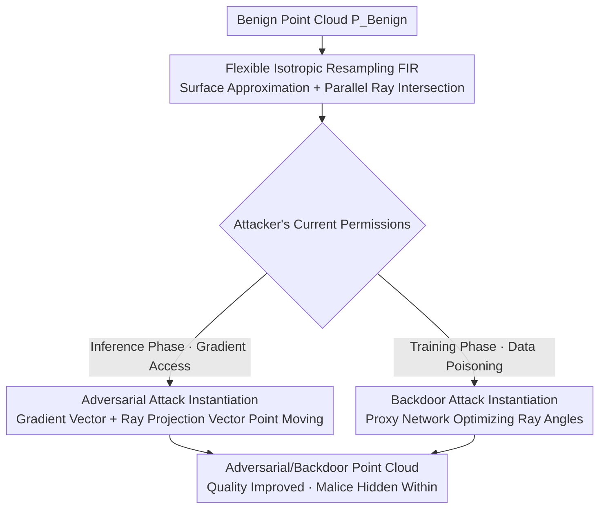

# Good Can Sometimes be Bad: A Unified Attack against 3D Point Cloud Classifier by a Flexible Isotropic Resampling

**Conference**: CVPR 2026  
**Paper**: [CVF Open Access](https://openaccess.thecvf.com/content/CVPR2026/html/Fan_Good_Can_Sometimes_be_Bad_A_Unified_Attack_against_3D_CVPR_2026_paper.html)  
**Code**: None  
**Area**: AI Security / 3D Vision  
**Keywords**: 3D Point Cloud, Adversarial Attack, Backdoor Attack, Unified Attack, Isotropic Resampling  

## TL;DR
This paper proposes UAtt3D, which unifies adversarial and backdoor attacks on 3D point clouds into a single transformation function using a differentiable "Flexible Isotropic Resampling (FIR)". It reverses the traditional paradigm—instead of hiding by minimizing perturbations, it evades detection by **making the attacked point cloud quality higher than the original**, achieving optimal imperceptibility while maintaining high attack success rates.

## Background & Motivation

**Background**: Two mainstream threats against 3D point cloud classification networks (3D DNNs, such as PointNet++, DGCNN) are adversarial attacks and backdoor attacks. Adversarial attacks add perturbations to individual samples during the **inference phase** to cause misclassification, usually requiring gradients of the victim model. Backdoor attacks implant samples with triggers into the training set during the **training phase**, requiring access to and poisoning of the training data. These two have different mechanisms and required permissions and have historically been studied separately.

**Limitations of Prior Work**: The permissions an attacker can actually obtain are uncertain—permissions change as the deployment environment changes. For example, a backdoor attacker intending to poison the training set may lose access to it but gain gradient access after deployment. At this point, the carefully designed backdoor trigger becomes completely invalid, and a separate adversarial perturbation must be developed from scratch. Existing backdoor triggers are only for backdoors, and adversarial perturbations are only for adversarial use; they are not interchangeable, strictly limiting the attack scope.

**Key Challenge**: To create a "unified attack" that performs both tasks, the attack intensity is inevitably higher (learning backdoor features while performing adversarial feature shifts). Traditional imperceptibility methods **limit the perturbation magnitude**, as smaller perturbations are more stealthy. However, this directly reduces attack intensity—there is a natural trade-off between imperceptibility and attack intensity, which is particularly unfriendly for unified attacks. Worse, limiting perturbations only "hides" the remaining malicious noise, essentially still **degrading** the point cloud quality.

**Goal**: ① Design a transformation function that can instantiate both backdoor triggers and adversarial perturbations; ② Find a new way to ensure imperceptibility without sacrificing attack intensity.

**Key Insight**: The author observes three commonalities between the two types of attacks—both triggers and adversarial perturbations are essentially "carefully designed noise," the method of application is adding noise to inference samples, and the goal is to "cause as many samples as possible to be misclassified while ensuring imperceptibility." Since this is the case, both can be unified into the same point cloud transformation function $T(\cdot)$. Simultaneously, the author notes that original point clouds often have **uneven density** due to acquisition/generation defects and require resampling for quality improvement. The vast operational space provided by isotropic resampling for "friendly large-scale point adjustment" is perfect for hiding attacks.

**Core Idea**: Use a differentiable, flexible isotropic resampling as a unified carrier to hide malicious behavior (bad thing) within point cloud quality improvement (good thing)—"good can sometimes be bad."

## Method

### Overall Architecture
The core of UAtt3D is a unified transformation function $T(\cdot)$: first, use **Flexible Isotropic Resampling (FIR)** to rearrange the benign point cloud $P_{Benign}$ into a higher quality $P_{Resample}$, then **fine-tune** the same resampling result into a backdoor or adversarial point cloud depending on whether "training permissions" or "inference permissions" are currently held. FIR consists of two steps: first, approximate the object surface using a triangular mesh (constraining points from moving erratically and preserving geometric shape), then emit a beam of parallel rays from three mutually orthogonal starting planes, taking the intersection of the rays and the mesh as the resampled points. By changing the ray angles $(\eta,\gamma)$ and the starting point density $k$, different distributions of point clouds can be flexibly produced. The key is that the entire resampling process is **differentiable** with respect to the angles, so the backdoor branch can optimize the angles using gradient descent, and the adversarial branch can move point positions using gradients.

### Key Designs

**1. Unified Attack Formalization + New Paradigm of "Quality as Imperceptibility": Unifying Backdoor and Adversarial into One Function**

To address the pain point that "backdoor and adversarial attacks are not interchangeable and fail when permissions change," this paper first performs formal unification. A backdoor attack makes the model learn the mapping from a trigger to a target label $y_t$, with the goal:

$$\min_{\theta}\ \sum_{P\in D_{clean}} L(F(P,\theta),y) + \sum_{P\in D_{backdoor}} L(F(T(P),\theta),y_t)$$

The adversarial attack transforms a benign point cloud $P$ into $A(P)$ during the inference phase such that $F(A(P),\theta)\neq y$. The author points out that the backdoor trigger implantation function $T(\cdot)$ and the adversarial attack function $A(\cdot)$ are **both essentially point cloud transformation functions**, thus unified as $T(\cdot)$. The same $T$, combined with training/inference usage modes, can accomplish both attack goals separately. This way, whether the attacker ultimately obtains training or inference permissions, the same mechanism can be applied.

The second layer of innovation is the reversal of the imperceptibility paradigm. Traditional methods rely on limiting perturbation magnitude for stealth, but residual perturbations still **degrade** point cloud quality. This paper instead **actively improves the quality of the attacked point cloud** for imperceptibility. The intuition is: original point clouds naturally have uneven density and need resampling; by disguising the attack as a resampling that "makes the point cloud more uniform and natural," the malicious behavior is covered by the quality improvement—human eyes and quality-based defenses perceive it as cleaner. This idea does not depend on point cloud characteristics, and the authors claim it holds for all data formats.

**2. Flexible Isotropic Resampling FIR: Surface Approximation + Ray Intersection, Differentiable and Unbound by Single Geometric Features**

This is the foundation of the entire attack, addressing the pain point that "traditional isotropic resampling is too rigid and can produce only one result for the same point cloud, making it unsuitable for different victim models/samples/attack goals." FIR has two steps:

*Surface Approximation*—Aiming only for efficient geometric shape bounding rather than high-quality meshes (allowing intersecting and overlapping triangular faces because the mesh is not processed directly). The authors improve the concave-hull-based Alpha Shapes: first, perform outlier removal to smooth the point cloud, then use an **adaptive radius** to select sampling spheres. For point $p_i$, $r_i = R\cdot Cur(p_i)$ is taken, where $R$ is the initial radius and $Cur(p_i)$ is the normalized curvature. Larger radii are used in areas with high curvature to both fit the shape and save time.

*Ray Resampling*—Given a triangular mesh, emit several parallel rays and **take the intersection of the rays and the mesh surface as resampled points**. To ensure isotropic distribution, starting points are placed on the tangent plane $\xi$ of the mesh's bounding sphere (using three mutually orthogonal planes to cover geometric details fully). The tangent point $p_c$ is represented in polar coordinates $(\eta_c,\gamma_c,r)$. Starting points $p_s = p_c + d\cdot u + d\cdot v,\ d = r/k$ are uniformly distributed on the plane ($u,v$ are orthogonal vectors in the plane, $k$ controls density). All rays on the same plane have the same direction, equal to the plane's normal, determined by the $(\eta,\gamma)$ of the tangent point. The intersection point $p'$ is solved by combining the ray equation $p(t)=p_s+t\cdot\vec{n}$ and the triangular face parametric equation $p(a_1,a_2)=(1-a_1-a_2)v_0+a_1v_1+a_2v_2$ to find $t,a_1,a_2$. The entire resampling can be written compactly as:

$$P_{Resample} = T(P_{Benign},\ \eta_c,\ \gamma_c,\ k)$$

"Flexibility" is manifested in: adjusting $(\eta_c,\gamma_c,k)$ allows for the flexible production of resampled point clouds with different distributions to suit different attack needs. Because the final result is differentiable with respect to angles, downstream attacks can use gradients for solving.

**3. Adversarial Attack Instantiation: Two-stage Point Movement via Gradient Vector + Ray Projection Vector**

After obtaining the resampled point cloud from FIR, adversarial perturbations are generated on its basis, and point movement is **constrained by both the reconstructed surface and the sampling rays** to maintain isotropy. Each movement step is a synthesis of two vectors: the first is the gradient of the classification loss with respect to point coordinates:

$$\vec{r} = \frac{dL(F(\theta, P_{Resample}), y)}{dP_{Resample}}$$

In an untargeted attack, it reduces the probability of the model classifying the point cloud as the true label $y$; in a targeted attack, the loss gradient for the target label $y_t$ is used with the opposite direction. The second vector is $\vec{s}\cdot t_s$, where $\vec{s}$ is the projection of the gradient $\vec{r}$ onto the sampling ray direction, with the magnitude determined by the step size $t_s$, used to balance attack intensity and deformation constraints at each step. Once $P_{Resample}$ is misclassified, movement stops immediately, resulting in an adversarial point cloud with isotropic features. Constraining the gradient direction to the ray direction is key to making the attack "still look like a normal resampling."

**4. Backdoor Attack Instantiation: Optimizing Ray Angles via a Proxy Network to Hide Triggers in Geometric Distributions**

Backdoor attacks require the model to learn the mapping of "trigger → target label," and the success of the trigger depends on the geometric features common to point clouds with the backdoor. In the FIR framework, the key becomes **choosing the right ray angles $(\eta,\gamma)$**. Inspired by the shared feature learning mechanisms across different 3D DNNs, this paper introduces a **proxy 3D DNN** $F_s(\theta_s,\cdot)$ to solve for angles by minimizing the distance between training sample features and the target label $y_t$:

$$\eta^*,\gamma^* = \arg\min_{(\eta,\gamma)} \sum_{P\in D_{clean}} L(F_s(T(P,\eta,\gamma),\theta_s),\ y_t)$$

where $k$ is omitted as it is manually specified. Because the resampling function $T(\cdot)$ is differentiable with respect to $\eta,\gamma$ ($\partial L/\partial\eta$, $\partial L/\partial\gamma$ are calculable), the above equation can be solved directly via gradient descent. The obtained $(\eta^*,\gamma^*)$ are used to generate backdoor point clouds injected into the training set—the trigger is no longer noticeable extra noise, but a "uniform geometric distribution under specific ray angles." This is why it is stealthy and transferable across models.

### Loss & Training
The two attack branches share the same FIR, differing only in how they use gradients: the adversarial branch uses classification loss gradients to move point positions (constrained by ray direction projection), and the backdoor branch uses proxy network loss gradients to optimize ray angles $(\eta,\gamma)$. Backdoor injection is controlled by the poisoning rate $\alpha$; a larger $\alpha$ leads to a higher ASR.

## Key Experimental Results

Datasets: Synthetic ModelNet40 (MN40), ShapeNet16 (SN16), and real ScanObjectNN (SON); Victim models: PointConv, PointNet++, DGCNN, CurveNet. Metrics: Attack Success Rate ASR (higher is better), Backdoor Benign Accuracy BAc, and KUV, CUD for measuring point cloud isotropy (**lower is better**, representing higher quality).

### Main Results

Backdoor Attack (MN40, selected ASR / CUD / KUV, lower CUD·KUV is better):

| Method | PointConv ASR | PointNet++ ASR | CUD | KUV |
|----------|------|------|------|------|
| Benign (Original) | - | - | 103.49 | 0.51 |
| PointPBA-I | 97.13 | 100 | 152.05 | 4.34 |
| IRBA | 91.13 | 89.82 | 78.83 | 0.48 |
| IBAPC | 95.43 | 92.08 | ~101 | ~0.7 |
| **UAtt3D (Ours)** | **97.62** | **98.94** | **62.27** | **0.33** |

Untargeted Adversarial Attack (MN40, selected ASR / CUD / KUV):

| Method | PointConv ASR | PointNet++ ASR | CUD | KUV |
|----------|------|------|------|------|
| Benign | - | - | 103.49 | 0.51 |
| GeoA3 | 100 | 85.18 | 136.01 | 1.60 |
| SIA | 100 | 98.75 | 260.07 | 2.06 |
| Eidos | 100 | 98.38 | 233.82 | 1.39 |
| **UAtt3D (Ours)** | 100 | **100** | **64.89** | **0.46** |

Key comparison: Almost all baseline attacks **degrade** CUD/KUV (reducing point cloud quality), while UAtt3D alone reduces CUD from the original 103.49 to 62.27 and KUV from 0.51 to 0.33—meaning the quality after the attack is actually **higher** than the original benign point cloud, while ASR remains competitive in the 96%–100% range. PointPBA-I reaches 100% ASR in some settings, slightly higher than ours, but its KUV is as high as 4.34, resulting in far worse stealth.

### Ablation Study / Robustness Experiments

| Experiment | Result |
|------|------|
| Defective Point Clouds (Outliers/Holes/Sparse, SON+Defective MN40) | UAtt3D backdoor ASR 96%–98%, adversarial ASR 100%, CUD/KUV still significantly improved (robust to noise as high-quality watertight meshes aren't required). |
| Saliency Defense (Dropping high saliency points) | UAtt3D baseline largely unchanged; PointPBA-I ASR plummets to 15.13% after dropping the top 60 points. |
| PointCVaR Defense | UAtt3D backdoor ASR 98.77%→98.29%, adversarial 95.78%→78.42%; PointBA-I 100%→4.33%. |
| Frequency Domain Filtering Defense | UAtt3D backdoor only 98.77%→98.29%; IBAPC/PointBA-I drop to 25.31%/4.33%. |
| STRIP Backdoor Defense | UAtt3D distribution overlaps more with benign, making it harder to distinguish. |
| Human Subjective Evaluation (176 people × 1760 votes) | 80.62% considered UAtt3D point clouds to have the best quality, with benign point clouds at only 19.31%. |

### Key Findings
- **Quality improvement is the core selling point**: UAtt3D is the only attack that consistently makes KUV/CUD better than original point clouds, thus evading quality-based and human detection—attacked point clouds are rated "most natural."
- **Robustness to noise** stems from FIR not requiring high-quality, watertight meshes; ASR remains near perfect even on defective point clouds.
- **Strong resistance to defense**: It barely loses performance under four types of defenses (Saliency, PointCVaR, Frequency filtering, STRIP), whereas PointBA-I with conspicuous triggers is easily dismantled.
- Reconstructing a 3D mesh from UAtt3D point clouds yields a surface normal consistency of 16.48, better than 23.15 for benign point clouds, and avoids mesh holes—further proving that "quality really does get better."
- Backdoor ASR increases with the poisoning rate $\alpha$ and is insensitive to the choice of target label $y_t$.

## Highlights & Insights
- **Stunning Paradigm Reversal**: Turning "Attack = Quality Degradation" into "Attack = Quality Improvement." Previously, stealth relied on minimizing perturbations; this paper directly makes the attacked sample cleaner than the original, rendering both quality-based defenses and the human eye—two traditional lines of defense—obsolete. This "hiding bad in good" logic can be transferred to 2D images or even other modalities.
- **Differentiable Resampling as a Clever Unified Carrier**: By parameterizing "point cloud transformation" with ray angles $(\eta,\gamma)$ in a differentiable way, adversarial (moving points) and backdoor (adjusting angles) attacks share the same function and use their respective gradients, cleanly unifying two mechanisms that are inherently different.
- **Adaptive Curvature Radius** $r_i=R\cdot Cur(p_i)$ makes surface approximation both shape-fitting and time-efficient, a reusable small trick.
- A warning to the security community: Defense cannot just focus on "perturbation size/point cloud quality"; samples with higher quality could also be attacks.

## Limitations & Future Work
- The entire attack depends on FIR's ability to approximate a triangular mesh from the point cloud; while authors prove robustness to defective points, the method might degrade in cases of **extreme sparsity or fragmentation** where a valid mesh cannot be formed (⚠️ the paper does not provide quantitative boundaries for these extreme cases).
- The backdoor branch depends on the assumption of **proxy network** $F_s$ sharing feature mechanisms with the victim model; whether transferability holds if victim model architectures differ significantly is not fully discussed.
- Evaluation is concentrated on classification tasks and four classic 3D DNNs; its effectiveness on downstream tasks like detection/segmentation, or more modern Transformer-based point cloud backbones, remains to be verified.
- Although "quality as imperceptibility" is clever, ASR in some settings (e.g., 95.78% on DGCNN) is slightly lower than pure adversarial methods, indicating a residual trade-off between attack strength and quality improvement.

## Related Work & Insights
- **vs. Traditional Point Cloud Backdoors (PointPBA-I / PCBA / IRBA / IBAPC)**: These are designed for the training phase with fixed triggers often worsening KUV/CUD and failing when permissions change. UAtt3D uses the same FIR for both backdoor and adversarial attacks, improves quality, and leads in stealth and defense resistance, at the cost of slightly lower ASR in some settings.
- **vs. Traditional Point Cloud Adversarial (GeoA3 / SIA / HiT / AdvPC / Eidos)**: These rely on limiting perturbation magnitude for stealth, yet residual perturbations still degrade quality (CUD often doubles). UAtt3D constrains adversarial movement to ray directions accompanied by quality improvement, maintaining ~100% ASR while significantly reducing CUD/KUV.
- **vs. Traditional Isotropic Resampling**: Traditional methods produce almost unique results for the same point cloud, failing to adapt to varied attack needs. FIR provides "flexibility" and differentiability through adjustable ray angles, transforming a point cloud processing tool into an attack carrier.

## Rating
- Novelty: ⭐⭐⭐⭐⭐ Unifying two attack types + Paradigm reversal of "quality as imperceptibility," highly novel and self-consistent.
- Experimental Thoroughness: ⭐⭐⭐⭐⭐ Three datasets × four backbones, dual backdoor/adversarial lines, defective point clouds, five defense types, and human subjective evaluation.
- Writing Quality: ⭐⭐⭐⭐ Motivation derivation is clear; FIR geometric details are dense but understandable with diagrams.
- Value: ⭐⭐⭐⭐ Reveals a new threat surface where "high-quality samples can also be attacks," signaling importance for 3D point cloud security defense.

<!-- RELATED:START -->

## Related Papers

- [\[CVPR 2026\] Your Classifier Can Do More: Towards Balancing the Gaps in Classification, Robustness, and Generation](your_classifier_can_do_more_towards_balancing_the.md)
- [\[CVPR 2026\] RemedyGS: Defend 3D Gaussian Splatting Against Computation Cost Attacks](remedygs_defend_3d_gaussian_splatting_against_computation_cost_attacks.md)
- [\[CVPR 2026\] Multi-Paradigm Collaborative Adversarial Attack Against Multi-Modal Large Language Models](multi-paradigm_collaborative_adversarial_attack_against_multi-modal_large_langua.md)
- [\[CVPR 2026\] R$^2$TUA: Reconstruction-residual Based Targeted and Untargeted Attack Against Text-Image Person Re-Identification](r2tua_reconstruction-residual_based_targeted_and_untargeted_attack_against_text-.md)
- [\[CVPR 2026\] PoInit-of-View: Poisoning Initialization of Views Transfers Across Multiple 3D Reconstruction Systems](poinit-of-view_poisoning_initialization_of_views_transfers_across_multiple_3d_re.md)

<!-- RELATED:END -->
