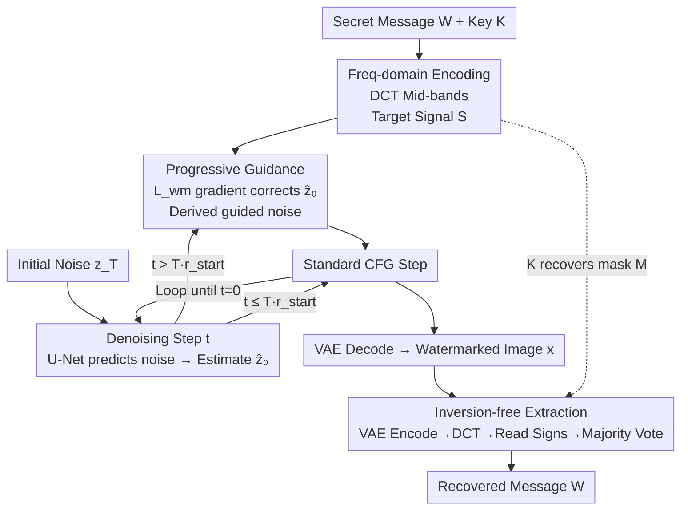

# GROW: Watermark Generation with Progressive Guidance for Diffusion Models

**Conference**: CVPR 2026  
**Paper**: [CVF Open Access](https://openaccess.thecvf.com/content/CVPR2026/html/Luo_GROW_Watermark_Generation_with_Progressive_Guidance_for_Diffusion_Models_CVPR_2026_paper.html)  
**Code**: None (Authors committed to open-source; not released at the time of writing)  
**Area**: AI Security / Diffusion Model Watermarking  
**Keywords**: Digital Watermarking, Diffusion Models, Training-free, Frequency Domain Guidance, Inversion-free Extraction

## TL;DR
GROW reformulates diffusion model watermarking from "one-time embedding in initial noise requiring expensive DDIM inversion during extraction" to "progressive guidance using frequency-domain gradients during denoising." This allows the watermark to naturally grow into the image texture, enabling **inversion-free** extraction—surpassing existing methods in robustness and invisibility while achieving nearly 100x faster extraction.

## Background & Motivation

**Background**: Images generated by diffusion models require digital watermarks for copyright protection and traceability. Existing methods fall into three categories: post-processing (modifying the final image, poor quality/robustness), fine-tuning (modifying model parameters, high cost/weight alteration), and training-free (plug-and-play, most popular). The mainstream training-free paradigm, pioneered by Tree-Ring, embeds watermarks as specific patterns in the **initial noise** $z_T$, allowing the denoising process to fuse the noise with image semantics.

**Limitations of Prior Work**: A fatal flaw of all "initial noise" methods is that **extracting the watermark requires DDIM inversion to reverse the image back to initial noise**. Inversion is essentially a full diffusion sampling process, which is computationally expensive (taking 10–20 seconds per image), creating a latency bottleneck for large-scale or real-time scenarios.

**Key Challenge**: The robustness of initial noise methods stems from a **passive scattering** mechanism—the denoising network implicitly filters the watermarked noise and integrates it into the image semantics. This "imprinting at the source" naturally requires "reversing from the result" to retrieve the watermark, making inversion unavoidable. A naive alternative—directly adding watermarks to the **final latent** $z_0$ (which avoids inversion)—results in severe image degradation by brutally disrupting the learned data distribution (as shown in Figure 6).

**Key Insight / Core Idea**: The author's key insight is that the "deep fusion" desired in passive scattering can be achieved through **active guidance**. Instead of modifying the initial noise, the method leverages the model's iterative denoising process: at each step, it calculates the difference between the current latent (in the frequency domain) and a target watermark pattern, using the gradient of this difference to **gently** steer the generation trajectory. These micro-perturbations accumulate along the learned data manifold, and the U-Net renders them as "high-frequency details" (e.g., feathers, bark, water ripples), growing a deeply fused watermark. In short: **transforming the watermark from a "one-time imprint" into a "progressive co-evolution of image and watermark,"** thereby making extraction a simple sign check of frequency coefficients, eliminating inversion.

## Method

### Overall Architecture
GROW is a training-free paradigm comprising two paths: **watermark generation** and **watermark extraction**. On the generation side: secret messages are encoded into a frequency-domain target signal $S$. During the latter half of the denoising process, the MSE between the DCT coefficients of the predicted clean latent and $S$ is used to compute gradients. These gradients correct the noise prediction, guiding the trajectory toward the target. In the extraction phase: the image is encoded back to latent $z_0$, a DCT is performed, and coefficient signs (1 for positive, 0 for negative) are read at positions specified by mask $M$. Redundant copies are resolved via majority voting—requiring no inversion.

The generation process converts a "standard denoising step" into "standard denoising + one gradient guidance step." Guidance is only active when $t > T \cdot r_{start}$. The following Mermaid diagram overviews the generation (with guidance loop) and extraction:

### Key Designs

**1. Frequency Mid-band Watermark Encoding: Balancing Robustness and Quality**

Watermarks must be "invisible" yet "robust." Low frequencies carry main structures (modification is visible), while high frequencies are fragile (easily removed by compression/blur). GROW selects the **DCT mid-bands** of the latent space as the optimal compromise. Specifically, the secret message $W$ is converted into a binary sequence $w$. A binary mask $M$ is generated via a PRNG seeded by key $K$. The target signal matrix is then:

$$\mathbf{S}(u,v) = \begin{cases} \alpha \cdot (2w_i - 1) & \text{if } \mathbf{M}(u,v)=1 \\ 0 & \text{otherwise} \end{cases}$$

where $w_i$ is the bit at $(u,v)$ and $\alpha$ is the intensity. The mapping $2w_i-1$ converts bits $\{0,1\}$ to $\{-1,+1\}$, providing the basis for sign-based extraction.

**2. Progressive Watermark Guidance: Weaving in Watermarks along the Trajectory**

This is the core mechanism to prevent image degradation. Guidance starts at $t > T \cdot r_{start}$ (e.g., $r_{start}=0.5$). Each step involves:
First, **predicting the clean latent**: Estimate $\hat{z}_0$ using $z_t$ and the U-Net prediction $\mathcal{E}_\theta$:
$$\hat{\mathbf{z}}_0 = \frac{1}{\sqrt{\bar{\alpha}_t}}\left(\mathbf{z}_t - \sqrt{1-\bar{\alpha}_t}\,\mathcal{E}_\theta(\mathbf{z}_t, t, c)\right)$$
Second, **calculating gradient and correction**: Convert $\hat{z}_0$ to the frequency domain and compute the MSE loss $\mathcal{L}_{wm} = \|(\text{DCT}(\hat{\mathbf{z}}_0) - \mathbf{S}) \odot \mathbf{M}\|_2^2$. Update the latent: $\hat{\mathbf{z}}_0^{\text{guided}} = \hat{\mathbf{z}}_0 - \eta \nabla_{\hat{\mathbf{z}}_0}\mathcal{L}_{wm}$, where $\eta$ is the guidance scale.
Third, **deriving guided noise**: Re-solve the equation to find the corresponding noise for the scheduler: $\mathcal{E}^{\text{guided}} = \frac{1}{\sqrt{1-\bar{\alpha}_t}}(\mathbf{z}_t - \sqrt{\bar{\alpha}_t}\,\hat{\mathbf{z}}_0^{\text{guided}})$. This noise, containing the watermark signal, is used in the standard CFG framework. By applying **tiny** perturbations every step, the U-Net treats them as textures rather than noise to be removed.

**3. Inversion-free Extraction: Direct Sign Reading + Majority Voting**

Extraction is direct: given image $x$, encode it to $z_0$ using VAE and perform DCT to get $F$. Reconstruct mask $M$ using key $K$. For each $M(u,v)=1$, **read only the sign of $F(u,v)$**: positive maps to 1, negative to 0. Since bits are redundantly embedded, **majority voting** is used to determine final values, ensuring robustness against distortion. This process (VAE encode + DCT + sign statistics) takes only 0.24 seconds, nearly 100x faster than inversion-based methods.

## Key Experimental Results

Backbone: Stable Diffusion v2.1-base. Evaluation on 1000 images from MS-COCO and Stable-Diffusion-Prompts. Robustness is measured by **M-ACC** (message success only if all bits are correct). Invisibility is measured by PSNR/SSIM/FID/LPIPS.

### Main Results

Invisibility and Average Robustness (Selected results):

| Dataset | Method | PSNR↑ | SSIM↑ | FID↓ | LPIPS↓ | Avg M-ACC↑ |
|--------|------|-------|-------|------|--------|------------|
| SD-Prompts | Tree-Ring | 15.25 | 0.54 | 25.93 | 0.42 | 0.485 |
| SD-Prompts | Gaussian Shading | 24.83 | 0.81 | 25.45 | 0.07 | 0.907 |
| SD-Prompts | WIND | 13.16 | 0.47 | 24.12 | 0.39 | 0.926 |
| SD-Prompts | **GROW** | **28.09** | **0.84** | **18.90** | **0.06** | **0.976** |
| MS-COCO | **GROW** | **27.54** | **0.85** | **12.32** | **0.05** | **0.978** |

GROW achieves the best invisibility (lowest FID, indicating distribution closest to original) and highest average robustness. While "initial noise" methods sacrifice PSNR/SSIM significantly to achieve robustness, GROW avoids this trade-off.

Extraction Efficiency (Table 3, seconds/image, Tesla T4):

| Method | Generation Time (Total/Watermark Overhead) | Extraction Time ↓ |
|------|----------------------|-----------|
| Tree-Ring | 21.03 / 0.04 | 19.70 |
| Gaussian Shading | 21.24 / 0.25 | 12.50 |
| WIND | 21.17 / 0.18 | 21.70 |
| **GROW** | 21.16 / 0.17 | **0.24** |

### Ablation Study

Progressive Guidance vs. One-Step Injection (MS-COCO, Table 4) — Injecting the same DCT pattern directly into final latent $z_0$:

| Configuration | FID↓ | PSNR↑ | SSIM↑ | Result |
|------|------|-------|-------|------|
| One-Step (into $z_0$) | 157.8 | 11.36 | 0.19 | Catastrophic collapse in quality |
| **GROW (Progressive)** | **12.32** | **27.54** | **0.85** | Intact quality at same intensity |

### Key Findings
- **Progressive vs. One-step is the tipping point**: One-step injection causes FID to spike to 157.8, proving that "small iterative perturbations along the manifold" are essential for embedding strong signals without destroying the image.
- **Balanced Robustness-Quality trade-off**: Unlike prior methods that sacrifice one for the other, GROW achieves Pareto optimality in both.
- **Model-agnostic**: Tested on SD-v1.5 and SDXL, GROW maintains high M-ACC, proving it is a general technique.
- **Earlier guidance ensures deeper integration**: Lower $r_{start}$ values result in higher robustness as the watermark experiences more refinement steps.

## Highlights & Insights
- **From Passive Scattering to Active Guidance**: The authors recognize that the "deep fusion" in older methods can be replicated actively using gradients, which simultaneously removes the need for inversion.
- **Sign-based Freq-domain Reading for Efficiency**: Encoding information into the **sign** of coefficients allows for extremely cheap extraction via sign statistics and majority voting.
- **Reusing Scheduler Interfaces**: By applying guidance to $\hat{z}_0$ and re-solving for noise, the method integrates as a plug-in for any diffusion sampler without modifying U-Net or the scheduler itself.

## Limitations & Future Work
- Robustness can be compromised by **random ratio stretching**, and capacity is physically limited by the frequency domain structure.
- The 100x speedup is specifically against "inversion-based" extraction; it is not necessarily faster than post-processing methods (like Hidden) that already avoid inversion.
- Future work aims to replace the static DCT domain with an **adversarially-trained representation space** to improve security and robustness further.

## Related Work & Insights
- **vs. Initial Noise Methods (Tree-Ring/WIND)**: These rely on passive scattering and require DDIM inversion (10–20s). GROW uses active guidance for inversion-free extraction (0.24s) with superior image quality.
- **vs. One-step Latent Injection**: GROW avoids the catastrophic quality collapse of naive injection by using iterative refinement.
- **vs. Post-processing (Hidden)**: Post-processing is not "endogenous" to the generation process and is generally less robust.
- **vs. Fine-tuning (Stable Signature)**: Fine-tuning requires model weight modification, whereas GROW is plug-and-play.

## Rating
- Novelty: ⭐⭐⭐⭐⭐ 
- Experimental Thoroughness: ⭐⭐⭐⭐ 
- Writing Quality: ⭐⭐⭐⭐⭐ 
- Value: ⭐⭐⭐⭐⭐ 

<!-- RELATED:START -->

## Related Papers

- [\[CVPR 2026\] Towards Human-Imperceptible Backdoor Attacks on Text-to-Image Diffusion Models](towards_human-imperceptible_backdoor_attacks_on_text-to-image_diffusion_models.md)
- [\[CVPR 2026\] Bridging Privacy and Provenance: Traceable Virtual Identity Generation](bridging_privacy_and_provenance_traceable_virtual_identity_generation.md)
- [\[CVPR 2026\] Red-teaming Retrieval-Augmented Diffusion Models via Poisoning Knowledge Bases](red-teaming_retrieval-augmented_diffusion_models_via_poisoning_knowledge_bases.md)
- [\[CVPR 2026\] GenBreak: Red Teaming Text-to-Image Generation Using Large Language Models](genbreak_red_teaming_text-to-image_generation_using_large_language_models.md)
- [\[CVPR 2026\] Roots Beneath the Cut: Uncovering the Risk of Concept Revival in Pruning-Based Unlearning for Diffusion Models](roots_beneath_the_cut_uncovering_the_risk_of_concept_revival_in_pruning-based_un.md)

<!-- RELATED:END -->
