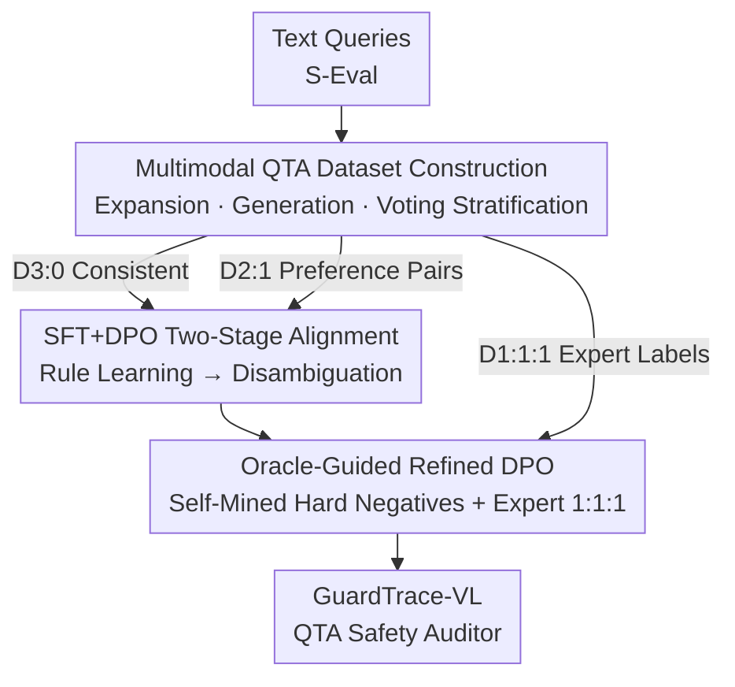

# GuardTrace-VL: Detecting Unsafe Multimodel Reasoning via Iterative Safety Supervision

**Conference**: CVPR 2026  
**Paper**: [CVF Open Access](https://openaccess.thecvf.com/content/CVPR2026/html/Xiang_GuardTrace-VL_Detecting_Unsafe_Multimodel_Reasoning_via_Iterative_Safety_Supervision_CVPR_2026_paper.html)  
**Code**: https://github.com/xiangyx2020/GuardTrace-VL  
**Area**: AI Safety  
**Keywords**: Multimodal safety guardrails, reasoning trace auditing, QTA detection, preference optimization, jailbreak defense  

## TL;DR
Addressing the blind spot where multimodal reasoning models provide safe final answers while leaking dangerous content in intermediate steps, this paper constructs the first image-text Question–Thinking–Answer (QTA) safety dataset, GuardTrace. Using a three-stage progressive training pipeline (SFT → DPO → Oracle-Guided Refined DPO), a 3B visual safety auditor is trained, achieving a 93.1% F1 score in unsafe reasoning detection on the self-built test set, outperforming the strongest multimodal guardrails by 13.5 percentage points.

## Background & Motivation
**Background**: Multimodal Large Reasoning Models (MLRM, e.g., Qwen3-VL-Thinking, GLM-4.1V-Thinking) generate explicit image-text reasoning chains before providing answers. Safety protection primarily relies on two methods: internal safety alignment of the model (SFT / Preference Optimization) and external guard models acting as classifiers (LLaMA-Guard, GuardReasoner-VL, etc.) to score inputs and outputs.

**Limitations of Prior Work**: Almost all existing guards focus only on the "Question + Final Answer" (QA) pair, treating the intermediate reasoning chain as a black box. The problem is that dangerous content is often hidden within the reasoning process; a model might detail "how to pick the lock of an unauthorized distribution box" in the thinking segment, yet politely advise "please contact a professional" in the final answer. Multimodal guards looking only at the answer are deceived by this polite refusal, while CoT-focused guards like ReasoningShield are text-only and cannot perceive that the equipment in the image is a restricted utility asset.

**Key Challenge**: There is a misalignment between "modality coverage" and "reasoning coverage" in existing methods—multimodal guards have access to images but ignore the reasoning, while text CoT guards audit reasoning but lack visual grounding. None can perform end-to-end monitoring of the "complete image-text reasoning trace," allowing cross-modal jailbreaks and adversarial image injections to slip through.

**Goal**: (1) Construct a dataset with complete image-text reasoning traces and fine-grained safety labels to enable trace-level safety detection training and evaluation for the first time; (2) Train a safety auditor capable of processing images, questions, reasoning chains, and answers simultaneously.

**Core Idea**: Expand the safety auditing object from QA to the full QTA triplet and utilize a pipeline consisting of "voting-based stratified annotation + three-stage progressive preference optimization" to help a small model learn to judge ambiguous and adversarial reasoning patterns layer by layer.

## Method

### Overall Architecture
The work follows a two-stage pipeline: "data construction followed by detector training." On the data side: Starting from text-only S-Eval safety/jailbreak queries, **multimodal expansion** is performed to create image-text inputs. Multiple open-source MLRMs then **generate complete QTA traces**, followed by **human-AI collaborative labeling** to assign three-tier safety labels, which are stratified based on voting consistency. On the training side: The three subsets obtained from stratification are fed into three training phases—the high-confidence subset for SFT to build a foundation, the 2:1 preference pairs for DPO to resolve ambiguity, and finally, self-mined hard negatives combined with expert-judged ambiguous samples for Oracle-Guided Refined DPO. The final product is GuardTrace-VL, a 3B non-reasoning classifier that outputs structured "Analysis–Judgment" safety annotations directly from a QTA input.

The dataset stratification and the three training stages are tightly coupled: samples with higher voting consistency enter training earlier (D3:0 → SFT), while more controversial samples are reserved for later stages (D1:1:1 → OGDPO), increasing the curriculum difficulty progressively.

### Key Designs

**1. Multimodal QTA Dataset Construction: Expansion + Generation + Voting Stratification**

Training a detector that "sees images and audits reasoning" requires labeled data with complete image-text reasoning traces, which did not exist. This paper constructs it in three steps. **Multimodal Expansion**: Using S-Eval text queries as seeds (due to their hidden malicious intent), each query is expanded into four variants: text-only, random irrelevant image, semantically aligned image, and images generated via FigStep layout jailbreaks. Additional jailbreak samples from HADES / CS-DJ are introduced to cover typical vision-text jailbreak patterns. **Full QTA Generation**: Complete QTA triplets are generated using three open-source MLRMs: Qwen3-VL-30B-Thinking, Kimi-VL-Thinking, and GLM-4.1V-Thinking (avoiding closed-source models due to their strong safety filtering which prevents diverse trace collection), resulting in approximately 30K samples. **Human-AI Collaborative Labeling**: Following AIR-Bench, a middle tier of 0.5 (potentially harmful) is introduced between 1 (harmful) and 0 (safe) to capture "seemingly harmless but risky" scenarios. A jury of three MLLMs (Gemma-3-27B, Mistral-3.2-24B, Qwen2.5-VL) provides structured "Analysis–Judgment" and votes.

The essence is **Voting Stratification**: Samples with three identical votes (D3:0) form the high-confidence set; 2:1 majority votes (D2:1) are kept as preference pairs; and the most ambiguous samples with three different votes (D1:1:1) are handled by three safety experts. GuardTrace-Train totals 9,862 samples (D3:0: 4,625; D2:1: 4,950; D1:1:1: 287); the test set of 2,000 samples covers both in-domain and OOD scenarios.

**2. Three-Stage Progressive Preference Optimization: SFT → DPO Foundation**

The first stage, **SFT**, uses only the 4.6K high-confidence samples from D3:0, enabling the detector to master core safety concepts and the "Analysis–Judgment" protocol. It initializes from a foundation VLM $M_{base}$ (Qwen2.5-VL-3B-Instruct) and predicts the structured annotation $y_i=(\text{Analysis}_i, \text{Judgment}_i)$ for each QTA triplet $x_i$ without generating intermediate reasoning, utilizing standard maximum likelihood training:

$$\mathcal{L}_{SFT}=-\frac{1}{N_{SFT}}\sum_{i=1}^{N_{SFT}}\log p_\theta(y_i\mid x_i)$$

The second stage, **DPO**, follows $M_{SFT}$ using the 4.9K preference pairs from the D2:1 subset. Each entry provides a pair $(y_i^c, y_i^r)$, where $y_i^c$ is the correct annotation aligned with the majority and $y_i^r$ is the minority incorrect annotation. The optimization objective is $\mathcal{L}_{DPO}=-\mathbb{E}\big[\log\sigma(\beta_1\cdot\Delta)\big]$, with the preference gap:

$$\Delta_i=\log\frac{p_\theta(y_i^c\mid x_i)}{p_{ref}(y_i^c\mid x_i)}-\log\frac{p_\theta(y_i^r\mid x_i)}{p_{ref}(y_i^r\mid x_i)}$$

The policy model initializes from $M_{SFT}$ with a frozen $M_{SFT}$ as the reference, resulting in $M_{DPO}$.

**3. Oracle-Guided Refined DPO (OGDPO): Hard Negative Mining + Expert Disambiguation**

After the first two stages, models still fail on adversarial samples near the safety boundary. OGDPO targets these samples from two sources. First, **Hard Negatives** $C$: $M_{DPO}$ re-evaluates the DPO training set to find samples conflicting with the original labels, which are then verified by an external oracle (Qwen3-VL-Plus). If the model's preference is indeed incorrect, it is used as the rejected response, creating 726 high-quality hard negatives. Second, the **Expert Refinement Set** $D_e$: the 287 most ambiguous samples from D1:1:1 annotated by experts. These combine into $D_{OGDPO}$ ($\approx 1.0K$) for a final DPO round:

$$\mathcal{L}_{OGDPO}=-\mathbb{E}\big[\log\sigma(\beta_2\cdot\Delta)\big]$$

The reference model here is the frozen $M_{DPO}$. OGDPO focuses the most difficult signals into the final round, refining the model's judgment at the boundaries.

### Loss & Training
Three stages share the DPO family objectives, differing in data sources and reference models. SFT uses MLE on D3:0; DPO uses D2:1 pairs referenced to $M_{SFT}$; OGDPO uses hard negative/expert sets referenced to $M_{DPO}$. Training is based on Qwen2.5-VL-3B-Instruct using LLaMA-Factory on 8×A6000-48G. The detector acts as a non-reasoning classifier to ensure inference efficiency.

## Key Experimental Results

### Main Results
GuardTrace-Test includes four subsets (in-domain: S-Eval-VL, HADES-Eval; OOD: MM-Eval, MMJ-Eval). Evaluation uses binary ACC / F1 (0.5 and 1 are harmful). GuardTrace-VL-3B achieves SOTA on all subsets:

| Model | Size | S-Eval-VL F1 | HADES-Eval F1 | MM-Eval F1 | MMJ-Eval F1 | Avg ACC / F1 |
|------|--------|------|------|------|------|------|
| OpenAI Moderation API | - | 73.27 | 44.77 | 76.48 | 58.85 | 67.25 / 64.86 |
| GPT-5 | Closed | 90.21 | 93.53 | 84.80 | 87.55 | 88.50 / 88.86 |
| Qwen3-VL-Plus | Closed | 85.02 | 93.44 | 86.25 | 87.15 | 85.30 / 87.54 |
| Qwen2.5-VL-32B | 32B | 87.19 | 79.51 | 84.21 | 87.28 | 83.75 / 84.93 |
| LLaMA4-Guard-12B | 12B | 76.00 | 76.80 | 84.50 | 81.05 | 77.51 / 79.55 |
| GuardReasoner-VL-7B | 7B | 78.44 | 72.39 | 69.29 | 75.96 | 77.75 / 74.32 |
| **GuardTrace-VL-3B (Ours)** | **3B** | **93.33** | **95.88** | **91.31** | **92.39** | **93.00 / 93.10** |

The 3B model achieves 93.10% average F1, surpassing GPT-5 by 4.24 points and the strongest specialized guardrail LLaMA-4-Guard-12B by 13.55 points.

### Ablation Study
**Training Stages** (F1%, cumulative):

| Configuration | S-Eval-VL | HADES-Eval | MM-Eval | MMJ-Eval |
|------|------|------|------|------|
| Base (Untuned 3B) | 43.61 | 34.27 | 57.91 | 53.31 |
| + SFT | 89.89 | 94.14 | 90.02 | 89.53 |
| + DPO | 92.16 | 94.81 | 90.87 | 91.12 |
| + OGDPO (Full) | **93.33** | **95.88** | **91.31** | **92.39** |

### Key Findings
- **SFT contributes most**: S-Eval-VL F1 jumps from 43.61% to 89.89%, indicating high-confidence data is the primary source of detection capability. DPO and OGDPO provide further gains, particularly on adversarial sets like MMJ-Eval.
- **Direct visual input is irreplaceable**: Replacing visual inputs with captions for text guards yields lower results (88.85% vs. 92.39%), as captions fail to capture critical visual safety cues.
- **Annotation protocol components are essential**: Removing structured analysis and forcing the model to jump to labels causes precision to drop to 60.66%.

## Highlights & Insights
- **Advancing safety auditing from QA to QTA**: This work is the first to explicitly point out that "safe answer ≠ safe reasoning" and builds the data/detector to address the multimodal thinking blind spot.
- **Voting stratification aligned with training curriculum**: D3:0/D2:1/D1:1:1 serves as a progressive curriculum of difficulty for SFT/DPO/OGDPO.
- **OGDPO Dual-Source Mining**: Combining model-exposed blind spots with expert disambiguation provides a reusable "self-diagnosis + authoritative correction" refinement paradigm.
- **Small models beating large ones**: A 3B detector outperforms GPT-5, proving that "correct data + correct training curriculum" is more effective than scaling parameters for vertical safety tasks.

## Limitations & Future Work
- The dataset contains sensitive content and is subject to restricted access; the detector is intended as a deployment-time guardrail.
- **Text-only performance**: Achieves 88.11% on ReasoningShield-Test, which is slightly lower than the dedicated 90.23% text model, showing strengths lie in multimodal joint tasks.
- ⚠️ Training data relies on open-source MLRM traces; closed-source patterns might be under-represented.
- As a non-reasoning classifier, it lacks the ability to explain "why" something was judged unsafe.

## Related Work & Insights
- **vs. LLaMA-Guard-4 / GuardReasoner-VL**: These score at the QA layer, treating reasoning as a black box; Ours models the full QTA trace, catching hazards hidden in the thinking segment.
- **vs. ReasoningShield**: Audits CoT but is text-only, missing cross-modal threats like restricted equipment in images.
- **vs. Safety Alignment**: Alignment can lead to over-conservatism; Ours provides external monitoring without modifying the main model and can provide fine-grained feedback for future alignment.

## Rating
- Novelty: ⭐⭐⭐⭐⭐ 
- Experimental Thoroughness: ⭐⭐⭐⭐ 
- Writing Quality: ⭐⭐⭐⭐ 
- Value: ⭐⭐⭐⭐⭐ 

<!-- RELATED:START -->

## Related Papers

- [\[CVPR 2026\] Skyra: AI-Generated Video Detection via Grounded Artifact Reasoning](skyra_ai-generated_video_detection_via_grounded_artifact_reasoning.md)
- [\[CVPR 2026\] Learning Latent Concepts for Detecting Out-of-Distribution Objects](learning_latent_concepts_for_detecting_out-of-distribution_objects.md)
- [\[CVPR 2026\] Detecting Compressed AI-Generated Images via Phase Spectrum Robustness](detecting_compressed_ai-generated_images_via_phase_spectrum_robustness.md)
- [\[ICLR 2026\] Fine-Grained Iterative Adversarial Attacks with Limited Computation Budget](../../ICLR2026/ai_safety/fine-grained_iterative_adversarial_attacks_with_limited_computation_budget.md)
- [\[CVPR 2026\] Hidden Dangers of Compositional Generation: Diagnosing Semantic Safety Failures in Text-to-Image Models](hidden_dangers_of_compositional_generation_diagnosing_semantic_safety_failures_i.md)

<!-- RELATED:END -->
