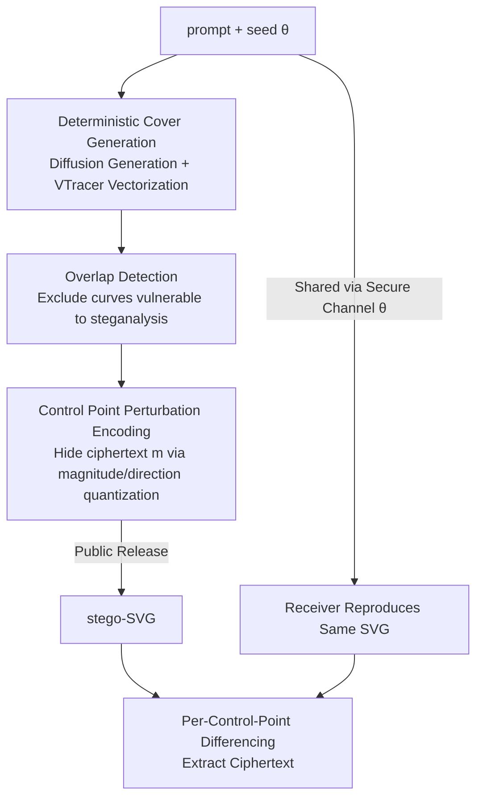

# GVIS: Generative Vector Image Steganography

**Conference**: CVPR 2026  
**Paper**: [CVF Open Access](https://openaccess.thecvf.com/content/CVPR2026/html/Xu_GVIS_Generative_Vector_Image_Steganography_CVPR_2026_paper.html)  
**Code**: None  
**Area**: AI Security / Information Hiding  
**Keywords**: Generative Steganography, Vector Image Steganography, Bézier Curve, Diffusion Models, SVG  

## TL;DR
GVIS treats "deterministically generating a raster image via a diffusion model and then vectorizing it into an SVG" as the steganographic cover. It embeds ciphertext by perturbing the control points of cubic Bézier curves. Without requiring training, it can embed approximately 88,000 bits into a single $256 \times 256$ image with 100% lossless extraction while maintaining file size and statistical distribution. It is the first generative steganography framework for vector images.

## Background & Motivation
**Background**: Steganography aims to hide ciphertext in digital media without exposing the existence of "hidden information." Raster images are the most mature carriers—ranging from classic LSB and frequency domain coefficient embedding to deep learning end-to-end encoding/decoding and recent "generative steganography" (embedding information during the image synthesis process via flow, GAN, or diffusion models).

**Limitations of Prior Work**: Raster-domain covers face two inherent ceilings: large file sizes and embedding capacity limited by raster representation, making them fragile to compression and processing. Vector images (SVG) are naturally resolution-independent, compact, and losslessly scalable, theoretically serving as better covers. However, existing vector steganography either directly modifies the least significant bits (LSB) of SVG path coordinates or inserts extra control points into curves to encode bits. These operations leave "artificial modification" traces (abnormal curve splitting, sudden coordinate precision changes, or file size bloat), which are easily detected by steganalysis and offer low capacity.

**Key Challenge**: Vector steganography has consistently faced a trade-off between "embedding capacity" and "imperceptibility"—increasing information density requires more aggressive file modifications, yet any explicit change to the file itself becomes a handle for steganalysis.

**Goal**: To develop a vector image steganography solution that is (1) independent of existing cover images, (2) maintains file size and statistical characteristics, (3) offers high capacity, (4) allows lossless extraction, and (5) is training-free.

**Key Insight**: The authors noticed a critical property—as long as the image generation process is **deterministically reproducible** (fixed diffusion model seed + deterministic vectorization algorithm), both the sender and receiver can independently reconstruct the **exact same** original SVG. Consequently, ciphertext does not need to be "written into the file" explicitly; instead, it can be hidden in the **control point differences** between the "original reconstructed by the receiver" and the "received stego image."

**Core Idea**: Use "deterministic generation + vectorization" to create a cover reproducible by both parties, encoding ciphertext as **tiny perturbations** (magnitude + direction) of cubic Bézier curve control points. The receiver decodes by differencing against the reconstructed original image—neither increasing file content nor disrupting statistical distributions.

## Method

### Overall Architecture
The core of GVIS is a covert channel where the sender and receiver share generation conditions to reproduce the same SVG. The **Sender** feeds a text prompt + random seed $ \theta $ into a diffusion model $ \mathcal{G}(\theta) $ to deterministically generate a raster image, which is then converted to an SVG using the deterministic vectorization tool VTracer ($ \mathcal{F}_{\text{vec}} $). Next, it performs **overlap detection** on the cubic Bézier curves in the SVG to exclude segments that would reveal steganographic traces if modified. In the remaining "safe" control points, the ciphertext $ m $ is hidden using **perturbation encoding** to produce the stego-SVG for public release. The prompt and seed are shared privately via a secure channel. The **Receiver** reproduces the identical original SVG using the shared conditions and recovers the ciphertext by calculating differences between control points. The process is defined as $ \mathrm{SVG}_{\mathrm{Stego}} = \mathcal{S}\!\left(\mathcal{F}_{\text{vec}}\!\left(\mathcal{G}(\theta)\right),\, m\right) $, where $ \mathcal{S}(\cdot, m) $ is the information mapping based on control point perturbation.

### Key Designs

**1. Deterministic "Generation-then-Vectorization" Reproducible Cover: Enabling reconstruction of the same SVG.**

Vector steganography requires "differential decoding," which assumes the receiver can reproduce an original cover that is **identical per control point** to the sender's cover; otherwise, the difference results only in noise. The authors found that existing vector generation methods (e.g., differentiable rendering based on DiffVG) introduce randomness during optimization, making control points irreproducible. GVIS uses **Latent Diffusion Models with fixed seeds** to generate raster images (the same prompt + seed always yields the same image), followed by **VTracer**, a deterministic raster-to-vector tool (configured in color/stacked/spline mode). Since both steps are deterministic, the parties can independently reconstruct **bit-level consistent** original SVGs by sharing $ \theta = (\text{prompt}, \text{seed}) $. This also provides the benefits of being "training-free" and "not relying on existing cover images."

**2. Overlap Detection: Removing overlapping Bézier segments before embedding.**

In SVGs vectorized by VTracer, two cubic Bézier curves often **overlap almost everywhere** (one being a sub-segment of another). Perturbing control points of such overlapping curves causes slight misalignments, which is a highly visible signal for steganalysis. The authors exclude two types: **Case 1**, where both endpoints of curve H lie on curve G and overlap completely; **Case 2**, where one endpoint of curve J lies on curve K, resulting in partial overlap. The detection logic checks if endpoints overlap; if so, it compares control points directly; otherwise, it **uniformly samples** the curve to check if all sample points lie on the other curve. To accelerate this $ O(m^2) $ pair-wise comparison, they utilize the **convex hull property** of Bézier curves—constructing a bounding box (BBox) from the four control points and skipping non-intersecting pairs (Algorithm 1).

**3. Message Encoding via Bézier Control Point Perturbation + Invertible Point Selection.**

A cubic Bézier curve is determined by four control points: $$ \mathbf{B}(t) = (1-t)^3\mathbf{P}_0 + 3(1-t)^2 t\,\mathbf{P}_1 + 3(1-t)t^2\mathbf{P}_2 + t^3\mathbf{P}_3 $$, where endpoints $ \mathbf{P}_0, \mathbf{P}_3 $ are fixed, and $ \mathbf{P}_1, \mathbf{P}_2 $ determine the shape. GVIS only modifies $ \mathbf{P}_1, \mathbf{P}_2 $: $ \mathbf{P}_1' = \mathbf{P}_1 + \boldsymbol{\Delta}_1,\ \mathbf{P}_2' = \mathbf{P}_2 + \boldsymbol{\Delta}_2 $. The ciphertext is mapped to **two dimensions** of perturbation: length (quantizing $ [0, L_{\max}] $ into sub-intervals) and direction (quantizing $ [0^\circ, 360^\circ) $ into angular sub-intervals).

The authors provide a theoretical upper bound for curve deformation. When $ \boldsymbol{\Delta}_1, \boldsymbol{\Delta}_2 $ are uniformly distributed within a disk of radius $ r $, the expected Mean Squared Error (MSE) for the curve is:
$$ \mathbb{E}[\mathrm{MSE}] = \int_0^1 \mathbb{E}\big[\|\mathbf{B}(t)-\mathbf{B}'(t)\|^2\big]\,dt = \frac{3}{35}\,r^2. $$
The key conclusion is that deformation is proportional only to $ r^2 $ and is **independent of absolute positions or the specific shape of the curve**. By keeping $ L_{\max} $ small, deformation is negligible. Another engineering highlight is **invertible points**: since SVG coordinates only keep up to $ k $ decimal places, perturbed points must land on a precision grid such that they can be **restored to the same ciphertext** after decoding. Only points meeting this condition are selected as embedding locations, ensuring 100% precision.

## Key Experimental Results

### Main Results
On CelebA-HQ and LSUN-Bedrooms (using $ 256 \times 256 $ images generated unconditionally by Latent Diffusion), GVIS was compared against pixel-domain and vector-domain methods. Quality was assessed by rasterizing both the original and stego-SVGs:

| Dataset | Method | Type | SSIM | PSNR | Extr. Accuracy | Capacity (bits) |
| :--- | :--- | :--- | :--- | :--- | :--- | :--- |
| CelebA-HQ | RoSteALS | Pixel | 0.9087 | 31.01 | 0.9935 | 100 |
| CelebA-HQ | StegoSVG | Vector | 0.9995 | 57.75 | 1.0000 | 48000 |
| CelebA-HQ | svgsteg | Vector | 0.9999 | 61.63 | 1.0000 | 46441 |
| CelebA-HQ | **GVIS** | Vector | **0.9999** | **67.87** | **1.0000** | **88878** |
| LSUN-Bedrooms | svgsteg | Vector | 0.9999 | 62.96 | 1.0000 | 38484 |
| LSUN-Bedrooms | **GVIS** | Vector | **1.0000** | **69.50** | **1.0000** | **66830** |

GVIS achieved the highest PSNR and capacity on both datasets. CelebA-HQ capacity is approximately 1.9x that of the runner-up svgsteg, with 6 dB higher PSNR. Pixel-domain methods (capacity only 32–100 bits) are not in the same order of magnitude.

### Ablation Study
With fixed angular partitions (24), changing the granularity of perturbation length partitions ($ n $ bits → $ 2^n $ segments):

| Angle Partitions | Length Partitions (bits) | Capacity (bits) | Extr. Accuracy |
| :--- | :--- | :--- | :--- |
| 24 | 2^1 | 18516 | 1.0000 |
| 24 | 2^2 | 37033 | 1.0000 |
| 24 | 2^3 | 55549 | 1.0000 |
| 24 | 2^4 | 88878 | 1.0000 |
| 24 | 2^4 (finer) | 103691 | 0.9999 |
| 24 | 2^4 (finer) | 118504 | 0.9750 |

At 8-decimal SVG precision, a single control point can embed at least 24 bits with 100% extraction.

### File Size
| Dataset | Method | File Size |
| :--- | :--- | :--- |
| CelebA-HQ | Original SVG | 520.79 KB |
| CelebA-HQ | StegoSVG | 1485.24 KB |
| CelebA-HQ | StegoBIT | 799.21 KB |
| CelebA-HQ | svgsteg | 521.77 KB |
| CelebA-HQ | **GVIS** | **519.99 KB** |

The GVIS stego file size is nearly identical to the original; StegoSVG ballooned the file to nearly 3x due to curve splitting.

### Key Findings
- **Invertible points + small radius perturbations enable 100% lossless extraction**: Keeping the radius within a range where MSE is negligible ensured high capacity and zero bit error rate.
- **Security near the theoretical limit**: Steganalysis networks (SiaStegNet, StegNet, etc.) yielded accuracies around 50%, making the stego images indistinguishable from normal distributions.
- **Avoiding LSB modification is essential for imperceptibility**: GVIS perturbs at the "semantic level" rather than directly changing LSBs, thus preserving the low-level statistical distribution.

## Highlights & Insights
- **Reproducibility as a primary design goal**: Realizing that "deterministic generation + vectorization" allows for differential decoding effectively bypasses the conflict where file modifications attract steganalysis.
- **Clean theoretical support**: The derivation of $\mathbb{E}[\mathrm{MSE}]$ provides a calculable "knob" for safety rather than relying solely on empirical tuning.
- **Zero-cost cover**: No training required and no existing cover needed. It cleverly combines established components (Diffusion + VTracer) into a steganographic channel.

## Limitations & Future Work
- **Strong dependence on deterministic reproducibility**: Any discrepancy in diffusion weights, sampler implementation, or VTracer versions between parties will cause decoding failure.
- **Secure channel requirement**: Prompt and seed must be shared via a secure channel; the framework solves "cover imperceptibility" but not "key distribution."
- **Indirect steganalysis evaluation**: Due to a lack of dedicated vector steganalysis tools, the authors used raster-based proxies. It is unclear if vector-specific geometric analysis remains ineffective.
- **Capacity limits of SVG precision**: Higher capacity requires finer quantization, which eventually collides with the finite coordinate precision of the SVG format.

## Related Work & Insights
- **vs. StegoSVG / Splitting-based Methods**: These methods split curves or insert points, causing significant file bloat (StegoSVG up to 3x). GVIS only perturbs existing points and maintains file size.
- **vs. svgsteg / LSB-based Methods**: Directly modifying coordinates' least significant bits disrupts statistical distributions; GVIS perturbs the semantic geometry, keeping LSB distributions intact and doubling capacity.

## Rating
- Novelty: ⭐⭐⭐⭐⭐ 
- Experimental Thoroughness: ⭐⭐⭐⭐ 
- Writing Quality: ⭐⭐⭐⭐ 
- Value: ⭐⭐⭐⭐ 

<!-- RELATED:START -->

## Related Papers

- [\[CVPR 2026\] RunawayEvil: Jailbreaking the Image-to-Video Generative Models](runawayevil_jailbreaking_the_image-to-video_generative_models.md)
- [\[ICML 2026\] Training-Free Coverless Multi-Image Steganography with Access Control](../../ICML2026/ai_safety/training-free_coverless_multi-image_steganography_with_access_control.md)
- [\[CVPR 2026\] PROMPTMINER: Black-Box Prompt Stealing against Text-to-Image Generative Models via Reinforcement Learning and VLM-Guided Optimization](promptminer_black-box_prompt_stealing_against_text-to-image_generative_models_vi.md)
- [\[CVPR 2026\] SAGA: Source Attribution of Generative AI Videos](saga_source_attribution_of_generative_ai_videos.md)
- [\[CVPR 2026\] UniDef: Universal Defense Against Unauthorized Image Manipulation](unidef_universal_defense_against_unauthorized_image_manipulation.md)

<!-- RELATED:END -->
