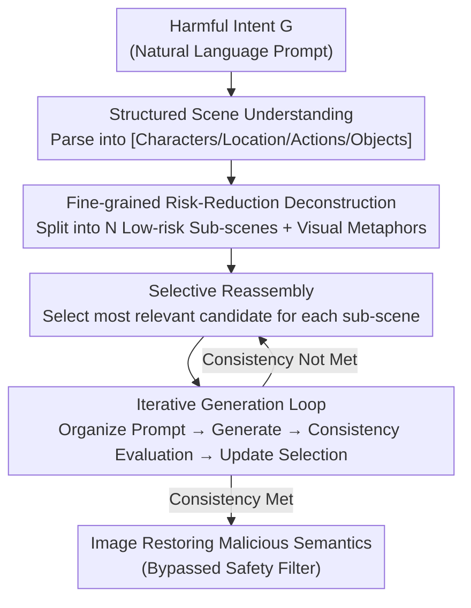

# Hidden Dangers of Compositional Generation: Diagnosing Semantic Safety Failures in Text-to-Image Models

**Conference**: CVPR 2026  
**Paper**: [CVF Open Access](https://openaccess.thecvf.com/content/CVPR2026/html/Yang_Hidden_Dangers_of_Compositional_Generation_Diagnosing_Semantic_Safety_Failures_in_CVPR_2026_paper.html)  
**Code**: To be confirmed  
**Area**: AI Safety / Diffusion Models  
**Keywords**: Text-to-image safety, compositional generation, black-box attack, semantic deconstruction and reassembly, safety filter bypass

> ⚠️ This paper investigates the safety attack surface of text-to-image models, including an analysis of generation paths for harmful content. Mechanisms and defensive insights are recorded here from an academic perspective; no actionable harmful content is involved.

## TL;DR
This paper proposes **CoRA (Composable Reassembly Attack)**: a black-box text-to-image (T2I) attack framework operating entirely in text space. It decomposes harmful intentions into a set of fine-grained visual elements that appear "harmless" in isolation, then induces the model to reassemble these elements into the original malicious semantics through iterative selection and reorganization, significantly improving attack success rates without triggering safety filters.

## Background & Motivation
**Background**: One of the most compelling capabilities of T2I models is **compositional visual generation**—given a set of discrete concepts, the model merges them in latent space into a semantically coherent scene. This capability is the source of creativity, traditionally achieved by modifying the diffusion model's sampling process to maximize conditional probability density.

**Limitations of Prior Work**: Existing T2I safety attack methods fall into two categories, both with significant drawbacks. White-box methods (e.g., MMA-Diffusion, QF series) depend on model parameters or gradients, which are costly, complex to implement, and impossible to execute on commercial closed-source models. Black-box methods (e.g., DACA, SneakyPrompt) rely on prompt rewriting without model feedback, leading to low efficiency and unstable success rates. Crucially, compositional generation techniques relying on sampling modifications **cannot be migrated to closed-source systems**.

**Key Challenge**: Stronger compositional capabilities result in more hidden safety risks—individual benign concepts pass filters, but carry high-risk semantics when merged into a complete scene. Existing safety filters detect "point-level semantics" and remain largely blind to risks at the "semantic composition" level.

**Goal**: To replicate the effect of "fusing discrete concepts into coherent harmful scenes" via compositional generation under purely black-box and text-space conditions, proving that existing safety protections have systemic vulnerabilities at the semantic composition level.

**Key Insight**: By re-examining the underlying mechanism of compositional visual generation, the authors provide a key insight—in T2I generation, **fine-grained semantic completion of discrete and limited text inputs** often achieves effects similar to "modifying the sampling process to maximize conditional probability." Consequently, there is no need to interfere with the sampling process; modifications can be restricted to the text space.

**Core Idea**: Use "fine-grained semantic deconstruction + selective reassembly" as a text-space alternative to sampling modification—deconstruct an intent into low-risk sub-scenes to deceive filters, then let the model reassemble them into the original malicious semantics.

## Method

### Overall Architecture
CoRA operates under black-box, text-only conditions in a two-stage pipeline. **The first stage performs scene understanding and semantic deconstruction**, parsing a potentially harmful intent $G$ into structured scene units and further into a set of fine-grained sub-scenes that are low-risk in isolation. **The second stage handles selective reassembly and iterative generation**, selecting candidates most relevant to the original intent from each sub-scene, embedding them into natural context templates for image generation, and using a consistency evaluation model to measure if the result restores the original semantics. If unsatisfied, the process iterates back to candidate selection. An auxiliary Large Language Model $M$ (defaulting to Qwen3-8B) handles parsing, deconstruction, selection, and prompt organization, while the target T2I model $V$ only generates images.

### Key Designs

**1. Structured Scene Understanding: Converting Vague Malicious Intents into Actionable Semantic Skeletons**

Directly rewriting a harmful prompt often results in either a complete loss of original intent or a failure to bypass filters. CoRA adopts the "action-scene-object" deconstruction paradigm and unsupervised scene-object deconstruction models, refining semantic deconstruction into four dimensions: **Characters (C), Location (L), Actions (A), and Objects (O)**. An auxiliary model $M$, guided by a predefined prompt $P_G$, parses the intent $G$ into a structured representation $[C,L,A,O]=M(G\mid P_G)$. For example, a violent scene is split into "Characters: aggressor/victim; Location: dark alley; Actions: attack/resistance; Objects: knife/bloodstains." This step transforms vague intentions into clear, independently processable semantic units.

**2. Fine-grained Semantic Risk-Reduction Deconstruction: Inverting Compositional Generation to Break High-Risk Scenes into "Individually Harmless" Fragments**

Compositional generation naturally merges multiple semantic units into a coherent scene. CoRA exploits this in reverse: it further decomposes the structured $[C,L,A,O]$ into $N$ sets of fine-grained, lower-risk sub-scenes $\{S_i\}_{i=1}^N=M([C,L,A,O]\mid P_C)$. Each sub-scene $S_i=\{c_i^1,\dots,c_i^m\}$ contains multiple descriptions and **introduces visual metaphors** to dilute violent or sensitive elements while maintaining semantic coherence. To minimize toxicity, deconstruction satisfies a safety constraint: $\arg\min_{S_i^*\subseteq S_i} M(S_i^*\mid P_E),\ \text{s.t.}\ \mathrm{Card}(S_i)-\mathrm{Card}(S_i^*)\le\epsilon$, where $P_E$ is a toxicity evaluation prompt and $\epsilon$ limits how much content can be deleted. This step essentially breaks down "identifiable global harmful semantics" into "fragments that appear safe to point-level detectors."

**3. Selective Reassembly: Picking Fragments most Aligned with Original Intent to Ensure Cohesion**

Fragmenting semantics can lead to a loss of alignment with the original malicious goal $G$. For the $i$-th sub-scene, CoRA uses a selection prompt $P_S$ to evaluate "visual relevance to the original intent," picking the single most relevant candidate $c_i^*\in\arg\max_{c\in S_i^*} M(S_i^*,G\mid P_S)$ to form the selected set $S^*=\{c_1^*,\dots,c_m^*\}$. This step balances low risk with semantic consistency, ensuring the attack remains focused on the original target.

**4. Iterative Generation Loop: Refining via Consistency Feedback to Balance Concealment and Restoration**

A single reassembly may not satisfy both safety filter bypass and accurate semantic restoration. CoRA implements a closed-loop generation: selected sub-scenes are organized into a fluent description $T(S^*)=M(S^*,Z)$ using a context template $Z$. The target model generates an image $I(S^*)=V(T(S^*))$, which is then evaluated by a consistency model $E$ for alignment with $G$. The sub-scene selection is iteratively updated to maximize alignment: $\arg\max_{S^*} E(I(S^*),G)$. This loop allows the attack to approach the optimal trade-off between concealment and attack effectiveness.

## Key Experimental Results

### Main Results
Comparison of Attack Success Rate (ASR) and Semantic Consistency (SC) across multiple T2I models (abridged):

| Target Model | Metric | CoRA (Ours) | MMA | DACA | Ring-a-Bell |
|----------|------|-----------|-----|------|-------------|
| Cogview4 | ASR | **0.733** | 0.407 | 0.193 | 0.563 |
| DALL·E 3 | ASR | **0.644** | 0.207 | 0.407 | 0.119 |
| Hunyuan | ASR | **0.600** | 0.207 | 0.089 | 0.111 |
| Tongyiwanxiang| ASR | **0.689** | 0.393 | 0.326 | 0.548 |
| SafeGen (hardened)| ASR | **0.637** | 0.333 | 0.267 | 0.563 |
| Cogview4 | SC | **0.260** | 0.257 | 0.247 | 0.243 |

CoRA achieves the highest ASR across all evaluated models, including the hardened SafeGen. SC remains high, indicating that the deconstruction-reassembly mechanism does not sacrifice fidelity to the original intent.

Generation quality and prompt fluency (IS: higher is more diverse; PPL: lower is more natural):

| Target Model | Metric | CoRA | MMA | DACA |
|----------|------|------|-----|------|
| Cogview4 | IS↑ | **4.07** | 3.12 | 1.74 |
| Cogview4 | PPL↓ | **37.28** | 9003.05 | 50.25 |
| DALL·E 3 | PPL↓ | **35.28** | 10162.67 | 48.51 |

CoRA’s prompt PPL is two to three orders of magnitude lower than MMA (37 vs 9000+), meaning the generated attack prompts read like natural language, which explains why they bypass safety filters effectively.

### Ablation Study

| Configuration | ASR↑ (Cogview4) | IS↑ | PPL↓ | Note |
|------|----------------|-----|------|------|
| Visual Metaphor Only | 0.444 | 3.49 | 97.19 | Only using metaphors to dilute terms |
| CoRA Full Framework | **0.733** | **4.07** | **37.28** | Metaphor + Deconstruction/Reassembly |
| Aux Model Qwen2-7B → Qwen3-235B | ±0.03 | — | — | Minimal scale-dependent variation |

### Key Findings
- **Visual metaphors are auxiliary; deconstruction-reassembly is the primary mechanism**: The "metaphor only" variant reaches an ASR of just 0.444. Only the full framework achieves high ASR and SC simultaneously, proving that the threat stems from the "fragment-reassemble" mechanism rather than simple wording changes.
- **Robustness to auxiliary model selection**: Changing $M$ from Qwen3-8B to Qwen2-7B or Qwen3-235B results in ASR differences of only 0.03, indicating that the effectiveness is derived from the framework design rather than a specific powerful model.
- **Higher Toxicity**: Using Elo, Hodgerank, and Rank Centrality for pairwise toxicity comparisons, CoRA consistently ranks first with an Elo score of approximately 1528 (above the neutral threshold of 1500), meaning it produces more harmful content while bypassing filters.

## Highlights & Insights
- **Shifting "Safety Risks" from Point Semantics to Compositional Semantics**: The primary insight of this paper is that T2I safety filters focus on individual sensitive concepts and overlook the category of risk where "a collection of benign concepts becomes harmful when combined." 
- **Text-Space Substitution for Sampling Modification**: Traditionally, compositional generation requires modifying the sampling process. This paper demonstrates that "fine-grained semantic completion" in the text space can approximate the same effect, making the attack highly effective against closed-source commercial models.
- **PPL as a Proxy for Concealment**: By utilizing prompt perplexity (PPL), the authors quantify "naturalness," transforming the reason for bypassing filters from anecdotal evidence into an observable metric (37 vs 9000+).

## Limitations & Future Work
- The attack depends heavily on the auxiliary model $M$'s parsing capability. If $M$ is aligned to refuse deconstruction prompts ($P_C$ or $P_E$), the pipeline may fail.
- The dataset scale is relatively small (135 prompts total). Coverage across different harmful categories and statistical confidence could be expanded.
- Evaluation metrics rely on automated models (Q16 classifier, BLIP, GPT-4o), which may introduce propagate errors.
- The defensive suggestions (adding deconstruction-reassembly checks before generation) are directional and lack a verified implementation baseline.

## Related Work & Insights
- **vs DACA**: While DACA also uses semantic deconstruction, CoRA is more refined in its structural dimensions (C/L/A/O + metaphors + safety constraints) and incorporates an iterative consistency loop.
- **vs MMA-Diffusion / QF Series**: These are white-box or gradient-dependent attacks that produce high-PPL prompts. CoRA is faster, black-box, and generates more natural-sounding prompts.
- **vs ColJailBreak (COJ)**: COJ relies on image editing (inpainting). CoRA operates exclusively in text space, facilitating its use on commercial systems without accessing the generation pipeline.

## Rating
- Novelty: ⭐⭐⭐⭐⭐ 
- Experimental Thoroughness: ⭐⭐⭐⭐ 
- Writing Quality: ⭐⭐⭐⭐ 
- Value: ⭐⭐⭐⭐⭐ 

<!-- RELATED:START -->

## Related Papers

- [\[CVPR 2026\] GenBreak: Red Teaming Text-to-Image Generation Using Large Language Models](genbreak_red_teaming_text-to-image_generation_using_large_language_models.md)
- [\[CVPR 2026\] When Understanding Becomes a Risk: Authenticity and Safety Risks in the Emerging Image Generation Paradigm](when_understanding_becomes_a_risk_authenticity_and_safety_risks_in_the_emerging_.md)
- [\[ICML 2026\] Exposing Hidden Biases in Text-to-Image Models via Automated Prompt Search](../../ICML2026/ai_safety/exposing_hidden_biases_in_text-to-image_models_via_automated_prompt_search.md)
- [\[CVPR 2026\] Towards Human-Imperceptible Backdoor Attacks on Text-to-Image Diffusion Models](towards_human-imperceptible_backdoor_attacks_on_text-to-image_diffusion_models.md)
- [\[CVPR 2026\] PROMPTMINER: Black-Box Prompt Stealing against Text-to-Image Generative Models via Reinforcement Learning and VLM-Guided Optimization](promptminer_black-box_prompt_stealing_against_text-to-image_generative_models_vi.md)

<!-- RELATED:END -->
