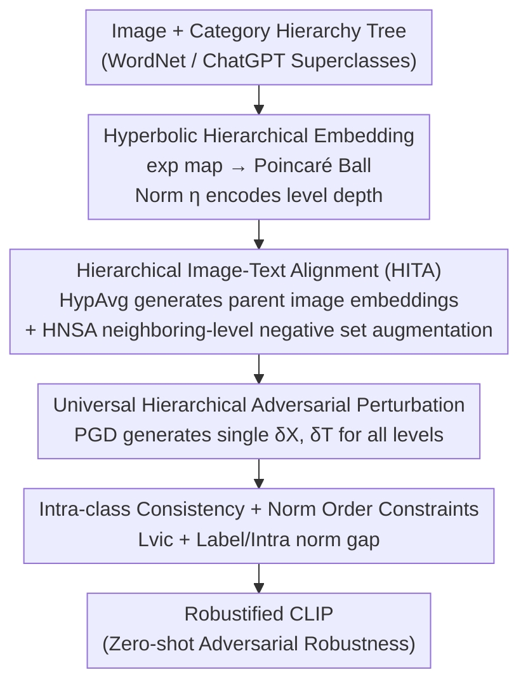

# Hierarchically Robust Zero-shot Vision-language Models

**Conference**: CVPR 2026  
**Paper**: [CVF Open Access](https://openaccess.thecvf.com/content/CVPR2026/html/Dong_Hierarchically_Robust_Zero-shot_Vision-language_Models_CVPR_2026_paper.html)  
**Code**: TBD  
**Area**: AI Safety / Adversarial Robustness / Multimodal VLM  
**Keywords**: Adversarial Fine-tuning, CLIP Robustness, Hyperbolic Embedding, Category Hierarchy, Zero-shot Classification

## TL;DR
Transforms CLIP adversarial fine-tuning from a "flat scheme aligning only leaf/base classes" into a hierarchical scheme aligning across multiple layers of a WordNet category tree. Leveraging hyperbolic (Poincaré ball) geometry, which naturally provides different margins for different hierarchy levels, it generates more universal adversarial perturbations, improving both clean accuracy ($62.5\%$) and robust accuracy ($45.4\%$) across 15 datasets simultaneously.

## Background & Motivation

**Background**: Vision-Language Models (VLMs) like CLIP enable zero-shot classification but are extremely vulnerable to adversarial examples (standard CLIP robust accuracy is only $\sim 7\%$ under PGD attacks). The primary remedy is **adversarial fine-tuning**, such as TeCoA / PMG-FT / FARE: aligning the adversarial features of each image with the text embeddings of its base class (leaf class, e.g., "kit fox") to keep the model matched to the correct category under attack.

**Limitations of Prior Work**: These methods perform "instance-wise alignment" on a **flat category structure**—focusing only on base classes and ignoring hierarchical information inherent in categories (fox$\leftarrow$canine$\leftarrow$carnivore$\leftarrow$mammal). The authors reveal a neglected vulnerability: when attackers target **superclasses** (e.g., mammal) instead of leaf classes, the robust accuracy of TeCoA/PMG/FARE collapses (Fig 1a); conversely, adversarial examples generated at the superclass level can successfully transfer to attack leaf classes (Fig 1b).

**Key Challenge**: Adversarial learning restricted to base classes produces perturbations that **by design only focus on leaf classes**, failing to generalize to more universal semantic levels, while real-world attacks can occur at any abstraction level. The root cause is the "flat class space + Euclidean geometry"—the feasible margin for Euclidean classifiers is restricted to a finite range $(0,1)$, unable to simultaneously cover scales ranging from "general to specific."

**Goal**: (i) Rewrite adversarial fine-tuning to utilize category hierarchies; (ii) allow a single perturbation to threaten multiple abstraction levels simultaneously, yielding more universal adversarial samples to robustify the model.

**Key Insight**: Trees naturally embed into hyperbolic space (Poincaré ball) with minimal distortion; furthermore, in hyperbolic space, **vector norm $\eta=\|\phi\|_2$ directly encodes node depth in the tree** (smaller norms are closer to the root/more general). More importantly, the feasible margin of hyperbolic classifiers grows **exponentially to infinity** as norm $\eta\to 1/\sqrt{r}$, whereas Euclidean classifiers remain bounded—implying different levels naturally correspond to different margin sizes.

**Core Idea**: Use hyperbolic hierarchical embeddings to host the "leaf-to-root" category tree, allowing all levels to participate in adversarial image-text alignment and generating a **universal hierarchical perturbation** effective for all levels. This upgrades single-margin adversarial fine-tuning to "multi-margin, multi-scale" hierarchical robustification.

## Method

### Overall Architecture
The method performs adversarial fine-tuning atop CLIP's dual image/text encoders. On the text side, for each class, the full path from leaf to root is extracted (using WordNet for ImageNet, and ChatGPT-4o for other datasets), with prompts encoded for each level; all embeddings are mapped to the Poincaré ball via the exponential map (exp map). On the image side, since only base class labels exist, **Hyperbolic Averaging (HypAvg)** "rolls up" several subclass image embeddings under the same parent into a more general parent image embedding. Hierarchical image-text alignment is then performed at every level, and a universal hierarchical adversarial perturbation $\delta_X,\delta_T$ effective for all levels is generated. Finally, intra-class consistency and norm-order constraints are added to obtain the robustified CLIP.

### Key Designs

**1. Hyperbolic Hierarchical Embedding: Using Norm as a "Level Ruler"**

The fundamental limitation of flat Euclidean alignment is its single fixed margin, which cannot cover multi-scale generalization. The authors embed the category tree in the Poincaré ball $\mathbb{D}^d_r=\{\phi\in\mathbb{R}^d \mid \|\phi\|_2^2<1/r\}$, mapping CLIP's Euclidean embeddings into hyperbolic space via $\exp^r_0(\cdot)$ and measuring with Riemannian distance $d_r(u,v)=\frac{2}{\sqrt r}\tanh^{-1}(\sqrt r\|-u\oplus v\|_2)$. The key property is: **vector norm $\eta=\|\phi\|_2$ monotonically encodes node depth**—parent classes (more general) have smaller norms near the center, while subclasses (more specific) have larger norms near the boundary. Theorem 1 proves that the feasible log-margin $m_r(\eta)$ of a hyperbolic classifier approaches infinity as $\eta\to 1/\sqrt r$ (Euclidean classifiers stop at $2\lambda\eta^2$). Thus, levels spread along the tree **naturally provide a series of margins from small to large**, serving as the geometric foundation for universal perturbations.

**2. Hierarchical Image-Text Alignment (HITA): HypAvg for Parent Image Embeddings + HNSA Negative Set Augmentation**

Text prompts exist for each level, but "superclass images" do not exist. The authors use **Hyperbolic Averaging (HypAvg)** (based on the Einstein midpoint, Eq 8) to aggregate several subclass image embeddings under the same parent into a parent image embedding $\phi^l_c=\mathrm{HypAvg}(\{\phi(x):x\in X^l_c\})$ with a lower norm, recursing from leaf $l=0$ to root $l=L$. Alignment is performed at each level via Hierarchy-preserving Image-Text Alignment (HITA, Eq 10): $L'=\max_{\delta}\sum_{l=0}^{L}\omega_l L_{CE}(p^l, t^l_c+\delta_T, y(c))$, where weight $\omega_l=1-\frac{l}{L+1}$ is higher for levels near leaves. Simultaneously, **Hierarchy-aware Negative Set Augmentation (HNSA)** inserts non-sibling classes from adjacent levels $l\pm1$ into the softmax denominator (Eq 9) as extra negatives $\eta^l_c$, forcing alignment to distinguish across hierarchical levels.

**3. Universal Hierarchical Adversarial Perturbation: One Perturbation for All Levels**

After establishing multi-level classifiers, the generation of adversarial samples is key. Running PGD independently for each level is slow and less effective. This work uses PGD on the HITA objective (Eq 10) to generate a **single universal perturbation** $\hat x=x+\delta_X, \hat t=t+\delta_T$ that simultaneously targets adversarial risk across all levels. Its effectiveness stems from Design 1: parent classifiers have smaller margins and are easily broken, yielding perturbations that are more "universal"; this same perturbation specialized for subclass classifiers (larger margins) yields robustification across scales.

**4. Intra-class Consistency and Norm Order Constraints: Preserving Hierarchical Geometry**

Hierarchical alignment risks collapsing image embeddings onto base text embeddings and disrupting the norm order (parents must have smaller norms). Two soft constraints are added: **Intra-class Neighborhood Alignment** $L_{vic}=\sum d_r(\phi(\hat x_c),\psi(\hat t_c))-\zeta_{vic}$ constrains image embeddings within a radius $\zeta_{vic}$ of text embeddings; **Norm Order Penalty** (Eq 11, 13) using $\max(0,\|\psi(\hat t^{l+1}_c)\|_2-\|\psi(\hat t^l_c)\|_2+\zeta_{gap})$ forces "parent norm < subclass norm," preserving the mapping between tree depth and norm.

### Loss & Training
The total objective is $L=L'+\lambda_1 L_{vic}+\lambda_2(L^{Label}_{gap}+L^{Intra}_{gap})$ (Eq 14). Unlike previous work that only modifies the image encoder, this work **simultaneously optimizes the text encoder's projection layer**. Bone: CLIP ViT-B/32, fine-tuned on ImageNet, WordNet depth $L=5$; perturbation radii/steps $\epsilon_X=\alpha_X=1/255$, $\epsilon_T=2\times10^{-4}$, 3-step PGD. It also supports "forests" (multiple trees sharing leaves) by summing losses across trees (up to 5 trees used).

## Key Experimental Results

### Main Results
Fine-tuned on ImageNet, zero-shot evaluated on 15 datasets (including ImageNet). Mean clean accuracy and PGD-20 robust accuracy ($\epsilon_X=1/255$, ViT-B/32).

| Method | Avg. Clean Acc | Avg. Robust Acc (PGD-20) |
|------|------|------|
| CLIP (2021) | 64.90 | 7.21 |
| TeCoA (2023) | 52.62 | 38.91 |
| PMG-FT (2024) | 57.36 | 39.72 |
| FARE (2024) | 59.67 | 37.93 |
| AoS (2025) | 61.70 | 43.88 |
| **Ours** | **62.14** | **44.34** |
| **Ours (5 Trees)** | **62.49** | **45.39** |

Compared to FARE, clean accuracy increases by $+2.5\%$ and robust accuracy by $+6.4\%$ on average. The 5-tree version outperforms the latest AoS in both clean/robust ($+1\%/+1.5\%$), despite AoS using $10\times$ image and $50\times$ text augmentation. The lead is maintained under stronger attacks (CW, Auto-Attack), larger radii (2--4/255), and across ViT-L/ResNet-50 backbones.

### Ablation Study

| Config | Clean | PGD | AA | Description |
|------|------|-----|-----|------|
| Baseline (TeCoA) | 52.62 | 38.91 | 37.62 | Flat instance-wise alignment |
| + HITA | 59.27 | 42.08 | 40.59 | Add hierarchical alignment |
| + HITA + vic | 62.35 | 43.67 | 42.18 | Add neighborhood alignment |
| + HITA + gap | 60.06 | 43.15 | 41.54 | Add norm order penalty |
| Full | 62.14 | 44.34 | 42.72 | Complete model |

| Adversarial Perturbation Strategy | Clean | PGD | AA | Time per Epoch |
|------|------|-----|-----|------|
| Leaf-only perturbation | 60.25 | 41.59 | 40.23 | 70.1 min |
| Layer-wise independent perturbation | 61.37 | 42.35 | 40.88 | 154.2 min |
| **Universal Hierarchical Perturbation** | **62.14** | **44.34** | **42.72** | **73.2 min** |

### Key Findings
- **HITA provides the largest gain**: Hierarchical alignment alone improves robust accuracy from $38.91\to 42.08$ and clean accuracy by $+6.65\%$.
- **Negative Set Augmentation requires "bi-directional" levels**: Using neighbors from both $l\pm1$ ($44.34$) outperforms using only one direction ($43.62 / 43.83$).
- **"Universal Perturbation" is the sweet spot**: One perturbation targeting all levels is more robust and twice as fast as layer-wise perturbations—a direct benefit of hyperbolic multi-margin geometry.
- Choice of LLM for superclasses (Claude-2, ChatGPT-4o) has minimal impact ($<1\%$).

## Highlights & Insights
- **Reintroducing "Category Hierarchy" to Adversarial Robustness**: Identifies the blind spot where adversarial examples targeting superclasses transfer back to leaf classes, providing a highly convincing motivation.
- **Norm as Level, Margin Exponential with Depth**: Binding embedding depth to margin size using hyperbolic geometry is a transferable design primitive for any multi-scale alignment task.
- **HypAvg addresses the "lack of superclass images"**: Using the Einstein midpoint to aggregate subclass embeddings is a crucial engineering step to complete hierarchical training.

## Limitations & Future Work
- Dependency on reliable category trees: While robust to LLM choice, hierarchy generation for new datasets still requires quality checks.
- Hyperbolic operations (exp/log maps, HypAvg) introduce additional computation and requires numerical stability handling (projection $\xi$ to prevent boundary contact).
- Focused primarily on classification; robustness in open-vocabulary detection or dense prediction remains unverified.

## Related Work & Insights
- **vs TeCoA / PMG-FT / FARE**: These use flat base classes with a single margin; this work uses hierarchical alignment with hyperbolic geometry to obtain multi-margins, yielding more universal perturbations and stronger robust transfer.
- **vs AoS (2025)**: AoS relies on massive data augmentation; this work achieves better results on a tighter budget by prioritizing structural hierarchy.
- **vs General Hyperbolic Representation**: While hyperbolic embeddings are common for retrieval, this is the first to link "exponential hyperbolic margins" to adversarial robustness (Theorem 1).

## Rating
- Novelty: ⭐⭐⭐⭐⭐ First to combine hyperbolic hierarchical geometry with adversarial fine-tuning.
- Experimental Thoroughness: ⭐⭐⭐⭐⭐ 15 datasets, multiple attacks, backbones, and multitasking.
- Writing Quality: ⭐⭐⭐⭐ Clear motivation and solid theory, though hyperbolic notation is dense.
- Value: ⭐⭐⭐⭐ Improvements in both efficiency and robustness; structural strategy is transferable.

## Related Papers
- [TeCoA: Zero-Shot Adversarial Robustness via Text-to-Image Concept Alignment] (ArXiv 2023)
- [Towards Universal Multimodal Adversarial Robustness with Hyperbolic Representation] (AoS, 2025)
- [FARE: Feature-Aware Robustness Enhancement for Vision-Language Models] (CVPR 2024)

## Related Papers

- [\[CVPR 2026\] TTP: Test-Time Padding for Adversarial Detection and Robust Adaptation on Vision-Language Models](ttp_test-time_padding_for_adversarial_detection_and_robust_adaptation_on_vision-.md)
- [\[CVPR 2026\] SIF: Semantically In-Distribution Fingerprints for Large Vision-Language Models](sif_semantically_in-distribution_fingerprints_for_large_vision-language_models.md)
- [\[AAAI 2026\] OAD-Promoter: Enhancing Zero-shot VQA using Large Language Models with Object Attribute Description](../../AAAI2026/ai_safety/oad-promoter_enhancing_zero-shot_vqa_using_large_language_models_with_object_att.md)
- [\[CVPR 2026\] Zero-shot Detection of AI-Generated Image via RAW-RGB Alignment](zero-shot_detection_of_ai-generated_image_via_raw-rgb_alignment.md)
- [\[ICML 2026\] Calibrating Uncertainty for Zero-Shot Adversarial CLIP](../../ICML2026/ai_safety/calibrating_uncertainty_for_zero-shot_adversarial_clip.md)

<!-- RELATED:END -->

<!-- RELATED:START -->

## Related Papers

- [\[CVPR 2026\] SIF: Semantically In-Distribution Fingerprints for Large Vision-Language Models](sif_semantically_in-distribution_fingerprints_for_large_vision-language_models.md)
- [\[CVPR 2026\] Zero-shot Detection of AI-Generated Image via RAW-RGB Alignment](zero-shot_detection_of_ai-generated_image_via_raw-rgb_alignment.md)
- [\[CVPR 2026\] PureProof: Diffusion-Resistant Black-box Targeted Attack on Large Vision-Language Models](pureproof_diffusion-resistant_black-box_targeted_attack_on_large_vision-language.md)
- [\[CVPR 2026\] Jailbreaking Vision-Language Models via Dissonance-Guided Suffix Optimization and Image-Phrase Injection](jailbreaking_vision-language_models_via_dissonance-guided_suffix_optimization_an.md)
- [\[CVPR 2026\] Transform to Transfer: Boosting Adversarial Attack Transferability on Vision-Language Pre-training Models](transform_to_transfer_boosting_adversarial_attack_transferability_on_vision-lang.md)

<!-- RELATED:END -->
