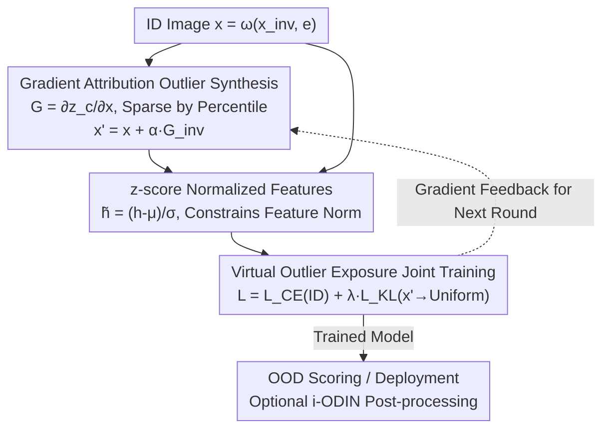

# Image-based Outlier Synthesis With Training Data

**Conference**: CVPR 2026  
**Paper**: [CVF Open Access](https://openaccess.thecvf.com/content/CVPR2026/html/Regmi_Image-based_Outlier_Synthesis_With_Training_Data_CVPR_2026_paper.html)  
**Code**: None  
**Area**: AI Safety / OOD Detection / Anomaly Synthesis / Robustness  
**Keywords**: Out-of-Distribution Detection, Virtual Outlier Synthesis, Gradient Attribution, Outlier Exposure, z-score Normalization

## TL;DR
Without relying on external data, near-manifold virtual outliers are synthesized from training images by using "gradient attribution perturbation" to destroy invariant features while preserving environmental features. Through joint training with outlier exposure and z-score normalized features, the method provides a unified solution for spurious, fine-grained, and conventional OOD detection.

## Background & Motivation
**Background**: Out-of-Distribution (OOD) detection is critical for the safe deployment of deep models, ensuring that inputs outside the training distribution are identified rather than misclassified as known categories. Most mainstream methods are evaluated in "conventional" settings where OOD samples differ significantly from ID samples in semantics and appearance.

**Limitations of Prior Work**: Two more challenging scenarios in real-world deployment have been long neglected. First is **Spurious OOD**: class labels $y$ are highly correlated with environmental features $e$ in the training set (e.g., in the Waterbirds dataset, "waterbird" is almost always paired with a "water" background). Models exploit such spurious features for high-confidence predictions, causing "landbird + water background" samples to be misclassified as ID. Second is **Fine-grained OOD**: the differences between OOD and ID classes are as subtle as those between different ID classes (e.g., mistaking a "hen" for a waterbird). Significant overlap in high-level features makes these extremely difficult to distinguish.

**Key Challenge**: The few works addressing these two difficult scenarios almost entirely rely on **external data**—either curated real outlier images non-overlapping with ID, or synthetic outliers from foundation models (diffusion/LLMs). The latter is computationally expensive, requires iterative prompt tuning, and depends heavily on the foundation model's prior knowledge, failing in highly novel scenarios. Consequently, the **Core Problem** becomes: **Can a unified OOD detection framework covering all three settings be constructed using only training samples without any external data?**

**Key Insight**: An image $x=\omega(x_{inv}, e)$ consists of **invariant features** $x_{inv}$ (class-determining, usually a small region) and **environmental features** $e$ (non-essential context). Selectively "destroying $x_{inv}$ and preserving $e$" yields "near-manifold" hard outliers—precisely what is needed for spurious and fine-grained settings. Since the oracle distribution $G_{oracle}$ for $x_{inv}$ is unavailable, the model itself can be used to approximate it.

**Core Idea**: The **input gradient of the ground-truth class logit** from the model being trained serves as a positional prior for invariant features. Adding gradient values back to the image destroys invariant features while simultaneously boosting the ground-truth logit, synthesizing challenging virtual outliers without external data. Joint optimization follows via outlier exposure and z-score normalized features.

## Method

### Overall Architecture
ASCOOD (A unified approach to **S**purious, fine-grained and **C**onventional **OOD** detection) consists of two pipelines: ① **Image Outlier Synthesis Pipeline**—for each ID image $x$, gradient attribution is performed ($G = \partial z_c/\partial x$), and gradients are added to the image to destroy $x_{inv}$ while keeping $e$, resulting in virtual outlier $x'$; ② **Virtual Outlier Exposure Training Pipeline**—ID samples and synthetic $x'$ are fed into the same model, with a joint loss optimizing ID classification and OOD uncertainty. All features are z-score normalized before the classification head. The pipelines are coupled: synthesis depends on current model gradients, while training uses synthesis results to shape the model.

### Key Designs

**1. Gradient Attribution Outlier Synthesis: Approximating Invariant Locations with Self-Gradients**

To address the lack of oracle labels and avoid external data, the gradient of the ground-truth logit $z_c$ with respect to the input $G=\frac{\partial z_c}{\partial x}$ is used as an attribution map. Since $G$ has large magnitudes on invariant pixels and low magnitudes on environmental pixels, adding it to the image ($x'=x+\alpha\cdot G$) **disproportionately destroys invariant features while leaving environmental features intact**. This creates hard outliers that share the ID background but lack valid semantics. For highly spurious scenarios, $G$ is sparsified: only gradients in the top $p_{inv}\%$ percentile are kept ($G_{inv}$), and $x'=x+\alpha\cdot G_{inv}$ is used. A counter-intuitive but critical finding is that **one must "add" gradients rather than "subtract"**—adding destroys $x_{inv}$ while raising the logit, leading to "high-confidence errors" which have high training value; subtracting lowers the logit, making the outlier "softer" with limited gains (FPR@95 on Car dropped from 60.20 to 40.76 when using addition).

**2. z-score Normalized Features: Suppressing Overconfidence via Norm Constraints**

During joint training, models often become overconfident on all inputs, disrupting the balance between ID and OOD gradients. The authors propose z-score normalization before the classification head: $\tilde h = S_h(h)=\big(\frac{h-\mu_h}{\sigma_h}\big)\cdot\sigma$ (with $\mu=0$). Proposition 2 provides a theoretical result: the norm of normalized features is **upper-bounded** by $\lVert\tilde h\rVert=\sigma\cdot\sqrt{m-1}$ ($m$ is feature dimension). This constraint prevents extreme values in probabilities $p_k$ and $p'_k$, mitigating overconfidence and maintaining a proper balance between ID gradients $(p_k-y_k)$ and OOD gradients $(p'_k-1/C)$. Experiments show z-score systematically outperforms L2 normalization (FPR@95/AUROC improved from 40.81/85.26 to 29.90/91.35 on CIFAR-100).

**3. Virtual Outlier Exposure Joint Training: Classification Correctness + Outlier Uniformity**

A joint objective is used: minimize cross-entropy $L_{CE}$ for ID samples and the KL divergence $L_{KL}$ between the predicted distribution of $x'$ and a uniform distribution $U$. The total loss is:
$$L_{total}=L_{CE}\big(f_\psi(S_h(\phi_\varphi(x))), y\big)+\lambda\cdot L_{KL}\big(f_\psi(S_h(\phi_\varphi(x'))), U\big),$$
where $\lambda$ balances the weights. Proposition 1 derives the total gradient on the $k$-th logit as $(p_k-y_k)+(p'_k-1/C)$. Since outliers are synthesized online using current gradients, $x'$ becomes increasingly difficult as it approaches the decision boundary during later training stages.

**4. i-ODIN: Decoupled Post-processing Enhancement (Optional)**

The authors propose an improved version of ODIN called i-ODIN. Unlike the original ODIN which applies uniform perturbations across all color channels, i-ODIN perturbs only a **variable number of significant color channels determined by pixel attribution** (perturbing only the most significant channel often works best). As a zero-training enhancement, i-ODIN yields significant gains in challenging scenarios (FPR@95 reduced by ~20% for CIFAR-10 vs CIFAR-100).

### Loss & Training
The core objective is $L_{total}=L_{CE}+\lambda\cdot L_{KL}$. The ID branch ensures classification accuracy, while the outlier branch enhances uncertainty via KL divergence toward a uniform distribution. Features are unified via z-score normalization $S_h(\cdot)$. Outliers $x'$ are synthesized online every step using current gradients ($\alpha$ controls perturbation strength, $p_{inv}$ controls sparsification ratio).

## Key Experimental Results

### Main Results
Evaluated across 7 datasets and 30+ methods using AUROC and FPR@95.

| Setting / Benchmark | Metric | ASCOOD | Best Competitor | Gain |
|------|------|------|----------|------|
| Spurious (Waterbirds) | FPR@95↓ | Best | Second (Relation) | ↓ ~59% |
| Spurious (CelebA) | FPR@95↓ | Best | Second Method | Significant |
| Fine-grained (Aircraft) | AUROC↑ | Best | GEN / RMDS | ↑ ~3 pts |
| Conventional (Avg) | FPR@95↓ / AUROC↑ | Best | Third (ReAct) | ↑ ~5 / ~3 pts |
| Conventional (CIFAR-100) | FPR@95↓ / AUROC↑ | Best | RotPred | ↑ ~16% / ~3 pts |

Large-scale setting (ImageNet-100 as ID, average of three conventional OOD sets, Table 3):

| Method | iNaturalist (FPR/AUROC) | Textures | OpenImage | Average |
|------|------|------|------|------|
| Dream-OOD (EBO) | 14.47 / 96.09 | 60.73 / 84.79 | 32.67 / 90.16 | 35.96 / 90.35 |
| **ASCOOD (EBO)** | 18.11 / 95.73 | 25.20 / 94.40 | 26.04 / 91.95 | **23.12 / 94.02** |

On the SSB-Hard benchmark, ASCOOD achieves an AUROC of 83.91, surpassing DreamOOD's 83.30.

### Ablation Study

| Synthesis Method (Fine-grained) | Car FPR@95↓ / AUROC↑ | Aircraft FPR@95↓ / AUROC↑ | Explanation |
|------|------|------|------|
| Shuffle invariant pixels | 63.84 / 85.38 | 47.98 / 83.87 | Zero-parameter baseline |
| Gradient Subtraction $x-\alpha G_{inv}$ | 60.20 / 86.27 | 50.15 / 83.64 | "Softer" outliers |
| Gradient Addition $x+\alpha G_{inv}$ | **40.76 / 91.86** | **47.94 / 89.75** | Best (Add > Subtract) |

| Other Ablations | Key Metric | Conclusion |
|------|---------|------|
| z-score vs L2 (CIFAR-100) | 29.90/91.35 vs 40.81/85.26 | z-score is superior |
| i-ODIN vs ODIN (CIFAR-100 vs TIN) | 50.20 vs 75.38 FPR@95 | Significant post-processing gain |
| ID Accuracy Retention (ImageNet/C100/C10) | 87.27/76.63/94.95% | On par with baseline |

### Key Findings
- **"Gradient Addition" is the core of synthesis**: Adding gradients destroys invariant features while elevating ground-truth logits, creating "confident but wrong" hard outliers. Subtraction lowers logits, making outliers less effective for training.
- **z-score outperforms L2 normalization**: Constraining the feature norm effectively suppresses overconfidence. This systematic comparison provides a directly reusable conclusion for OOD detection.
- **No sacrifice in classification accuracy**: ID accuracy remains consistent with baselines, and even improved in fine-grained settings (Car/Aircraft), indicating outlier exposure does not harm the primary task.
- **Greater gains in harder settings**: In the spurious Waterbirds dataset, FPR@95 decreased by ~59% relative to the next best method, far exceeding improvements in conventional settings.

## Highlights & Insights
- **Model gradients as "Invariant Feature Locators"**: Repurposing input gradient attribution from explainability to "semantic destruction" without external data or foundation models is a very efficient and direct design.
- **Asymmetric insight of "Add vs Subtract"**: While both destroy semantics, only "Addition" induces the "high-confidence error" state most valuable for training.
- **Provable upper bound for z-score**: Proposition 2 establishes a clean $\sigma\sqrt{m-1}$ upper bound, moving "suppressing overconfidence" from an empirical trick to a mathematically grounded constraint.
- **Unified framework for three settings**: ASCOOD addresses spurious, fine-grained, and conventional OOD detection in a single synthesis+training scheme, leading across 30+ compared methods.

## Limitations & Future Work
- **Dependency on gradient quality**: In early training stages, model gradients might not accurately locate invariant features, potentially affecting synthesis quality ⚠️ (paper shows late-stage synthesis samples).
- **Hyperparameter Sensitivity**: $\alpha$, $p_{inv}$, and $\lambda$ need project-specific tuning; no universal cross-domain guide was provided.
- **i-ODIN limitations**: The authors admit i-ODIN offers no gain over ODIN in simple binary settings (Waterbirds/CelebA), suggesting its strengths lie in multi-class, complex scenarios.
- **Future Directions**: Combining gradient attribution with lightweight segmentation priors for more precise localization, or extending "addition-based synthesis" to dense prediction tasks like OOD detection in segmentation.

## Related Work & Insights
- **vs. Foundation Model Synthesis (Dream-OOD, etc.)**: These methods use diffusion/LLMs for image-space generation, which is computationally heavy and dependent on foundation model priors. ASCOOD uses only training gradients and outperforms Dream-OOD on ImageNet-100 (23.12 vs 35.96 FPR@95).
- **vs. Background/Augmentation Virtual Outliers (Kirby, BackMix)**: These methods use inpainting or explicit data augmentation. ASCOOD is more direct—perturbing via gradients while using z-score to suppress overconfidence.
- **vs. L2 Normalization (LogitNorm/CIDER)**: While L2 is commonly used, ASCOOD proves that z-score normalization is systematically superior for OOD detection.

## Rating
- Novelty: ⭐⭐⭐⭐⭐ "Gradient addition for semantic destruction" and "z-score normalization" are both novel and self-consistent.
- Experimental Thoroughness: ⭐⭐⭐⭐⭐ 7 datasets, 30+ methods, covering spurious, fine-grained, conventional, and large-scale settings.
- Writing Quality: ⭐⭐⭐⭐ Clear chain from motivation to method and propositions, though some notation in the CVF version is slightly cluttered.
- Value: ⭐⭐⭐⭐ Addresses neglected hard OOD scenarios with zero external data and no accuracy loss. Highly deployment-friendly.

<!-- RELATED:START -->

## Related Papers

- [\[ICML 2026\] Geometrically Constrained Outlier Synthesis](../../ICML2026/ai_safety/geometrically_constrained_outlier_synthesis.md)
- [\[CVPR 2026\] Editprint: General Digital Image Forensics via Editing Fingerprint with Self-Augmentation Training](editprint_general_digital_image_forensics_via_editing_fingerprint_with_self-augm.md)
- [\[CVPR 2026\] Robustness Under Data Scarcity: Few-Shot Continual Adversarial Training for Evolving Threats](robustness_under_data_scarcity_few-shot_continual_adversarial_training_for_evolv.md)
- [\[CVPR 2026\] RAVEN: Erasing Invisible Watermarks via Novel View Synthesis](raven_erasing_invisible_watermarks_via_novel_view_synthesis.md)
- [\[ICML 2026\] Differentially Private Preference Data Synthesis for Large Language Model Alignment](../../ICML2026/ai_safety/differentially_private_preference_data_synthesis_for_large_language_model_alignm.md)

<!-- RELATED:END -->
