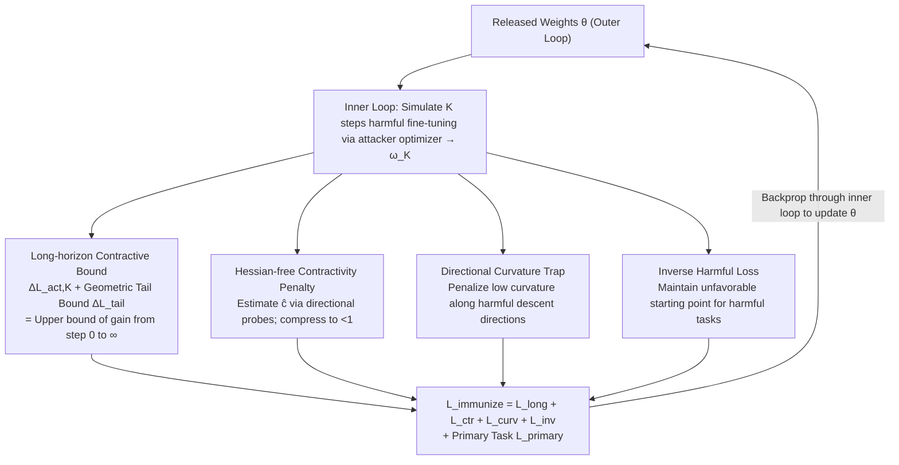

# Immunizing Models Against Harmful Long-Horizon Fine-Tuning via Contractive Optimization Dynamics

**Conference**: CVPR 2026  
**Paper**: [CVF Open Access](https://openaccess.thecvf.com/content/CVPR2026/html/Sarker_Immunizing_Models_Against_Harmful_Long_Horizon_Fine-Tuning_via_Contractive_Optimization_Dynamics_CVPR_2026_paper.html)  
**Code**: TBD  
**Area**: AI Safety / Model Immunization / Harmful Fine-tuning Defense  
**Keywords**: Model Immunization, Harmful Fine-tuning, Contractive Dynamics, Bilevel Optimization, Hessian-Free

## TL;DR
This paper proposes CLAMP, a model immunization method against "long-horizon harmful fine-tuning." Instead of merely shaping the geometry of initial weights, it "contracts" the attacker's entire optimization trajectory—ensuring each update step is smaller than the last. This provides a closed-form upper bound on the attainable gain from step 0 to infinity. It maintains defenses across classification, generation, and autoregressive models even after thousands of fine-tuning steps, with negligible impact on benign fine-tuning capabilities.

## Background & Motivation
**Background**: Open-source foundation models and parameter-efficient fine-tuning (LoRA, partial weight updates) allow anyone to adapt strong models to new tasks at low cost, but also lower the barrier for repurposing models for harmful tasks. The concept of "model immunization" involves pre-processing weights before release so that specific harmful tasks are difficult to fine-tune, while preserving original performance and benign fine-tunability.

**Limitations of Prior Work**: Existing immunization methods fall into two categories. One is **short-horizon meta-defenses** (SOPHON, Self-Destructing, IMMA, etc.), which simulate 1~K attack steps in an inner loop to penalize observed harmful loss decreases, essentially creating a "bad initialization." The other is **local geometric manipulation** (e.g., condition-number-based methods), which raises curvature/condition numbers near the starting point to make optimization difficult.

**Key Challenge**: The common blind spot of these methods is that **they only optimize the "beginning of training" without constraining the "training process."** They implicitly assume attackers stop after the simulated steps. In reality, attackers can continue for thousands of steps, easily recovering losses caused by bad initialization; defense strength decays as fine-tuning duration increases. No existing method constrains the **cumulative** progress of attackers over long horizons.

**Goal**: Provide an immunization objective effective against "long-horizon attackers"—limiting not just the first few steps, but the **total final gain** an attacker can achieve.

**Key Insight**: The authors borrow the concept of **contractivity** from dynamical systems. If an attacker's weight update mapping $T$ is contractive within a neighborhood (exists $c \in [0, 1)$ such that $\|T(\omega)-T(\omega')\| \le c\|\omega-\omega'\|$), then consecutive steps satisfy $\|u_{t+1}\| \le c\|u_t\|$. The step sizes decay geometrically, effectively capping the total distance an attacker can travel from a given point by a geometric series.

**Core Idea**: Replace "creating a bad initialization" with "making harmful fine-tuning locally contractive." This allows the remaining progress beyond the inner loop $K$ steps to be written as a closed-form upper bound, which is minimized using a Hessian-free bilevel objective to predict "total gain from step 0 to infinity."

## Method

### Overall Architecture
CLAMP models immunization as a **bilevel optimization**: the inner loop uses the attacker's optimizer $\pi$ to simulate $K$ steps of harmful fine-tuning ($\omega_0 \to \omega_K$); the outer loop updates the released weights $\theta$ to minimize the "predictable total gain" on harmful tasks while maintaining performance on the primary task $D_P$. The global objective is:

$$\min_\theta\ \mathcal{L}_{total}=\lambda_{primary}\mathcal{L}_{primary}+\mathcal{L}_{immunize}$$

The key lies in the four terms of $\mathcal{L}_{immunize}=\mathcal{L}_{long}+\mathcal{L}_{ctr}+\mathcal{L}_{curv}+\mathcal{L}_{inv}$: the first provides and minimizes the long-horizon gain upper bound, the second forces the update mapping to be contractive (keeping the bound tight), the third creates curvature traps in harmful descent directions, and the fourth prevents "improving the starting point" while trying to lower predicted gains. This objective requires only backpropagation and a few directional probes, avoiding second-order Hessians, thus enabling immunization of large models.

### Key Designs

**1. Long-Horizon Contractive Bound: Capping gains to infinity**

Addressing the root cause of "defense decay," CLAMP looks beyond the $K$ simulated steps to include all tail progress. It measures the observed loss drop $\Delta L_{act,K}=L_H(\omega_0;\theta)-L_H(\omega_K;\theta)$. Using contractivity, if the factor $\hat c < 1$, the tail updates form a geometric series, and the total distance is capped by $B_{tail}=\sum_{i\ge0}\hat c^i\|u_K\|=\frac{\|u_K\|}{1-\hat c}$, meaning $\|\omega_\infty-\omega_K\|\le B_{tail}$.

Applying the **descent lemma** (assuming $\nabla_\omega L_H$ is $\tilde L_K$-Lipschitz within radius $B_{tail}$), this is translated into a bound on loss reduction: $\Delta L_{tail}\le\|g_K\|B_{tail}+\frac{\tilde L_K}{2}B_{tail}^2$. The predicted total gain is $\Delta L_{\infty,pred}=\Delta L_{act,K}+\Delta L_{tail}$. The loss term is implemented as a hinge loss with slack $m$: $\mathcal{L}_{long}=\lambda_{long}\max(0, \Delta L_{\infty,pred}-m)$. This differs fundamentally from prior works that only suppress $\Delta L_{act,K}$.

**2. Hessian-Free Contractivity Penalty: Compressing the update mapping**

The tail bound is valid only when $\hat c < 1$, so the update mapping must be forced to be contractive. The contraction factor $c$ is controlled by the spectral norm of the update Jacobian $\|J_{T_\pi}\|_2$. For gradient descent, $J_T=I-\eta\nabla^2_\omega L_H$, linking contractivity to curvature. To avoid constructing Hessians for large models, ClAMP uses **Hessian-free finite-difference directional probes**:

$$\hat c\approx\frac{\|T_\pi(\omega_K+\varepsilon v;\theta)-T_\pi(\omega_K;\theta)\|}{\varepsilon}$$

where $v$ is a unit probe direction and $\varepsilon$ is a small step. The smooth loss $\mathcal{L}_{ctr}=\lambda_{ctr}\,\text{softplus}(\hat c-\hat c_{max})$ penalizes values exceeding $\hat c_{max} < 1$, forcing step sizes to decay.

**3. Directional Curvature Trap: Creating "hard-to-traverse ridges"**

Restricting step size isn't enough; the attacker's **finite steps must also be ineffective**. Curvature is measured along the unit direction of the attacker's movement $\hat u_t=u_t/\|u_t\|$ using second-order finite differences:

$$\hat\kappa_t=\frac{L_H(\omega_t+\delta\hat u_t;\theta)-2L_H(\omega_t;\theta)+L_H(\omega_t-\delta\hat u_t;\theta)}{\delta^2}$$

Low curvature allows large, effective steps. Conversely, CLAMP **penalizes low curvature** (below $\kappa_{min}$) to shape harmful directions into high-curvature, ill-conditioned ridges: $\mathcal{L}_{curv}=\lambda_{curv}\sum_{t=0}^{K}\text{softplus}(\kappa_{min}-\hat\kappa_t)$.

**4. Inverse Harmful Loss: Preventing accidental improvement of the start point**

Minimizing "predicted gain" can inadvertently lower the initial harmful loss $L_H(\omega_0;\theta)$, giving the attacker a better head start. An inverse harmful loss $\mathcal{L}_{inv}=-\lambda_{inv}L_H(\omega_0;\theta)$ is added to counteract this effect, ensuring the starting point remains unfavorable.

### Loss & Training
- Global objective $\mathcal{L}_{total}=\lambda_{primary}\mathcal{L}_{primary}+\mathcal{L}_{immunize}$.
- For classification, non-PEFT shared backbone updates are used; harmful direction projection and gradient conflict mitigation are introduced to reduce interference with benign performance.
- Key hyperparameters: inner loop steps $K$, slack $m$, target contraction $\hat c_{max}$, and various $\lambda$ weights.

## Key Experimental Results

> **Metric Description**: **SGRC** (Similarity Gap Ratio for Classification) = $\frac{M(f_O(x))-M(f_I(x))}{M(f_O(x))}\times 100\%$, where $M$ is accuracy, $f_O$ is the original model, and $f_I$ is the immunized model. **Higher SGRC** for harmful tasks is better (harder to adapt). **Lower SGRC** for benign tasks is better (easier to adapt). **SGRG** is the generative version. **FR** (Failure Rate) is used for LLMs.

### Main Results
Comparison with CN (Condition Number), IMMA, Booster, etc.:

| Scenario | Model/Data | Metric | Best Baseline | CLAMP | Note |
| :--- | :--- | :--- | :--- | :--- | :--- |
| Classification | Cars (Harmful) | Harmful SGRC↑ | CN 3.35 | **26.37** | 23.02 higher than CN |
| Classification | Country211 (Harmful) | Harmful SGRC↑ | CN 9.49 | **15.56** | 6.07 higher than CN |
| Generation | SD V1-4 | Harmful SGRG↑ | IMMA 4.55 | **26.70** | 22.15 lead over IMMA |
| Autoregressive | Mistral 7B | Harmful FR↑ | Booster 29.52 | **31.75** | Preserves ARC-C/MMLU |
| Autoregressive | LLaMA 3.2 1B | Harmful FR↑ | Booster 25.4 | **26.4** | ARC-C 51.9 vs 52.3 (Orig) |

On the benign side, CLAMP is friendlier: Benign SGRC for Cars/Country211 is −2.01 / −0.36 (lower is better); Benign SGRG is 7.66, significantly better than IMMA's 13.94.

### Key Findings: Long-Horizon Stability
The core differentiator is whether immunization strength decays over training time:

| Harmful Data | Method | ep=10/5 | ep=50/35 | Trend |
| :--- | :--- | :--- | :--- | :--- |
| Cars (Cls) | CN | 7.91 | 1.58 | Sharp drop; broken by long training |
| Cars (Cls) | CLAMP | 29.38 | 24.46 | Stable |
| SD (Gen) | CN | −2.03 | −5.78 | Ineffective |
| SD (Gen) | CLAMP | 25.18 | 28.64 | Stronger over long horizon |

- Methods like CN only create bad initializations; attackers bypass them by **simply training longer**. CLAMP maintains stability because it constrains the trajectory.
- In generation, CLAMP causes outputs to be "noise variants" rather than reference images, whereas IMMA may still generate recognizable shapes.

## Highlights & Insights
- **Defense duration as an optimizable quantity**: Traditional immunization only optimizes the start. CLAMP uses contractivity + geometric series to wrap "infinite tail gain" into a closed-form bound.
- **Hessian-free implementation is key**: Using directional probes reduces second-order requirements to a few forward/backward passes, making large-model immunization feasible.
- **Inverse harmful loss is a critical "patch"**: Minimizing predicted gain can inadvertently lower the starting loss; $-\lambda_{inv}L_H(\omega_0)$ blocks this side effect, serving as a reminder to watch for conflicting internal terms in min-max objectives.

## Limitations & Future Work
- Contractivity, Lipschitz constants, and reachable ball assumptions are **local**. It is unverified if tail bounds hold if the attacker moves far beyond $B_{tail}$ or uses highly non-linear/adaptive optimizers.
- Evaluation tasks (Cars/Country211, synthetic concepts) and models (up to 7B) are relatively small. Effectiveness against real-scale NSFW data or larger models is TBD.
- Defense depends on access to a harmful dataset $D_H$; generalization to unknown harmful directions not present during training is not fully addressed.

## Related Work & Insights
- **vs. CN**: CN only raises curvature near the start; it fails once the attacker moves away or trains longer. CLAMP constrains the whole trajectory.
- **vs. IMMA / SOPHON / Self-Destructing**: These methods penalize observed loss over $K$ steps, assuming the attacker stops. CLAMP addresses the blind spot of $K \to \infty$ progress.
- **vs. Booster / Antidote (LLM Safety Repair)**: These focus on post-training parameter repair. CLAMP is proactive immunization before release, showing superior SGRC on Mistral 7B while preserving benchmarks like ARC-C/MMLU.

## Rating
- Novelty: ⭐⭐⭐⭐⭐ Bringing contractive dynamics to immunization is a novel perspective.
- Experimental Thoroughness: ⭐⭐⭐⭐ Covers various model types, though task/model scales are relatively small.
- Writing Quality: ⭐⭐⭐⭐ Theoretical derivation is clear, though notation-heavy.
- Value: ⭐⭐⭐⭐ Directly addresses the pain point of "breaking defense via long training"; Hessian-free design is practical.

<!-- RELATED:START -->

## Related Papers

- [\[CVPR 2026\] Fine-Tuning Impairs the Balancedness of Foundation Models in Long-tailed Personalized Federated Learning](fine-tuning_impairs_the_balancedness_of_foundation_models_in_long-tailed_persona.md)
- [\[CVPR 2026\] FlowHijack: A Dynamics-Aware Backdoor Attack on Flow-Matching Vision-Language-Action Models](flowhijack_a_dynamics-aware_backdoor_attack_on_flow-matching_vision-language-act.md)
- [\[CVPR 2026\] PROMPTMINER: Black-Box Prompt Stealing against Text-to-Image Generative Models via Reinforcement Learning and VLM-Guided Optimization](promptminer_black-box_prompt_stealing_against_text-to-image_generative_models_vi.md)
- [\[CVPR 2026\] JANUS: A Lightweight Framework for Jailbreaking Text-to-Image Models via Distribution Optimization](janus_a_lightweight_framework_for_jailbreaking_text-to-image_models_via_distribu.md)
- [\[CVPR 2026\] Taming Noise-Induced Prototype Degradation for Privacy-Preserving Personalized Federated Fine-Tuning](taming_noise-induced_prototype_degradation_for_privacy-preserving_personalized_f.md)

<!-- RELATED:END -->
