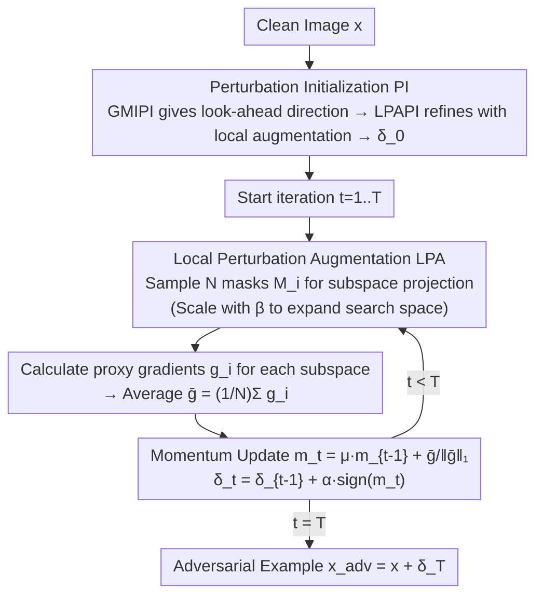

# Improving Adversarial Transferability with Local Perturbation Augmentation

**Conference**: CVPR 2026  
**Paper**: [CVF Open Access](https://openaccess.thecvf.com/content/CVPR2026/html/Mi_Improving_Adversarial_Transferability_with_Local_Perturbation_Augmentation_CVPR_2026_paper.html)  
**Code**: To be confirmed  
**Area**: AI Security / Adversarial Examples / Black-box Transfer Attack  
**Keywords**: Adversarial Transferability, Local Perturbation Augmentation, Subspace Sampling, Perturbation Initialization, Black-box Attack

## TL;DR
This paper points out that iterative adversarial attacks tend to "overfit" perturbations to the local gradient features of the proxy model, making it difficult to transfer to other models. It proposes LPAA: using random masks to construct multiple augmented local subspaces in each iteration, aggregating subspace gradients to push updates in a more generalized direction, and incorporating a transfer-oriented perturbation initialization strategy. LPAA significantly outperforms existing SOTA transfer attacks on both CNNs and ViTs.

## Background & Motivation
**Background**: The "transferability" of adversarial examples (small perturbations imperceptible to the human eye that cause model misclassification)—where examples generated on a proxy model can deceive unknown target models—is the core of black-box attacks. The mainstream approach is **transfer-based attacks**: using iterative methods like I-FGSM on a proxy model to maximize loss for perturbation generation, then transferring to the target. Subsequent works enhance transferability using momentum (MI-FGSM), neighborhood information (VMI, GRA), finding flat minima (PGN), input transformations (DIM/TIM/SIM/Admix), or ensemble models.

**Limitations of Prior Work**: Although naive iterations like I-FGSM are strong under white-box settings, their transferability is poor. Greedily iterating toward the "direction of maximum proxy model loss" causes the perturbation to fall into the proxy model's local optima and sharp (high-curvature) regions of its loss landscape.

**Key Challenge**: The authors identify the root cause specifically: writing each update as $\delta_t=\delta_{t-1}+\alpha\cdot u_{t-1}$, where $u_{t-1}=\text{sign}(g(x+\delta_{t-1}))$, the final perturbation $\delta_T=\sum_{t=1}^{T}\alpha\cdot u_{t-1}$ becomes a linear combination of all encountered gradient directions. Consequently, **iterations continuously accumulate curvature information specific only to the proxy model**, causing the perturbation to over-specialize to the proxy model and reducing transferability. Existing methods still optimize within the **global perturbation space**, remaining constrained by proxy model gradients and struggling to escape local optima.

**Goal**: To weaken the perturbation's overfitting to the proxy model and find a more "universal" update direction without increasing knowledge of the target model.

**Key Insight**: Rather than following a single gradient path across the entire perturbation vector, it is more effective to **update only within randomly sampled subspaces** and aggregate gradients from multiple subspaces. This regularizes the optimization trajectory and encourages the exploration of more diverse directions, acting as a form of "perturbation-based" neighborhood sampling.

**Core Idea**: Replace the "global single gradient path" with the "aggregated gradient of multiple augmented local subspaces" for perturbation updates, complemented by a transfer-oriented initialization to provide a strong starting point for the iterations.

## Method

### Overall Architecture
LPAA decomposes the generation of adversarial examples into two stages: first, **Perturbation Initialization (PI)** provides a more transferable starting point $\delta_0$ (derived from the look-ahead direction of GMIPI and refined by the proposed local augmentation LPAPI). This is followed by $T$ iterations where each step performs **Local Perturbation Augmentation (LPA)**: sampling $N$ random binary masks to project the perturbation into different subspaces, calculating proxy model gradients for each, scaling the search space with an augmentation coefficient $\beta$, averaging the $N$ subspace gradients, and finally updating the perturbation with momentum. The entire process uses only the proxy model, ultimately outputting $x_{adv}=x+\delta_T$.

### Key Designs

**1. Local Perturbation Augmentation (LPA): Replacing Single Global Gradient with Multi-subspace Aggregated Gradients to Break Overfitting**

Addressing the root cause of "accumulated proxy-specific curvature and perturbation overfitting," LPA introduces **random masks** during optimization. A binary mask $M_{t-1}$ has the same shape as $\delta_{t-1}$, where each element is 0 with probability $p$ and 1 otherwise. The mask ratio $p$ controls the proportion of the masked perturbation, effectively determining the effective dimension of the subspace. Each update depends only on the gradient of a random subspace $u_{t-1}=\text{sign}(g(x+\delta_{t-1}\odot M_{t-1}))$, which regularizes the optimization trajectory and forces the exploration of diverse directions.

Since a single subspace gradient contains only local information, LPA aggregates the average gradient of $N$ independently sampled subspaces $\bar g=\frac{1}{N}\sum_{i=1}^{N}g_{i-1}(x+\delta_{t-1}\odot M_{i-1})$ for a more comprehensive and stable direction. Furthermore, simple masking might restrict the exploration range, potentially trapping the optimization in local optima. Unlike prior ideas of "directly increasing step size," the authors introduce an **augmentation coefficient $\beta$** to scale the perturbation and expand the search space: $\bar g=\frac{1}{N}\sum_{i=1}^{N}g_{i-1}(x+\delta_{t-1}\odot M_{i-1}\cdot\beta)$. The final update is:

$$\delta_t=\delta_{t-1}+\alpha\cdot\text{sign}\!\Big(\tfrac{1}{N}\sum_{i=1}^{N}g_{i-1}(x+\delta_{t-1}\odot M_{i-1}\cdot\beta)\Big)$$

As iterations progress, the effective exploration range changes dynamically, further suppressing overfitting. Compared to existing "random neighborhood sampling" (adding $\tau\sim U[-\gamma\epsilon,\gamma\epsilon]$ near the iteration point), LPA is a **perturbation-based** neighborhood sampling that utilizes both the direction and magnitude of the perturbation, offering a wider sampling range and more consistent update directions.

**2. Perturbation Initialization (PI = GMIPI + LPAPI): Providing a Transfer-oriented Starting Point**

At $t=0$, LPA is ineffective because $\delta_0=0$, and since each step relies on local guidance, the overall performance is highly sensitive to the initial perturbation. The authors construct a more transferable starting point in two steps. First, the look-ahead momentum direction $\mathcal{M}(x)$ calculated by GMI (Global Momentum Initialization) is converted into an initial perturbation and projected onto the perturbation domain: $\delta_M=\Pi_{[-\eta\alpha,\,\eta\alpha]}(\mathcal{M}(x))$, termed **GMIPI**. This reveals the network's vulnerable directions but only provides a coarse direction that cannot be directly integrated into this framework.

Thus, the LPA operation $\mathcal{I}(\cdot)$ is used to refine it: $\delta_0=\Pi_{[-\eta\alpha,\,\eta\alpha]}\big(\mathcal{I}(x+\delta_M)\big)$. The component using only LPA refinement is denoted as **LPAPI**, and their combination forms the complete PI strategy. Note that $\delta_0$ only serves as a directional prior for the first iteration; subsequent updates proceed independently. Ablations show that GMIPI and LPAPI used alone are inferior to their combination, and random noise initialization even performs slightly worse than no initialization—indicating that this starting point must be "look-ahead + isomorphic to the current framework" to be effective.

### Loss & Training
- The optimization goal is the standard maximization of cross-entropy loss $\arg\max_\delta \mathcal{L}(f_\theta(x+\delta),y)$, subject to $\|\delta\|_\infty\le\epsilon$. LPAA modifies the **construction of the update direction** rather than the loss itself.
- Key hyperparameters (from cache): Iterations $T=10$, budget $\epsilon=16/255$, step size $\alpha=1.6/255$, momentum $\mu=1.0$. For LPA: $N=20, p=0.95, \beta=35$. For LPAPI: $T_{LPAPI}=5, \alpha_{LPAPI}=3.2/255, \eta=3$.

## Key Experimental Results

> Dataset: 1,000 images randomly selected from the ILSVRC 2012 validation set (correctly classified by almost all models). Metric: Attack Success Rate (ASR, %), where samples are generated on a proxy model and tested on target models (higher is better).

### Main Results
Comparison with SOTA methods including GRA, PGN, SIA, ANDA, and MuMoDIG. Average ASR across multiple CNN and ViT targets:

| Proxy Model | Second Best Method | Second Best ASR(avg) | LPAA(avg) | Gain |
|-------------|--------------------|----------------------|-----------|------|
| RNX-50      | PGN                | 82.2                 | **86.5**  | +4.3 |
| ViT-B       | SIA                | 85.8                 | **91.5**  | +5.7 |
| RN-50       | PGN                | 76.9                 | **80.0**  | +3.1 |

Performance on defense models/methods (two ensemble adversarially trained models + NRP/HGD/Bit defenses):

| Proxy Model | Second Best Method | Second Best ASR(avg) | LPAA(avg) |
|-------------|--------------------|----------------------|-----------|
| RN-50       | PGN 70.9           | 70.9                 | **76.6**  |
| ViT-B       | PGN 66.4           | 66.4                 | **73.1**  |

### Ablation Study
LPAA can serve as a "plug-and-play" subspace sampling module for other attacks:

| Combination | Baseline ASR(avg) | With LPAA | Description |
|-------------|-------------------|-----------|-------------|
| DIM         | 40.1              | **85.5**  | Input transformation; ~50% gain |
| Admix       | 41.8              | **90.0**  | Input transformation; ~48% gain |
| PGN(+PI+LPA)| 75.4              | **82.2**  | Replaced neighborhood sampling with LPAA |
| GRA(+PI+LPA)| 69.3              | **79.7**  | Replaced neighborhood sampling with LPAA |

Ablation of initialization strategies (RN-50 as proxy, average ASR on CNN/ViT/ATM):

| Configuration | CNNs | ViTs | ATMs | Description |
|---------------|------|------|------|-------------|
| No PI (LPA only) | 82.2 | 66.4 | 73.4 | Baseline |
| Random Noise  | 64.5 | 49.2 | 52.9 | Worse performance |
| GMIPI         | 82.6 | 68.6 | 74.8 | Slight improvement |
| GMIPI+LPAPI (Full PI) | **87.2** | **72.7** | **79.7** | Best |

### Key Findings
- Random noise initialization alone (CNN 64.5) is worse than no initialization (82.2), suggesting that "blindly choosing a starting point" introduces useless information and undermines the gains from LPAPI; the starting point must be look-ahead and isomorphic to the framework.
- The PI strategy consistently improves performance for neighborhood sampling methods (overall ~+7.75%), and adding LPA adds another ~3.2% without per-method hyperparameter tuning, verifying its universality.
- There is an optimal combination for mask ratio $p$ and augmentation coefficient $\beta$ (e.g., peak ASR near $p=0.95$ with moderate $\beta$). Extreme values lead to performance drops, reflecting the trade-off between "subspace dimension × search range."

## Highlights & Insights
- **Formulating "Iterative Overfitting" as a Linear Combination**: The authors use $\delta_T=\sum\alpha u_{t-1}$ to demonstrate how iterations accumulate proxy-specific curvature. This is more persuasive than general claims of "overfitting" and directly leads to the "subspace sampling" solution.
- **Reusable Perspective of "Perturbation-based Neighborhood Sampling"**: Existing neighborhood sampling adds random noise around iteration points (small range, direction-only). LPA samples within the augmented subspaces of the perturbation itself, utilizing both direction and magnitude. This approach can be grafted onto any neighborhood-sampling-based attack.
- **Initialization as an Underestimated Lever**: Converting GMI's momentum "look-ahead direction" into an initial perturbation and refining it with the proposed method achieves universal gains across multiple SOTAs. This highlights that the sensitivity of iterative attacks to the starting point warrants dedicated design.

## Limitations & Future Work
- The method introduces $N$ subspaces, requiring $N$ proxy model gradient calculations per step ($N=20$ in experiments). This makes the computational cost approximately $N$ times that of the baseline, which is not discussed in depth.
- There are several hyperparameters ($p, \beta, \eta, N$) with optimal intervals, and robust default values across different datasets/model families remain unclear.
- As an attack method, its primary value lies in revealing shared DNN vulnerabilities to drive defense research; the risk of misuse in real-world security systems should be considered alongside defensive measures.
- ⚠️ This note is based on OCR cache; certain symbols in formulas (mask updates, projection $\Pi$) and table figures may contain recognition errors. Refer to the original paper for definitive values.

## Related Work & Insights
- **vs. GRA / PGN / VMI (Neighborhood Sampling)**: These methods add random noise near the iteration point for neighborhood sampling to find flat minima; LPAA samples in the augmented subspaces of the perturbation, using both direction and magnitude for a wider range and more consistent directions. Replacing their sampling mechanisms with LPAA results in universal gains.
- **vs. DIM / TIM / SIM / Admix (Input Transformation)**: These apply transformations to the input for diverse gradients. LPAA is orthogonal to these and can be combined with them, yielding average improvements of nearly 50%, proving it modifies an independent dimension: "update direction construction."
- **vs. GMI (Global Momentum Initialization)**: GMI initializes momentum itself. LPAA converts GMI's momentum direction into an initial perturbation (GMIPI) and refines it with LPA (LPAPI), effectively bridging the "look-ahead direction" into the perturbation space.

## Rating
- Novelty: ⭐⭐⭐⭐ The "perturbation-based neighborhood sampling" perspective using subspace masking + augmentation coefficients is clear, though it belongs to the broader family of neighborhood sampling improvements.
- Experimental Thoroughness: ⭐⭐⭐⭐⭐ Covers 5 CNNs + 6 ViTs + 3 ATMs + 3 defenses, including compatibility and multiple ablation groups; very solid.
- Writing Quality: ⭐⭐⭐⭐ Specific root-cause analysis and complete algorithm flow, though symbols are dense and subspace geometry requires visual aid.
- Value: ⭐⭐⭐⭐ Plug-and-play and stackable with existing attacks; valuable for both transfer attack and defense research.

<!-- RELATED:START -->

## Related Papers

- [\[CVPR 2026\] Generative Adversarial Perturbations with Cross-paradigm Transferability on Localized Crowd Counting](generative_adversarial_perturbations_with_cross-paradigm_transferability_on_loca.md)
- [\[CVPR 2026\] Taming the Long Tail: Rebalancing Adversarial Training via Adaptive Perturbation](taming_the_long_tail_rebalancing_adversarial_training_via_adaptive_perturbation.md)
- [\[NeurIPS 2025\] Boosting Adversarial Transferability with Spatial Adversarial Alignment](../../NeurIPS2025/ai_safety/boosting_adversarial_transferability_with_spatial_adversarial_alignment.md)
- [\[CVPR 2026\] Transform to Transfer: Boosting Adversarial Attack Transferability on Vision-Language Pre-training Models](transform_to_transfer_boosting_adversarial_attack_transferability_on_vision-lang.md)
- [\[CVPR 2026\] Editprint: General Digital Image Forensics via Editing Fingerprint with Self-Augmentation Training](editprint_general_digital_image_forensics_via_editing_fingerprint_with_self-augm.md)

<!-- RELATED:END -->
