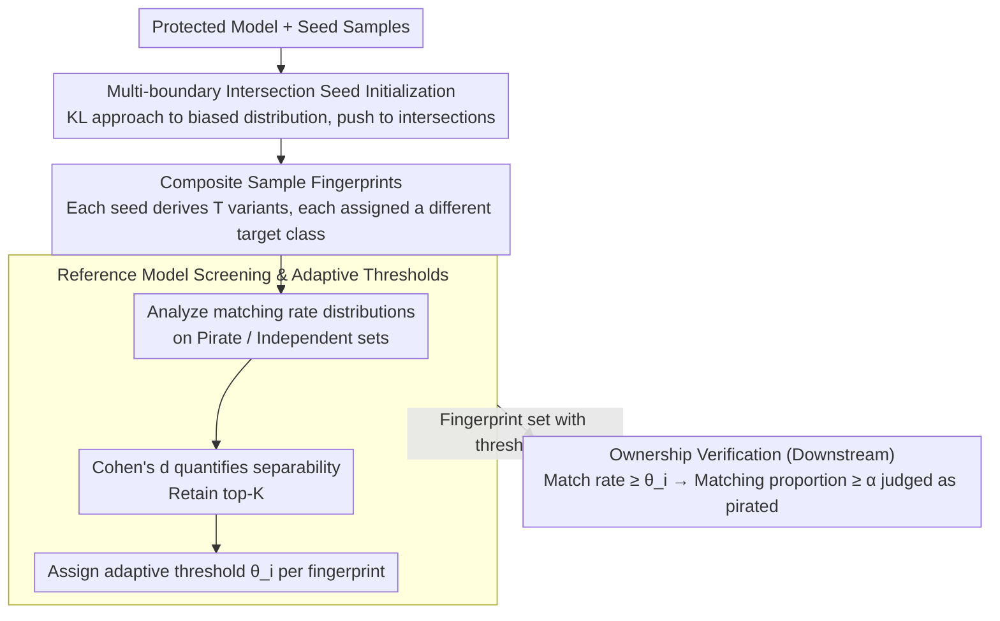

# IrisFP: Adversarial-Example-based Model Fingerprinting with Enhanced Uniqueness and Robustness

**Conference**: CVPR 2026  
**arXiv**: [2603.24996](https://arxiv.org/abs/2603.24996)  
**Code**: None  
**Area**: Others  
**Keywords**: Model fingerprinting, adversarial examples, IP protection, ownership verification, decision boundary

## TL;DR

Ours proposes IrisFP, a model fingerprinting framework that simultaneously enhances uniqueness and robustness through three innovations: placing fingerprints at multi-class decision boundary intersections, constructing composite sample fingerprints, and screening fingerprints based on statistical separability. It consistently outperforms SOTA methods in AUC across five datasets.

## Background & Motivation

Adversarial-example-based model fingerprinting techiniques use slight perturbations added to clean inputs to elicit model-specific response behaviors, serving DNN intellectual property protection and ownership verification. Existing methods face a **fundamental conflict between uniqueness and robustness**:

- **Uniqueness Issue**: Fingerprints need to be near decision boundaries to capture model-specific behavior, but existing methods target only a single boundary, leading to insufficient discriminative power.
- **Robustness Issue**: Model modification attacks (fine-tuning, pruning, adversarial training, etc.) shift decision boundaries, causing fingerprints to fail. To enhance robustness, prior methods place fingerprints deep within target class regions, but this compromises uniqueness.

Key Challenge: Existing methods suffer from either weak uniqueness or weak robustness, failing to achieve both.

Key Insight: Samples located at the **intersections of multi-class decision boundaries** possess a larger predicted margin—meaning the target class confidence is high while the distances to all other classes are small. This maintains model sensitivity (uniqueness) while increasing the predicted margin (robustness) without requiring fingerprints to be placed in deep regions.

## Method

### Overall Architecture

The core challenge IrisFP addresses is ensuring that a set of adversarial fingerprints can both precisely identify "this is my trained model" (uniqueness) and remain effective after model fine-tuning, pruning, or adversarial training (robustness). It decomposes the process into offline **fingerprint generation** and online **ownership verification**. Fingerprint generation involves three steps: first, optimizing each seed sample on the protected model to the intersection of all decision boundaries; second, deriving a set of variants around each seed to form composite fingerprints; and finally, using a batch of reference models to eliminate weak fingerprints and assign an exclusive threshold to each remaining fingerprint. During verification, these threshold-equipped fingerprints are used to query a suspect model, judging matches individually and aggregating them into a final "pirated or not" conclusion. The generation steps correspond to the three key designs below, progressively raising uniqueness and robustness, while verification is the downstream application.

### Key Designs

**1. Multi-boundary Intersection Seed Initialization: Aligning fingerprints with all boundaries simultaneously**

Traditional adversarial fingerprints push samples across a single decision boundary, making them sensitive only to behaviors near that specific boundary, which naturally limits discriminative power. Conversely, pushing samples deep into the target class enhances robustness against perturbations but loses model sensitivity. Ours constructs a **biased target distribution** $p_i$ towards the target class $\hat{y}_i^0$ for each input $x_i^0$, where the target class probability is forced to $\frac{1}{C}+\tau$, and the remaining probability is equally distributed among other classes. Then, by minimizing

$$\mathcal{L}_{phase1} = KL(f_o(\hat{x}_i^0) \,||\, p_i) + \lambda_1\|\delta_i^0\|_1$$

the model's output for the perturbed sample $\hat{x}_i^0=x_i^0+\delta_i^0$ is pushed toward this distribution, with the $\ell_1$ term constraining the perturbation to be small. The key is that $p_i$ makes the target class only slightly higher than others, resulting in a point that has the highest target confidence but is very close to all other classes—falling exactly at the multi-class boundary intersection. A smaller $\tau$ makes the sample closer to the intersection center with a larger predicted margin; this is why it achieves both uniqueness (remaining on the boundary and sensitive to the model) and robustness (large margin, resistant to minor boundary shifts).

**2. Composite Sample Fingerprints: Using collective behavior of a sample set against accidental duplication**

The response of a single fingerprint might be accidentally reproduced by an independently trained irrelevant model, leading to false piracy judgments. IrisFP addresses this by deriving $T$ variants with trainable perturbations $\{\delta_i^1,\dots,\delta_i^T\}$ around each seed $\hat{x}_i^0$, assigning a different random target class to each variant. These are also pushed to their respective multi-boundary intersections using biased distributions and KL divergence. A "composite fingerprint" consists of the seed plus $T+1$ variants, and verification checks whether the predictions for this entire group match. While single-point behavior might collide, it is nearly impossible for another model to perfectly replicate the specific prediction patterns exhibited by an entire set of samples near intersections, significantly enhancing uniqueness.

**3. Reference Model Screening & Adaptive Thresholds: QC using attack models during generation**

Previous methods used fingerprints directly after generation without considering how model modification attacks or independent training affect matching. IrisFP incorporates this as quality control. It constructs two reference sets: a **Pirate set** $\mathcal{V}_f$ (modified versions of the protected model via FT/KD/AT, which should technically match) and an **Independent set** $\mathcal{I}_f$ (irrelevant independently trained models, which should not match). For each composite fingerprint, it calculates the matching rate distribution across these sets and quantifies its ability to distinguish the two using the Cohen's d effect size:

$$d_i = \frac{\mu_i^{\mathcal{V}} - \mu_i^{\mathcal{I}}}{\sqrt{\tfrac{1}{2}\big((\sigma_i^{\mathcal{V}})^2 + (\sigma_i^{\mathcal{I}})^2\big)}}$$

A larger $d_i$ indicates that the mean matching rates of the pirate and independent sets are further apart with lower variance, allowing for cleaner differentiation. The top-K fingerprints are retained. Each selected fingerprint is then assigned an **adaptive threshold** $\theta_i$, calculated as a weighted average of the mean matching rates of the pirate and independent sets, with weights inversely proportional to their respective standard deviations. This fits the actual distribution of each fingerprint better than a global fixed threshold, avoiding sub-optimal results from a one-size-fits-all approach. In ablation studies, this adaptive threshold increased AUC from 0.812 to 0.893, being the most significant design contribution.

### Loss & Training

Both generation phases use the objective of "KL approximation of biased distribution + $\ell_1$ perturbation constraint." Phase I optimizes a single seed: $\mathcal{L}_{phase1} = KL(f_o(\hat{x}_i^0) \,||\, p_i) + \lambda_1\|\delta_i^0\|_1$. Phase II averages over $T$ variants: $\mathcal{L}_{phase2} = \frac{1}{T}\sum_{t=1}^T \big[KL(f_o(\hat{x}_i^t) \,||\, p_i^t) + \lambda_2\|\delta_i^t\|_1\big]$. Verification involves a two-step decision: a single fingerprint matches if its rate $\ge \theta_i$, and the suspect model is judged as pirated if the proportion of matched fingerprints $\ge \alpha$.

## Key Experimental Results

### Main Results — AUC Comparison

| Protected Model | Method | CIFAR-10 | CIFAR-100 | Fashion-MNIST | MNIST | Tiny-ImageNet |
|-----------|------|----------|-----------|--------------|-------|---------------|
| ResNet-18 | IPGuard | 0.675 | 0.654 | 0.721 | 0.471 | 0.726 |
| ResNet-18 | ADV-TRA | 0.799 | 0.806 | 0.845 | 0.753 | 0.767 |
| ResNet-18 | AKH | 0.710 | 0.785 | 0.765 | 0.820 | 0.823 |
| ResNet-18 | **IrisFP** | **0.893** | **0.916** | **0.940** | **0.854** | **0.874** |
| MobileNet-V2 | **IrisFP** | **0.936** | **0.937** | **0.963** | **0.876** | **0.934** |
| ViT-B/16 | **IrisFP** | — | — | — | — | **0.887** |

### Robustness against Model Modification Attacks (ResNet-18, CIFAR-10)

| Method | FT | PR | KD | AT | PFT | NFT |
|------|-----|-----|-----|-----|-----|-----|
| IPGuard | 0.656 | 0.997 | 0.515 | 0.511 | 0.687 | 0.724 |
| ADV-TRA | 1.000 | 1.000 | 0.805 | 0.025 | 0.959 | 0.962 |
| AKH | 0.921 | 0.876 | 0.621 | 0.531 | 0.701 | 0.733 |
| **IrisFP** | 0.954 | **1.000** | 0.616 | **0.929** | **0.965** | **0.968** |

### Ablation Study

| Configuration | CIFAR-10 AUC | Note |
|------|-------------|------|
| Seed | 0.691 | Seed only |
| Seed_s | 0.748 | + Fingerprint screening |
| Com_ft | ~0.79 | + Composite samples + Fixed threshold |
| Com_s_ft | 0.812 | + Composite samples + Screening + Fixed threshold |
| IrisFP | **0.893** | + Composite samples + Screening + Adaptive threshold |

### Key Findings

- IrisFP performs exceptionally well under adversarial training (AT) attacks—ADV-TRA's AUC drops to 0.025 (nearly failing completely) on CIFAR-10 under AT, whereas IrisFP reaches 0.929.
- Both the composite sample mechanism and fingerprint screening are independently effective, with the adaptive threshold providing the largest gain (from 0.812 to 0.893).
- It remains effective on the more complex ViT-B/16 architecture (AUC 0.887).

## Highlights & Insights

- The core insight of multi-boundary intersection localization is simple yet profound: being close to all boundaries is more robust than being deep within a target class region because of the larger predicted margin.
- Composite sample fingerprints leverage collective behavior patterns rather than single-sample matching, significantly enhancing uniqueness.
- Cohen's d effect size and adaptive thresholds provide statistically grounded quantitative methods for fingerprint quality assessment.
- The method utilizes black-box verification—requiring only the model's query outputs.

## Limitations & Future Work

- Performance is relatively weaker under Knowledge Distillation (KD) attacks (e.g., AUC 0.616 on CIFAR-10), as KD can fundamentally alter the structure of the model's decision boundaries.
- Requirement for building reference pirate and independent model sets for screening increases upfront costs.
- Validated only on image classification tasks; applicability to detection or segmentation remains unknown.
- The assumption of a 200-query budget might be too high for certain scenarios.

## Related Work & Insights

- **vs IPGuard**: IPGuard pushes fingerprints toward a single boundary, resulting in the poorest uniqueness and robustness.
- **vs ADV-TRA**: ADV-TRA captures rich model features via adversarial trajectories, providing decent robustness but poor uniqueness; it fails almost completely under AT attacks.
- **vs IBSF/SDBF**: While also utilizing multi-boundary intersections, they are used only for tampering detection and have very weak robustness; IrisFP solves the robustness issue via composite samples and screening.

## Rating

- Novelty: ⭐⭐⭐⭐ Triple innovation of multi-boundary intersection + composite samples + statistical screening, solving uniqueness and robustness simultaneously.
- Experimental Thoroughness: ⭐⭐⭐⭐⭐ 5 datasets, 3 architectures, 6 attack types, 4 baselines, and detailed ablations—very comprehensive.
- Writing Quality: ⭐⭐⭐⭐ Clear motivation, step-by-step methodology, though symbolic notation is dense.
- Value: ⭐⭐⭐ Clear practical demand for model IP protection, though the application scenario is relatively specific.

<!-- RELATED:START -->

## Related Papers

- [\[CVPR 2026\] Towards Reliable Evaluation of Adversarial Robustness for Spiking Neural Networks](towards_reliable_evaluation_of_adversarial_robustness_for_spiking_neural_network.md)
- [\[CVPR 2026\] A Combination of Noise and Bilateral Filters Achieve Supralinear and Scalable Adversarial Robustness in CNNs](a_combination_of_noise_and_bilateral_filters_achieve_supralinear_and_scalable_ad.md)
- [\[CVPR 2026\] Verifying Neural Network Robustness with Dual Perturbations](verifying_neural_network_robustness_with_dual_perturbations.md)
- [\[CVPR 2026\] Robustness Under Data Scarcity: Few-Shot Continual Adversarial Training for Evolving Threats](robustness_under_data_scarcity_few-shot_continual_adversarial_training_for_evolv.md)
- [\[CVPR 2026\] Shedding Light on VLN Robustness: A Black-box Framework for Indoor Lighting-based Adversarial Attack](shedding_light_on_vln_robustness_a_black-box_framework_for_indoor_lighting-based.md)

<!-- RELATED:END -->
