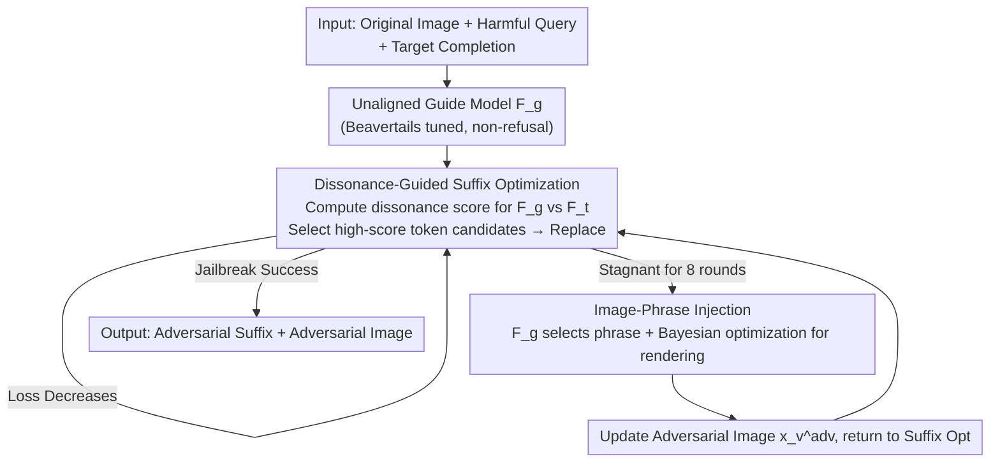

# Jailbreaking Vision-Language Models via Dissonance-Guided Suffix Optimization and Image-Phrase Injection

**Conference**: CVPR 2026  
**Paper**: [CVF Open Access](https://openaccess.thecvf.com/content/CVPR2026/html/Pi_Jailbreaking_Vision-Language_Models_via_Dissonance-Guided_Suffix_Optimization_and_Image-Phrase_Injection_CVPR_2026_paper.html)  
**Code**: https://github.com/TrustedLLM/DGSIP  
**Area**: AI Safety / Multimodal Jailbreak Attack  
**Keywords**: VLM Jailbreak, Adversarial Suffix, Predictive Dissonance, Image-Phrase Injection, Cross-model Transfer

## TL;DR
DGSIP utilizes an "unaligned guide model" and the **predictive distribution difference (dissonance)** at each token position relative to the target VLM to perform gradient-free searches for adversarial suffixes. When suffix optimization reaches a plateau, it switches to a visual injection mechanism that renders induction phrases into the image. This alternating process achieves a 100% attack success rate on MiniGPT-4 and InstructBLIP using AdvBench and demonstrates significant transferability to black-box commercial models like GPT-4o-Mini, Gemini, and Qwen2.5-VL.

## Background & Motivation

**Background**: Vision-Language Models (VLMs) combine linguistic backbones with visual encoders to achieve multimodal capabilities, which simultaneously expands the attack surface. Mainstream white-box jailbreaking follows two paths: gradient-based suffix or perturbation optimization (e.g., GCG, UMK, VAJM, which approximate gradients in discrete token spaces), and rendering malicious intent into typography or diagrams to bypass filters (e.g., FigStep).

**Limitations of Prior Work**: Gradient-based text optimization often suffers from "inaccurate" signals in discrete token spaces, easily becoming trapped in local optima. Conversely, image perturbation methods often destroy image fidelity and exhibit **poor cross-model transferability**—disturbances tuned for one model often fail on another.

**Key Challenge**: Safety fine-tuning is effectively a "shallow alignment"—it does not alter the model's underlying representations but only suppresses probabilities for a small set of safety-sensitive tokens. This implies that aligned and unaligned models yield nearly identical predictions for the vast majority of tokens, with divergence concentrated on the few suppressed tokens. Existing gradient methods fail to exploit this structural information, instead searching blindly across the entire vocabulary.

**Goal**: (1) Identify a signal with more "directional sense" than gradients to guide suffix searches; (2) Provide a fallback channel to escape local optima when text search stalls; (3) Ensure the attack depends only on logits (gray-box) rather than full parameters to enhance cross-model transferability.

**Key Insight**: The authors observe that since safety alignment only suppresses a few tokens, those identified as "low score by the target model, high score by the unaligned guide model" precisely mark the "latent knowledge directions suppressed by safety mechanisms." Applying pressure in these directions can reactivate suppressed harmful behaviors.

**Core Idea**: Replace gradients with "predictive dissonance" between the target model and an unaligned guide model as the suffix search signal, supplemented by "image-phrase injection" as an escape mechanism during stagnation, alternating both to optimize the same attack loss.

## Method

### Overall Architecture

DGSIP formalizes jailbreaking as constructing a pair of adversarial inputs: pasting a phrase $r_p$ into the original image according to rendering parameters $\rho$ to obtain $x_v^{adv}=R(x_v,r_p,\rho)$, and appending a suffix $s$ to the original prompt to get $x_t^{adv}=x_t\oplus s$. The objective is to minimize the token-wise negative log-likelihood (NLL) of the target VLM for a predefined harmful completion $y_{target}=(y_1,\dots,y_T)$:

$$\mathcal{L}_{CE}=-\frac{1}{T}\sum_{t=1}^{T}\log p_t\!\left(y_t\mid R(x_v,r_p,\rho),\,x_t\oplus s,\,y_{<t}\right)$$

The attack involves an **unaligned guide model** $F_g$ (LLaMA-2-7B-chat fine-tuned on the Beavertails harmful dataset) and a **target VLM** $F_t$ alternating between two modules: first running "dissonance-guided suffix optimization" to lower the loss; once progress stalls for several rounds, "image-phrase injection" is triggered to shift direction and loosen the model state before returning to suffix optimization. This alternating loop is shown below:

### Key Designs

**1. Dissonance-Guided Gradient-Free Suffix Search: Replacing Gradients with Model Divergence**

To address the issue that gradient signals in discrete token spaces are inaccurate and prone to local optima, the authors abandon gradients in favor of the divergence between the predictive distributions of two models. For a prefix $pre$ and a candidate token $v$, the position-level dissonance score is defined as:

$$d(v;pre)=p_g(v\mid pre)\,\log\frac{p_g(v\mid pre)}{p_t(v\mid pre)}$$

The intuition is: when $F_g$ assigns a high probability to $v$ while $F_t$ assigns a low probability, $d$ is large, marking tokens that "$F_g$ deems reasonable but $F_t$ suppresses as high-risk"—the direction of safety alignment. Conversely, if $d$ is small or negative, the token is ignored. The process involves: at each position $i$ of the suffix, taking top-$k$ candidates from both models, calculating their dissonance scores, and keeping top scorers as candidate pool $P_i$; then performing single-token replacements by sampling from $P_i$ to generate a batch of candidates for loss evaluation on the target model. This ensures searching only in "high dissonance directions."

**2. Image-Phrase Injection: Cross-modal Escape Channel for Suffix Stagnation**

Pure text optimization often hits local optima. The authors introduce a complementary visual channel: when suffix updates fail to reduce loss for $T_{stag}$ rounds (set to 8), image-phrase injection is triggered. It involves: first, letting $F_g$ generate $m$ "visually plausible" phrase candidates and filtering them using fluency scores $s(r_{p,j})=\frac{1}{L_j}\sum_i\log p_g(z_i\mid z_{<i})$ to keep the top-$K$; then, using $F_g$ to predict "which phrase best leads the model toward the harmful completion" to select $r_p^*=\arg\max p_g(\text{choice}\mid \cdot)$. Finally, rendering parameters $\rho$ (font size, rotation, color, position) are optimized to further reduce the attack loss $\rho^*=\arg\min_\rho \mathcal{L}_{CE}(F_t(R(x_v,r_p^*,\rho),x_t^{adv}))$. Since the rendering function is non-differentiable, **Bayesian Optimization** is used. This leverages the VLM's OCR/cross-modal fusion to "reactivate suppressed response patterns."

**3. Stagnation-Triggered Alternating Mechanism: Synergistic Modules**

The modules are linked by a "stagnation counter" in a closed loop (Algorithm 1). The main loop runs suffix optimization; if the loss drops, the counter resets. If it doesn't, the counter increments. Reaching $T_{stag}$ triggers image injection. If injection lowers the global best loss, the adversarial image is updated, the counter resets, and the process returns to suffix optimization. This design addresses the specific weaknesses of each path—pure text is fast but prone to stalls, while pure image is unstable—allowing them to complement each other.

### Loss & Training
The attack does not train the models but optimizes the adversarial suffix $s$, the image phrase $r_p$, and rendering parameters $\rho$ by minimizing the NLL loss $\mathcal{L}_{CE}$. Key hyperparameters: suffix length 20 tokens, initialized as repeating "!"; 128 candidates per step (sampled from top-256 dissonance tokens); stagnation threshold $T_{stag}=8$; 6 selected phrases from 50 candidates; rendering search range: font size [10,30], rotation [-15°,15°], RGB ∈ [0,255]³, relative position [0.2,0.8].

## Key Experimental Results

### Main Results

On a white-box subset of AdvBench (50 harder, deduplicated prompts), DGSIP significantly outperforms gradient-based baselines:

| Method | MiniGPT-4 | InstructBLIP | LLaVA |
|------|-----------|--------------|-------|
| GCG | 78% | 34% | 50% |
| VAJM | 56% | 24% | 26% |
| UMK | 82% | 42% | 66% |
| FigStep | 36% | 18% | 16% |
| **DGSIP (Ours)** | **100%** | **100%** | **98%** |

Average ASR on MM-SafetyBench (13 themes): MiniGPT-4 96.37%, InstructBLIP 82.12%, LLaVA 92.74%. It achieved at least a 20% improvement on the Legal Opinion theme, which was previously difficult. On HADES, scores were 96.37% / 87.73% / 96.00%.

Black-box Transfer (optimized on MiniGPT-4, transferred to 5 high-risk themes on commercial models):

| Method | GPT-4o-Mini | Gemini 2.0 Flash | Qwen 2.5-VL |
|------|-------------|------------------|-------------|
| GCG | 37% | 32% | 39% |
| UMK | 49% | 28% | 35% |
| FigStep | 40% | 34% | 44% |
| **DGSIP (Ours)** | **52%** | 34% | **46%** |

ASR was evaluated using DeepSeek-R1-Distill-Qwen-14B as a judge following CLAS policies (score 1-5; score=5 and length ≥80 chars counted as success), with manual verification of 400 random samples.

### Ablation Study

Decomposition of modules on MiniGPT-4 (MM-SafetyBench subset):

| Configuration | ASR | Description |
|------|-----|------|
| Original Query (No Optimization) | 11.59% | Baseline vulnerability |
| Only Image-Phrase Injection | 31.68% | Visual manipulation alone triggers some behaviors |
| Only Dissonance Suffix | 87.43% | Primary contributor, +75.84% vs baseline |
| **Full DGSIP** | **96.37%** | Complementary modules escape local optima |

### Key Findings
- **Text dissonance optimization is the primary driver** (87.43% alone). Image injection serves as a complementary escape (31.68% alone), but the combination reaches 96.37%. Loss curves show pure text stalls early, whereas the full framework uses image injection to resume loss reduction.
- **Higher efficiency**: On AdvBench, MiniGPT-4 per-prompt time dropped from 232.1s (GCG) to 101.24s (DGSIP), a ~2x speedup despite higher ASR.
- Hyperparameters follow a "bell curve": $K=256$ is optimal for candidates; exceeding this introduces noise. $T_{stag}=8$ is the optimal threshold for switching.

## Highlights & Insights
- **Turning "shallow alignment" into an actionable attack signal**: Alignment only suppresses a few tokens; thus, the "predictive divergence" precisely locates the suppressed harmful directions. Replacing gradients with KL-style dissonance is both accurate and logit-only.
- **Smart positioning of image injection**: It is not the primary attacker but an "escape mechanism" that uses VLM's OCR capabilities to loosen the model state when text search plateaus.
- **Transferability from signal nature**: Dissonance tokens represent common divergences between aligned/unaligned models on the same backbone, making it effective on black-box commercial models.

## Limitations & Future Work
- **Dependency on an unaligned guide model**: An $F_g$ must be fine-tuned on harmful data. Defensive auditors might use this to monitor long-tail tokens.
- **Black-box transfer remains lower than white-box** (ASR 34%~52%), likely due to stronger commercial alignment and architectural differences.
- Vocabulary mismatch handling is discussed in the appendix; robustness in cross-vocabulary scenarios requires further exploration.

## Related Work & Insights
- **vs GCG / UMK (White-box Gradient)**: These rely on inaccurate gradient approximations and stall easily; DGSIP is faster (~2x), stronger, and logit-only.
- **vs FigStep (Black-box Typography)**: FigStep renders entire intents into images, destroying scene semantics; DGSIP embeds short phrases into real images and uses it only as a fallback.
- **vs VAJM (Image Perturbation)**: PGD-based image perturbations transfer poorly; DGSIP uses Bayesian rendering optimization, which is more stable.

## Rating
- Novelty: ⭐⭐⭐⭐⭐ Using "predictive dissonance" as a jailbreak signal is a clean and theoretically intuitive new perspective.
- Experimental Thoroughness: ⭐⭐⭐⭐⭐ Covers 3 benchmarks, 3 white-box + 3 black-box models, with extensive ablation and runtime analysis.
- Writing Quality: ⭐⭐⭐⭐ Clear formalization, though Figure 2 is slightly dense.
- Value: ⭐⭐⭐⭐ Reveals systematic weaknesses in VLM alignment with direct implications for defensive research.

<!-- RELATED:START -->

## Related Papers

- [\[CVPR 2026\] JANUS: A Lightweight Framework for Jailbreaking Text-to-Image Models via Distribution Optimization](janus_a_lightweight_framework_for_jailbreaking_text-to-image_models_via_distribu.md)
- [\[CVPR 2026\] RunawayEvil: Jailbreaking the Image-to-Video Generative Models](runawayevil_jailbreaking_the_image-to-video_generative_models.md)
- [\[CVPR 2026\] Hierarchically Robust Zero-shot Vision-language Models](hierarchically_robust_zero-shot_vision-language_models.md)
- [\[CVPR 2026\] PROMPTMINER: Black-Box Prompt Stealing against Text-to-Image Generative Models via Reinforcement Learning and VLM-Guided Optimization](promptminer_black-box_prompt_stealing_against_text-to-image_generative_models_vi.md)
- [\[CVPR 2026\] SIF: Semantically In-Distribution Fingerprints for Large Vision-Language Models](sif_semantically_in-distribution_fingerprints_for_large_vision-language_models.md)

<!-- RELATED:END -->
