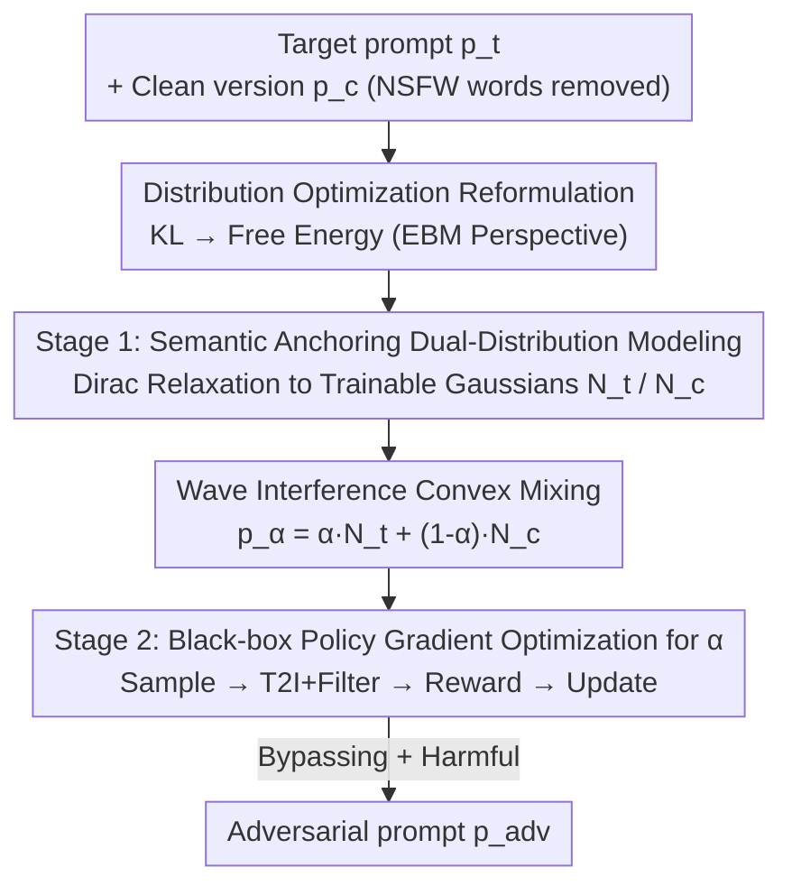

# JANUS: A Lightweight Framework for Jailbreaking Text-to-Image Models via Distribution Optimization

**Conference**: CVPR 2026  
**Paper**: [CVF Open Access](https://openaccess.thecvf.com/content/CVPR2026/html/Zheng_JANUS_A_Lightweight_Framework_for_Jailbreaking_Text-to-Image_Models_via_Distribution_CVPR_2026_paper.html)  
**Code**: https://github.com/dimshimmer/JANUS  
**Area**: AI Safety / Adversarial Attacks / Red Teaming  
**Keywords**: Text-to-Image Models, Jailbreaking Attacks, Safety Filtering, Distribution Optimization, Black-box Policy Gradient

## TL;DR
JANUS reformulates jailbreaking attacks on Text-to-Image (T2I) models as a "low-dimensional distribution optimization" problem. By employing two semantically anchored Gaussian distributions for "wave interference" mixing and a lightweight policy gradient to learn optimal mixing coefficients under black-box rewards, it improves the ASR-8 on SD3.5 Large Turbo from 25.30% to 43.15% without a large model generator, exposing structural weaknesses in T2I safety pipelines.

## Background & Motivation
> ⚠️ This note describes red-teaming/attack research aimed at exposing vulnerabilities in T2I safety pipelines to encourage "distribution-aware" defenses. This content is for academic purposes only.

**Background**: T2I diffusion models (e.g., Stable Diffusion, DALL·E 3) are trained on web-scale data containing NSFW content. Consequently, two types of defenses are deployed: ① Internal model alignment (concept erasure/fine-tuning); ② Plug-and-play external safety filters (pre-hoc text intercepting + post-hoc image detection), with commercial systems favoring the latter.

**Limitations of Prior Work**: Existing jailbreak attacks fall into two categories with inherent flaws:

- **Prompt-level Optimization** (soft continuous embedding / hard discrete token search like GCG): Incorporating the full T2I forward pass and safety filters into a differentiable loss requires white-box access and high compute. These methods often optimize **proxy targets** (e.g., semantic similarity to a target concept), which are **mismatched** with the true "bypassing + harmful" end-to-end goal—optimized prompts may still be blocked or produce harmless images.
- **Generator-level Optimization** (training LSTM/LLM as a policy network using RL feedback): These directly optimize end-to-end targets but depend heavily on generator size, often requiring RL fine-tuning of billion-parameter LLMs, which lacks scalability and compute efficiency.

**Key Challenge**: Prior work faces a dilemma: either the optimization target is correct but the loss is a proxy, or the target is correct but requires a massive generator. The root cause is that the end-to-end jailbreak target (bypassing filters + harmful content + semantic consistency) is both discrete and black-box.

**Goal**: Find a **lightweight, LLM-free** framework that explicitly optimizes end-to-end bypassing goals.

**Key Insight**: Instead of searching for a "single adversarial prompt," learn a **parameterized distribution** $p_\theta(p)$ that approximates the ideal distribution of successful jailbreaking prompts $q^*$. Using an Energy-Based Model (EBM) to represent $q^*\propto\exp(-E(p))$, $\min_\theta D_{KL}(p_\theta\|q^*)$ is reduced to minimizing the expected free energy $\mathbb{E}_{p\sim p_\theta}[E(p)+\log p_\theta(p)]$.

**Core Idea**: Transform "discrete prompt search" into "low-dimensional continuous mixing strategy optimization." Use two semantically anchored distributions (Target NSFW vs. Clean semantics) for convex mixing, and learn a single scalar mixing coefficient $\alpha$ via black-box policy gradient under end-to-end T2I rewards.

## Method

### Overall Architecture
JANUS is a two-stage framework that reformulates jailbreaking as distribution optimization. **Stage 1** starts with a target malicious prompt $p_t$ and its "cleaned" version $p_c$ (removing predefined NSFW words while keeping core semantics). Each discrete prompt is relaxed into a trainable token-level Gaussian distribution $N_t, N_c$, which are then mixed via $p_\alpha=\alpha N_t+(1-\alpha)N_c$. This step **structurally embeds** semantic preservation into the distribution. **Stage 2** fixes $N_t$ and $N_c$ and optimizes the scalar mixing coefficient $\alpha$ via black-box policy gradient: sample prompts from $p_\alpha$ → feed to T2I system → receive "bypass × NSFW score" reward → update $\alpha$. This process requires no large generators or white-box gradients.

### Key Designs

**1. Distribution Optimization Reformulation: From "Searching Prompts" to "Optimizing Distributions"**

To address the proxy loss mismatch and the high cost of large generators, the authors learn a distribution $p_\theta(p)$ to approximate the ideal jailbreak distribution $q^*$, where $\theta^*=\arg\min_\theta D_{KL}(p_\theta\|q^*)$. Since $q^*$ is unknown, they represent any positive distribution in Boltzmann form $q^*(p)\propto\exp(-E(p))$. Minimizing KL becomes minimizing the expected free energy:

$$\min_\theta D_{KL}(p_\theta\|q^*)=\mathbb{E}_{p\sim p_\theta}\big[E(p)+\log p_\theta(p)\big]$$

The energy function $E(p)$ encodes three competing goals: ① Bypassing filters (evasion), ② Semantic consistency with the target (similarity), and ③ True harmfulness (harmfulness). Since optimizing a distribution over such a complex black-box energy is difficult, the process is split into two stages: Stage 1 for semantic consistency and Stage 2 for bypassing and harmfulness.

**2. Stage 1 Semantic Anchoring Dual-Distributions + Wave Interference: Structural Semantic Preservation**

To prevent losing target semantics during search, the authors use **wave interference** as inspiration. The harmfulness of an NSFW prompt is often determined by a few explicit words, while other components (subject, scene, action) carry core semantics. Removing NSFW words from $p_t$ yields a clean version $p_c$. By constructing two distributions anchored to $p_t$ and $p_c$, their "probabilistic interference" allows shared core semantics to **interfere constructively**, maintaining stability while allowing adjustable harmfulness.

Discrete prompts undergo a **Dirac-inspired relaxation**: a prompt is a selection matrix $\mathcal{O}=[\delta_{t_1},\dots,\delta_{t_L}]^T$, and the embedding is $e=\mathcal{O}\cdot E$. Replacing each rigid one-hot row $\delta_{t_i}$ with a continuous random vector $\delta_{\theta_i}\sim\mathcal{N}(\mu_{\theta_i},\text{diag}(\sigma_{\theta_i}^2))$ creates a trainable distribution. Parameters are learned using a cosine semantic loss $\mathcal{L}(x,y)=1-\frac{\langle x,y\rangle}{\|x\|\|y\|}$ relative to the anchors. The convex mixture is:

$$p_\alpha=\alpha N_t+(1-\alpha)N_c,\quad \alpha\in[0,1]$$

The authors prove that the expected semantic similarity of $p_\alpha$ is lower-bounded by the weaker of the two base distributions, ensuring structural semantic stability.

**3. Stage 2 Policy Gradient for Coefficient α: End-to-End Black-box Optimization**

With semantic consistency handled in Stage 1, the energy function focuses on the remaining targets:

$$E(p)=-C(p,M(p))\cdot S(M(p))$$

where $C(\cdot)\in\{0,1\}$ is the safety classifier (1 = bypass), $S(\cdot)$ is the NSFW scorer, and $M$ is the T2I model. Maximizing the reward $J(\alpha)=\mathbb{E}_{p\sim p_\alpha}[R(p)]$, where $R(p)=-(E(p)+\log p_\alpha(p))$, uses the score-function gradient:

$$\nabla_\alpha\log p_\alpha(p)=\frac{N_t(p)-N_c(p)}{\alpha N_t(p)+(1-\alpha)N_c(p)}$$

The gradient is estimated via Monte Carlo sampling and updated with projection $\alpha\leftarrow\text{Proj}(\alpha+\eta\widehat{\nabla_\alpha J})$. Only **one scalar** $\alpha$ is optimized in Stage 2, making it lightweight and LLM-free.

### Loss & Training
The threat model is **black-box**: the attacker only receives generated images or refusal messages. Open-source NSFW scorers are used for reward signals. Stage 1 uses cosine semantic loss to anchor distributions. Stage 2 uses policy gradient (REINFORCE + Monte Carlo + Projection) to update the scalar $\alpha$ with reward $-(E(p)+\log p_\alpha(p))$. No backpropagation through the T2I model is required.

## Key Experimental Results

### Main Results
Evaluated on open-source (SDXL, SD3.5 Large Turbo) and commercial (DALL·E 3, Midjourney) models using 200 human-annotated NSFW prompts from Civitai. Metrics: TASR (Text Bypass Rate), IASR-N (Image Bypass Rate after Text Bypass), ASR-N (Joint Success Rate), CLIP Score (Semantic Similarity), NSFW Score (Harmfulness).

| Model | Method | TASR%↑ | IASR-8%↑ | ASR-8%↑ | CLIP↑ | NSFW↑ |
|------|------|--------|----------|---------|-------|-------|
| SD3.5LT | QFA (Prev. SOTA) | 37.00 | 28.65 | 25.30 | 0.31 | 0.28 |
| SD3.5LT | PGJ | 32.75 | 41.21 | 17.15 | 0.23 | 0.27 |
| SD3.5LT | **Ours** | **94.25** | **46.65** | **43.15** | **0.37** | **0.33** |
| DALL·E 3 | PGJ | 7.05 | 7.27 | 2.13 | 0.18 | 0.06 |
| DALL·E 3 | **Ours** | **12.98** | **12.62** | **3.39** | **0.24** | **0.08** |

On SD3.5LT, JANUS increases ASR-8 from 25.30% to 43.15% and achieves a TASR of 94.25%. Even on DALL·E 3, JANUS leads across all metrics.

### Ablation Study
Component ablation (N=8, SD3.5LT):

| Configuration | TASR% | IASR% | ASR% | NSFW | Description |
|------|-------|-------|------|------|------|
| Unimodal | 97.00 | 28.00 | 26.87 | 0.241 | Removing interference results in lower ASR/NSFW |
| Fix NSFW | 91.50 | 35.15 | 32.33 | 0.286 | Static reward reduces NSFW scores |
| **Full Process** | 94.25 | **46.65** | **44.50** | **0.329** | Optimal configuration |

### Key Findings
- **Dual-distribution interference is the key Gain**: While the Unimodal variant has high TASR (97%), its ASR and NSFW scores are lower, suggesting that single-distribution exploration cannot effectively balance text bypass with image-level harmfulness.
- **Dynamic rewards are essential**: Using fixed reward signals significantly drops the NSFW score, proving that rewards reflecting image harmfulness are critical.
- **Dynamic α outperforms fixed values**: There is a linear trade-off between bypass rates and harmfulness; RL learns the Pareto optimal $\alpha$.
- **Highest semantic preservation**: JANUS achieves the highest CLIP scores, indicating it bypasses filters while staying truest to the malicious intent.

## Highlights & Insights
- **Ingenious Reformulation**: Replacing discrete adversarial prompt search with a convex mixture of two semantic distributions reduces the problem from a massive discrete space to a 1D continuous segment.
- **Structural Decoupling**: Hard-coding semantic preservation into the distribution structure allows the optimizer to focus solely on bypassing and harmfulness.
- **The EBM-to-RL Chain**: Using EBMs to represent unknown distributions and reducing the problem to policy gradients provides a reusable math template for black-box end-to-end attacks.
- **Defense Insight**: Current T2I pipelines are vulnerable to distribution-level attacks, suggesting that defenders should employ **distribution-aware** detection rather than just keyword filtering.

## Limitations & Future Work
- **Attack-Centric**: The study reveals vulnerabilities but does not propose specific defensive mechanisms.
- **Scorer Dependency**: Performance is sensitive to the accuracy of the external NSFW scorer.
- **Prompt Cleaning Fragility**: The clean version $p_c$ depends on a predefined word list; incomplete lists may hinder semantic decoupling.
- **Absolute Success Trends**: While state-of-the-art, success rates on restricted commercial models like DALL·E 3 remain low (3.39% ASR-8), showing multi-layer defense effectiveness.

## Related Work & Insights
- **vs. Prompt-level Optimization (MMA, GCG)**: These optimize proxy losses. JANUS uses end-to-end black-box rewards, resulting in significantly higher TASR/ASR.
- **vs. Generator-level Optimization (SneakyPrompt)**: These require fine-tuning large LLMs. JANUS is lightweight, optimizing only a scalar $\alpha$.
- **vs. Concept Erasure**: While internal alignment "forgets" concepts, JANUS proves that external filters and alignment can still be bypassed by distribution-aware attacks.

## Rating
- Novelty: ⭐⭐⭐⭐⭐ Elegant reformulation using EBMs and 1D distribution mixing.
- Experimental Thoroughness: ⭐⭐⭐⭐ Broad coverage of models and baselines, though absolute success rates on commercial models are low.
- Writing Quality: ⭐⭐⭐⭐ Strong mathematical derivation and clear motivation.
- Value: ⭐⭐⭐⭐ High red-teaming value; highlights critical structural weaknesses in current T2I safety pipelines.

<!-- RELATED:START -->

## Related Papers

- [\[CVPR 2026\] RunawayEvil: Jailbreaking the Image-to-Video Generative Models](runawayevil_jailbreaking_the_image-to-video_generative_models.md)
- [\[CVPR 2026\] Jailbreaking Vision-Language Models via Dissonance-Guided Suffix Optimization and Image-Phrase Injection](jailbreaking_vision-language_models_via_dissonance-guided_suffix_optimization_an.md)
- [\[CVPR 2026\] Towards Human-Imperceptible Backdoor Attacks on Text-to-Image Diffusion Models](towards_human-imperceptible_backdoor_attacks_on_text-to-image_diffusion_models.md)
- [\[CVPR 2026\] PROMPTMINER: Black-Box Prompt Stealing against Text-to-Image Generative Models via Reinforcement Learning and VLM-Guided Optimization](promptminer_black-box_prompt_stealing_against_text-to-image_generative_models_vi.md)
- [\[CVPR 2026\] GenBreak: Red Teaming Text-to-Image Generation Using Large Language Models](genbreak_red_teaming_text-to-image_generation_using_large_language_models.md)

<!-- RELATED:END -->
