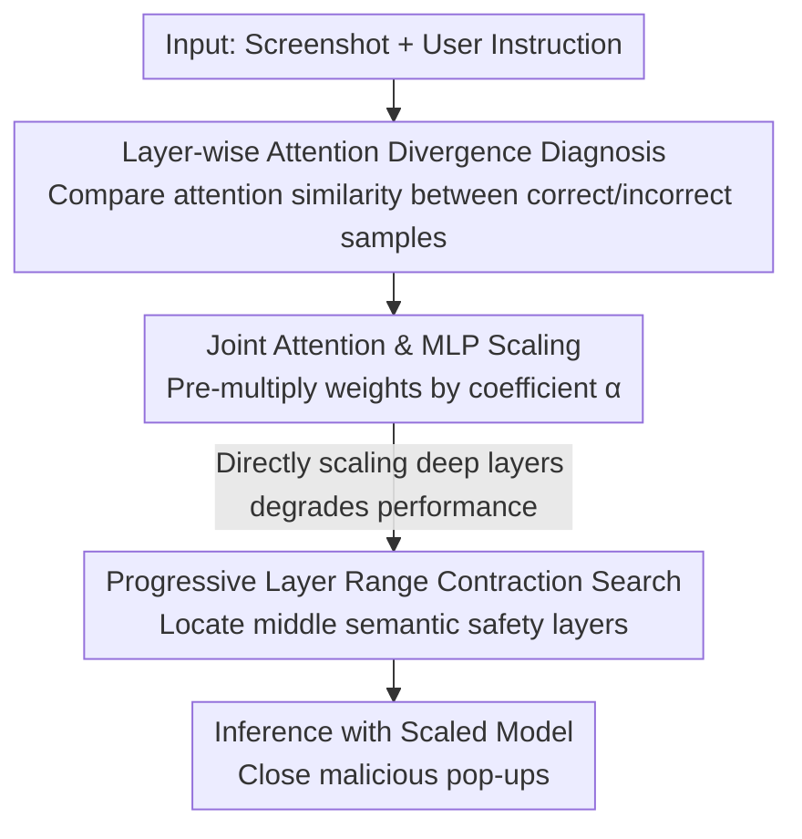

# LaSM: Layer-wise Scaling Mechanism for Defending Pop-up Attack on GUI Agents

**Conference**: CVPR 2026  
**Paper**: [CVF Open Access](https://openaccess.thecvf.com/content/CVPR2026/html/Yan_LaSM_Layer-wise_Scaling_Mechanism_for_Defending_Pop-up_Attack_on_GUI_CVPR_2026_paper.html)  
**Code**: https://github.com/YANGTUOMAO/LaSM  
**Area**: AI Security / GUI Agent / Multimodal VLM  
**Keywords**: GUI Agent, Pop-up Injection Attack, Attention Alignment, Layer-wise Scaling, Training-free Defense

## TL;DR
Through a systematic analysis of how pop-up injection attacks distort the layer-wise attention of GUI Agents, the authors found that deep-layer attention diverges significantly between "correct" and "incorrect" samples. They propose LaSM—a training-free, plug-and-play layer-wise scaling mechanism that amplifies attention and MLP weights specifically in middle semantic layers. This mechanism improves the defense success rate (DSR) of Qwen2-VL-7B from approximately 19% to over 66% under pop-up attacks, with minimal impact on normal task performance.

## Background & Motivation
**Background**: Graphical User Interface (GUI) Agents based on Multimodal Large Language Models (MLLMs) can "perceive screens and make decisions," showing impressive performance in tasks like web browsing, online shopping, and mobile operations. They function by encoding screenshots and user instructions to output the next UI element to be clicked.

**Limitations of Prior Work**: Such agents are extremely sensitive to "environment injection attacks," particularly pop-ups that attackers can freely render. A malicious pop-up can hijack the agent's attention, leading it to click a "Confirm" button instead of closing the pop-up, resulting in privacy leaks or system misuse. Existing defenses fall into two categories: 1) Retraining methods (RLHF/DPO preference optimization) improve robustness but require large-scale data and computing power, leading to high deployment costs; 2) Prompt-based warning methods (adding safety instructions or Chain-of-Thought in the input) are lightweight but largely ineffective against "inductive" pop-ups where the text is semantically aligned with the user request.

**Key Challenge**: Both types of methods treat the model as a black box and fail to explain *why* the agent is misled by pop-ups, resulting in limited defense coverage. The authors argue that the root of vulnerability lies within the model's internal attention being hijacked by pop-ups in specific layers.

**Goal**: First, to clarify how pop-ups alter the agent's layer-wise attention, and then to design a defense that is training-free, backbone-agnostic, and has almost no side effects on normal scenarios.

**Key Insight**: Borrowing from relative attention visualization methods (e.g., Zhang et al.), the authors observed the layer-wise attention on two key clickable regions: `<icon-cross>` (close button) and `<button-confirm>` (confirm button). They found that "correct" and "incorrect" samples exhibit different attention distributions in deep layers.

**Core Idea**: Since vulnerability stems from attention misalignment in specific layers, the defense should **selectively amplify attention and MLP weights only in critical layers** to pull the model's saliency back to task-relevant regions without affecting other layers—a training-free intervention called Layer-wise Scaling.

## Method

### Overall Architecture
The logic of LaSM follows "Diagnosis → Intervention → Localization": first, use layer-wise attention comparison to identify which layers show the maximum divergence between "correct" and "incorrect" samples, verifying that attention distribution dominates decision-making. Next, define an update rule that scales both attention and MLP weights by a coefficient $\alpha$. However, the authors found that directly scaling the most divergent deep layers (layers 21–26) actually degrades performance. Thus, they use "Progressive Layer Range Contraction Search" to automatically locate the true "safe" middle semantic layers (e.g., layers 7–18 for Qwen2-VL-7B). Finally, the scaled model is used directly for inference, ensuring the agent stably chooses to close pop-ups. The entire process is training-free and plug-and-play.

### Key Designs

**1. Layer-wise Attention Divergence Diagnosis: Identifying Decision-Critical Layers**

To defend, one must first locate the lesion. The authors take a local square of radius $r=1$ for the target pixels of `<icon-cross>` and `<button-confirm>`. The relative attention map $A^{(l)}$ at layer $l$ is flattened into a vector $v^{(l)}$ within this square. Consistency is measured using cosine similarity $\mathrm{CosSim}^{(l)} = \langle v^{(l)}_1, v^{(l)}_2\rangle / (\|v^{(l)}_1\|\,\|v^{(l)}_2\|)$. Samples are split into $\mathrm{Att}(R)$ (correct, e.g., selected the close button) and $\mathrm{Att}(W)$ (incorrect), forming R–R pairs and R–W pairs. Findings show: in shallow layers (1–21), both R–R and R–W similarities are near 1, making them indistinguishable. However, in deep layers (21–26), the divergence between R–R and R–W increases significantly, indicating that **more discriminative attention patterns emerge in deep layers and dictate the final button choice**. This diagnosis provides the basis for intervention: vulnerability is indeed "attention misalignment" and is strongly correlated with layer depth.

**2. Joint Attention & MLP Scaling Rule: Amplification Without Retraining**

Following the diagnosis, the authors define an intervened Transformer update rule:

$$X^{(l+1)} = X^{(l)} + \alpha \cdot \mathrm{Attention}^{(l)}(\mathrm{Norm}(X^{(l)})) + \alpha \cdot \mathrm{MLP}^{(l)}(\mathrm{Norm}(X'))$$

Where $X'$ is the intermediate hidden state after the attention sub-layer. The scaling coefficient $\alpha$ is pre-multiplied to all projection matrices in the selected layers—$W_Q, W_K, W_V, W_O$ in the attention module and $W_{up}, W_{gate}, W_{down}$ in the MLP module—before the forward pass. The keyword is "Joint": the authors emphasize that the MLP regulates the amplification or suppression of token representations in non-linear space, especially in deep layers forming fine-grained decision boundaries. Scaling attention alone is insufficient; the MLP must be amplified concurrently (ablations show robustness drops if only one component is scaled). This shifts the defense from "modifying input prompts" to "modifying internal weight magnitudes" without needing gradient updates.

**3. Progressive Layer Range Contraction Search: Locating Safe Middle Layers**

A counter-intuitive discovery was that scaling the most divergent deep layers (21–26) from Step 1 actually decreased defense capability by disrupting hierarchical semantic balance. Thus, "Progressive Layer Range Contraction" was developed: starting with $\alpha=1.1$, all layers 1–28 are scaled, and the ratio of `<icon-cross>` outputs (correct) is tracked. When the ratio starts to drop, the current layer is set as the lower bound. With the lower bound fixed, the upper bound is contracted downward. The resulting $[\text{lower bound}, \text{upper bound}]$ (e.g., layers 7–18 for Qwen2-VL-7B) identifies the true "safety layers." Visualization using region mean attention $\overline{\mathrm{AttnMean}}^{(l)}$ confirms that scaling middle layers (7–18) significantly boosts attention to the close button region, while scaling deep layers (21–26) causes attention to scatter and the focus to drift. Conclusion: **Middle layers handle vision-language alignment and safety reasoning, making them suitable for moderate amplification; high layers handle high-level semantic aggregation and should remain untouched.**

### Loss & Training
LaSM involves no training or fine-tuning; it only pre-multiplies projection matrices of selected layers by $\alpha$ during inference. The coefficient $\alpha$ is scanned in the range $[0.9, 1.3]$ with a step $\beta=0.05$. The authors construct a trade-off table between robustness and semantic consistency to select the optimal value. Ultimately, $\alpha=1.1$ was chosen for Qwen2-VL-7B and $\alpha=1.2$ for LLaVA-v1.6-Vicuna-13B, showing that the optimal coefficient lies in a narrow, model-dependent range.

## Key Experimental Results

### Main Results
The primary metric is **DSR (Defense Success Rate)**: under a pop-up attack, choosing to close the pop-up (clicking `<icon-cross>`) is a success; clicking confirm/background/irrelevant elements is a failure. Attacks are categorized into overlay (text is irrelevant to instruction) and inductive (text is semantically aligned with instruction). Below is the average DSR across injection types for two backbones (Before → After applying LaSM):

| Backbone Model | Defense Baseline | Injection Type | Original DSR(%) | +LaSM DSR(%) |
|----------|----------|----------|-------------|--------------|
| Qwen2-VL-7B (L7–18, α=1.1) | No Defense | Overlay | 18.9 | 66.4 |
| Qwen2-VL-7B | No Defense | Inductive | 14.8 | 68.3 |
| Qwen2-VL-7B | CoT Warning | Overlay | 96.3 | 100.0 |
| Qwen2-VL-7B | CoT Warning | Inductive | 92.7 | 99.8 |
| LLaVA-v1.6-13B (L12–28, α=1.2) | No Defense | Overlay | 68.6 | 81.2 |
| LLaVA-v1.6-13B | No Defense | Inductive | 60.8 | 78.0 |

LaSM acts as a plug-and-play plugin that can resolve gaps in DPO, Direct Awareness (DA), and Chain-of-Thought (CA) warnings: combined with CoT warnings on Qwen2-VL-7B, average DSR reached 99.3%. On 2,400 perturbed screenshots across 12 pop-up styles, DSR remained above 95% for all variants. On multi-step AndroidControl tasks, Task Success Rate (TSR) improved from 18.75% to 30.36% with negligible impact on action types or grounding accuracy; on a full-episode benchmark derived from real GUI tasks, task success rate improved by a relative 61.92% under pop-up attacks.

### Ablation Study

| Configuration | Key Conclusion |
|------|---------|
| Scaling Attention Only | Robustness drops—single component insufficient. |
| Scaling MLP Only | Robustness drops—single component insufficient. |
| Joint Attention + MLP Scaling (Ours) | Best defense, validates the necessity of joint scaling. |
| Scaling Deep Layers 21–26 | DSR decreases; attention scatters and focus drifts. |
| Scaling Middle Layers 7–18 | Significantly pulls attention back to the close button region. |

### Key Findings
- **Middle layers are safety-critical**: Layers 7–18 handle vision-language alignment and safety reasoning. Moderate amplification allows the model to refocus on the close button. Scaling high layers (e.g., 21–26) destroys high-level semantic aggregation, leading to attention misalignment.
- **Joint scaling is non-negotiable**: Attention and MLP must be amplified together. Scaling either separately drops robustness, confirming the MLP's role in forming decision boundaries in deep layers.
- **Inductive pop-ups are more dangerous**: When pop-up text aligns semantically with user instructions, models are more likely to treat them as legitimate UI (Qwen2-VL-7B inductive DSR 14.8% vs. overlay 18.9% without defense).
- **Coefficient sensitivity**: The optimal $\alpha$ is in a narrow range around $\approx 1.1$. Values too large disrupt semantic consistency. Cross-backbone experiments (Qwen2-VL-2B, OS-Atlas-Pro-7B, LLaMA-3.2-11B) confirm generalizability.

## Highlights & Insights
- **Solid "Diagnosis → Counter-intuitive Discovery → Correction" Narrative**: Proving attention divergence is in deep layers, discovering deep scaling is harmful, and then locating middle layers as the safety zone is supported by visualization and ablation rather than trial-and-error.
- **Training-free, Backbone-agnostic, Plug-and-play**: Scaling projection matrices by a scalar during inference can be stacked with prompt warnings or DPO for complementary gains. The low deployment cost is highly attractive for production GUI Agents.
- **Insight: "Safety is hidden in middle layers"**: This conclusion is transferable to other MLLM safety alignment or jailbreak defense research—the choice of intervention layers should be based on discriminative analysis rather than the assumption that "deeper is more critical."

## Limitations & Future Work
- **Reliance on Target Region Localization**: DSR and attention analysis revolve around explicit clickable elements like `<icon-cross>`. Its effectiveness on complex interfaces without a clear "correct close action" requires further discussion.
- **Manual Search for Optimal Layers and $\alpha$**: Different backbones vary in their safety layers (7–18 vs. 12–28) and coefficients (1.1 vs. 1.2). Switching models requires rerunning the progressive search; a one-size-fits-all adaptive solution is missing.
- **Threat Surface Limited to Pop-ups**: Designed for pop-up injection, its transferability to other environment injections (e.g., background tampering, multimodal adversarial patches) needs verification.
- **Future Directions**: Automating layer importance scoring to eliminate discrete range searching, or making scaling coefficients dynamic based on input to better balance robustness and normal performance.

## Related Work & Insights
- **vs. Retraining Defenses (DPO/RLHF)**: These improve robustness by penalizing unsafe behavior but require significant data and compute. LaSM is training-free and complements DPO.
- **vs. Prompt Warnings (DA/CoT)**: Prompting is lightweight but weak against inductive attacks. LaSM corrects attention internally and is effective against both overlay and inductive attacks; the combination approaches 100% DSR.
- **vs. Zhang et al. Attention Visualization**: While it uses similar relative attention metrics for diagnosis, LaSM goes beyond "describing focus" to perform active intervention via joint scaling.

## Rating
- Novelty: ⭐⭐⭐⭐ First to systematically characterize how pop-up attacks distort layer-wise attention and propose a training-free layer-wise scaling defense.
- Experimental Thoroughness: ⭐⭐⭐⭐ Multiple backbones, 12 pop-up styles, multi-step benchmarks, cross-backbone generalizability, and comprehensive ablations.
- Writing Quality: ⭐⭐⭐⭐ Clear "Diagnosis—Failure—Correction" narrative with strong visualization support.
- Value: ⭐⭐⭐⭐ Very low deployment cost, compatible with existing defenses, highly practical for GUI Agent safety.

<!-- RELATED:START -->

## Related Papers

- [\[CVPR 2026\] Scaling Up AI-Generated Image Detection with Generator-Aware Prototypes](scaling_up_ai-generated_image_detection_with_generator-aware_prototypes.md)
- [\[ICML 2026\] Scaling Unsupervised Multi-Source Federated Domain Adaptation through Group-Wise Discrepancy Minimization](../../ICML2026/ai_safety/scaling_unsupervised_multi-source_federated_domain_adaptation_through_group-wise.md)
- [\[CVPR 2026\] Eliminate Distance Differences Induced by Backdoor Attacks: Layer-Selective Training and Clipping to Mask Backdoor Models](eliminate_distance_differences_induced_by_backdoor_attacks_layer-selective_train.md)
- [\[CVPR 2026\] AntiStyler: Defending Object Detection Models Against Adversarial Patch Attacks Using Style Removal](antistyler_defending_object_detection_models_against_adversarial_patch_attacks_u.md)
- [\[CVPR 2026\] SafeRoPE: Risk-specific Head-wise Embedding Rotation for Safe Generation in Rectified Flow Transformers](saferope_risk-specific_head-wise_embedding_rotation_for_safe_generation_in_recti.md)

<!-- RELATED:END -->
