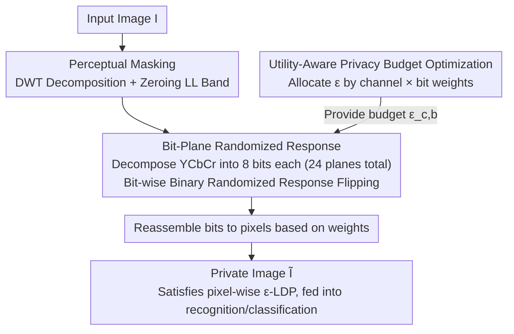

# LDP-Slicing: Local Differential Privacy for Images via Randomized Bit-Plane Slicing

**Conference**: CVPR 2026  
**Paper**: [CVF Open Access](https://openaccess.thecvf.com/content/CVPR2026/html/Cao_LDP-Slicing_Local_Differential_Privacy_for_Images_via_Randomized_Bit-Plane_Slicing_CVPR_2026_paper.html)  
**Code**: To be confirmed  
**Area**: AI Security / Image Privacy / Local Differential Privacy  
**Keywords**: Local Differential Privacy, Bit-Plane Slicing, Randomized Response, Privacy Budget Allocation, Face Recognition

## TL;DR
By decomposing each pixel into 8 binary bit-planes and independently applying randomized response to each bit, coupled with perceptual masking in the wavelet domain and bit-wise importance-based privacy budget allocation, LDP-Slicing for the first time renders "pixel-wise $\varepsilon$-LDP" strictly provable on standard images while preserving downstream task accuracy with zero extra storage and millisecond-level overhead.

## Background & Motivation

**Background**: To prevent privacy leakage when uploading images for server-side face recognition or medical diagnosis, three main paradigms exist. First, visual masking (blurring, pixelation, frequency cropping) is simple but **lacks formal guarantees**, and has been repeatedly penetrated by deep learning reconstruction attacks. Second, cryptographic methods are secure but computationally prohibitive for large models and cannot defend against inference attacks. Third, differential privacy (DP) stands as the current "gold standard".

**Limitations of Prior Work**: DP is categorized into two trust models. **Centralized DP** (such as DP-SGD) assumes a trusted central curator who collects raw images and adds noise. Although utility is high, the "trusted curator" assumption is unrealistic in zero-trust environments; if the curator is compromised, all raw data privacy is irreversibly lost. **Local Differential Privacy (LDP)** perturbs data at the source without requiring a trusted curator, offering a stronger trust model. However, it suffers from the "curse of dimensionality": an 8-bit pixel takes $k=256$ possible values. The probability of a $k$-ary randomized response reporting the true value is $p=\frac{e^\varepsilon}{e^\varepsilon+k-1}$. When $k=256$, even with a non-trivial budget, $p$ becomes so small that the output is almost pure noise, completely destroying task-relevant information.

**Key Challenge**: Due to this curse of dimensionality, past works on "provable visual privacy" have bypassed raw pixels—either reverting to centralized DP or applying LDP to **low-dimensional representations** (latent embeddings, feature descriptors, feature vectors, eigenvectors). However, this abandons the original intent of LDP, which is to "provide source-level guarantees directly on high-dimensional pixels", leaving a gap: Is it possible to obtain pixel-wise LDP on raw high-dimensional pixels without compressing the image into a low-dimensional space?

**Key Insight**: The authors' key observation is that this utility loss **is not an inherent flaw of LDP, but rather a mismatch in data representation**. A pixel with 256 discrete states is essentially a binary encoding of 8 bits, and the "importance" of each bit corresponds precisely to the semantic structure of the pixel (higher-order MSBs carry coarse structures, while lower-order LSBs are mostly noise and textures). Transitioning to the **bit-plane** representation reduces the fundamental operation unit of LDP from "256-ary" to "binary", which is naturally compatible with randomized response.

**Core Idea**: In a nutshell, this approach slices pixels into bit-planes and applies binary randomized response to each bit independently, achieving pixel-wise $\varepsilon$-LDP without collapsing dimensions. Combining this with two enhancement modules—perceptual masking and bit-wise importance-based budget allocation—yields a strong privacy-utility trade-off. The entire framework is **training-free**, and the output remains a standard image.

## Method

### Overall Architecture
The goal of LDP-Slicing is to design a local mechanism $\mathcal{M}$ that transforms an original image $I$ into a private version $\tilde I$, such that $\tilde I$ satisfies pixel-wise $\varepsilon$-LDP while remaining useful for downstream visual tasks. The pipeline consists of three sequential modules: ① **Perceptual Masking**: discrete wavelet transform (DWT) is used to prune low-frequency information, blocking the threat of direct human inspection; ② **Bit-Plane Randomized Response**: the masked image is decomposed into 8 binary bit-planes for each of the YCbCr channels (24 planes in total), and randomized response flipping is applied independently to each bit, which is the core for providing formal LDP guarantees; ③ **Utility-Aware Budget Optimization**: this determines how the total budget $\varepsilon_{\text{total}}$ is non-uniformly allocated across the 24 bit-planes to ensure the most critical bits receive the largest budget (and hence the least noise). Finally, the perturbed bits are reassembled into pixels to output a standard image that can be directly fed into off-the-shelf recognition or classification models without architectural modifications.

### Key Designs

**1. Perceptual Masking: Blocking Human Inspection via Wavelet LL-Pruning**

While the core LDP mechanism protects against algorithmic inference attacks, under weaker privacy regimes (larger $\varepsilon$), the noisy images might still retain structures recognizable by the human eye. To address this risk, the authors introduce a **preprocessing** stage called perceptual masking. This design is motivated by a well-established perceptual asymmetry: the human eye relies primarily on **low-frequency cues** (rough shapes, smooth regions) for content recognition, whereas modern CNNs leverage detailed **high-frequency** information. Therefore, a 1-level Haar Discrete Wavelet Transform (DWT) is applied to decompose each image channel into a low-frequency approximation subband LL and three high-frequency detail subbands (LH, HL, HH). Afterward, **LL-pruning** is performed by zeroing out all coefficients in the LL subband, followed by an Inverse DWT (IDWT) to reconstruct the image. Consequently, low-frequency content crucial for human recognition is erased, while the high-frequency details needed for machine learning are largely preserved. Compared to block-based DCT, DWT is a multi-resolution decomposition that avoids block artifacts common in DCT when aggressively pruning frequency coefficients, thereby better preserving useful high-frequency details (validated by DWT outperforming DCT in the ablation Table 3). Notably, this step is a **public, deterministic** preprocessing step that **does not consume any privacy budget**—it only defends against human eyes and provides no formal assurances; the actual LDP guarantees originate from the subsequent step.

**2. Bit-Plane Randomized Response: Converting "256-ary LDP" to "24 Binary LDPs" for Pixel-wise Formal Guarantees**

This is the core contribution of the paper. To avoid drowning the signal in noise (which occurs when applying randomized response directly to 256-ary pixels), the authors first reformulate the data representation using **Bit-Plane Slicing (BPS)**. For a $d$-bit pixel (typically $d=8$) $x\in[0,2^d-1]$, it is decomposed into a bit sequence $\{x_1,\dots,x_d\}$:

$$x_\ell = \left\lfloor \frac{x}{2^{d-\ell}} \right\rfloor \bmod 2, \quad \ell\in\{1,\dots,d\}.$$

The entire image yields 24 bit-planes across the three Y, Cb, and Cr channels. Then, in this **binary domain**, independent randomized response is applied to each bit $x_\ell\in\{0,1\}$ to output a private bit $\tilde x_\ell$:

$$\Pr[\mathcal{M}_{RR}(x_\ell)=\tilde x_\ell] = \begin{cases} \dfrac{e^{\varepsilon_\ell}}{e^{\varepsilon_\ell}+1}, & \tilde x_\ell = x_\ell,\\[6pt] \dfrac{1}{e^{\varepsilon_\ell}+1}, & \text{otherwise}, \end{cases}$$

where $\varepsilon_\ell$ is the privacy budget allocated to that bit-plane. Notably, the denominator here is $e^{\varepsilon_\ell}+1$ instead of the 256-ary $e^\varepsilon+255$—this represents the massive utility jump brought by the representation change: each bit is only perturbed between 2 possibilities, yielding a much higher probability of reporting the true value. After perturbation, the pixels are reconstructed using bit-weights: $\tilde x = \sum_{\ell=1}^{8} 2^{8-\ell}\cdot \tilde x_\ell$.

Formal guarantees are established via two fundamental properties of LDP (Theorem 3): **pixel-wise composition**—since the 24 bits of a colored pixel undergo independent randomized response, the cumulative pipeline guarantees $\big(\sum_{c,b}\varepsilon_{c,b}\big)$-LDP, i.e., $\varepsilon_{\text{total}}$-LDP, for that pixel by the sequential composition theorem; and **immunity to post-processing**—since reconstruction is a data-independent function, it does not degrade privacy. The authors also formalize the "operational meaning" of the privacy guarantee: $\varepsilon$-LDP imposes a hard upper bound on an adversary's ability to distinguish between any two private images, characterized by the total variation distance $\mathrm{TV}(P,Q)\le \frac{e^\varepsilon-1}{e^\varepsilon+1}=\tanh(\varepsilon/2)$, bounding the identity linkage attack (Definition 1) advantage by $\mathrm{Adv}\le \tfrac12\tanh(\varepsilon/2)$. While composing pixel-wise bounds to the entire image yields a loose worst-case bound, semantic identity inherently depends on spatial correlation (contours, textures). Under independent pixel-wise perturbation, this structural correlation is severely disrupted, resulting in extremely low empirical attack advantages (Table 2).

**3. Utility-Aware Privacy Budget Optimization: Non-Uniform Budget Allocation via Bit/Channel Importance**

A naive approach would evenly split $\varepsilon_{\text{total}}$ among the 24 bit-planes ($\varepsilon_\ell=\varepsilon_{\text{total}}/24$), but the authors demonstrate this is sub-optimal because not all bits are equal. The MSBs of the Luma (Y) channel carry the vast majority of structural information, and wasting budget on noisy low-order LSBs and less critical chroma channels sacrifices utility without gaining meaningful privacy. Thus, the allocation is formulated as a **constrained optimization** problem: let $\varepsilon_{c,b}$ denote the budget allocated to bit $b\in\{1,\dots,8\}$ of channel $c\in\{Y,Cb,Cr\}$. The goal is to minimize the weighted distortion under a fixed total budget:

$$\min_{\{\varepsilon_{c,b}\}} \sum_{c,b}\frac{W_{c,b}}{\varepsilon_{c,b}} \quad \text{s.t.}\ \sum_{c,b}\varepsilon_{c,b}=\varepsilon_{\text{total}},\ \varepsilon_{c,b}\ge 0.$$

The importance weight $W_{c,b}=w_c\cdot w_b$ is determined by two digital image/perceptual properties: **channel sensitivity** $w_c$—CNNs are robust to reduced chroma information (borrowing from JPEG chroma subsampling), so the Y channel receives a higher weight, setting $w_Y=4,\ w_{Cb}=w_{Cr}=1$; and **bit-plane importance** $w_b$—the contribution of the $b$-th bit to the pixel value is $2^{b-1}$, meaning $w_b=2^{b-1}$. Assuming distortion is inversely proportional to the budget, solving this with Lagrange multipliers yields a closed-form allocation:

$$\varepsilon_{c,b}=\varepsilon_{\text{total}}\cdot \frac{\sqrt{W_{c,b}}}{\sum_{i\in\{Y,Cb,Cr\}}\sum_{j=1}^{8}\sqrt{W_{i,j}}}.$$

Intuitively, critical components (Y-channel MSBs) receive the highest budget and thus the least noise, while the least important bits receive the minimum. Ablation studies show that removing this module leads to the most significant drop in performance (replacing it with uniform allocation drops AgeDB-30 accuracy by 6.86% in absolute terms), confirming the core assumption of bit/channel-wise budget allocation.

### Loss & Training
LDP-Slicing itself is a **training-free** privacy mechanism with no learnable parameters; training only occurs on the downstream models. Face recognition models are trained using pre-trained ResNet-50 with the ArcFace loss for 24 epochs using SGD. For small budgets (e.g., $\varepsilon=2.4$), gradient clipping (max norm = 1) is employed to mitigate vanishing gradients. The default testing budget is $\varepsilon_{\text{total}}=20$. Image classification models are trained from scratch on ResNet-56. Due to the post-processing property of LDP, any model trained on the private images inherits strict privacy guarantees.

## Key Experimental Results

Evaluation covers two primary tasks: Privacy-Preserving Face Recognition (PPFR, trained on MS1MV2, tested on LFW/CPLFW/CALFW/AgeDB-30) and privacy-preserving image classification (CIFAR-10/100). Reconstruction attacks are trained on the public BUPT dataset.

### Main Results: Face Recognition Accuracy (Table 1, %, $\varepsilon_{\text{total}}=20$)

| Method | Privacy Guarantee | AgeDB-30 | LFW | CPLFW | CALFW |
|------|----------|----------|-----|-------|-------|
| ArcFace (Non-private upper bound) | None | 97.88 | 99.77 | 92.77 | 96.05 |
| PEEP | Feature-level | 87.47 | 98.41 | 79.58 | 90.06 |
| DCTDP | Block-level | 94.37 | 99.48 | 90.60 | 93.47 |
| **LDP-Slicing (Ours)** | **Pixel-wise** | **96.68** | **99.75** | **91.08** | **96.02** |

LDP-Slicing consistently outperforms all DP/LDP counterparts (the best DP/LDP results are bolded) and nearly matches the non-private ArcFace baseline on LFW and CALFW. Notably, the privacy semantics of this work are stronger than those of DCTDP: while DCTDP reports a **block-level** budget, theoretical conversions provided in the Appendix show that the pixel-wise guarantee of this work is **approximately 5 times stricter** than DCTDP. For image classification, CIFAR-10 at $\varepsilon\le 12$ and CIFAR-100 across all budgets significantly outperform centralized DP-SGD ($\delta=10^{-10}$ to approximate pure DP), highlighting the counter-intuitive advantage of local models beating trusted-curator models.

### Ablation Study (Table 3, Face Recognition Accuracy %, $\varepsilon_{\text{total}}=20$)

| Configuration | AgeDB-30 | LFW | CPLFW | CALFW | Description |
|------|----------|-----|-------|-------|------|
| ArcFace (Baseline) | 97.88 | 99.77 | 92.77 | 96.05 | Non-private upper bound |
| (A) Without LL-pruning | 96.90 | 99.77 | 91.67 | 96.05 | Slightly higher accuracy but recognizable to the human eye |
| (B) LL-pruning + Uniform budget | 89.82 | 99.35 | 86.73 | 94.13 | Severe accuracy drop without budget optimization |
| (C) DCT-DC pruning + Utility optimization | 95.58 | 99.53 | 89.53 | 95.77 | Utility degrades when replacing DWT with DCT |
| **(D) LL-pruning + Utility optimization (Full)** | **96.68** | **99.75** | **91.08** | **96.02** | Full LDP-Slicing |

### Attack Robustness: Identity Linkage Attack Advantage (Table 2, %, Lower is Better)

| Method | CIFAR10 | CIFAR100 | AgeDB-30 | LFW | CALFW | CPLFW |
|------|---------|----------|----------|-----|-------|-------|
| PartialFace | 3.55 | 4.34 | 0.43 | 16.28 | 9.0 | 6.18 |
| DuetFace | 5.07 | 7.14 | 6.97 | 19.75 | 12.98 | 8.89 |
| DCTDP | 4.97 | 5.98 | 5.65 | 12.58 | 10.92 | 10.36 |
| **LDP-Slicing (Ours)** | **0.25** | **0.1** | **0.42** | **4.5** | **3.87** | **1.62** |

### Key Findings
* **Budget optimization is the primary driver of utility**: Removing it in favor of a uniform allocation (B) drops AgeDB-30 accuracy by an absolute 6.86% (from 96.68% to 89.82%), demonstrating that non-uniform budget allocation based on bit/channel importance is crucial for utility.
* **LL-pruning is a minor trade-off for human perceptual privacy**: Removing it (A) slightly improves machine recognition accuracy, but as shown in Fig. 4, the image remains recognizable to the human eye at larger $\varepsilon$. Thus, LL-pruning safeguards perceptual privacy rather than machine performance.
* **DWT outperforms DCT**: Variant (C) with DCT-DC pruning uniformly performs worse than (D) with DWT, confirming that the multi-resolution decomposition of DWT introduces fewer artifacts and better preserves crucial high frequencies.
* **Smooth privacy-utility trade-off** (Table 4): As $\varepsilon_{\text{total}}$ decreases from 58 to 1, AgeDB-30 accuracy declines smoothly from 97.45% to 50.95%. The PSNR is also monotonically correlated with the budget, matching theoretical expectations.
* **Robustness against reconstruction attacks**: Under white-box, black-box, and StyleGAN (Map2V) reconstruction attacks, the private images produced by the proposed method remain highly distorted even when relaxing the budget to $\varepsilon_{\text{total}}=58$. In contrast, competing methods like DCTDP can be reconstructed into nearly recognizable faces.
* **Negligible computational and storage overhead**: Processing a 112×112 image on an Apple M4 chip takes an average of only 5.5 ms (throughput of 232 img/s), which is an order of magnitude faster than MinusFace (68 ms). The time complexity is $\Theta(N)$, linear to the number of pixels. Because the output remains a standard image, it incurs **zero additional storage/transmission overhead** ($\times 1$), compared to DCTDP ($\times 63$) and DuetFace ($\times 54$).

## Highlights & Insights
* **Changing data representation instead of the mechanism is highly elegant**: The curse of dimensionality is diagnosed not as a flaw in LDP itself, but as a mismatch in data representation. Decomposing 256-ary pixels into 8 binary bits reduces the randomized response denominator from $e^\varepsilon+255$ directly to $e^\varepsilon+1$, instantly resolving the utility bottleneck. This paradigm of identifying representation mismatch to solve high-cardinality LDP challenges can be extended to other domain-specific high-cardinality LDP scenarios (e.g., discretized sensor or categorical data).
* **Closed-form optimization for budget allocation**: By leveraging two priors—bit contribution ($2^{b-1}$) and chroma subsampling robustness—to define the weight $W_{c,b}$, the authors formulate a Lagrange multiplier framework that yields an elegant closed-form solution where $\varepsilon_{c,b}\propto\sqrt{W_{c,b}}$. This is interpretable, highly efficient, and requires no training.
* **Insight on disrupting spatial correlation via independent pixel-wise perturbation**: Although the image-level worst-case privacy bound is loose, semantic identity fundamentally relies on spatial structures (contours, textures). Pixel-wise independent noise effectively disrupts this structural dependency, aligning the empirical low attack advantage with theoretical privacy insights.
* **Training-free pipeline and standard image output**: These properties make LDP-Slicing natively compatible with off-the-shelf pipelines, enabling zero-shot migration across datasets/domains (e.g., VGGFace2, CelebA, and chest X-rays). Furthermore, any downstream model automatically inherits privacy guarantees due to the post-processing property of LDP, offering immense practicality for edge deployment.

## Limitations & Future Work
* The authors acknowledge that composing pixel-wise bounds to the entire image yields a **loose worst-case guarantee**. Practical image-level security relies heavily on the empirical observation that independent perturbations destroy spatial correlation, rather than a tight theoretical bound, creating a gap between formal guarantees and practical security that is empirically patched by LL-pruning and attack experiments.
* **Perceptual masking (LL-pruning) does not consume privacy budget**; it serves solely as deterministic preprocessing to block human eyes. If an attacker trains a network specifically to recover the LL band, this component lacks formal guarantees (the authors demonstrate that recovery is difficult using white-box attacks, but this remains empirical).
* There is a caveat regarding the horizontal comparability of privacy semantics: Table 1 compares "pixel-wise" budgets directly alongside the "block-level" budget of DCTDP and the "feature-level" budget of PEEP. Because the privacy granularities differ, a fair comparison requires bounding conversions (as detailed in the Appendix); directly comparing the raw $\varepsilon$ values can be misleading.
* In most evaluations, the default budget $\varepsilon_{\text{total}}=20$ represents a relatively loose privacy regime. As shown in Table 4, in high-privacy regimes ($\varepsilon\le 2.4$), face recognition accuracy plummets to the 50% range, suggesting limited utility in ultra-strong privacy scenarios.
* Future Work: The authors propose extending the work to **video streams** (analyzing how bit-plane LDP can leverage or prevent leakage from temporal correlations remains open). Zero-shot utility in high-resolution domains like medical imaging has been initially validated, but more systematic evaluations on high-resolution data are left for future work.

## Related Work & Insights
* **vs. Visual Masking (Blurring/Pixelation/InstaHide/Cloak)**: These operate as heuristic visual obfuscations that lack formal guarantees and have been completely broken by modern reconstruction attacks (e.g., near-perfect reconstruction demonstrated by Carlini et al.). This work relies on mathematically provable $\varepsilon$-LDP, rendering it structurally robust against reconstruction attacks.
* **vs. Frequency-Domain Privacy (DCTDP/DuetFace/PPFR-FD)**: These approaches perturb/discard DCT frequency coefficients. However, low-frequency removal is reversible, and these methods incur a substantial storage overhead ($\times 54$ to $\times 63$). In contrast, the proposed DWT multi-resolution pruning introduces fewer artifacts, outputs standard images with zero storage overhead, and exhibits a lower empirical attack advantage.
* **vs. Centralized DP (DP-SGD/DP-GAN/DP-Diffusion)**: Centralized designs rely on a trusted curator; compromising the curator leads to a catastrophic release of raw data. This work enforces LDP at the source, eliminating the need for a trusted third party, and directly outperforms centralized DP-SGD on CIFAR across most budget intervals.
* **vs. Low-Dimensional LDP (Feature-level PEEP / Eigenvectors)**: Prior methods compress images into lower dimensions before adding noise to bypass the curse of dimensionality, sacrificing the original objective of protecting raw pixels. This work avoids design-level dimension collapse, providing pixel-wise guarantees directly on the raw image layer to fill this gap.

## Rating
* Novelty: ⭐⭐⭐⭐⭐ Re-diagnosing the "curse of dimensionality" as a data representation mismatch and using bit-plane slicing to make pixel-wise LDP viable on standard images for the first time is highly refreshing.
* Experimental Thoroughness: ⭐⭐⭐⭐ Extensive evaluation across 6 benchmarks, three types of attacks, ablation studies, and overhead analysis is highly comprehensive. However, the tight image-level bound and performance in high-privacy regimes are still somewhat dependent on empirical arguments.
* Writing Quality: ⭐⭐⭐⭐⭐ The motivation is progressively structured, creating a solid closed loop among theorems, corollaries, and attack experiments. Mathematical equations and tables are clearly cross-referenced.
* Value: ⭐⭐⭐⭐⭐ Being training-free with zero storage overhead, millisecond-level execution, standard image output, and cross-domain transferability gives this method outstanding potential for practical zero-trust edge deployment.

<!-- RELATED:START -->

## Related Papers

- [\[ICLR 2026\] Federated Learning of Quantile Inference under Local Differential Privacy](../../ICLR2026/ai_safety/federated_learning_of_quantile_inference_under_local_differential_privacy.md)
- [\[CVPR 2026\] Detecting Compressed AI-Generated Images via Phase Spectrum Robustness](detecting_compressed_ai-generated_images_via_phase_spectrum_robustness.md)
- [\[CVPR 2026\] Improving Adversarial Transferability with Local Perturbation Augmentation](improving_adversarial_transferability_with_local_perturbation_augmentation.md)
- [\[ICML 2026\] Minim: Privacy-Aware Minimal View for Agents via Trusted Local Sanitization](../../ICML2026/ai_safety/minim_privacy-aware_minimal_view_for_agents_via_trusted_local_sanitization.md)
- [\[ICLR 2026\] Convergent Differential Privacy Analysis for General Federated Learning](../../ICLR2026/ai_safety/convergent_differential_privacy_analysis_for_general_federated_learning.md)

<!-- RELATED:END -->
