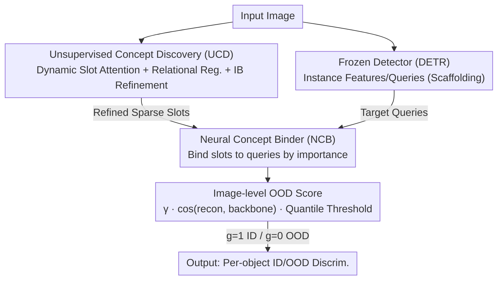

# Learning Latent Concepts for Detecting Out-of-Distribution Objects

**Conference**: CVPR 2026  
**Paper**: [CVF Open Access](https://openaccess.thecvf.com/content/CVPR2026/html/Peng_Learning_Latent_Concepts_for_Detecting_Out-of-Distribution_Objects_CVPR_2026_paper.html)  
**Code**: None  
**Area**: AI Safety / OOD Detection / Object Detection  
**Keywords**: OOD Object Detection, Object-Centric Learning, Slot Attention, Concept Binding, Open World

## TL;DR
UNO-Adapter injects "unknown" concepts into a **fully frozen** detector in a plug-and-play manner. It first abstracts the entire image into sparse concepts using unsupervised object-centric slots, then binds these concepts to the detector's instance features during inference, combined with an image-level OOD score. Without modifying any detector weights, it reduces the FPR95 on BDD-100K by up to 11.96% compared to the previous state-of-the-art.

## Background & Motivation

**Background**: OOD detection addresses the safe deployment of models in the open world when encountering samples outside the training distribution. Most methods treat this as an image-level binary classification task—relying on a trained ID classifier and using scoring functions (MSP, Energy, MaxLogit), training-time regularization, or outlier synthesis (VOS, NPOS, Dream-OOD) to distinguish between ID/OOD samples.

**Limitations of Prior Work**: In **object detection** scenarios, ID and OOD objects often appear in the same image and context (OOD-OD task). Existing OOD-OD methods (VOS, SIREN, DFDD, WFS, etc.) mostly transplant the classification paradigm: they rely on the detector's built-in localization capability to synthesize OOD features from instance-level features. This approach has two coupled flaws—inaccurate instance feature extraction leads to poor OOD localization and distorted ID/OOD decision boundaries.

**Key Challenge**: The root cause is that these methods focus only on **local instance features**, neglecting contextual relationships and causal dependencies between objects in a scene. When an OOD object appears in an unexpected context, models looking only at local features are prone to misclassification.

**Goal**: Design a unified framework that mimics the human visual process of "abstracting concepts through comparison and reasoning." The goal is to both recognize individual objects and understand latent conceptual relationships between them to more accurately detect OOD objects that deviate from scene expectations.

**Key Insight**: Humans do not memorize every object in a new environment but rather compare and abstract conceptual representations. The authors hypothesize that by abstracting the image into a set of sparse concepts (slots) independent of the detector and then binding these concepts back, the detector can be augmented with "global abstraction + reasoning" capabilities.

**Core Idea**: Utilize object-centric slots to represent "unknown concepts" and inject these concepts into a frozen detector via an **unknown injection** mechanism that requires no retraining, using global reasoning to compensate for localization biases in instance features.

## Method

### Overall Architecture
The input to UNO-Adapter is an image, and the output is a determination of whether each detection box is ID or OOD. It consists of three components: an **Unsupervised Concept Discovery (UCD)** module trained independently of the detector to abstract the image into sparse slots; a **Neural Concept Binder (NCB)** that fuses these refined slots into the detector's instance features (e.g., DETR queries) during inference; and an image-level OOD score for final adjudication. Critically, the weights and architecture of the detector remain **frozen throughout**, and the UCD is fixed and reused across datasets after being trained once on PASCAL-VOC.

### Key Designs

**1. Unsupervised Concept Discovery (UCD): Abstracting images into sparse, reason-able concept slots**

To address the limitation of "focusing on local instances while lacking global abstraction," UCD performs unsupervised concept discovery based on slot attention—extracting discrete slots without box/category labels. Traditional slot attention has two issues: a fixed number of slots and isolated representations due to a lack of interaction. UCD solves this in three steps. **(a) Coarse Slot Representation**: Each slot $s_i$ aggregates input features via cross-attention $\alpha_{ij}=\text{softmax}_i(s_i^\top W_Q x_j/\sqrt{d_s})$ to get $\hat s_i=\sum_j \alpha_{ij}W_V x_j$. **(b) Relational Regularization**: A lightweight network computes initial importance $\pi_i^{init}=\sigma(h_\theta(s_i))$, then a relation matrix $W_{ij}=\text{softmax}_j((Uv_i)^\top(Vv_j)/\sqrt d)$ models interactions to compute final importance $\pi_i=\sum_j W_{ij}\pi_j^{init}$, with slots weighted as $s_i'=\pi_i\cdot s_i$. **(c) Information Bottleneck (IB) Refinement**: Redundancy is compressed using the IB principle $\min_S I(S';Y)-\beta I(S';X)$. Slots are encoded as distributions where standard deviation scales inversely with importance $\sigma_i'=\sigma_i(1-\pi_i)$, enforcing stronger constraints on important slots. The training objective is $\mathcal L_{UCD}=\mathcal L_{recon}+\beta\mathcal L_{KL}$ with a $\pi_i$-weighted KL term. This yields sparse slots that separate objects from background noise, providing a robust foundation for OOD discrimination.

**2. Neural Concept Binder (NCB): Binding concepts to the frozen detector by importance**

Since UCD slots are learned independently, the challenge is fusing them into the detector without training. NCB performs adaptive fusion of slots and detector instance features (DETR queries) based on similarity. It normalizes slot importance $\hat\pi_i=\text{softmax}(\pi)_i$ and assigns a number of queries to each slot $m_i=\lfloor\hat\pi_i\cdot M\rfloor$. Queries are fused with their corresponding slots via $Q_i=\{q_{k_i},\dots,q_{k_i+m_i}\}+s_i''\cdot\hat\pi_i$ and concatenated as $Q_{fused}\in\mathbb R^{M\times D}$. This enables the global semantic understanding of slots to enhance local queries while preserving their original feature spaces—all without retraining.

**3. Image-level OOD Score: Global discrimination using reconstruction consistency + quantile thresholds**

Traditional OOD-OD often ignores global image information, relying only on single-object confidence. This paper proposes an image-guided OOD score. It uses the queries as slots to reconstruct second-to-last layer features $\hat f_t$ via the slot decoder, then calculates cosine similarity with fixed backbone (DINO) features $f_t$. High similarity indicates a low probability of OOD content. To handle small objects, a calibration factor $\gamma=\max_i\sigma(g_l(o_i))$ is added. The final score is $\text{score}(o_i,b_i)=\gamma\cdot\cos(\hat f_t,f_t)\cdot\Phi_\tau(z_i)$, where $\Phi_\tau$ is a logit threshold based on a **quantile strategy** (using the $\tau$-th quantile of the detection logit distribution) to replace over-confident MaxLogit.

### Loss & Training
Only the UCD is trained: the DINOSAUR framework (DINO backbone) is used for slot learning. The refinement module consists of three two-layer MLPs, with $\beta=0.5$. It is fine-tuned on PASCAL-VOC for 30 epochs using Adam ($10^{-5}$ LR) and batch size 64, then fixed across datasets. The detector is a Deformable DETR pre-trained on ImageNet-1K, which remains fully frozen.

## Key Experimental Results

### Main Results
OOD-OD: Using PASCAL-VOC / BDD-100K as ID and MS-COCO / OpenImages as OOD. Metrics: AUROC↑ / FPR95↓.

| ID Data | OOD Data | Method | AUROC↑ | FPR95↓ |
|--------|---------|------|--------|--------|
| BDD-100K | MS-COCO | WFS (Prev. SOTA) | 93.41 | 21.84 |
| BDD-100K | MS-COCO | **Ours** | **97.61** | **9.88** |
| BDD-100K | OpenImages | WFS | 96.85 | 7.83 |
| BDD-100K | OpenImages | **Ours** | **99.04** | **3.80** |
| PASCAL-VOC | MS-COCO | DFDD | 90.79 | 41.34 |
| PASCAL-VOC | MS-COCO | **Ours** | **91.68** | **32.61** |

On BDD-100K, FPR95 decreased by 11.96% (MS-COCO) and 4.03% (OpenImages) compared to WFS. UNO-Adapter also serves as a plug-in for MSP, Energy, SIREN, and SAFE, providing consistent gains (e.g., SAFE w/ ours reduced FPR95 from 32.56 to 16.25 on BDD-100K→MS-COCO).

Open World Object Detection (OWOD): UNO-Adapter leads in U-Recall and mAP on Task 2/3. For Task 2, it achieved U-Recall 16.8 / mAP(Both) 45.8, outperforming ASGS (14.8 / 44.7). It also outperforms test-time methods like OODD in image classification OOD tasks.

### Ablation Study

| Config | BDD-100K AUROC↑ / FPR95↓ (MS-COCO / OpenImages) | Note |
|------|------|------|
| Baseline Only | 88.92 / 28.60 , 92.74 / 15.56 | No UCD/NCB |
| + UCD | 94.69 / 14.25 , 97.32 / 7.10 | Concept discovery provides primary gain |
| + UCD + NCB | 97.61 / 9.88 , 99.04 / 3.80 | Full model |

OOD Score Decomposition (Table 5, PASCAL-VOC): MaxLogit yields 46.85 / 96.52; switching to quantile $\Phi_\tau(z_i)$ improves it to 80.30 / 57.36; adding global image guidance $\gamma\cos$ reaches 91.68 / 32.61.

### Key Findings
- **UCD is the primary driver**: Adding UCD alone cuts FPR95 from 28.60 to 14.25, proving global concept abstraction is more critical than local features. NCB further combines localization with global reasoning to reach 9.88.
- **Global information is indispensable**: Replacing MaxLogit with the quantile strategy and global reconstruction consistency dropped FPR95 from 96.52 to 32.61, validating that relying solely on single-object confidence is a weakness in prior methods.
- **Efficiency**: UNO-Adapter requires no retraining or fine-tuning. Inference time is 11.54s, faster than SIREN (36.31s) or SAFE (14.37s). Hyperparameters $S$ and $\tau$ are stable within reasonable ranges.

## Highlights & Insights
- **"Concept Injection" vs. "Modifying the Detector"**: The method functions as a sidecar adapter for frozen detectors. UCD is trained once and reused across datasets, making the deployment cost extremely low compared to methods requiring pipeline changes or retraining.
- **Transferring Object-Centric Learning to Safety Tasks**: Utilizing slot attention/DINOSAUR as a carrier for "unknown concepts" and using IB to enforce sparsity is a creative bridge between object discovery and OOD detection.
- **Practical Score Design**: The three-factor OOD score ($\gamma \times$ global cosine consistency $\times$ logit quantile) specifically addresses various failure modes and provides a useful template for other OOD frameworks.

## Limitations & Future Work
- UCD depends on the quality of self-supervised features (DINO/DINOSAUR) and the convergence of slot attention. Slots may struggle with precise localization and classification in complex real-world scenes.
- While $S$ and $\tau$ are relatively stable, they remain hyperparameters. The paper lacks a systematic analysis of whether they require retuning across significantly different domains.
- The main text focuses on DETR-based detectors. While Faster R-CNN results are in the appendix, more validation is needed for one-stage/anchor-free detectors and larger-scale open-world scenarios.

## Related Work & Insights
- **vs. VOS / DFDD / WFS (Instance-level Outlier Synthesis)**: These rely on instance features and often require training-time regularization, which can degrade ID performance. Ours involves no synthesis or retraining and achieves significantly lower FPR95.
- **vs. SIREN (Trainable Hyperspherical Loss)**: SIREN modifies representations and requires retraining and access to training data during inference. UNO-Adapter is faster and achieves better AUROC/FPR95 on most benchmarks.
- **vs. Original Slot Attention / DINOSAUR**: Traditional slot attention lacks slot interaction. DINOSAUR does not consider slot importance or redundancy. This work refines slots via relational matrices and IB to make them sparse and suited for OOD discrimination.

## Rating
- **Novelty**: ⭐⭐⭐⭐⭐ A new paradigm in OOD-OD, treating slots as latent concepts in a zero-training adapter.
- **Experimental Thoroughness**: ⭐⭐⭐⭐ Covers OOD-OD, OWOD, and classification, but evidence for one-stage detectors is lighter in the main text.
- **Writing Quality**: ⭐⭐⭐⭐ Clear logic from motivation to ablation; consistent though some notation ($N$ vs. $S$) is slightly mixed.
- **Value**: ⭐⭐⭐⭐⭐ Plug-and-play, cross-dataset reuse, and high efficiency provide strong practical value for safety.

<!-- RELATED:START -->

## Related Papers

- [\[CVPR 2026\] Sparsity as a Key: Unlocking New Insights from Latent Structures for Out-of-Distribution Detection](sparsity_as_a_key_unlocking_new_insights_from_latent_structures_for_out-of-distr.md)
- [\[CVPR 2026\] RankOOD: Class Ranking-based Out-of-Distribution Detection](rankood_-_class_ranking-based_out-of-distribution_detection.md)
- [\[CVPR 2026\] Enhancing Out-of-Distribution Detection with Extended Logit Normalization](enhancing_out-of-distribution_detection_with_extended_logit_normalization.md)
- [\[CVPR 2025\] Detecting Out-of-Distribution through the Lens of Neural Collapse](../../CVPR2025/ai_safety/detecting_out-of-distribution_through_the_lens_of_neural_collapse.md)
- [\[CVPR 2026\] Bypassing the Transport Plan: Dynamic Reweighting for Out-of-Distribution Detection with Optimal Transport](bypassing_the_transport_plan_dynamic_reweighting_for_out-of-distribution_detecti.md)

<!-- RELATED:END -->
