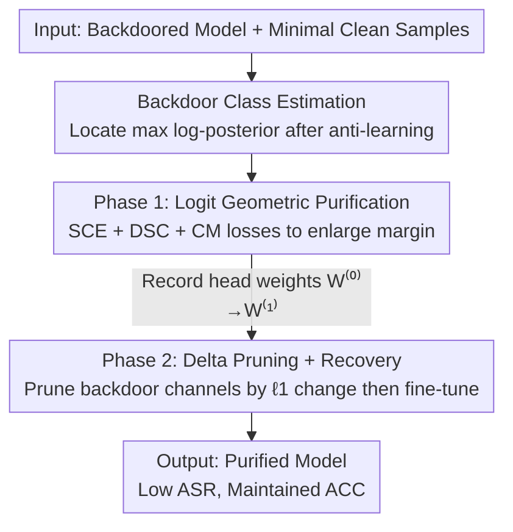

# Logit-Margin Repulsion for Backdoor Defense

**Conference**: CVPR 2026  
**Paper**: [CVF Open Access](https://openaccess.thecvf.com/content/CVPR2026/html/Yang_Logit-Margin_Repulsion_for_Backdoor_Defense_CVPR_2026_paper.html)  
**Code**: https://github.com/Trusted-LLM/LMR  
**Area**: AI Security / Backdoor Defense / Model Purification  
**Keywords**: Backdoor Attack, Backdoor Purification, Logit Margin, Conditional Backdoor, Selective Pruning

## TL;DR
LMR reformulates backdoor defense as a **geometric problem in logit space**: using only a minimal amount of clean samples (as low as 0.1%), it first locates the backdoor class, then artificially enlarges the margin between the "backdoor class logit and the strongest competitor logit" on clean data, and prunes classification head channels strongly correlated with the backdoor. This ensures that logit shifts caused by triggers or quantization/pruning are insufficient to flip the top-1 prediction, effectively defending against both traditional backdoors and conditional backdoors (quantization/pruning-based).

## Background & Motivation

**Background**: Backdoor attacks implant triggers during the training phase through data poisoning, causing the model to function normally on clean samples but output an attacker-specified target label when encountering a specific trigger. Defenses are categorized into detection (identifying if a model/data is poisoned) and purification (removing malicious behavior from an infected model, typically via fine-tuning or pruning backdoor neurons/channels).

**Limitations of Prior Work**: With the proliferation of model compression (quantization, pruning), more stealthy **conditional backdoors** have emerged—Quantization Conditional Backdoors (QCB) and Pruning Conditional Backdoors (PCB). These backdoors remain dormant in the original full-precision model (indistinguishable from benign models) and are only activated after the model undergoes quantization or pruning. Traditional detection/purification methods fail to identify abnormalities in the original model; meanwhile, specialized methods for QCB (EFRAP, LACPDA) struggle to generalize to traditional backdoors or PCB. Consequently, **no universal defense exists that can simultaneously resist traditional and conditional backdoors**.

**Key Challenge**: Traditional defenses target "backdoor neurons/features," but abnormal features of conditional backdoors only dominate after specific operations (quantization/pruning) and are undetectable in the original model. Conversely, specialized defenses tie their assumptions to specific compression mechanisms. Both types of methods cover only half of the threat surface.

**Goal**: Find a unified perspective that does not rely on trigger priors or assume specific compression mechanisms to resolve the "common pathology" of both traditional and conditional backdoors.

**Key Insight**: The authors observe a commonality in all backdoor attacks—the final effect of triggers or conditional operations is the **abnormal elevation of the target class logit**, causing the backdoor class logit to become the maximum and flip the prediction. Therefore, by **actively enlarging the logit margin between the backdoor class and the strongest competitor** on clean samples, the shift caused by triggers or conditional operations becomes "insufficient" to overcome the gap and change the top-1 prediction.

**Core Idea**: Logit-Margin Repulsion—geometrically "repelling/compressing" the decision region of the backdoor class in logit space, combined with selective pruning to cut off the "feature → backdoor class" shortcut, achieving universal purification.

## Method

### Overall Architecture
LMR takes a backdoored model and a minimal set of clean samples (approx. 1%, as low as 0.1%) as input and outputs a purified model. The process consists of three steps: first, use anti-learning to suppress the model's accuracy on clean samples to near-random to **locate the backdoor class**; proceed to Phase 1, using three losses on clean data to reshape the decision boundary of the backdoor class, enlarge the logit margin, and suppress the backdoor response; finally, in Phase 2, identify and prune channels strongly correlated with the backdoor class based on the $\ell_1$ change of the classification head weights before and after Phase 1, followed by lightweight fine-tuning to recover clean accuracy. The entire process only modifies logits and the classification head, assuming the defender has access to model logits.

### Key Designs

**1. Backdoor Class Estimation: Exposing backdoor bias via anti-learning**

Before purification, the backdoor class (the attacker's target class) must be identified. LMR performs anti-learning on a small batch of clean samples by **maximizing** the cross-entropy $\mathcal L(x,y;\theta)=-\frac1m\sum_i \text{CE}(f_\theta(x_i),y_i)$. This significantly suppresses normal neuron activations while backdoor-related neurons remain largely unaffected, thereby exposing the backdoor bias. Subsequently, the softmax posterior is calculated on the modified parameters $\theta'$, and the mean log-probability within the batch is computed for each class: $s(c)=\frac1m\sum_i\log p_{\theta'}(y=c\mid x_i)$. The class with the highest mean is identified as the backdoor class $\hat y_t=\arg\max_c s(c)$. Tests in the appendix show 100% localization accuracy across multiple models and datasets.

**2. Phase 1: Logit Geometric Purification via three synergistic losses**

Once the backdoor class $c$ is located, the challenge is to "compress the backdoor decision region" without harming other classes. LMR designs three losses. **(I) Selective Cross-Entropy (SCE)**: For samples with label $y=c$, the CE weight is temporarily set to 0, $\mathcal L_{SCE}=\mathbf 1\{y\neq c\}\,\text{CE}(f_\theta(x),y)$, to avoid unintentionally strengthening backdoor representations. **(II) Directed Suppression of Backdoor Class (DSC)**: For all clean samples where $y\neq c$, it forces the margin between the backdoor class logit and the strongest non-backdoor logit to exceed a positive margin $m_1$: $\mathcal L_{DSC}=(z_c-\max_{j\neq c}z_j+m_1)_+\cdot\mathbf 1\{y\neq c\}$. Crucially, it **does not assume clean samples naturally have high backdoor logits**—the constraint is actively constructed on the clean distribution, making it applicable to stealthy backdoors. Geometrically, it shrinks the decision region of the backdoor class. **(III) Conditional Margin (CM)**: Since DSC might cause boundary jitter for non-target classes, CM only penalizes when the "true class response does not lead the nearest competitor" (ambiguous/boundary samples): $\mathcal L_{CM}=(\max_{j\neq y}z_j-z_y+m_2)_+$. Phase 1 total loss is $\mathcal L_{P1}=\mathcal L_{SCE}+\alpha\mathcal L_{DSC}+\beta\mathcal L_{CM}$ (with $m_1=3,\alpha=1.0,m_2=0.5,\beta=0.25$).

**3. Phase 2: Delta Pruning + Lightweight Recovery based on weight changes**

Phase 1 suppresses the backdoor response, but subsequent fine-tuning could cause the backdoor to rebound. LMR prunes the **input channels of the classification head** (linear layer). Recording the head weights at the start of Phase 1 as $W^{(0)}$ and before switching as $W^{(1)}$, the suspiciousness score for each feature channel $j$ is calculated as the magnitude of change in the backdoor class row: $s_j=|W^{(1)}_{c,j}-W^{(0)}_{c,j}|$. The top-$k$ ($k=\lfloor pD\rfloor$) channels with the largest changes are pruned and frozen. The intuition is that channels with the largest weight changes during purification are those carrying the "feature → backdoor class" shortcut. Finally, standard CE fine-tuning on a small clean set recovers the clean accuracy of the backdoor class.

### Loss & Training
The complete process is described in Algorithm 1: Save initial head weights → Anti-learning to locate backdoor class → Phase 1 iterations with $\mathcal L_{P1}$ until backdoor class clean accuracy is near-random or step budget $T_1$ is reached → Record $W^{(1)}$ → Prune top-$k$ columns by $\ell_1$ delta → Phase 2 fine-tuning with CE for $T_2$ steps. Hyperparameter $\alpha$ requires only coarse selection ($\alpha\in[0.5,3]$), and the method is insensitive to $\beta$ ($\beta\in[0.1,1.0]$). The defense set is a random 1% subset of the test set.

## Key Experimental Results

### Main Results
The evaluation covers 9 traditional backdoors (BadNets, Trojan, Blend, CL, SIG, WaNet, DFST, Dynamic, LIRA) and 3 conditional backdoors (QCB, QCB-Distilled, PCB). Architectures include ResNet, VGG, MobileNetV2, and ViT across CIFAR-10, Tiny-ImageNet, and ImageNet. Metrics are ACC↑ (Clean Accuracy) and ASR↓ (Attack Success Rate) using only 1% clean data.

| Scenario | Metric | No Defense | RNP | MNP | LMR (Ours) |
|------|------|-----------|-----|-----|-----------|
| CIFAR-10 Trad. Backdoor Avg | ACC↑ | 95.55 | 93.00 | 93.21 | **95.03** |
| CIFAR-10 Trad. Backdoor Avg | ASR↓ | 96.80 | 13.56 | 3.42 | **0.53** |
| CIFAR-10 Cond. Backdoor Avg | ACC↑ | 89.03 | 87.50 | 85.06 | **89.03** |
| CIFAR-10 Cond. Backdoor Avg | ASR↓ | 99.77 | 29.53 | 2.14 | **0.72** |
| ImageNet (ResNet-34) Avg | ACC↑ | 82.50 | 79.57 | 80.23 | **82.26** |
| ImageNet (ResNet-34) Avg | ASR↓ | 94.18 | 1.39 | 0.95 | **0.68** |

On CIFAR-10, the average ASR of traditional backdoors dropped from 96.80% to 0.53%, with ACC decreasing by only 0.5%. For conditional backdoors, RNP/MNP showed significant failure (ASR remaining at 29.53% / 2.14%), whereas LMR suppressed average ASR to 0.72% without loss of ACC.

### Ablation Study
Ablation of Loss terms (CIFAR-10 / ResNet-18, BadNets, low learning rate + 0.6% clean samples):

| Configuration | ACC↑ | ASR↓ | Description |
|------|------|------|------|
| No Defense | 95.84 | 98.92 | Original backdoored model |
| CE Only | 96.43 | 92.70 | Standard fine-tuning is ineffective |
| SCE + DSC ($m_1=2$) | 96.32 | 42.77 | Margin constraint reduces ASR |
| SCE + DSC ($m_1=10$) | 96.23 | 4.84 | Larger margin yields lower ASR |
| SCE + DSC + CM | 96.31 | **0.69** | CM improves stability |

### Key Findings
- **DSC margin is the main switch**: With only CE, ASR barely drops (92.70%). Adding DSC causes ASR to drop monotonically as $m_1$ increases ($m_1=2\to10$: 42.77%→4.84%), confirming the hypothesis that enlarging logit margins suppresses backdoors.
- **Extreme Data Efficiency**: Even with only 0.02% defense data (10 samples on CIFAR-10), LMR reduces ASR of common backdoors to ~0.5%.
- **High Generality**: t-SNE visualizations show that after purification, triggered samples no longer collapse into the backdoor class but return to the neighborhoods of their respective source classes.

## Highlights & Insights
- **Reformulating defense as logit geometric constraints**: By identifying the common endpoint of all backdoors—the elevation of the target logit—a single margin constraint covers traditional, quantization-based, and pruning-based threats.
- **Independence from assumptions of high backdoor logits**: The margin is actively constructed on the clean distribution, making it effective against conditional backdoors that are dormant in the original model.
- **Delta Pruning targets the classification head**: Using the $\ell_1$ change of head weights before and after Phase 1 as an indicator of suspiciousness allows for precise localization of "feature → backdoor" shortcut channels.

## Limitations & Future Work
- The defense operates only at the logit/classification head level; if an attack does not rely on elevating a single target class logit, the "single-class logit margin" assumption may require further validation.
- Hyperparameters like margin $m_1$ and pruning ratio $p$ still need to be set, though the system is relatively robust to $\alpha, \beta$.
- Robustness against adaptive attackers who are aware of LMR has not yet been fully evaluated.

## Related Work & Insights
- **vs FP / NAD**: These methods perform poorly against content-aware attacks (DFST, Dynamic) and tend to over-prune. LMR reduces DFST ASR from 100% to 0.70% on CIFAR-10, whereas FP remains at 100%.
- **vs RNP / MNP**: These methods fail against conditional backdoors (QCB/PCB), where LMR achieves an average ASR of 0.72%.
- **vs EFRAP / LACPDA**: Specialized for QCB, these are ineffective against traditional backdoors. LMR is the only universal defense that works across all three types of threats (Table 1).

## Rating
- **Novelty**: ⭐⭐⭐⭐⭐ The "logit margin repulsion" perspective is a simple yet powerful universal solution.
- **Experimental Thoroughness**: ⭐⭐⭐⭐⭐ Extensive coverage across 12 attacks, 4 architectures, and 3 datasets.
- **Writing Quality**: ⭐⭐⭐⭐ Logic is clear; formulas and diagrams are complete.
- **Value**: ⭐⭐⭐⭐⭐ Strong practical significance for supply chain security in model compression and deployment.

<!-- RELATED:START -->

<!-- Related papers here if any -->

## Related Papers

- [\[ICML 2026\] TimeGuard: Channel-wise Pool Training for Backdoor Defense in Time Series Forecasting](../../ICML2026/ai_safety/timeguard_channel-wise_pool_training_for_backdoor_defense_in_time_series_forecas.md)
- [\[CVPR 2026\] Enhancing Out-of-Distribution Detection with Extended Logit Normalization](enhancing_out-of-distribution_detection_with_extended_logit_normalization.md)
- [\[CVPR 2026\] Eliminate Distance Differences Induced by Backdoor Attacks: Layer-Selective Training and Clipping to Mask Backdoor Models](eliminate_distance_differences_induced_by_backdoor_attacks_layer-selective_train.md)
- [\[CVPR 2026\] Unleashing Stealthy Backdoor Pandemic by Infecting a Single Diffusion Model](unleashing_stealthy_backdoor_pandemic_by_infecting_a_single_diffusion_model.md)
- [\[CVPR 2026\] Towards Human-Imperceptible Backdoor Attacks on Text-to-Image Diffusion Models](towards_human-imperceptible_backdoor_attacks_on_text-to-image_diffusion_models.md)

<!-- RELATED:END -->
